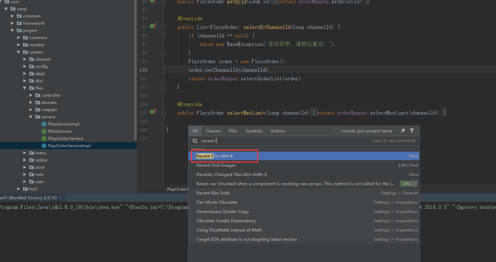
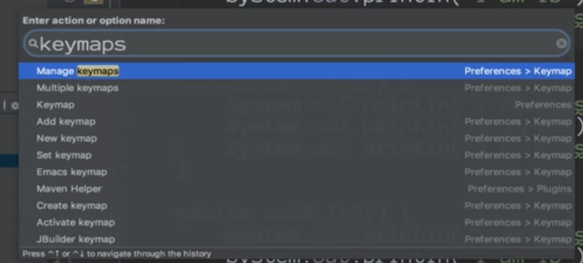

# IntelliJ IDEA使用技巧2


## idea界面介绍


```
	File主要是对文本进行操作
	
	Edit主要是对文本进行操作
	
	View是视图的选择有哪些
	
	Navigate就是你在项目工程中的跳转
	
	Code就是你的源码文件的操作
	
	Analyze是对你的源码进行分析或者说是对你项目的依赖关系进行分析
	
	Refactor是在代码重构的时候有一些比较快捷的功能去选择，比如抽取方法等等
	
	Build是当你的项目是J2EE之类的工程文件的时候，它可以帮助我们构建
	
	Run是运行，或者是调试
	
	Tools是亮点，是工具可以帮助我们快速操作
	
	VCS是 版本控制
	
	
	help--比如help下的keymap resource 可以生成快捷键的pdf
	
	
```


## 左边栏目


```
	project:当前项目的项目文件的一个导航
	
	注意：菜单上面的标号，比如project标的是1，我们可以使用alt + 1 进行快速呼出和隐藏
	
	
	Favorites：特别是浏览源码的时候使用-标记记录，或者是调试的过程中加了断点
	
```


## 2.无处不在的跳转


#### 2.1 比如项目的跳转


可以根据快捷键切换上一个窗口和下一个窗口


#### 2.2文件之间的跳转

​	recent Files ：最近的文件 ctrl + E




Ctrl + E 这样就会显示出最近使用的文件


Ctrl + Shift + A:是help下面的Find Action 就是追踪一个Action后面的一个快捷键


 浏览修改的位置跳转：比如编辑了A的代码，然后又编辑了B的代码，我们突然想返回到A重新编辑怎么办？

我们可以使用菜单的Navigate--》Last Edit Location 上次编辑的位置---或者是Alt + 箭头可以跳转到上次或者下次光标的浏览的位置


 

#### 2.3 高效的定位代码


​	书签就是在你浏览别人的代码的时候做一些标记

​	bookmarks--快捷键是 Ctrl + Shift + F11--------Shift + F11是查看标签


带有标记的书签 ctrl + shift + 1--9 或者A-Z


比如我们标记过后，使用Ctrl + 标记的1-9或者是字母 就可以实现快速的切换，比如ctrl + 1 在1标签中，ctrl + 2切换到2的标签中

​	在快速学习别人的源码或者是看别人代码的时候阅读的时候加入标签是非常有用的。


**收藏位置和文件** 

​	就是Favorites 一般是alt + 2


五角星就代表的收藏的意思，比如感觉A这个类写的不错，想收藏一下ctrl + shift + A呼出搜索框，输入 add to Facorites 添加收藏


add New 。。。是添加新的收藏列表

然后就可以把收藏的内容添加到新的列表中了


#### 比如说看见这段函数写的不错想收藏一下

​	将光标定位到函数，然后快捷键 ctrl + shift + F 


#### 字符跳转插件emacsIdea置跳转


选中字符后按ctrl + J可以上下寻找同样的字符


查看插件的配置：




然后可以 查看和修改快捷键


Windows 系统键盘 meta 对应 Windows 徽标键


**编辑文件与文件的跳转**

​	比如我们正在写代码，写完后想在项目中选中一个文件打卡可以使用alt + 1就打开文件导航目录了

从左边栏跳转到右边的代码编辑区，按Esc就可以了


