# Intellij IDEA Git集成

​		比如我们有大量的项目代码，而在这代码中我们在阅读的过程中发现某一行代码不理解，我们想找到这行代码的作者，那么我们就可以通过版本的控制去追寻作者了。

#### Annotate：

​		例如：在这行代码右键Annotate

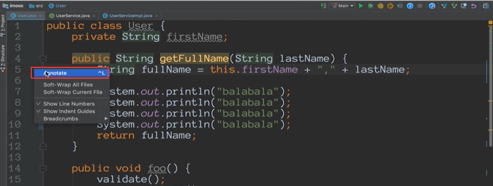

将鼠标放上来就会显示出详细信息

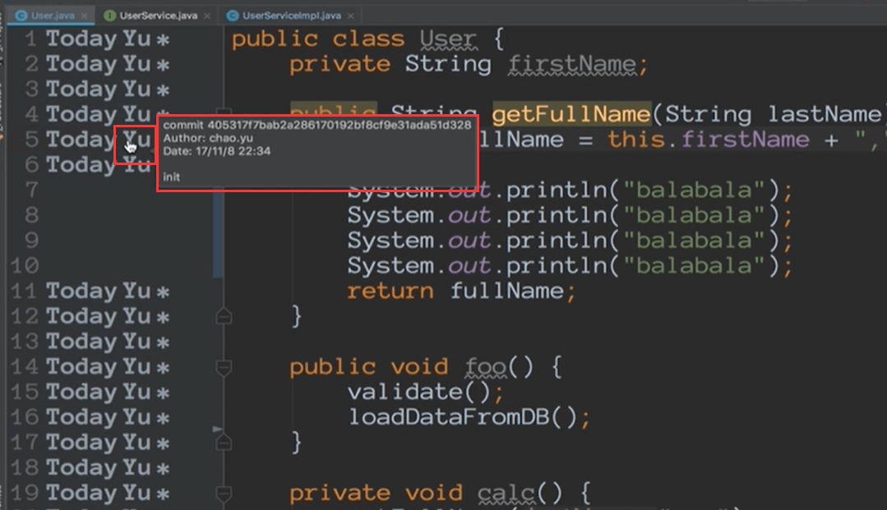

#### 移动所有改动之处

​	假如代码本来是受到版本控制管理的，在修改了很多的代码之后，发现我需要去review检查每一个修改的地方，那么如果我们一个个的检查的话有可能会遗漏或者是弄错，那么idea其实是有快捷键可以操作的，ctrl  + alt + shift + 上下箭头

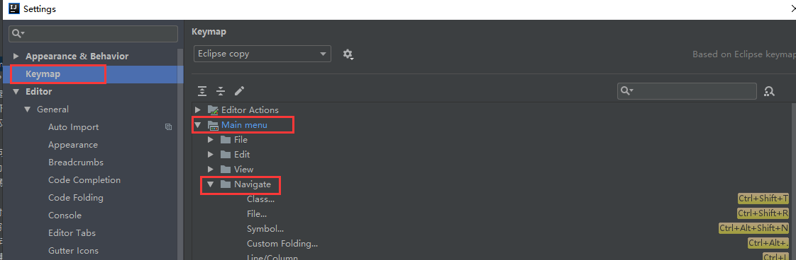

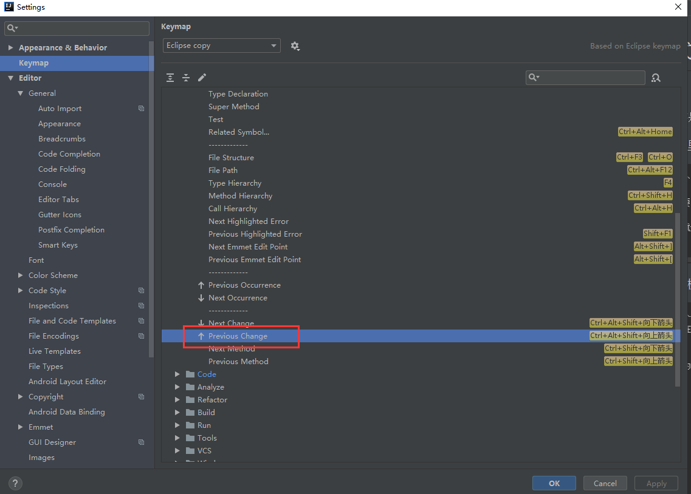

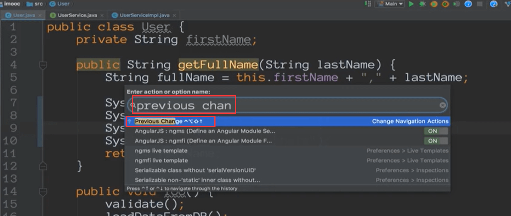

#### 撤销，还原

需要选中需要还原的代码-然后快捷键ctrl + alt + z

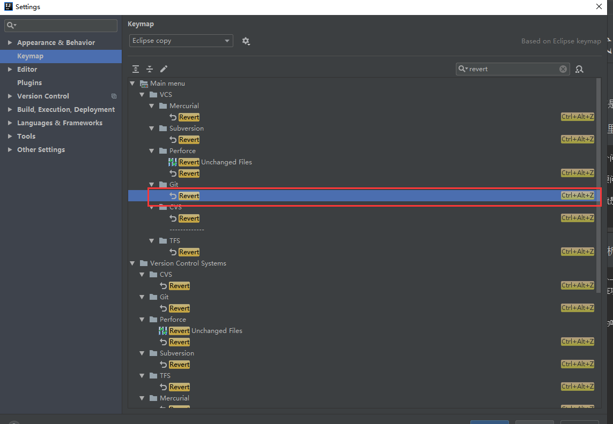

也可以对整个文件夹撤销 点击文件夹后快捷键ctrl + alt +z

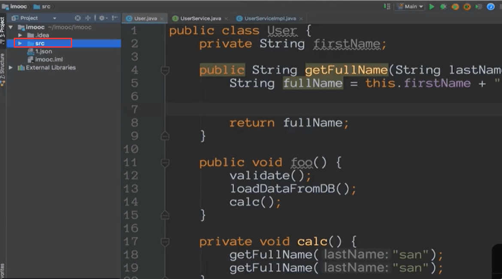

#### local History

​		当我们不使用版本控制的时候，idea本地也会为我们做一个版本的控制

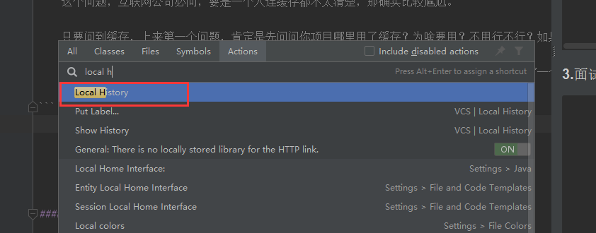

show history 就是查看历史记录

这个就是本地的历史修改记录

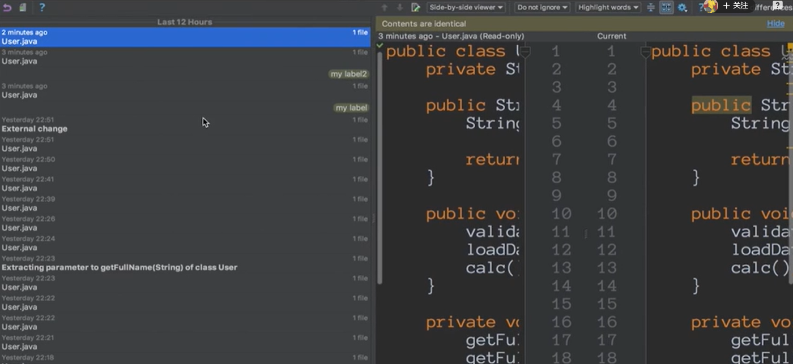

​	Put Label ：其实就和git里面的commit功能类似，当你没有版本控制的时候，你想把当前所有的更改提交一个commit，在idea就是一个label

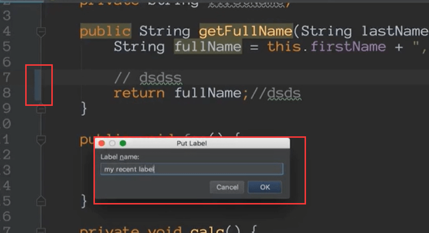

show history 就会发现刚刚我们提交了一个label

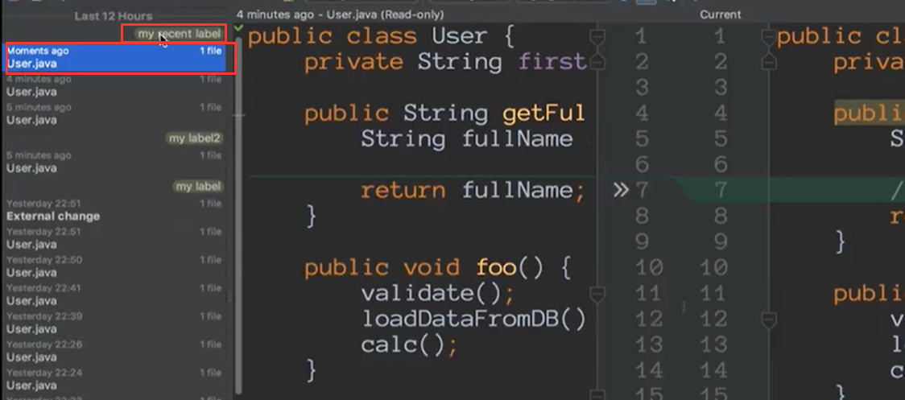

历史记录好处就是在你代码不受版本控制的时候也可以随时进行一个本地版本的控制

