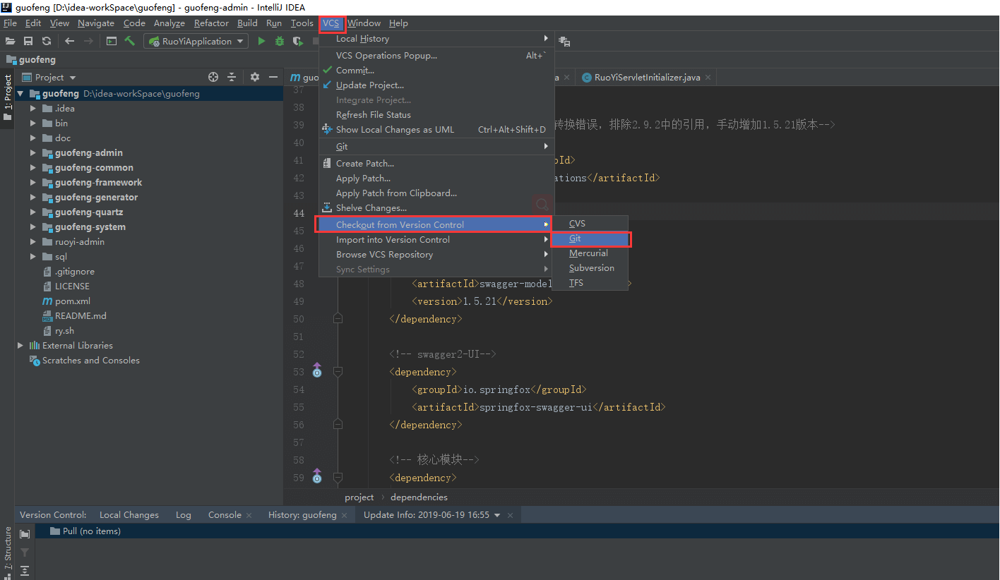
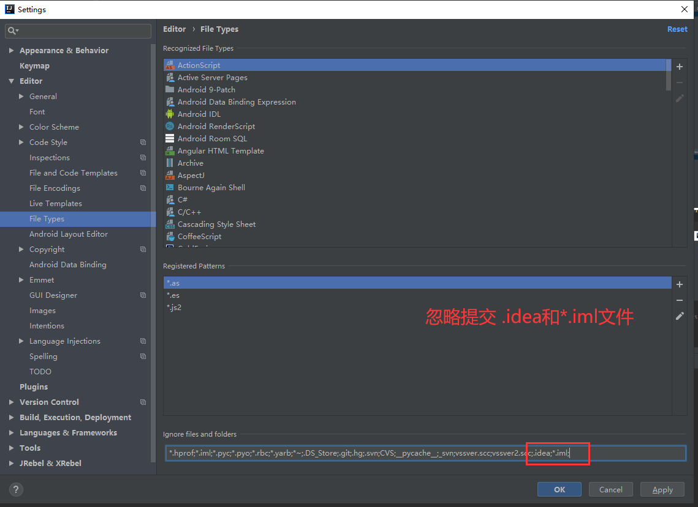
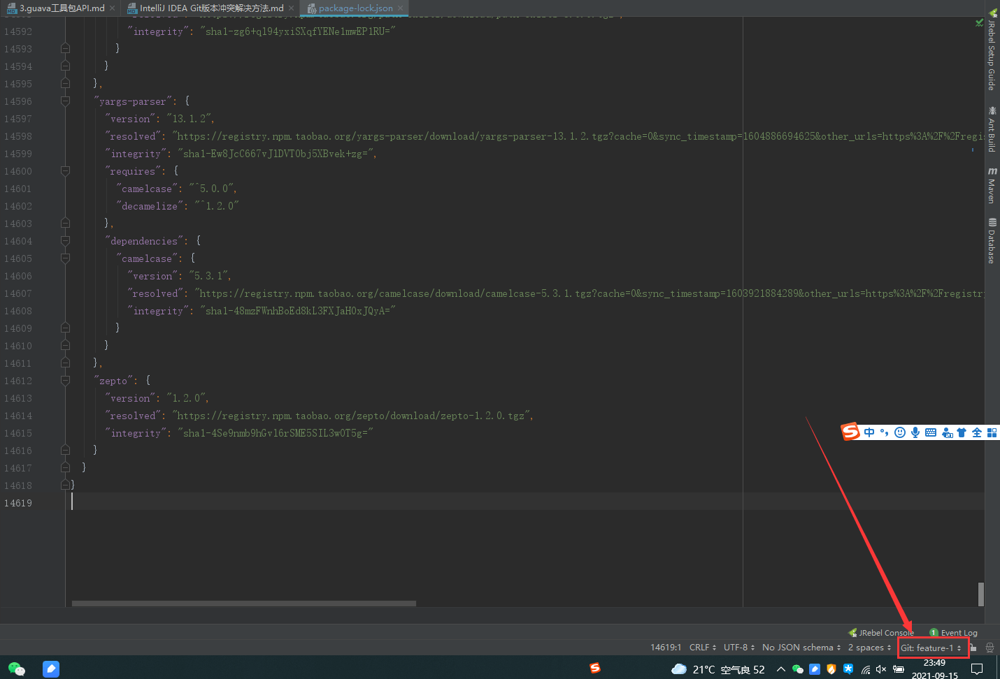
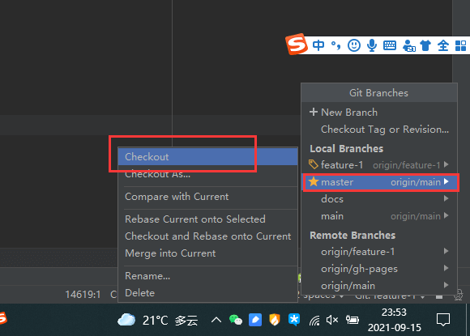

# Intellij IDEA从git克隆及提交代码

#### 1.检出项目

登录github：

输入检出地址

检出项目：

项目down下来之后：

#### 提交代码

我们修改代码后进行提交

**提交到版本库**

方法一、先按逻辑走，先add(添加) 然后 commit（提交）接着 push（推送） 

右键git->Add 

添加： 

右键git->Commit Directory….. 

提交和推送：**注意：**这里可以一起来 

上面选择Commit and push,别忘记了填写Commit Message,接着会出现一个窗口

看见有个Define remote了吗？点击它，然后又有一个小窗口

这里的URL，就是之前在GitBlit创建的版本库的时候的url，填写进去，确定就好，会弹出一个窗口，输入你的密码，点确定，然后点push就好了。

这是结果：

我们去gitblit上看看：

#### git的一些操作

#### Repository的功能

## 2.IDEA关于git的基本操作

#### 2.1、更新代码：

#### 2.2、提交代码

选择commit或者commit and push就好了

#### 2.3、忽略上传文件 

**方法1**

1.点击File—》Settings

**方法2**

点击Version Control–>Local Changes 然后点击下图中的Configure Ignored Files

点击右侧+号。配置你所需要忽略的文件或者文件夹

配置成功如图

#### 2.4添加分支

右下角点击，然后选择+New Branch，就可以创建一个分支

输入分支名称

#### 2.5切换分支

在Local Branchs中选择，然后在新的菜单中选择checkout就好

#### 2.6合并分支

#### 2.7 同步远程分支

选择项目，右键 git

#### 2.8文件恢复 

#### 2.9、版本回退

​	点击Version Control 然后查看log

找到想要回退的版本然后右键

接着会弹出一个窗口

这里我们选择hard，属于硬恢复，文件将回退到这个版本，所有本地都会被覆盖，局部的更改都会丢失。

soft方式是，文件不会改变，差异的文件将被暂存用于后期提交

Mixed方式：混合文件不会被改变，差异不会被暂存

Keep方式：文件恢复到所选的状态，本地修改会保持

#### 2.9.1单个文件回退版本

 找到相应要回退的版本---》项目右键--》git--》show history

然后点击相应的版本--》右键--》查看差异

然后继续右键---》

