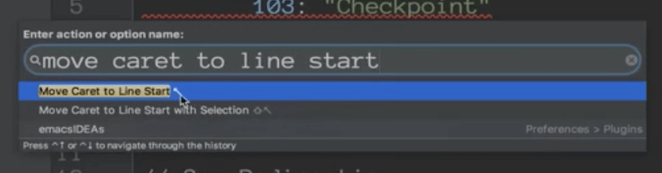
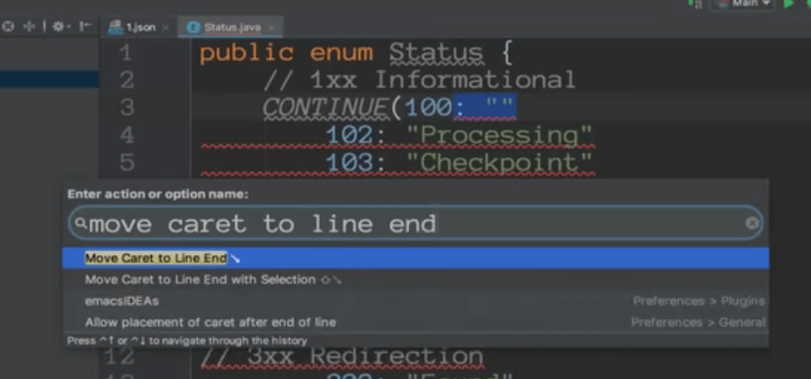
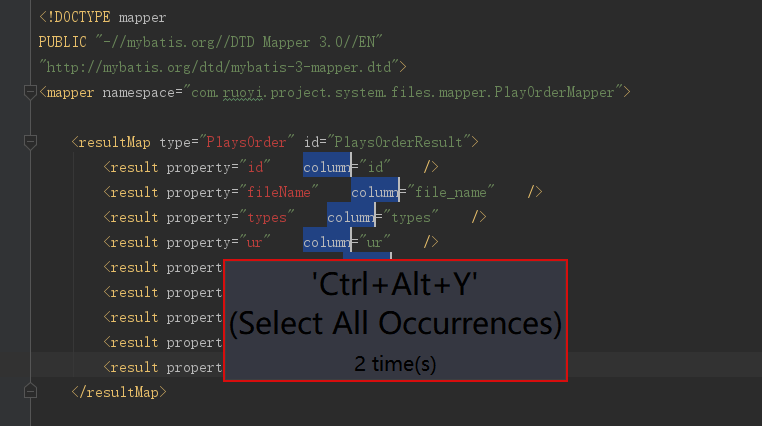

# Intellij IDEA代码助手3


### 1.列操作

比如根据左侧的响应码生成一个枚举类


首选创建枚举类

然后将转换的代码copy过来


我们发现所有需要转换的都有一个冒号

我们把冒号选中，还有就是注意选中单词


这个是选中单词的shift + 右


大小写切换是在 Edit--》toggle case


将字符串移动到前面 move caret to line start 





对于每一行都是这么个操作


Ctrl + Alt + Y




这样我们就 可以批量操作了


批量修改完可能发现代码比较乱，需要格式化一下代码 Ctrl + Alt + L


#### 2.Live template

​	设置代码模板


然后创建一个分组


创建完分组创建模板： $参数$


比如除了main函数，还有psfi和psfs

静态变量作为模板来处理


var1代表敲完后光标位置在var1的位置，当你输入完之后按回车键光标会在var2的位置


还有pi和ps也是常用的操作


比如我们需要带注释的


```
/**
* $var1$
*/
private String $var2$;

$END$

```

代表输入完第一个参数回车，光标跳转为第二个var2的位置回车后，光标跳转到End的位置结束模板。


設置代码提示，可能有时候不提示修改热键


