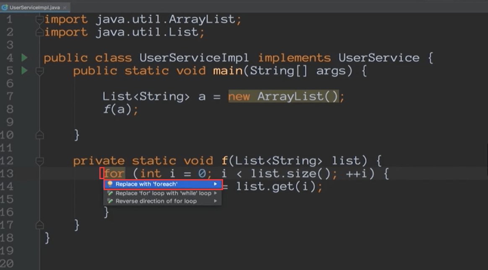
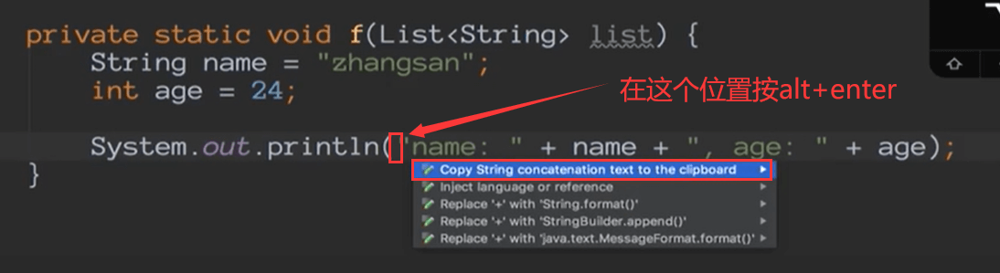

# Intellij IDEA代码助手alt+Enter

alter + enter是非常有用的快捷键

action:  show intention 这个意思就是在你不知道如何去完成某一段代码的时候，你只需要按alt+enter 他就会给你智能的提示了，并且非常智能在不同的代码语境有不同的提示

### 下面我们说几种提示功能

#### 1.自动创建函数：

我们在调用一个没有的函数的时候，会提示我们创建这个函数

#### 2.list replace

把光标放到for的前面，提示可以使用foreach进行代码简化

#### 3.字符串format或者build

比如：

下面会有replace + with String .format

点击format后

如果不是在输出的情况下--会有String.format的方法包裹

**build**：  也是一样的

将生成StringBuilder给拼接字符串build为你节省内存

#### 4.实现接口

创建实现类的名称-Destination package是在哪个包下创建

#### 5.单词拼写

​	对于我们英语不好的是相当的不错了

比如我们在写字符串的时候，单词错误idea会给我们一个波浪线

Change to 会给你几种建议

矫正之后波浪线消失

#### 6.导包

