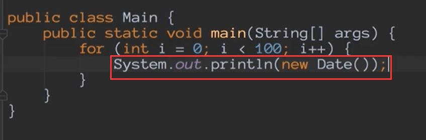
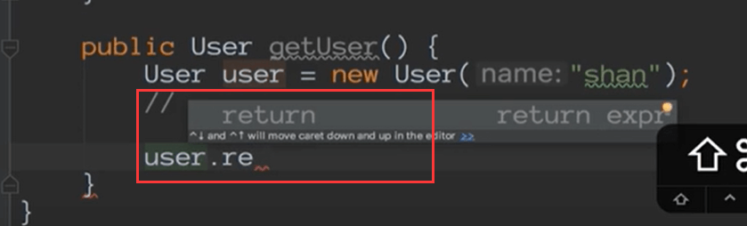
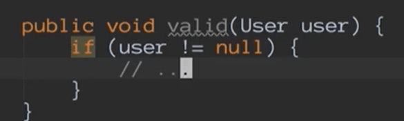

# Intellij IDEA代码助手postFix

比如我们使用100.fori就可以完成一个100次的for循环，这个看起来有点像模板，但是这个其实是在idea中叫postfix

​		postfix：字面的意思就是你在按一个点.后就会给你一些提示

我们还是通过help-》action或者是 ctrl + shift + A 的方式呼出查看一下postfix

他和模板最大的区别就是不能编辑

比如sout的使用

这样就直接给放入输出控制台了

**field的使用：**  当你在创建一个User类的时候

这是比Live Teleplate还高效的的东西叫postFix

**return**

​	比如我们写一个方法要返回值的时候比如返回一个User，我们可以直接user.return

**nn**

​	nn是判断处理比如我们判断user不为null，可以使用nn

要善于使用这些postfix

