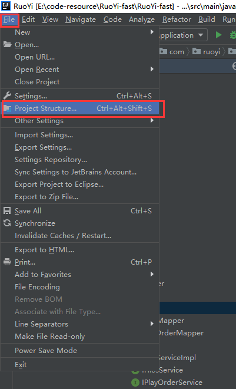
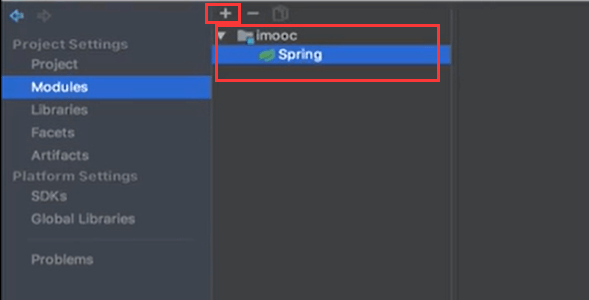
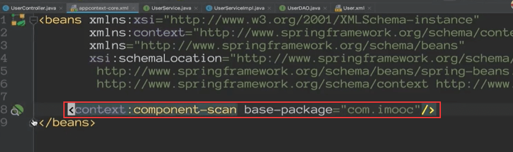
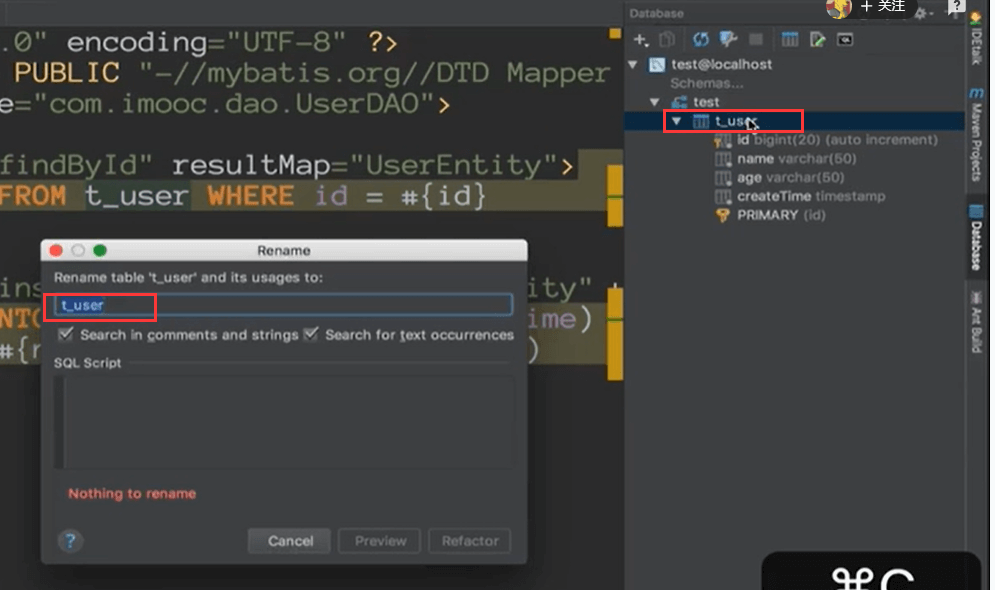

# Intellij IDEA关联Spring

如果我们没有做关联那么就不是那么清晰的看到整个代码流转过程

例如：需要一层层的键入查找关联关系

关联后的效果：

下面我们说一下如何关联

点击后有个facets

点击+建立关联--》选择模块然后与spring做关联

可能会提示：然后点击+号，会自动的帮你生成配置

然后全选，点击ok

然后关联完之后发现：

上面显示***依赖

点击一下发现直接连接到依赖的类了

这个是你这个Bean是在spring中被用到的，那么这个bean是在哪里定义的，哪里被扫描到的

点击一下会发现，他是在这个包下定义被扫描到的

这个点一下会发现，被扫描到的bean都有什么，哪些bean被扫描加载了

#### 与数据库的关联

我们在写sql的时候发现，在写表名称的时候已经可以智能的选择了

这样的话其实就根本不需要你自己手动去敲很多，因为手动敲可能会发生错误

还有个需求就是假如我们之前的表需要改名称，那么可以在database中找到对应的表 然后对表进行重构

shift + F6   windows 应该是 alt + shift + r

他会把所有的sql的表名称也全部修改的

比如我们现在想修改一下字段的名称，那么会提示有很多处使用到这个属性，我们可以选择那些是我们需要改的，不需要改的地方就Exclude排除掉

排除掉后然后refactor

改完后我们发现sql的字段也改掉了，数据库的字段也修改掉了

他可以通过数据库关联你的sql map 也可以通过sql map关联你的数据库

https://www.bilibili.com/video/BV1Ft411V7rf?p=16&spm_id_from=pageDriver

