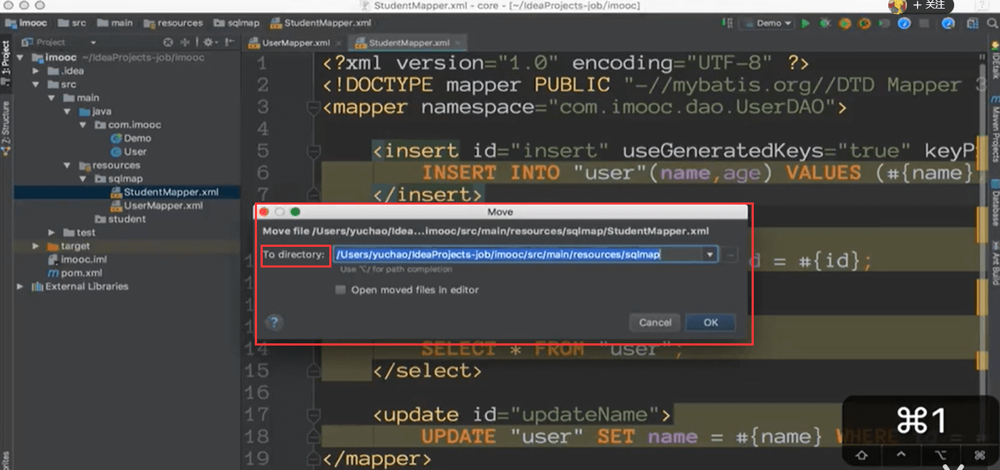
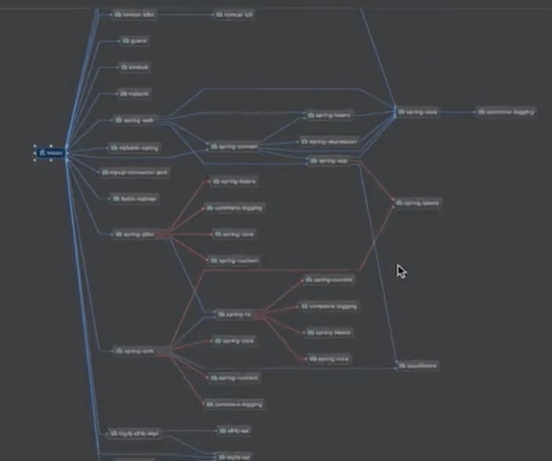
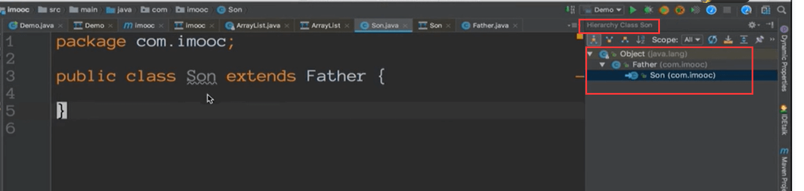
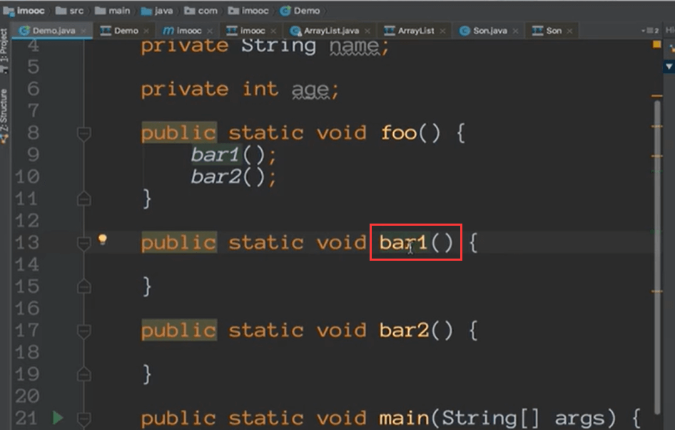

# Intellij IDEA其他操作

#### 文件操作

ctrl + alt + n 呼出新建文件

#### 复制当前文件

F5是快捷键

#### 移动当前文件

​	第一种方法是先截切然后放入

​	第二种是F6

#### 复制文件全路径

​		ctrl+shift +c

 如果我们连续复制ctrl +c 了很多次，就可以通过idea的调出剪贴板的方式将多次复制一起使用

ctrl + shift + v

我们按相应的序号就可以选择复制那个，反复操作可以达到批量复制的效果

#### 结构图

​	我们在看源码的时候常常会使用到，会清晰的看到所有的方法

会调出一个窗口，显示类的大纲； m代表method，f代表一个field，这样可以迅速了解这个类有几个函数方法，有几个成员变量，也可以迅速的定位到

#### 查看maven依赖类图

在pom中右键

可以看到maven的关系

比如我们要搜索ctrl +f 输入内容可以直接跳过去

也可以使用这个快捷键查看类图大纲

比如ArrayList可以看到他的结构

#### 另外一种查看类结构层次

#### 方法调用层次

ctrl +alt + h

左边的方框是别人调用你的，右边的是我们调用其他函数的结构

比如我们想查看这个函数被谁调用了

我们需要在对应的函数上快捷键 ctrl +alt + h

我们发现bar1 被foo函数调用了，而foo又被main函数调用了

这是个反向的调用层次推导

这样在我们看源码的时候是非常有用的，这样能够使我们迅速了解项目的结构

https://www.bilibili.com/video/BV1Ft411V7rf?p=22&spm_id_from=pageDriver

