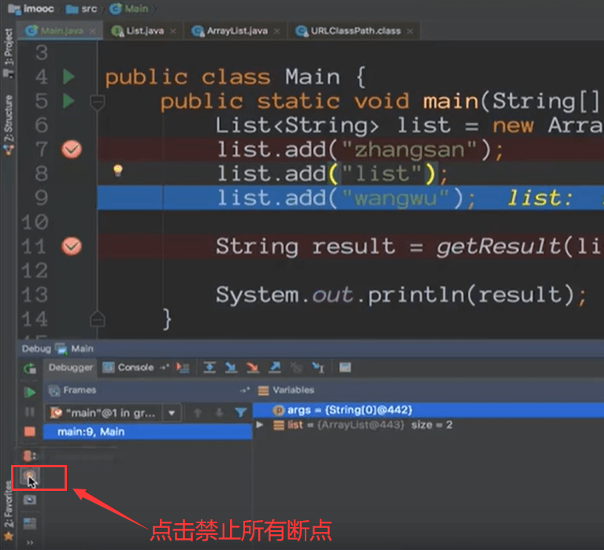
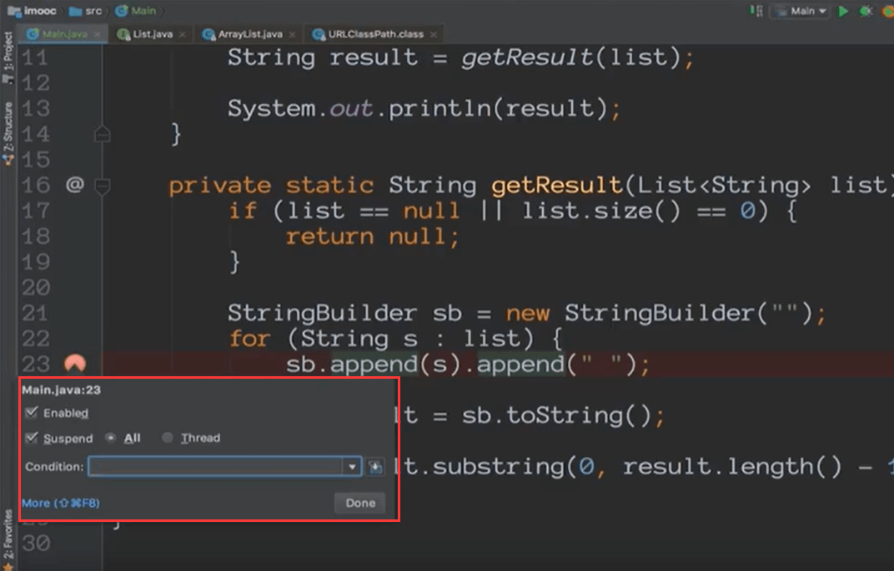
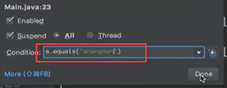
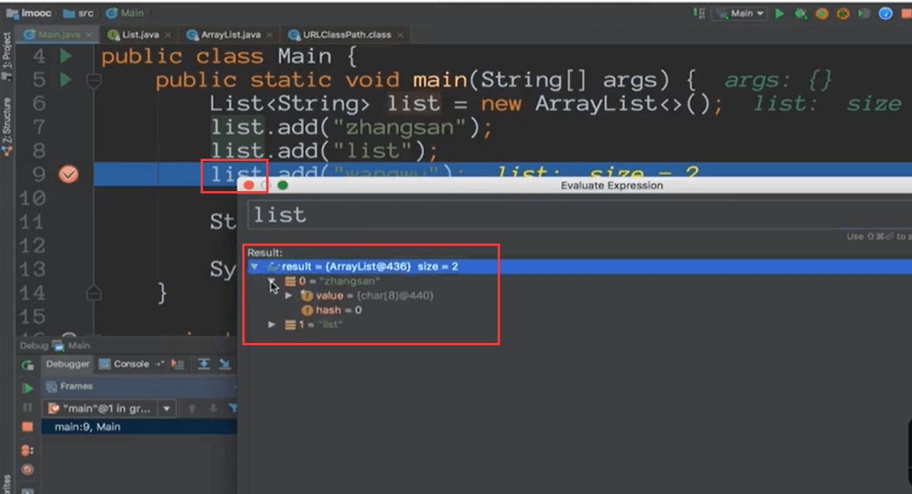
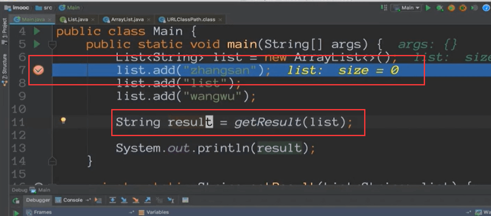
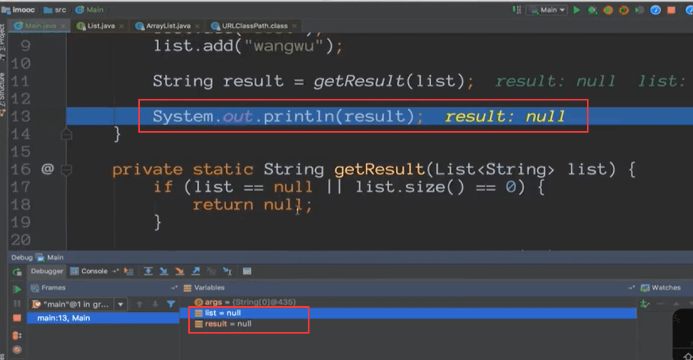

# Intellij IDEA断点调试

添加断点：ctrl + shift + B

#### 单步运行 debug

然后F8一行一行的单步运行

#### resume

​	假设我们在这里按一下F8单步运行后，后面的不想运行了--跳到下一个断点，如果没有断点直接运行结束程序

#### 查看所有断点

#### 禁止所有断点

断点都变为白灰色了

#### 条件断点

​		在断点上右键

​	在打断点的时候，必须满足某一个条件这个断点才会生效

比如：List中的元素 在元素中是 张三的时候进入断点

Condition里面输入条件，使用Java表达式

比如：s.equals("zhangsan")

在s是zhangsan的时候进入了断点

#### 表达式求值

​	在我们跳转断点的过程中，在断点处可能你要看看某一个值在计算之后是什么样的结果

到这个断点的时候---选中需要计算的地方然后ctrl + U 可以输入表达式

输入表达式后可以看到result的返回值

#### 运行到指定行

​	我们在调试的过程中有的代码是非常长的，我们想运行到某一行

​	运行到光标所处的这一行

中间的过程就没有全部展示了，直接就运行到光标所处的位置了

#### setValue

​	我们可以设置一些值进行测试

在断点处--然后在Varlables里面找到需要设置值的变量，按F2进行设置

比如设置为null，然后回车

然后之后的程序就按这个修改的值进行后续的逻辑了

#### run anywhere if you can

​	当你在一个可运行环境中，你就可以运行

其实就是光标所停的位置，去往上找可以运行的最小单元然后进行一个代码的运行

我们发现会运行这2个函数

好处就是当我们需要迅速的执行一下代码的时候可以使用这个功能

shift + alt + F9是我们可以运行的，可以选择一个

其实就是debug的运行，选择相应的需要执行的

#### 编辑当前运行

我们改为xixi

