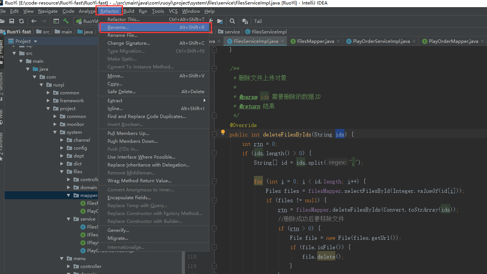
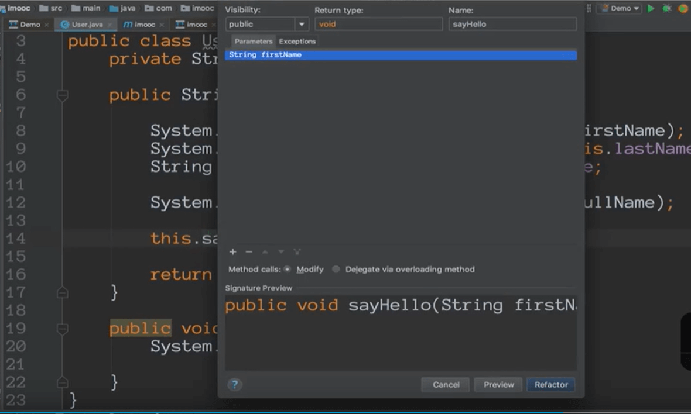
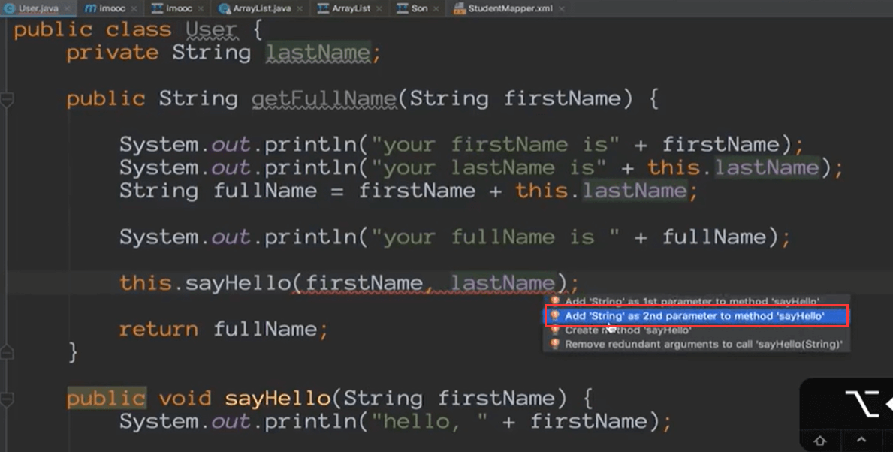
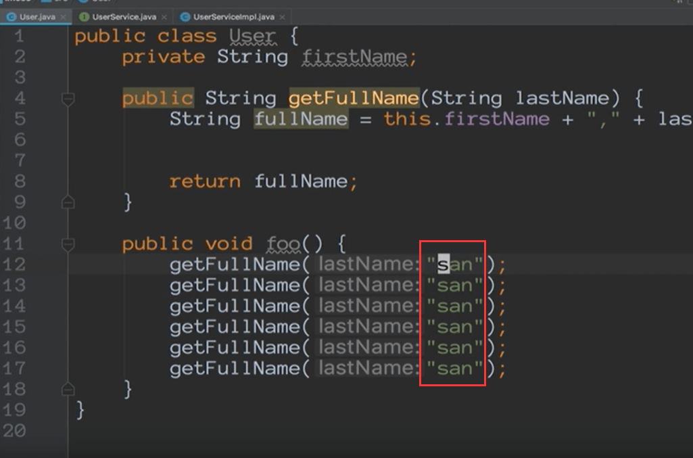
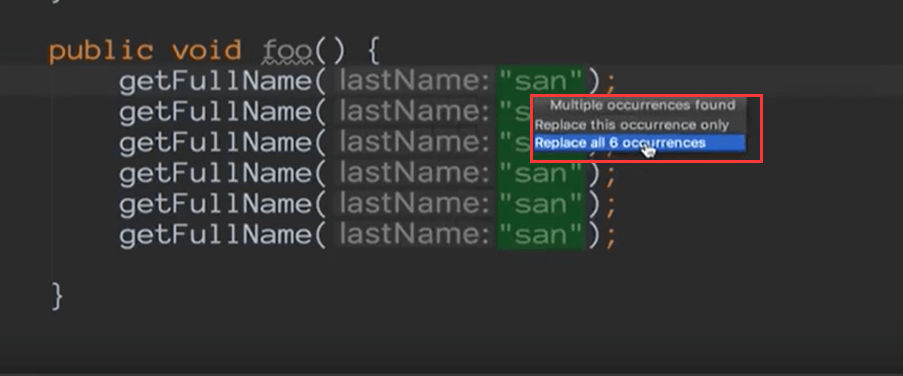
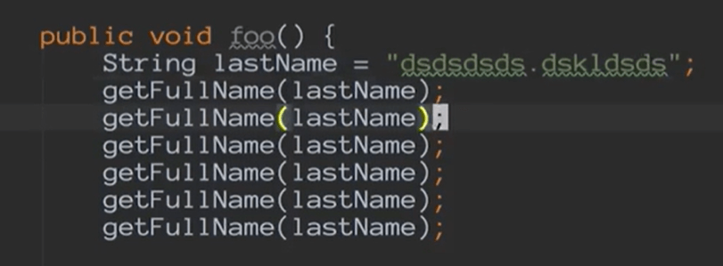
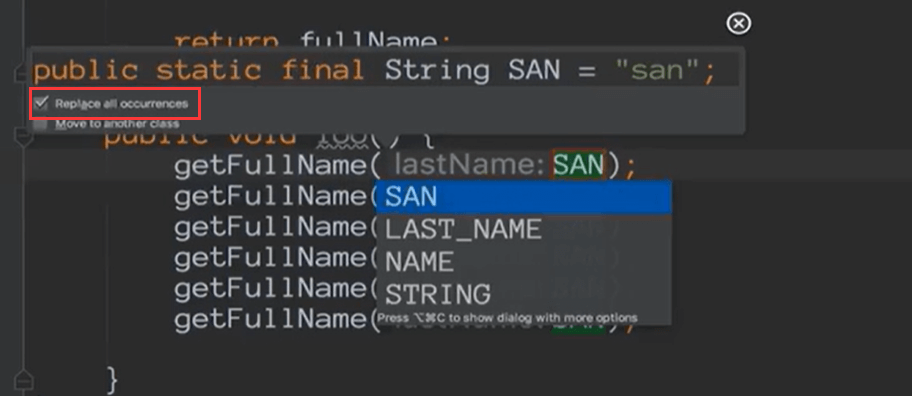
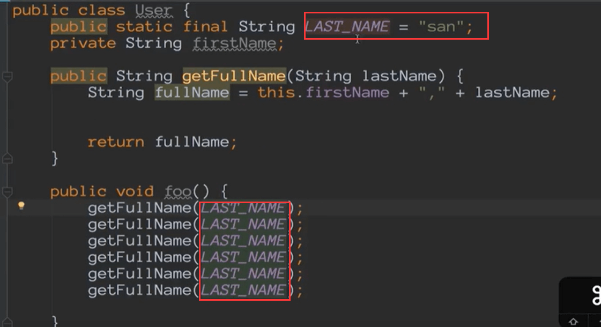

# Intellij IDEA编写高质量代码

### 1.重构

#### 1.1 重构变量

比如：以下代码我们通常都不清楚abc和bcd是什么意思，需要完整阅读完代码才知道他们的含义

遇到这样的代码，我们就需要把abc和bcd这样的变量和参数改为有意义的名字

idea为我们提供了重构refactor--》rename，按下快捷键后就变为红框了

我们将abc改为firstName

将bcd变量改为LastName

这样的话看起来就清晰多了，可能我们不需要太多阅读内部逻辑就知道其含义了

#### 1.2.重构方法

​	函数签名的重构Refactor--》Change Signature

我们可以添加一个参数lastname

然后点击Refactor

这样就满足之前有一个参数想多添加一个参数的操作了

我们也可以使用alt+enter的方式

其实这种方式更快一些

### 2.抽取

#### 2.1 抽取变量

场景：有非常多的字符串而且使用的相同

我们使用 Refactor--》Extract--》Variable抽取变量

他会提示我们抽离一个变量还是全部抽取

抽离完成后

#### 2.2 抽取静态变量

​	如果我们这里很多处使用到这个变量，并且在别的地方也有很多处使用到这个变量，那么我们就需要把这个变量抽取为一个静态的变量。

使用ctrl+alt+C是抽取为静态变量

replace all是替换所有

这样就抽取成一个静态的常量了

#### 2.3 抽取成员变量

​	ctrl + alt + f

#### 2.4 方法参数

​	我们发现除了参数还有一些成员变量在方法中使用，然后我们将这些使用的成员变量抽取到方法参数中 ctrl + alt + P

然后就抽取为一个方法的参数传入进来了

这样就变的非常的清爽了没有那么多的依赖关系，我们就可以把这个方法剪切放入一个单独的类中都可以了

#### 2.5 抽取函数

alt + shift + M快捷键

抽离后的函数代码：

