---
title： 1、基本介绍
date： 2024-06-21
tag：
  - linux
---

# 1、基本介绍

#### 	1、基本术语

​			在使用linux之前，需要了解一些基本术语

​		Kernel -- 内核

​		distribution -- 发行版

​		boot loader -- 系统引导

​		service -- 服务

​		filesystem -- 文件系统

​		X Window system -- 桌面系统

​		desktop environment -- 桌面环境变量

​		command line -- 命令行

​		Linux系统其实是使用Linux Kernel 内核的系统，内核相同软件不同的各种发行版系统 通常称为Linux系统，但是细化下分家族的话有很多分支。

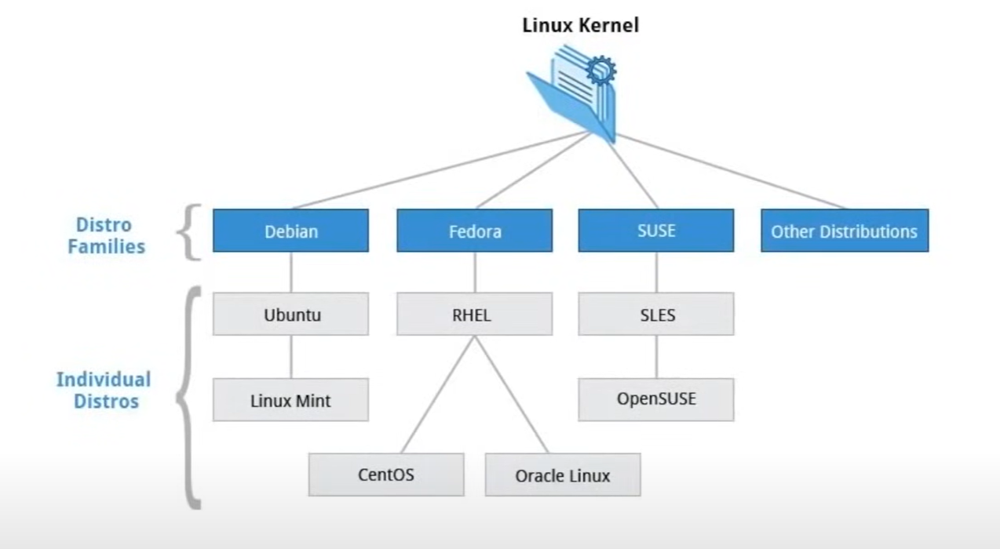

​	发行版一些常见的如：Red Hat 、Ubuntu

​	引导加载程序Boot Loader 是一个启动操作系统的程序，  如GRUB，ISOLINUX都是引导程序

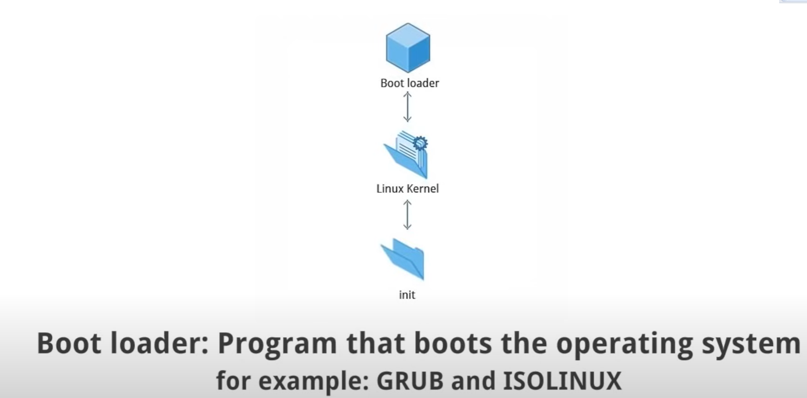

服务Service 是作为后台运行的服务程序，如ftp，httpd，nfsd

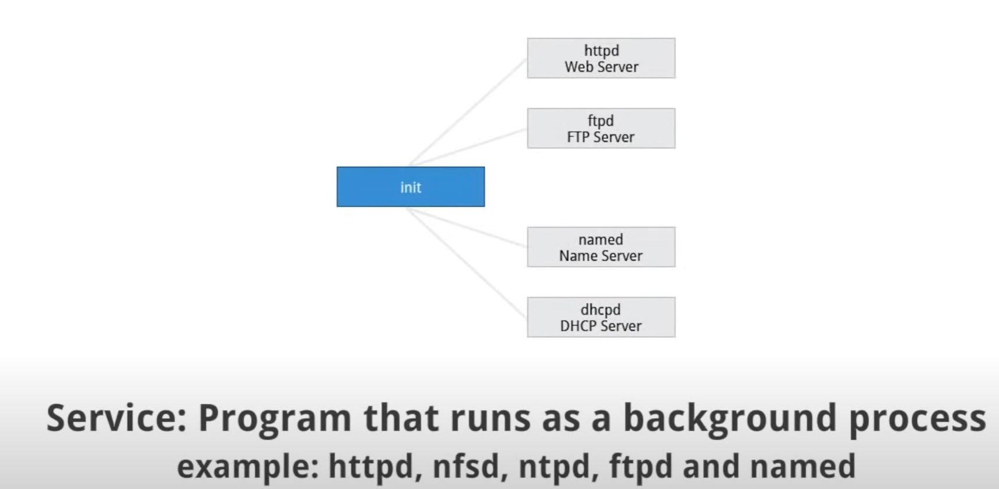

FileSystem -- 文件系统是Linux中存储和组织文件的方法

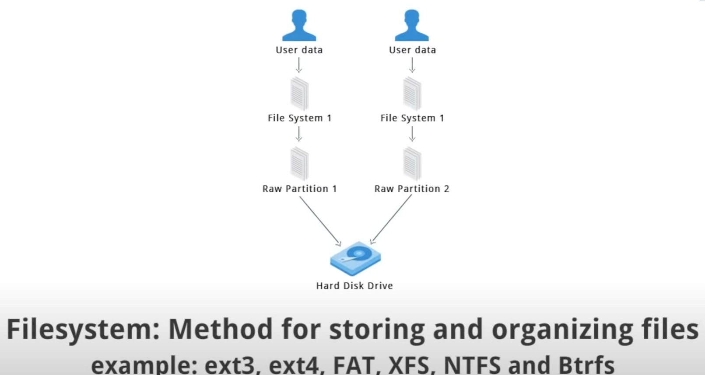

X Window System  -- X window系统提供了用于构建 标准工具包和协议

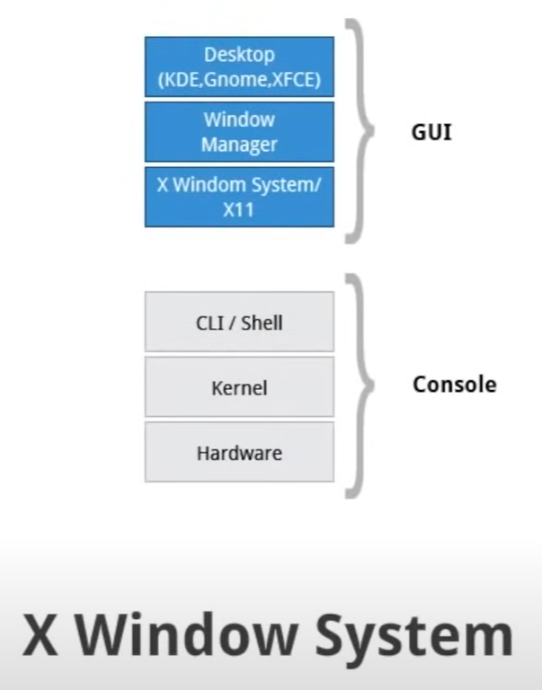

Desktop Env ： Linux系统桌面系统 图形界面，操作系统之上的图形界面管理

​		如：gnome KED、xfce、和fluxbox是桌面环境的一些例子

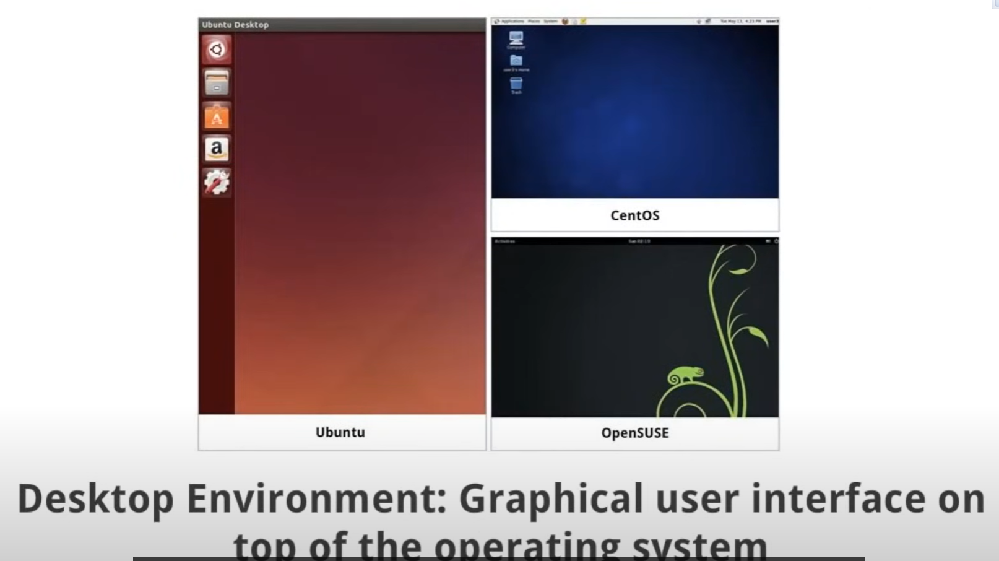

command line -- 命令行是用于操作系统之上 键入命令的界面

​		用于系统执行任何必要的任务和命令

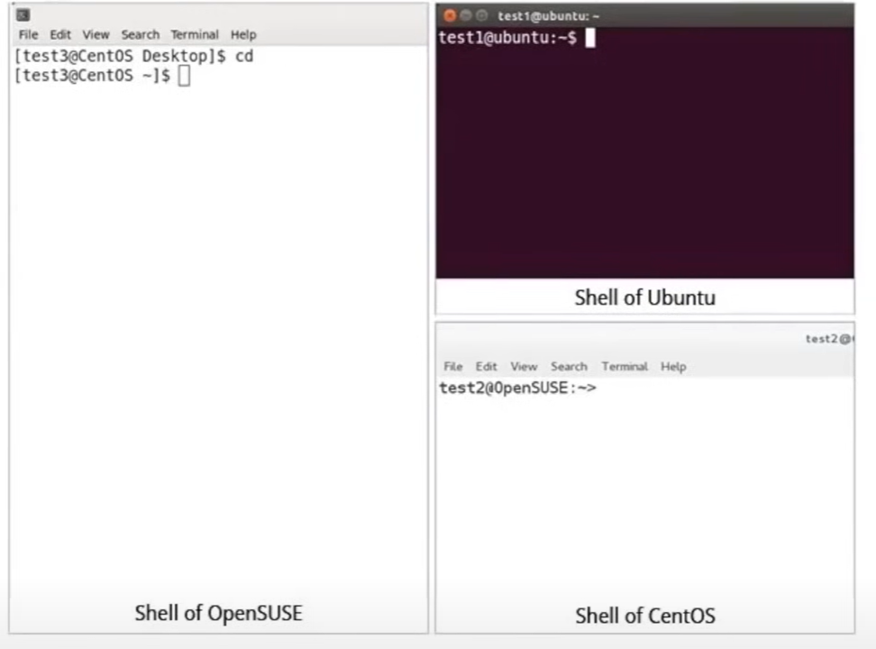

####  2、Linux Distributions -- linux发行版

​		假如我们在使用linux开发或者工作，那么需要了解 linux不同的组件、服务、和每个发行版关联的配置，我们需要了解这些，所以什么linux发行版以及它与linux kernel内核的关系。

​		Linux发行版 -- 就是基于不同的Linux kernel内核 + 独立的软件 组合成的独立系统版本

​	种类繁多的Linux发行版都是在满足许多不同的需求，例如政府，大型公司倾向于选择 商业支持的发行版

​	CentOS--免费 Ubuntu开发人员和教育领域受到人们的青睐

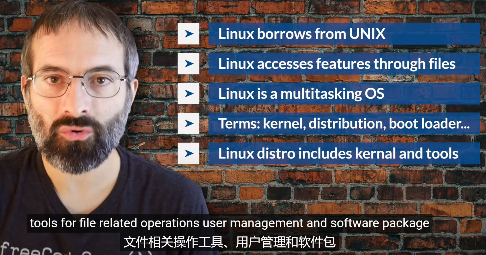

#### 3、Linux Basics and System Startup

​		linux基础和系统启动

​			linux启动过程是初始化系统过程，这个过程是首次打开计算机直到用户界面完全打开时

​	计算机打开电源后 进入基本输入输出系统，或BI OS -- 初始化硬件，并测试主机，这个过程也称为开机自检

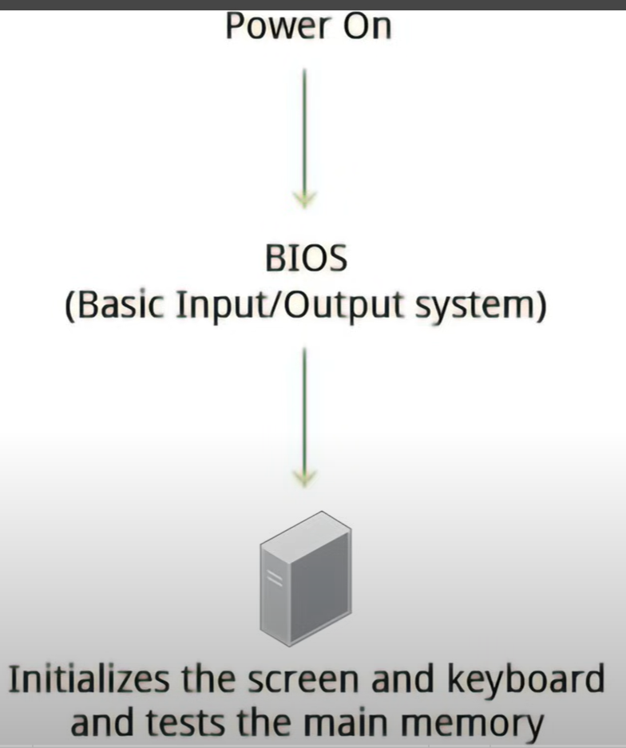

​	开机自检后--系统控制权由BIOS传递到了MBR 引导加载程序，引导加载程序通常存储在 引导扇区或 用于更新系统的 可扩展固件接口 或EFI分区，在此阶段 机器不会访问任何大容量存储介质。

​		大多数Linux引导加载程序可以使用可选择替代方案的用户界面，用于启动linux

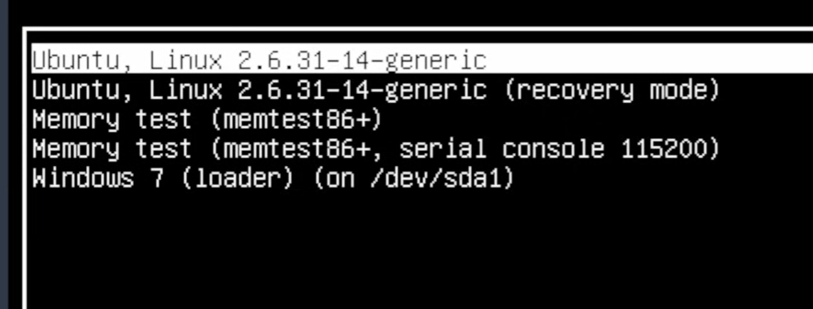

​	linux引导程序负责将内核镜像和初始化Ram磁盘放入内存中，

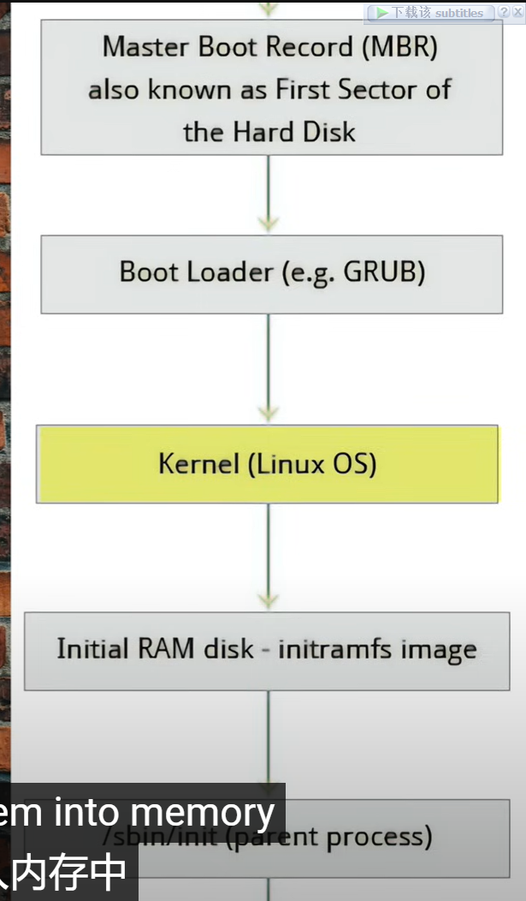

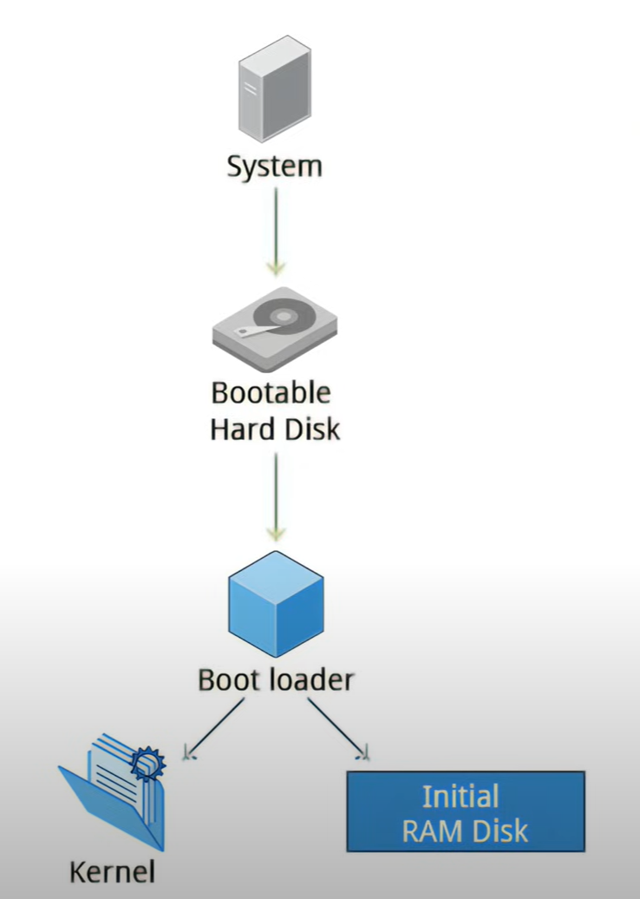

#### 	4、linux系统文件结构

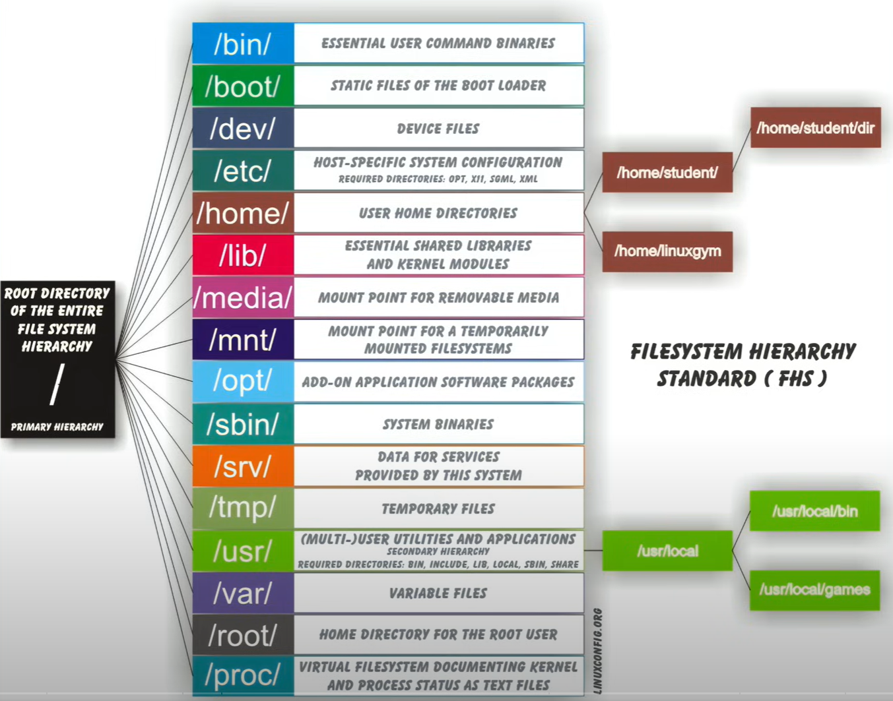

​	在选择发行版的时候--需要了解这个发行版的特性是什么，哪些类型的包很重要，例如Web服务器、文字处理等需要多少硬盘空间以及在嵌入式设备上安装linux系统时，有多少可用空间，通常受到包更新频率限制。

​	每个版本的支持周期有多长，例如LTS版本具有长期支持及内核定制。

#### 	5、linux网络连接

​		linux硬件接口和信号会被系统自动检测到，然后网络管理器设置实际网络 通过动态主机配置进行设置，动态协议配置DHCP--动态获取IP

​		DHCP是自动，Manual是手动配置IP地址

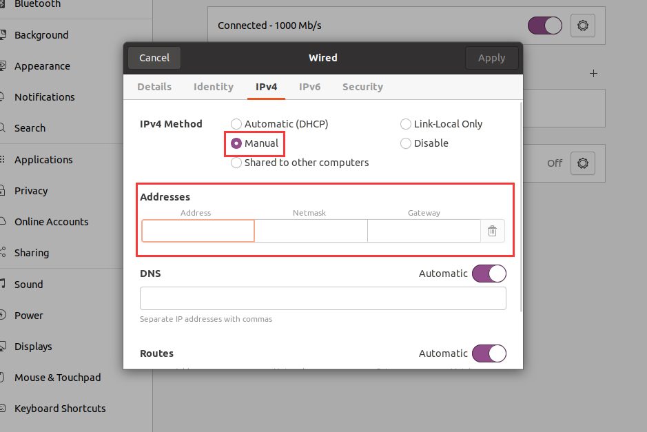

#### 6、包管理系统

​	每个软件包和Linux发行版提供一个系统，例如Linux 内核 + Ccompirle + Utilties，所有系统都有较低级别的实用程序处理拆包的细节，并将拆包碎片放入正确的地方，如Debian -- Ubuntu的 dpkg包管理器

​	Debian包管理系统：dpkg是底层包管理器，对于这些系统，它可以安装删除或构建更高级不同的包管理系统软件，如高级打包工具 apt打包系统

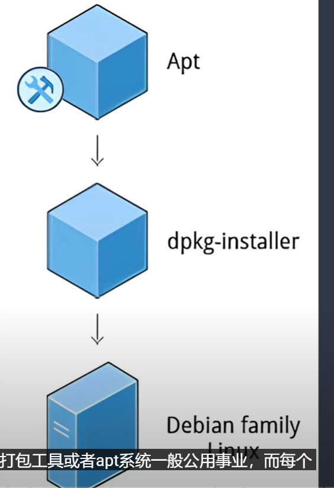

​	Red Hat 包管理器： RPM是流行的包管理系统，它是在Linux发行版上开发由红帽并被许多公司采用。它的高级打包工具是yum

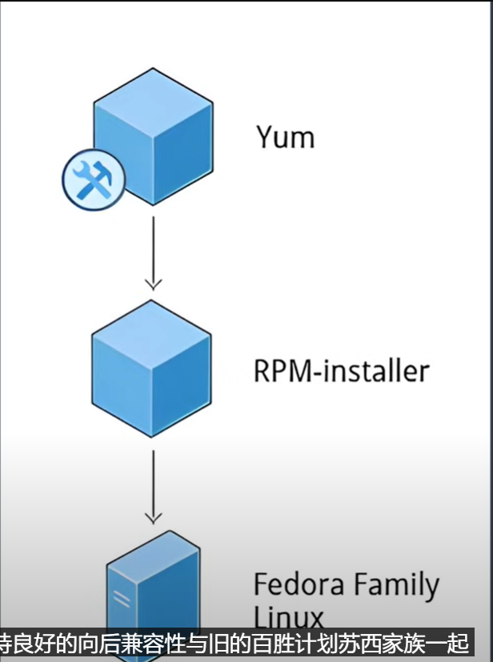

Ubuntu包管理器安装

​	打开software

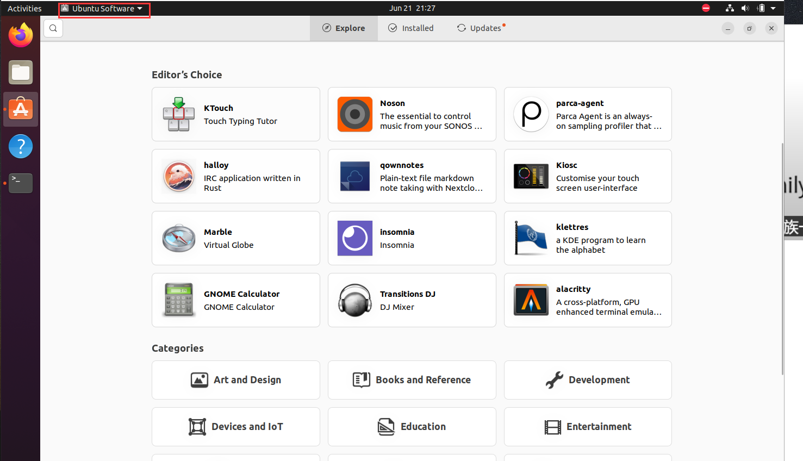

​		然后搜索软件进行安装即可

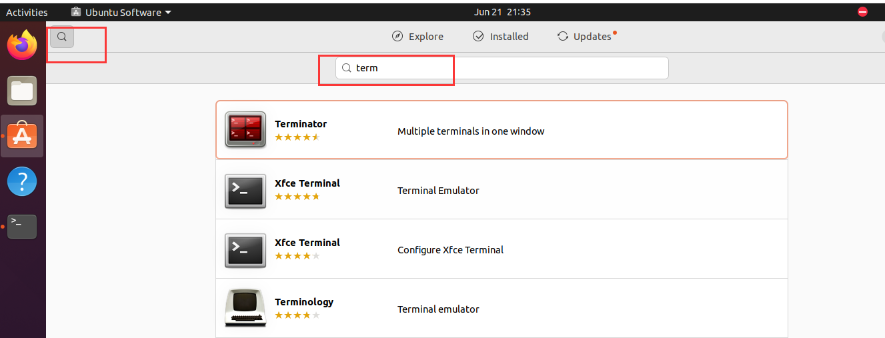

#### 7、Linux的办公套件

​		LibreOffice是最成熟被广泛使用的办公产品，类似与国内的WPS。

#### 	8、开发应用

​		emacs：编辑器

​		集成开发环境： eclipse，VScode

​	这些都是免费通过标准包安装就可以

#### 	9、图形编辑器

​		GIMP：类似于PS

