# 3、命令行

​			Linux系统使用过程中大部分时间是使用命令行操作，经常操作命令进行故障排查

​		图形化界面操作起来更为简单处理一些简单任务，而命令行界面可能操作一些困难的任务，Linux严重依赖丰富的命令行工具。

​		终端程序模拟或仿真一个独立的终端

​			

​	cat：查看文件

​	head：用于键入显示文件头

​	tail：用于显示文件的最后几行

​	man：用于查看文档

​		使用管道前使用符号垂直线 | 

#### 	1、命令三要素

​	在Shell中输入的大多数输入行提示具有三个基本要素：1、命令   2、 选项     3、参数

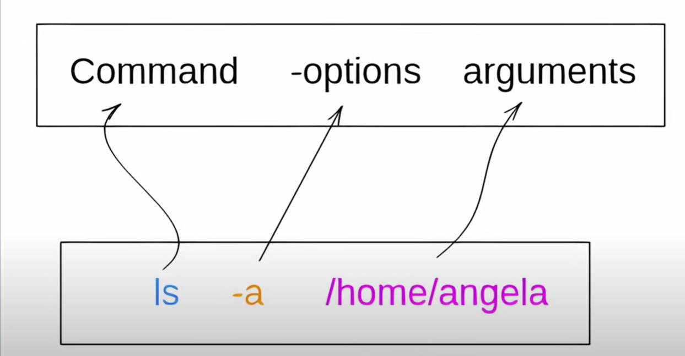

​	命令是程序名称，在执行命令的后面是 一个或者多个选项可执行的选项通常是一个破折号-或者是俩个--开头，例如：

​	基础操作：

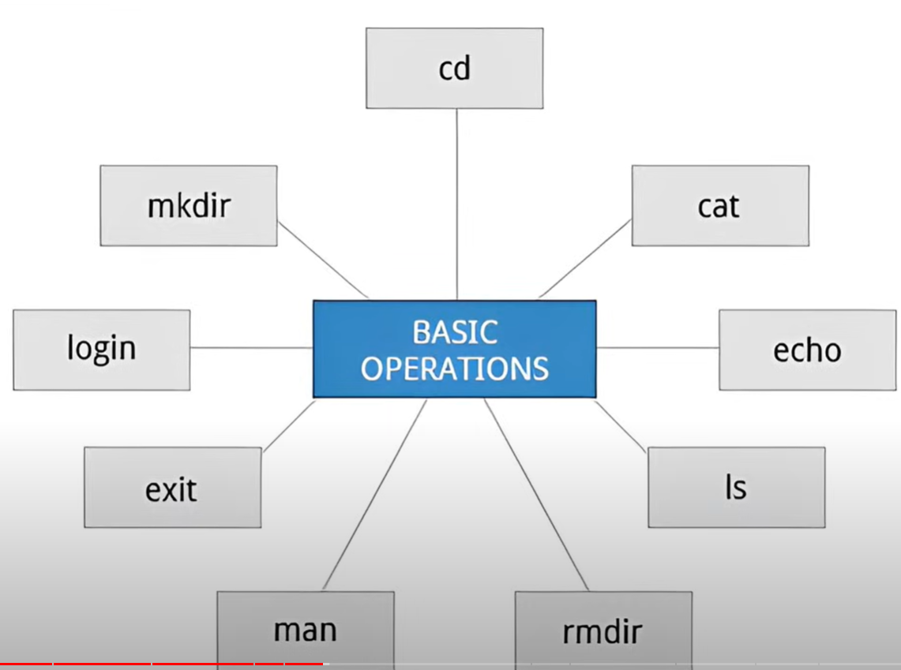

#### 2、Which和whereis命令区别

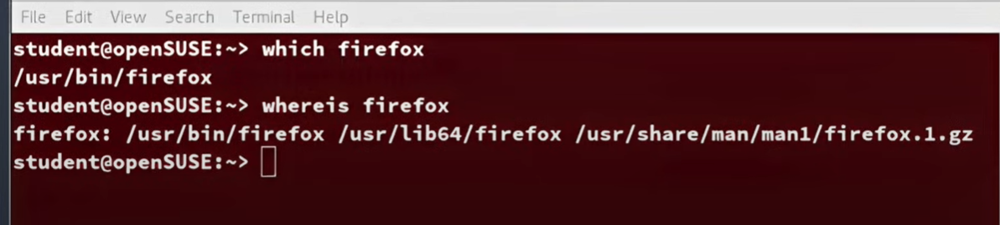

#### 	3、文件夹键入操作

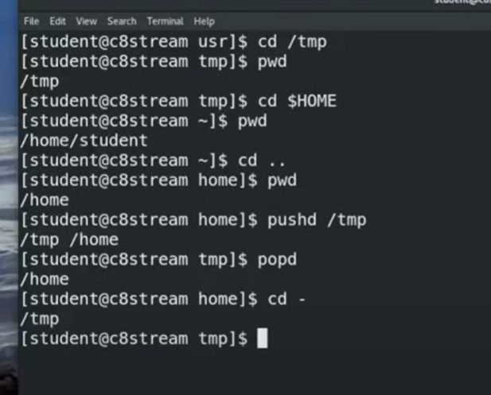

​	本级目录， 。。父目录， ~home目录

#### 	4、tree 树命令

​			鸟瞰整个文件系统 使用 tree -d

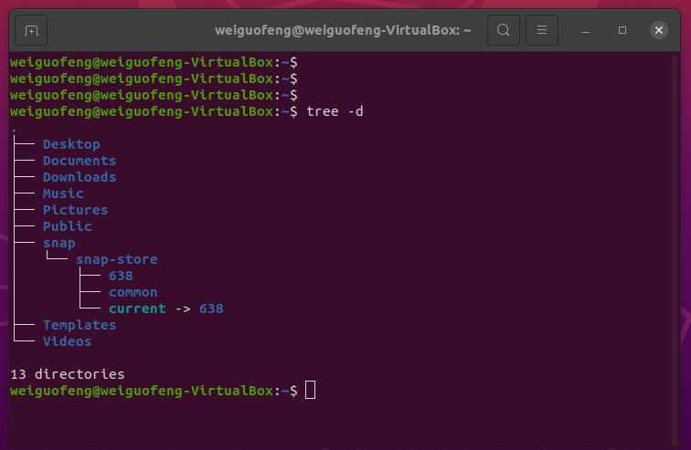

​		以下命令帮助我们探究文件系统

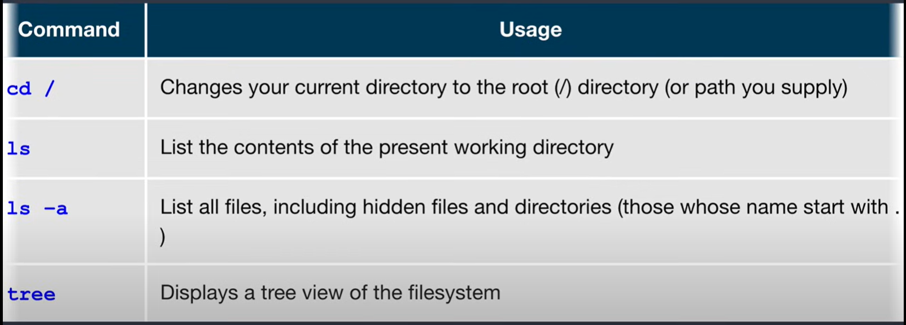

#### 	5、软链接Ln

​		ln链接也称为符号链接或软链接，这俩种链接基于Unix的操作中非常有用

​	假设文件1已经存在一个名为File2的软链接，使用此命令创建的配置，现在似乎存在俩个文件，然后仔细检查文件列表显示并不是这样 我们执行 ls -li file1 file2

​	-li是列表和索引，file1和file2使用同一索引，对于二者来说是内容相同的文件，那么这里使用ln发生了什么？

​	其实这个相当于给file1创建了一个名称为file2的快捷方式，这里需要注意的是切勿将原索引文件删除，例如删除file1，那么file2可能会受到影响，一般是默认创建的

​		还有就是修改文件的名称会破坏链接并导致创建俩个对象，链接仍然存在

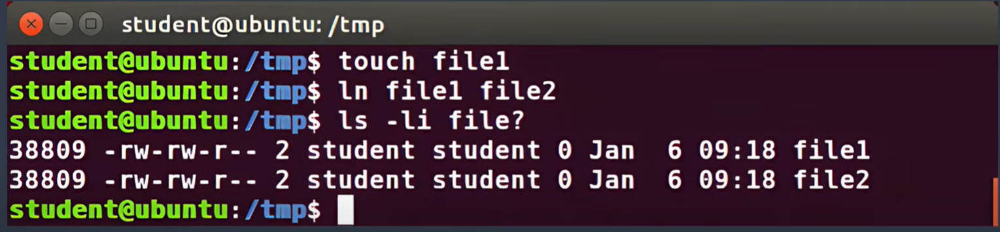

​	Ln -s file1 file3  -- 这个是给file3创建一个符号链接，符号链接也是软链接 在查看列表的时候会有link -- l标识，但索引会发生变化

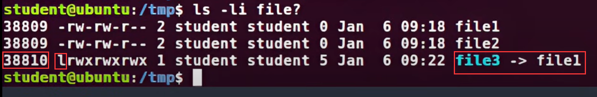

#### 6、查看文件

​	wc 文件名称 --可以查看这个文件的行数‘

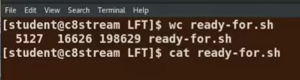

​	查看文件

​	使用 cat -n --使用n代表显示行数

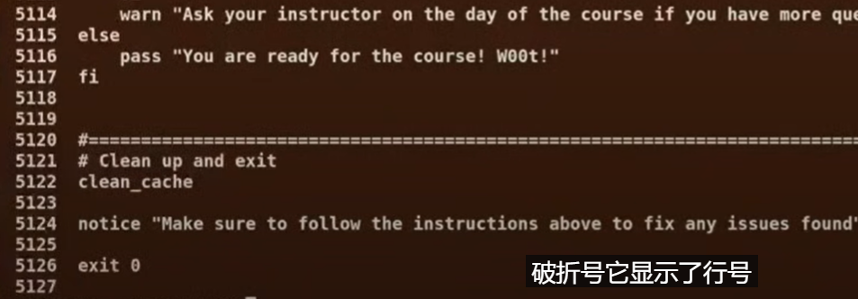

​	如果是想分页查看文件

​	使用less 文件名称 -----然后按空格进行 向下翻页 

​	less -N 携带行号分页查看

​	假如我们只想看前几行的内容使用head 文件名称

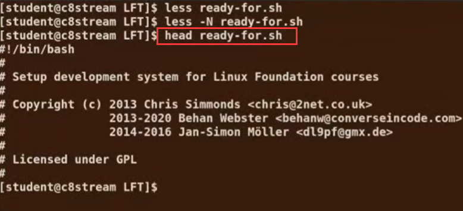

​	假如我们想查看前20行 -- 20行的内容

​	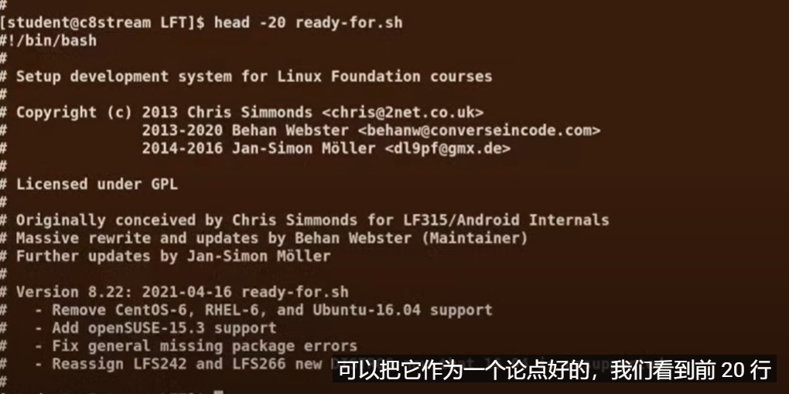

​	假如我们想查看尾部 最后的10行内容

​	使用tail 文件名称

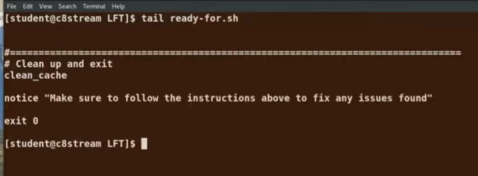

​	假如想看最后20行的内容

​	tail -20 filename

​	查看整个文件 tac filename

#### 	7、touch

​	touch通常用于设置或更新文件的访问更改和修改时间，默认情况下它会重置文件的时间戳为当前时间。

​	创建一个空文件 touch filename

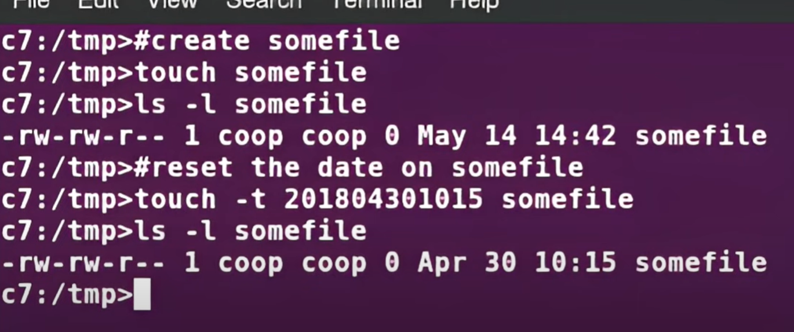

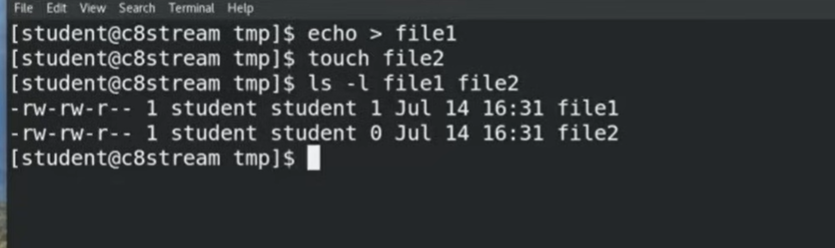

#### 8、创建文件夹删除文件夹

​	mkdir 文件夹 ---- rmdir删除文件夹 rm -rf 文件夹

#### 	9、mv移动和重命名

​	mv 原文件 目标文件

​	如果使用rm -i 交互式的删除 是每次删除都会有提示，是否确认删除

​	rmdir适用于 空文件夹，否则会报错

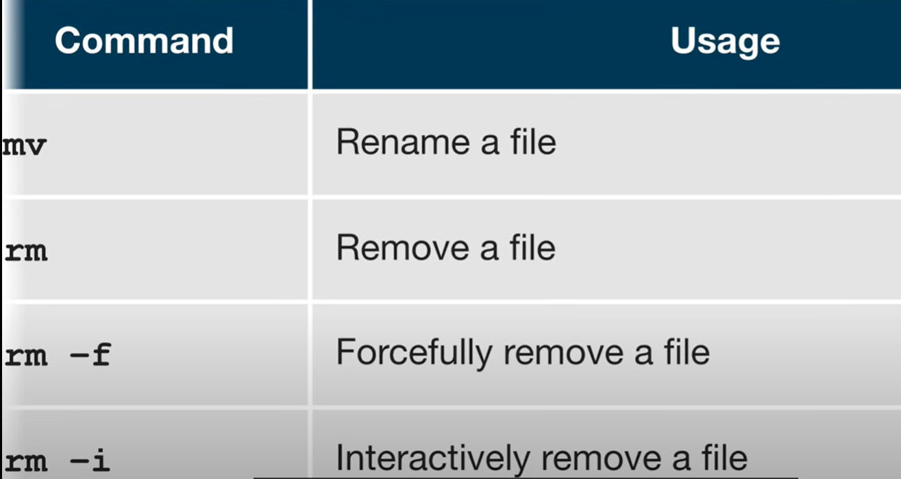

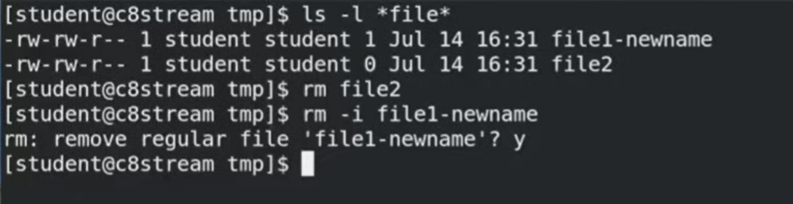

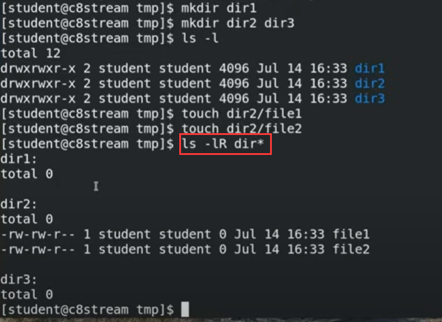

#### 	10、pipe管道

​	linux可以支持多个命令执行，多层管道过滤最终达到我们需要的内容

​	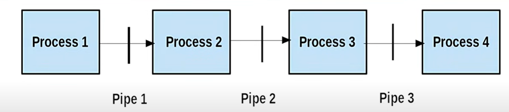

​	

假设我们想找到有字符串LFS300的文件

 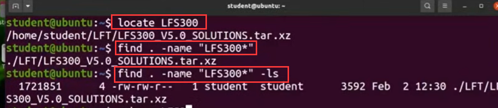

​	如果使用locate 来查找文件的话，新建的文件会查询不到，需要更新数据库

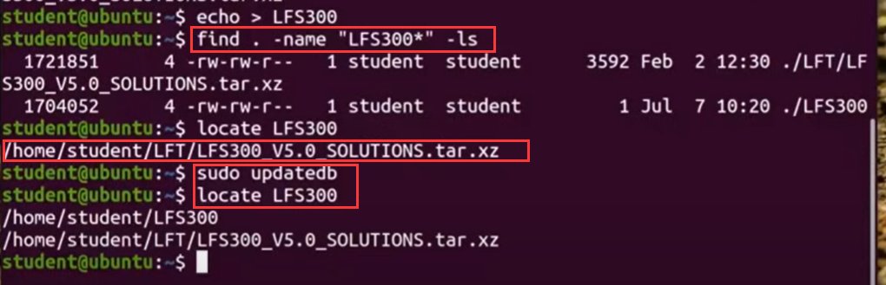

#### 11、通配符

​	使用通配符搜索文件

​		？ -- 匹配任何单个字符

​		* -- 匹配全部字符

​		[] -- 匹配括号中包括的内容

​		[!set] -- 匹配括号中不包括的内容

​	

​	du   -sh   -- d是disk，u是usage使用，-s是summary总大小 h是human以人类可读方式显示

​	du - sh a* -- 查看文件夹中全部以a开头的文件大小

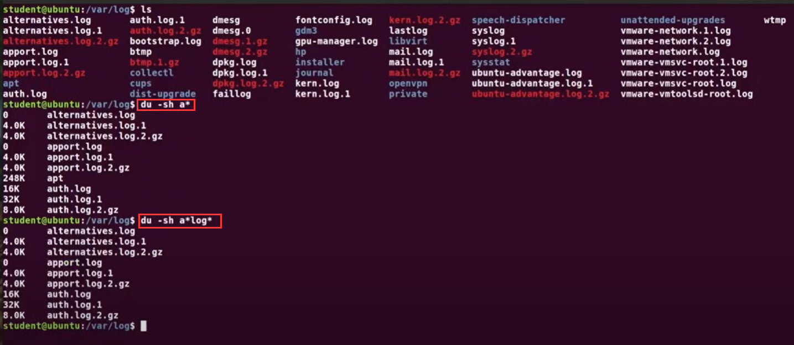

​	

​		使用通配p-z查询

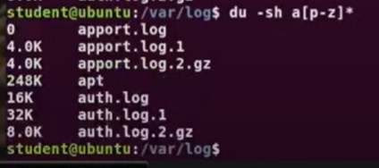

#### 	12、按时间查询文件

​		使用find   -ctime 3    3是代表 天

​		可以使用的option有 -cmin分钟查询

#### 	13、按文件大小查询

​			find  /  -size 0  ------注意这里的大小是512字节

​			我们可以指定使用字节 千字节 兆字节 等

​		查询lin开头的 大于10M的文件，并执行exec ls -shF命令

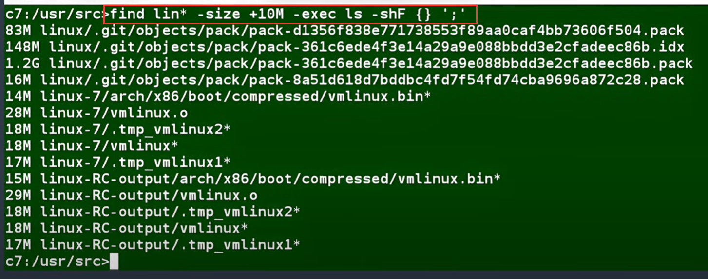

#### 14、文档的使用

​		定位到视频的 3小时33分钟，即可查看详细的文档参阅操作

https://www.youtube.com/watch?v=sWbUDq4S6Y8

