# 4、process进程

​		1、什么是进程？

​		2、区分进程类型枚举进程属性

​		3、使用PS管理进程

​		4、了解负载平均值的使用

​		5、操作进程进行后台处理

​		6、使用at，cron和sleep来安排将来的进程或暂停

#### 	1、什么是进程

​			一个进程是一个任务或更多相关任务线程正在执行，在计算机上，它与程序或单个命令运行的进程

#### 	2、进程类型

​			

​		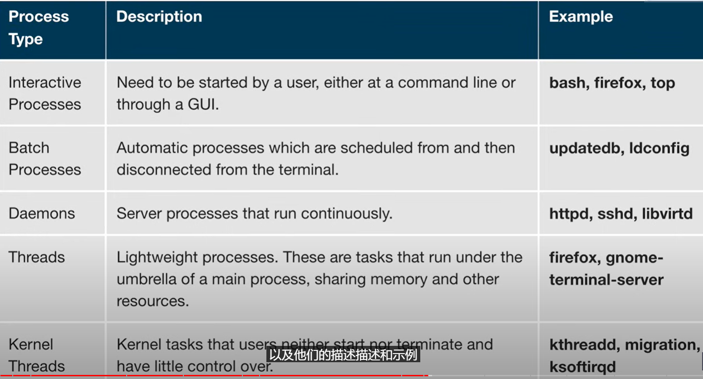

#### 3、进程调度和状态

​			一个关键的核心函数称为 调度程序 它不断的转移进程 开启和关闭CPU共享时间 根据相对优先级，需要多少时间以及花费了多少时间授予任务，进程处于运行状态这意味着它当前正在执行

​		如果子进程停止而主进程还在运行 -- 这样的进程称为 僵尸进程

​	进程和线程id：

​		在任何时间总有多个进程在执行，操作系统会给每个进程分配PID，PID用于跟踪进程状态 CPU使用情况 内存使用情况，资源所在的确切位置，内存及其他特性。

​		新进程PID通常按升序分配，生成的顺序是PID1表示初始进程，并且后续分配更高的数字的PID

​		PID---唯一进程ID

​		PPID---父进程ID

​		TID -- 线程ID

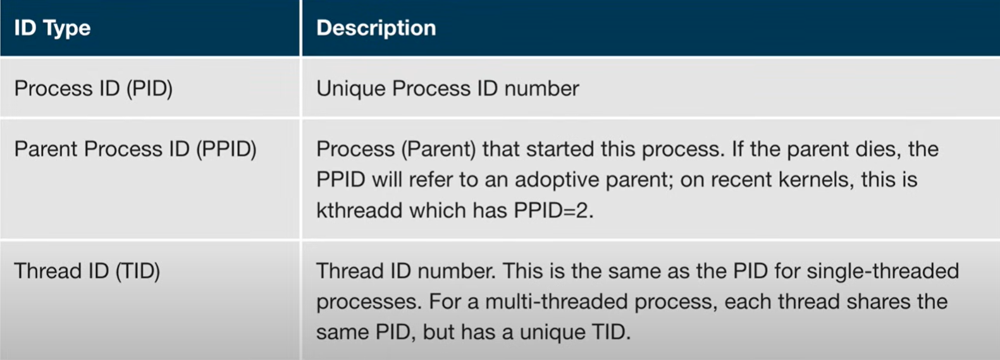

#### 4、终止进程

​	在某个时候应用程序可能会停止正常工作怎么办？消除它需要终止进程，我们可以使用kill命令

​	

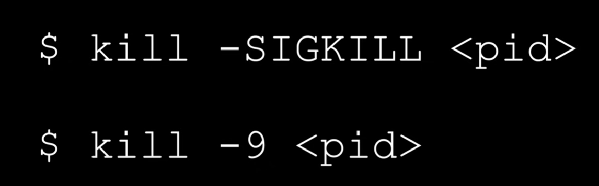

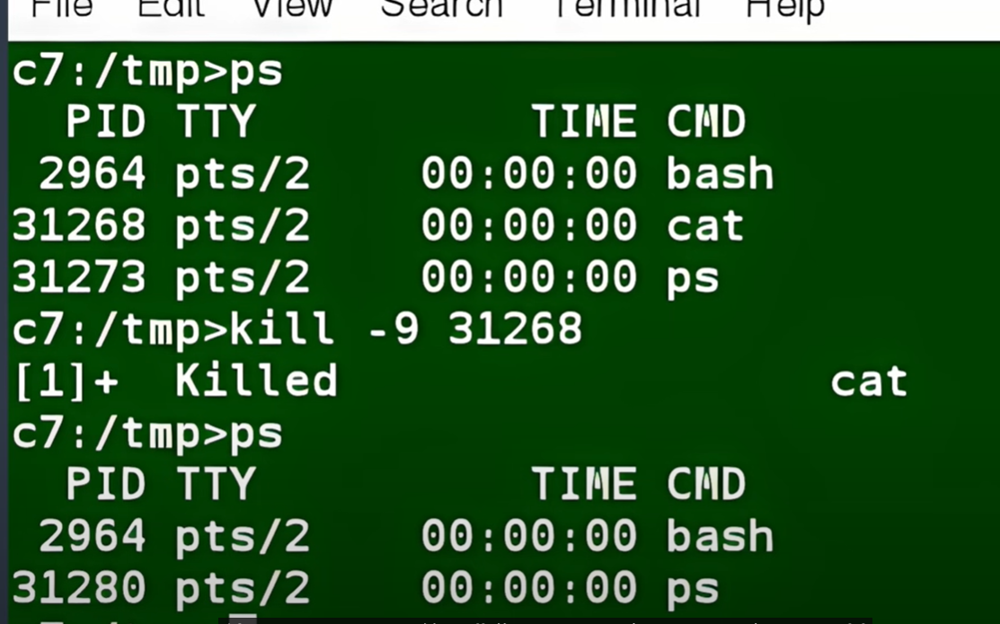

#### 	5、进程的优先级

​		我们可以查看nice.out  ---nice中的值越低 使用CPU的权重越高，优先级高

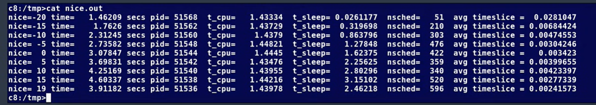

​		一般执行时间比较久的优先级设置的比较低

​	最高优先级的设置是 nice值为-20

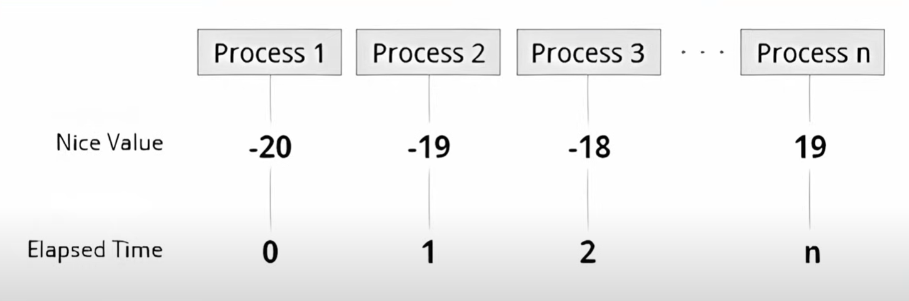

​		下面是例子：如何查看nice优先级，以及如何修改进程的优先级

​	查看进程

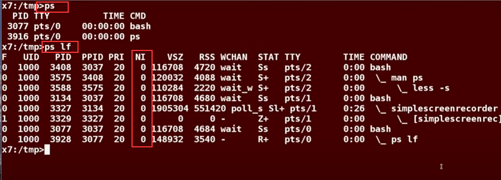

​	设置较低的优先级

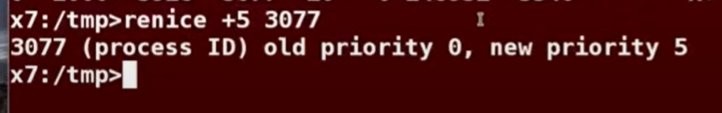

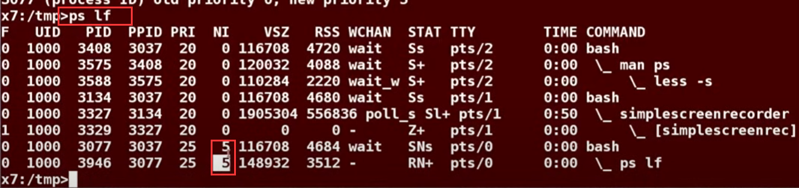

​	设置高优先级 -- 注意需要管理员权限

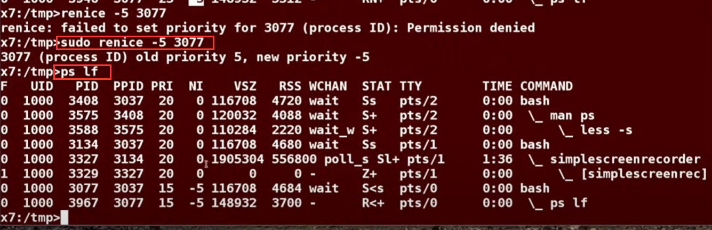

​	使用命令gnome-system-monitor可以呼出桌面系统的监视器

​	这也可以设置优先级

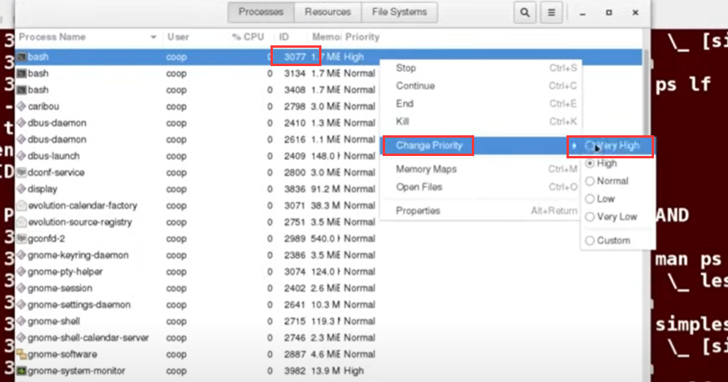

#### 	6、cpu使用率

​		命令 w、top、uptime

​		w命令-- 显示当前系统运行时长

​		uptime -- 当前系统平均负载情况

​		top -- 当前系统 cpu内存使用情况

​		ctrl + z 暂停进程

​		ctrl + c 退出

​		

#### 	7、job命令

#### 	8、ps命令

​		ps -- 提供当前进程有关的信息 如PID

​		ps有很多指定option选项

​		例如输出格式化的进程信息 ps   -ef    或者ps  -elf

​		ps -aux 

- `ps`：表示进程状态（Process Status）。
- `-aux`：是一组选项，用于指定要显示的进程信息的详细程度。其中，`a` 选项表示显示所有用户的进程，`u` 选项表示显示进程的cpu，mem详细信息，`x` 选项表示显示没有控制终端的进程

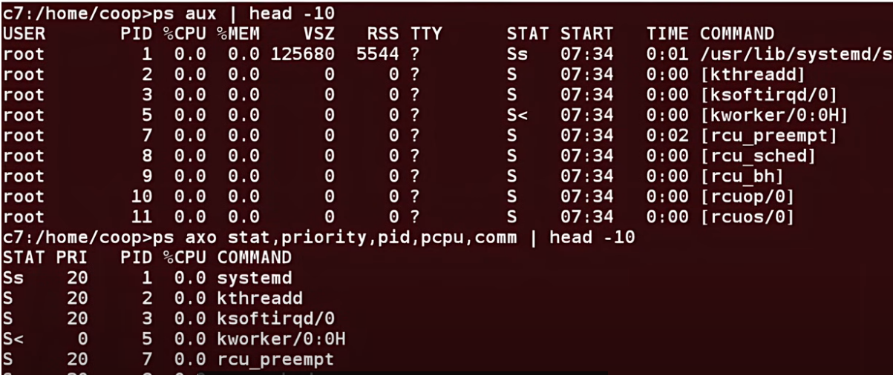

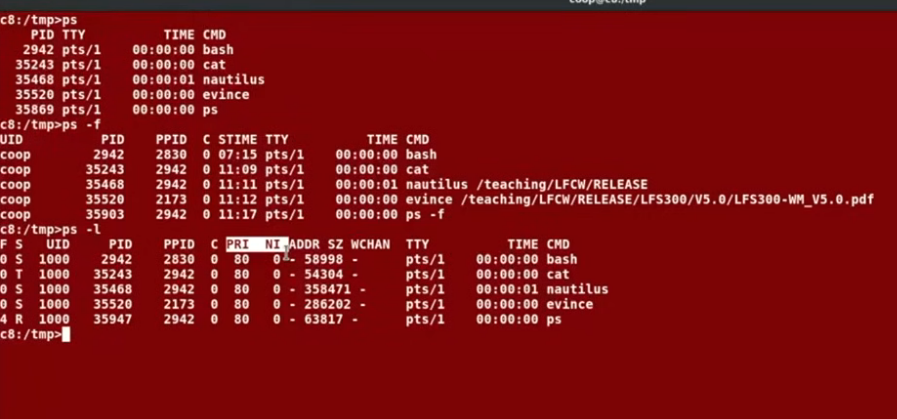

​	进程树 process tree

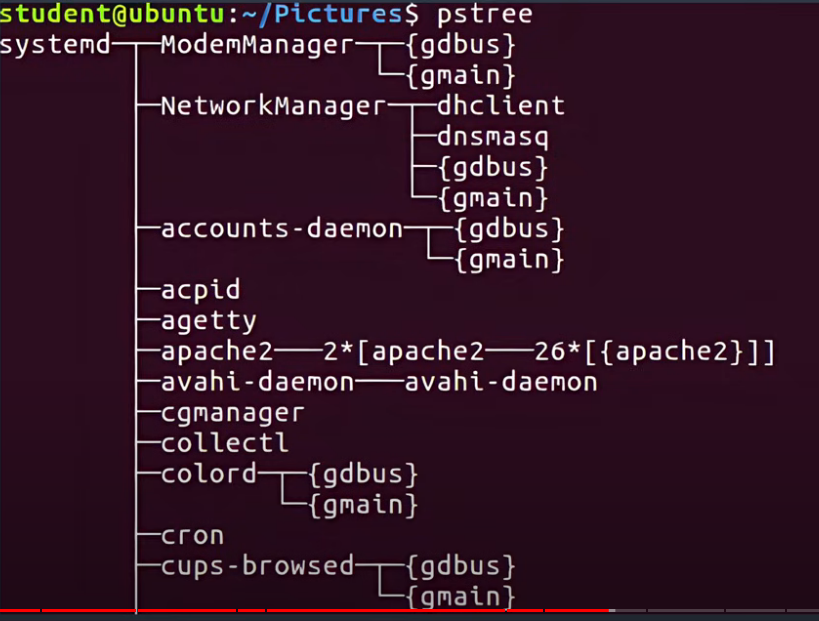

#### 	9、cron定时任务

​			设置etc下面的crontab 定时任务表

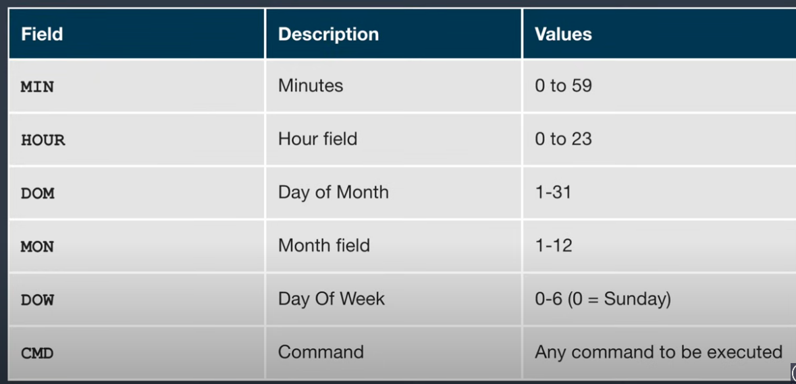

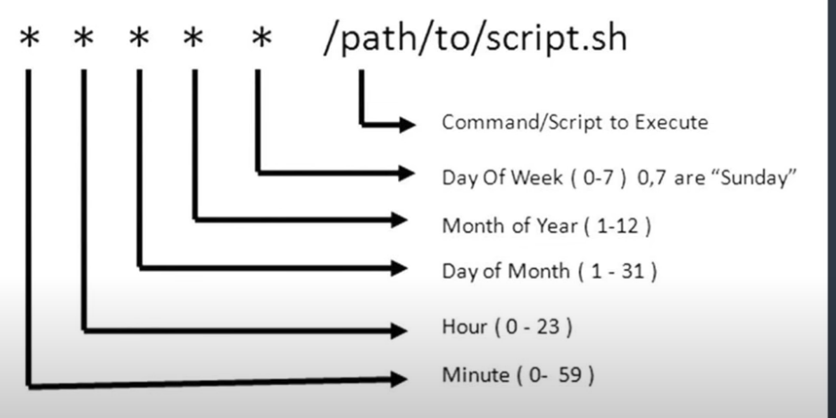

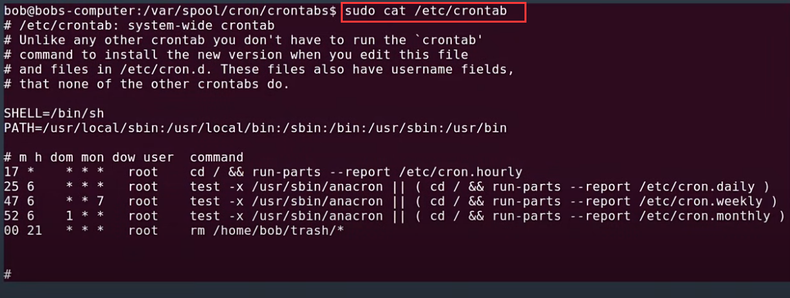

#### 10、sleep

#### 12、文件系统结构Introduction to Filesystem

​		/bin -- 用户的二进制文件

​		/sbin -- 系统二进制文件

​		/etc  -- 配置文件

​		/dev -- 设备文件

​		/proc -- 处理信息

​		/var -- 变量的文件

​		/tmp -- 临时文件

​		/usr -- 用户程序

​		/home  -- 主目录

​		/boot  -- 引导加载程序文件

​		/lib   -- 系统库

​		/opt -- 可选应用程序

​		/mnt -- 挂载的目录

​		/media -- 可移动设备

​		/srv  -- 服务数据

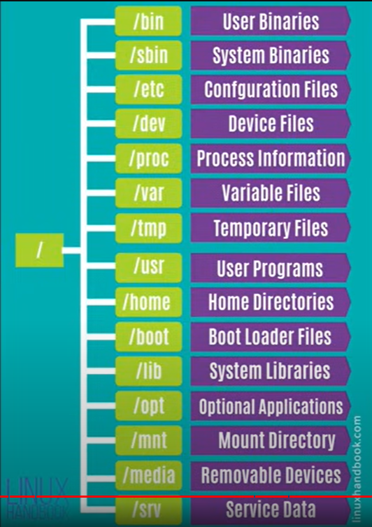

#### 	13、linux 分区

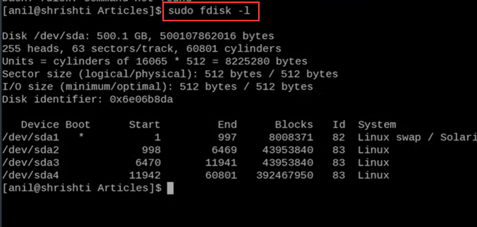

#### 14、Mount Points 挂载点

​		在使用文件系统之前，需要将其挂载到文件系统上，在挂载点，它是一个目录，可以是空的，也可以不是空的目录。要移植文件系统时有可能需要创建目录 -- 如果目录不存在，会有提示警告，如果挂载一个非空的目录，那么这个目录下之前的内容会被覆盖掉，以前的数据将不能再使用，因此挂载点通常是空目录。

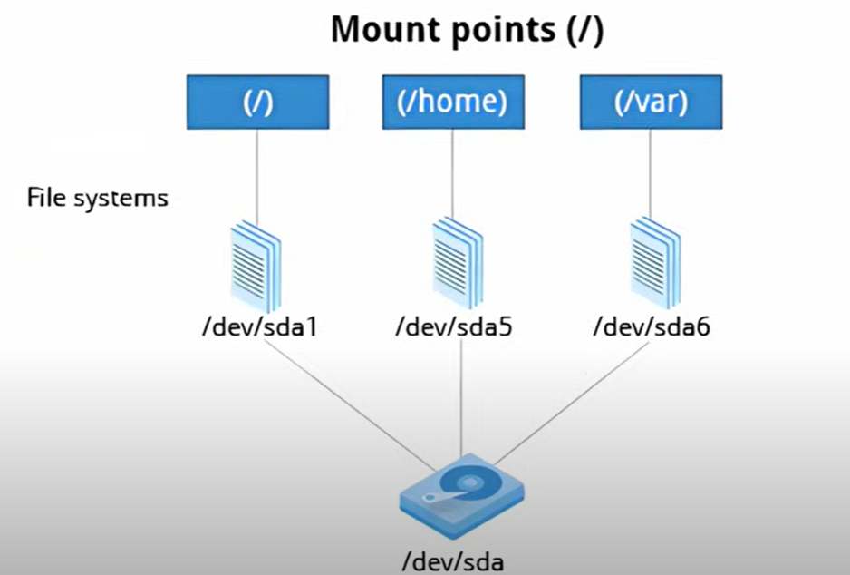

​	例如：将sda5盘 挂载到 home路径

​	取消挂载---只有root权限才可以

​	

​	无参数的Mount将显示 全部的挂载程序

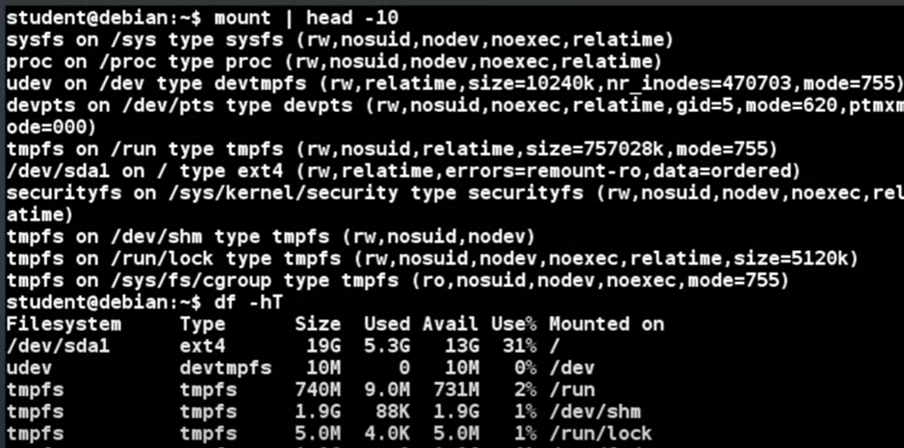

#### 	15、NFS和网络文件系统

​			我们通常需要跨物理系统 共享数据，要么是在同一个地点，要么是在可以网络互通的地方，NFS网络文件系统或分布式文件系统，可以在一台机器上拥有所有数据，也可以是多个不同的文件系统分布在多个网络节点上。

​	服务器管理员在服务器上挂载 远程用户的主目录，以便允许通过网络访问文件及配置，NFS系统有比较长远的历史，最早是由sun公司开发的。

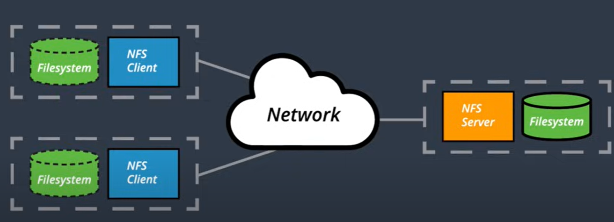

#### 	16、diff对比文件差异

​			使用diff命令

​		option：

​			-c 提供差异列表，包括前后的三行上下文，内容以不同线条区分

​			-r 用于递归比较子目录和当前目录

​			-i 忽略字母的大小写

​			-w 忽略空格和制表符（空白）的差异

​			-q 只报告文件不同，而不列出差异

​		diff3的使用方式

​	

