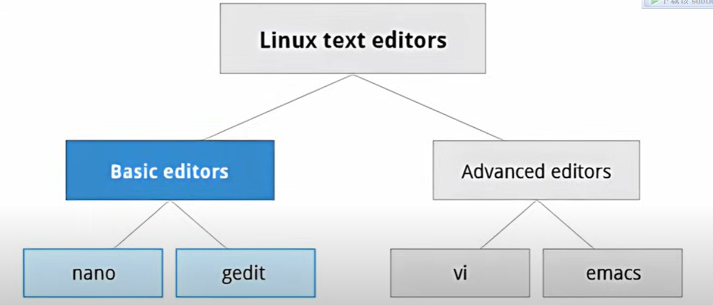
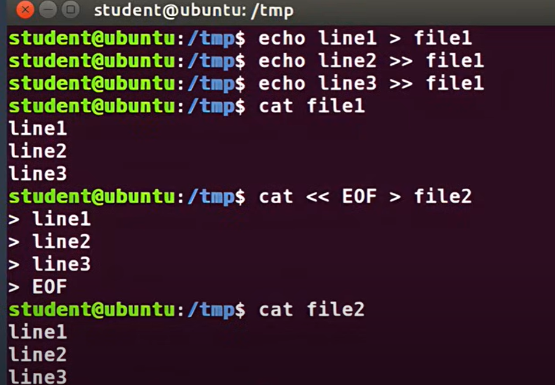
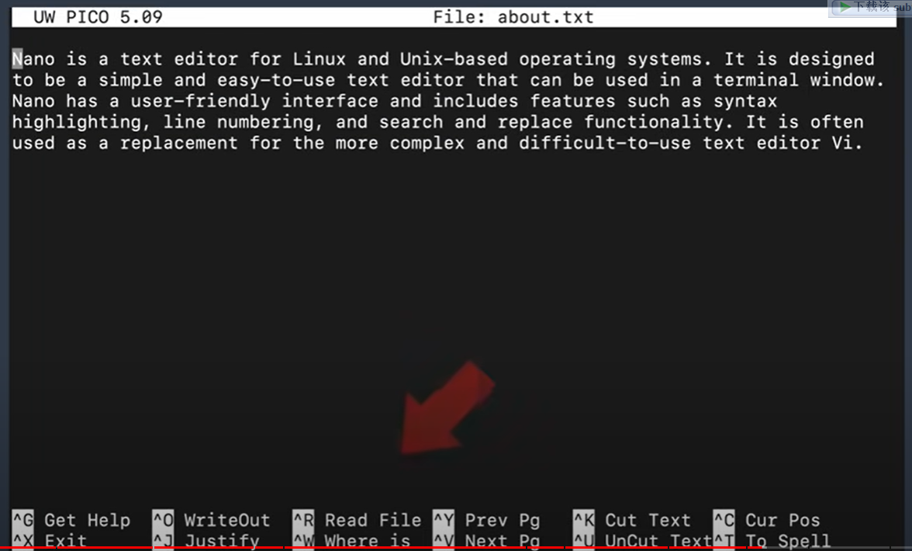
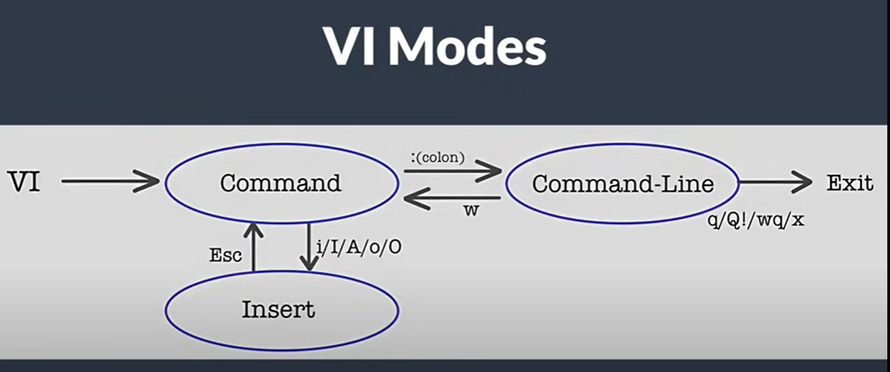
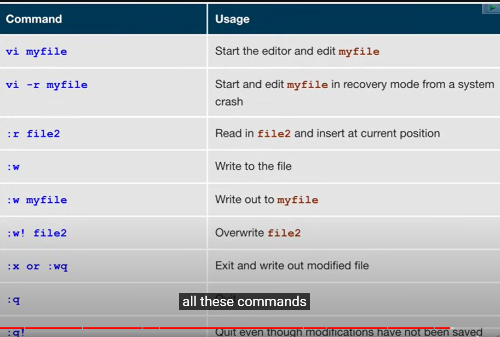

# 5、编辑器

​		text editors

​			如何创建和编辑

​			文本编辑器有很多种

#### 	1、echo

​	给文件追加行使用echo，例如

#### 	2、nano编辑器

​				命令行操作

​		

#### 	3、gedit 编辑器

##### 			是桌面可视化的编辑器

​				类似于notepad++

​	

#### 	4、vi和emcas编辑器

​				默认系统里安装的有这俩个编辑器

​		快速移动到下一字符 方向键/ h --左   k是右  j是下一行，k是上一行

​		快速移动到下一个单词开始 按 w  --常用

​		快速移动到最后位置 按 $

​		快速移动光标到指定行数  1gg 1代表行数   或者是 1G

​		不小心输入错误内容了，撤销上一步操作 输入 u

​		搜索定位到特定行 ------ 输入/内容 回车

​		使用`n`键跳转到下一个匹配项，使用`N`键跳转到上一个匹配项

