# 6、用户配置

#### 	1、查看用户

​		whoami

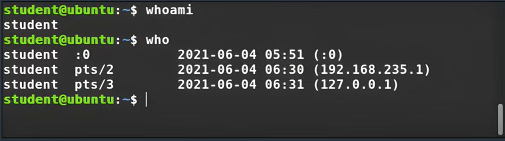

#### 	2、用户启动文件

​		在etc下定义和配置用户的环境文件，

#### 	3、创建用户

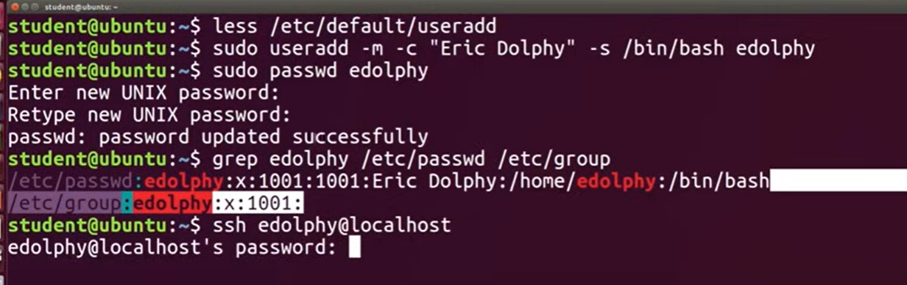

​		删除用户

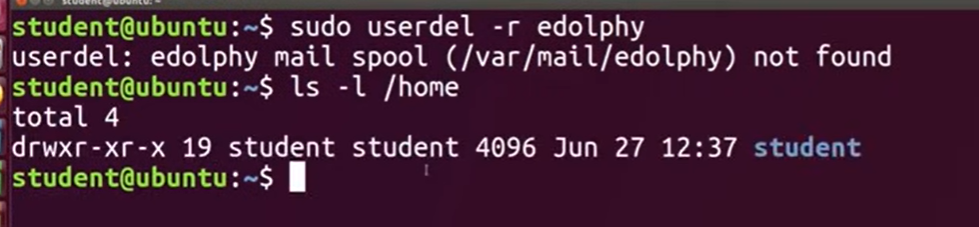

#### 	4、新建/删除组

#### 	5、设置环境变量PATH

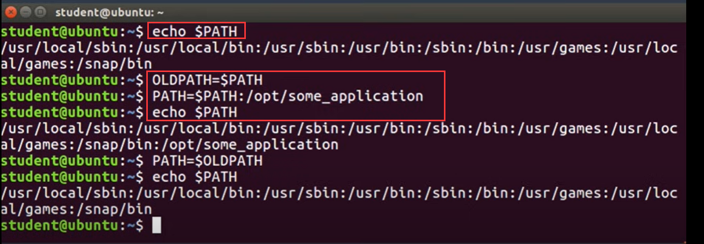

#### 	6、历史命令查看

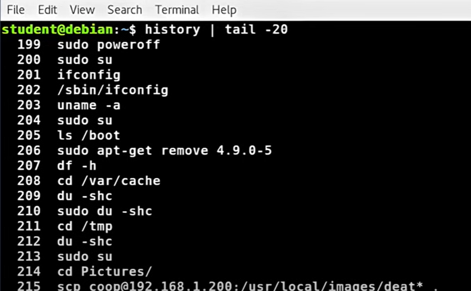

​		查询历史使用的命令

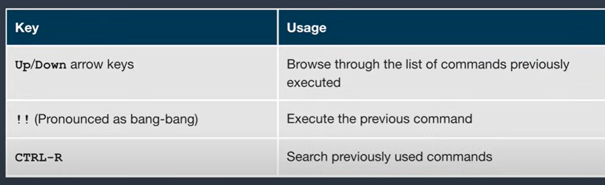

#### 	7、快捷键

​	使用键盘快捷键来迅速执行不同任务

​		ctrl + L ：清除屏幕

​		ctrl + D：退出当前shell	

​		ctrl + Z： 将当前进程置于挂起的后台

​		ctrl + C： 终止当前进程

​		ctrl + H： 工作原理和退格相同

​		ctrl + A： 到这一行的开头

​		ctrl + W：删除光标前的单词

​		ctrl + U： 删除从行首到光标位置的内容

​		ctrl + E：排到队伍的最后

​		Tab      ： 自动提示文件

#### 	8、文件权限

​	chown -- 修改文件目录的用户归属

​	chgrp -- 修改组的所有权

​	chmod -- 修改文件权限，可以对所有者、组和其他用户 进行更改

​	最高的权限是 7 可读、可写、可执行----如 chmod 777

​		可以对文件或目录进行权限的设置

​		如果是对目录进行设置，可以使用 option， -R 这个代表递归子目录及文件

​			chmod -R 777 ------第一个值是 R读，第二是W写，第三是X 执行Execute

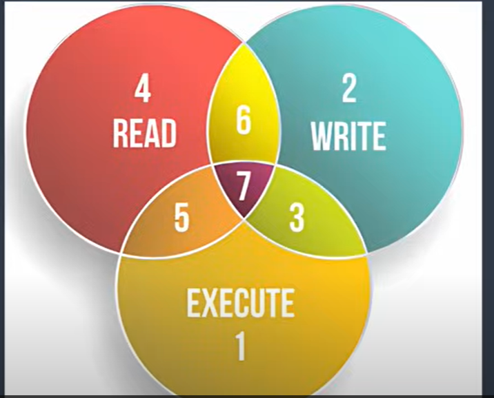

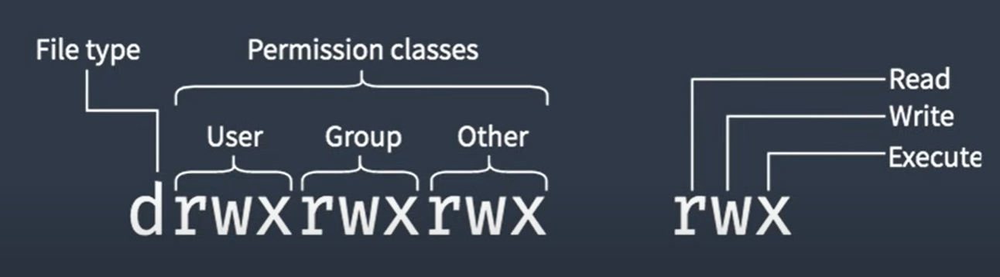

例如：给文件 添加 用户user和其他other --uo 增加执行权限x，而给组group，g去掉写的权限 -w

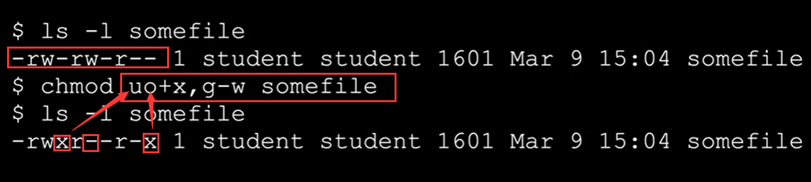

​		数字的代表方式

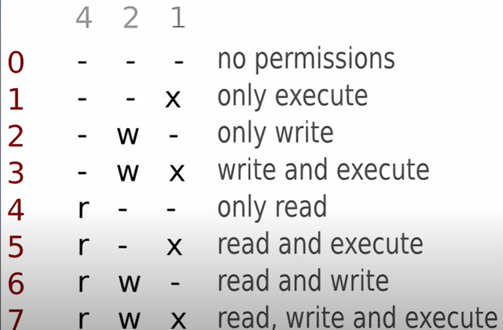

​	例如：

​	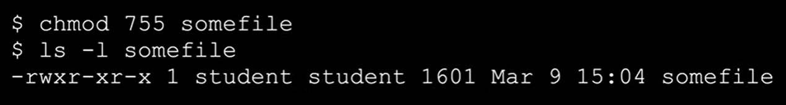

