# 8、network操作

​		network operations -- 网络操作

#### 	1、解释基本网络概念

​		网络是一组计算机和网络连接在一起的计算设备，通过电缆或无线媒体等通信渠道与计算机连接。

大多数组织同时具有内部网络和Internet连接用户与组织外部的机器和人员进行通信，互联网是世界上最大的网络。

​	

##### 		IP地址：

​		ipv4 -- 一个32位的地址 分为4个8位部分，称为8字节

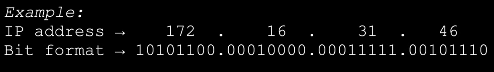

​	

​	网络地址分为五类 ：

​		网络地址 和主机地址

​		网络id用于标识网络，主机id用于识别网络中的主机

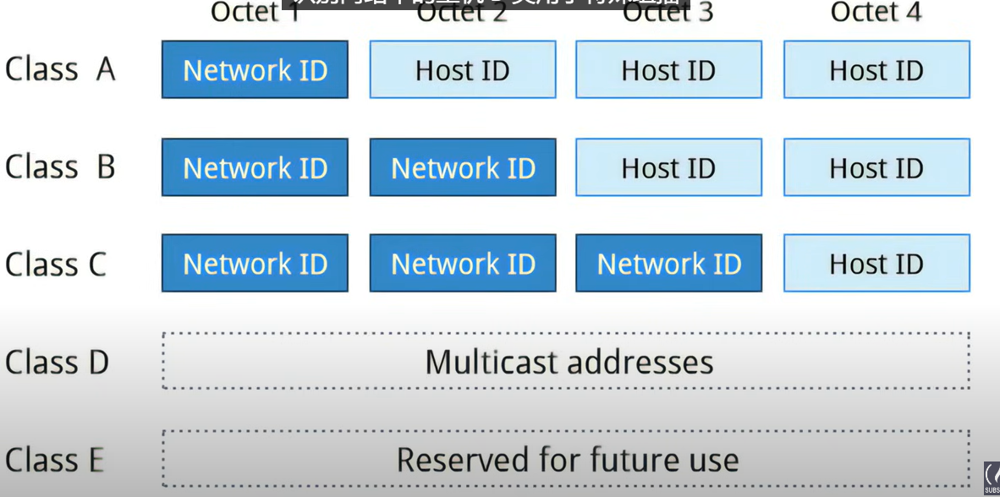

​	我们一般使用的是ABC三种

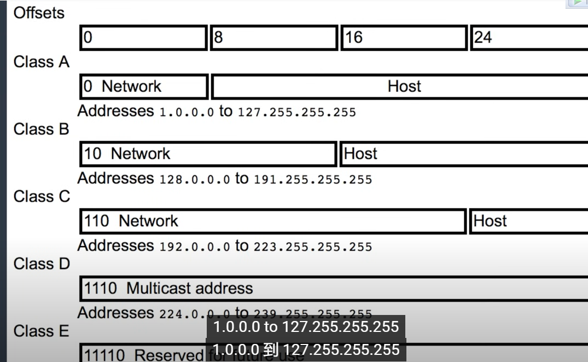

​	主机比较少的或者是小于255台设备的那么就使用C类网络，因为最后一位是主机地址

#### 	2、配置网络接口和使用实用程序

​			服务地址

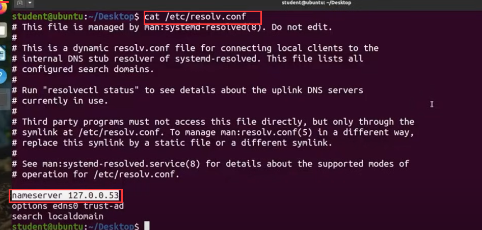

​	如果需要配置host的话，也是在etc目录下

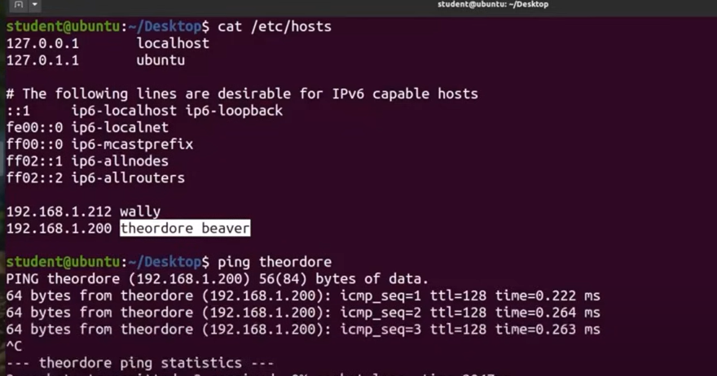

​	网络接口是设备和网络直接的连接通道，物理网络接口可以通过网络接口卡进行连接，网络接口均由IP进行连接。

 	IP网络地址配置：

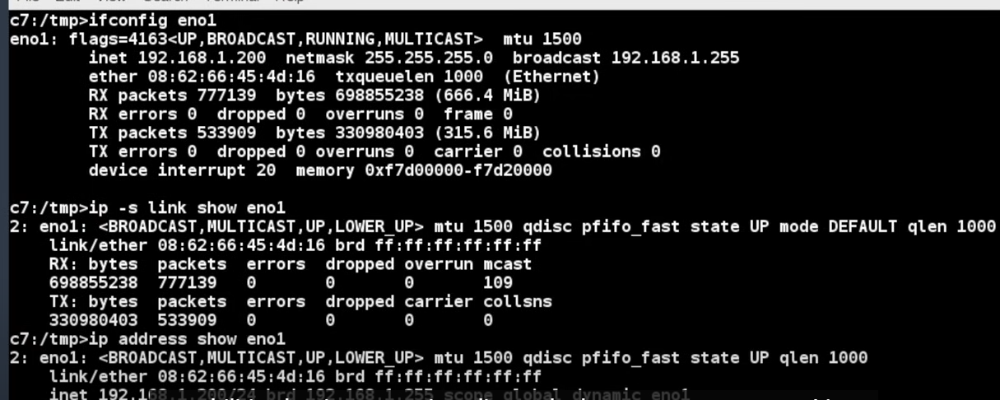

查看IP可以使用

​	/sbin/ip addr show

​	路由信息查看

##### 	ping：用于检测连接网络的机器是否可以接收和发送数据

 

​	

​		使用-c控制发送包的次数

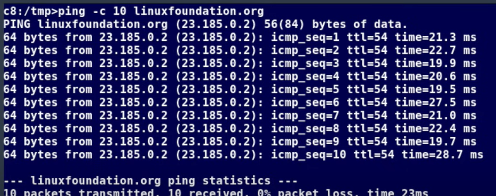

##### 	route：路由

​			网络需要连接许多节点，数据从源移动到一系列路由器，并可能跨越多个网络服务器包含地址的路由表，IP路由协议使路由器能够建立一个转发表，将最终目的地与下一个跳转地址可以使用IP路由命令查看或更改IP路由表，以添加、删除或修改特定的静态路由

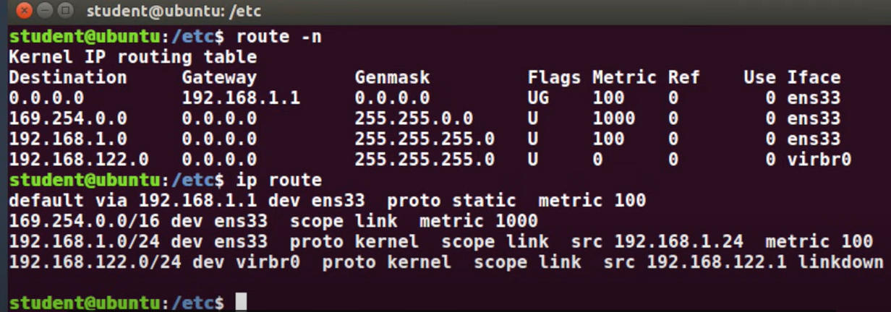

​	路由可以使用的命令：

​		显示当前路由表 --- route -n or ip route

​		添加静态路由 -------route add -net address or ip route add

​		删除静态路由 -------- route del -net address or ip route del

##### 	网络工具：

​		对于监控和调试网络问题非常有用

​	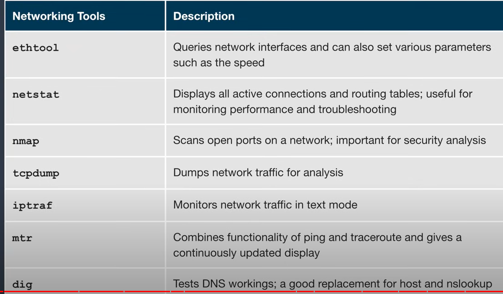

​	例如，查看eth0的所有网络活动连接

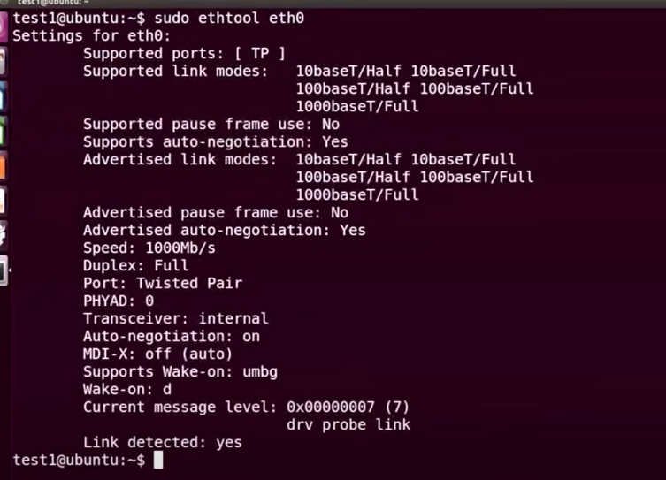

​		

​	路由表查看

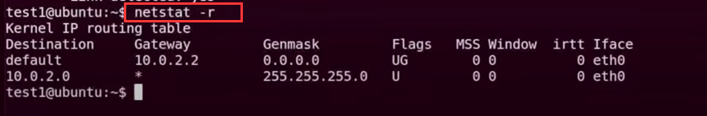

#### 	3、使用图形化和非图形化浏览器

​		非图形化的浏览器

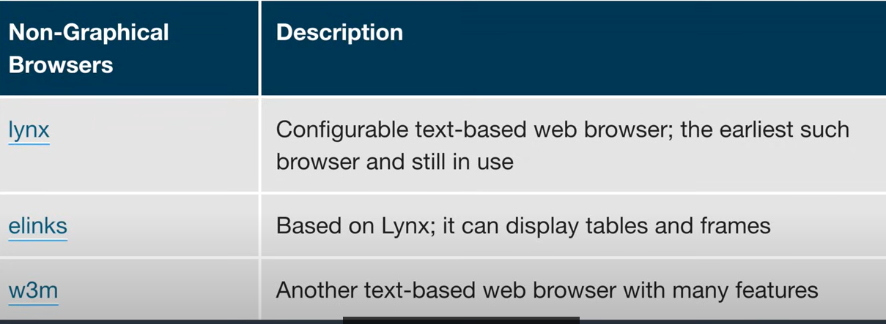

#### 	4、从客户端和服务端传输文件

​	有时候我们需要下载文件可以使用wget

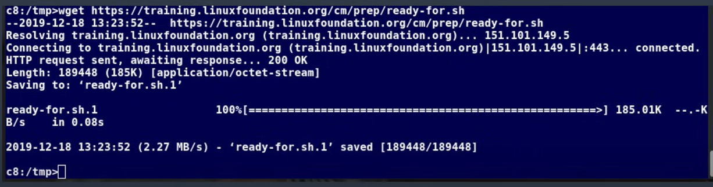

​	想获取有关url的信息，可以使用curl命令

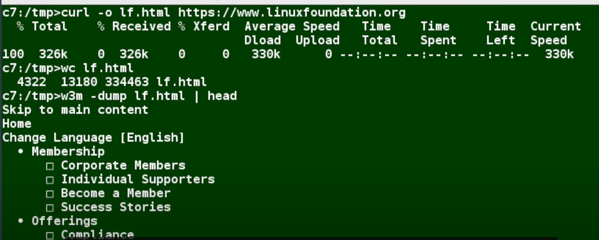

​	-o是将获取的url保存

##### 	ssh：

​		是一种用于安全数据的加密网络协议，还用于远程服务和其他安全服务，在网络上的俩个设备之间，对于管理系统非常有用

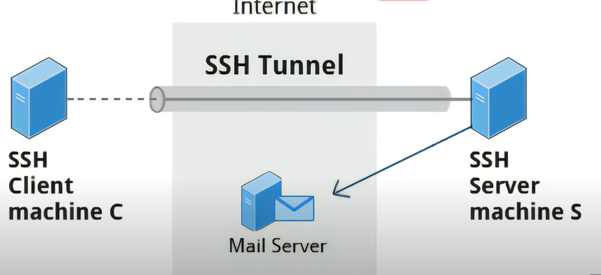

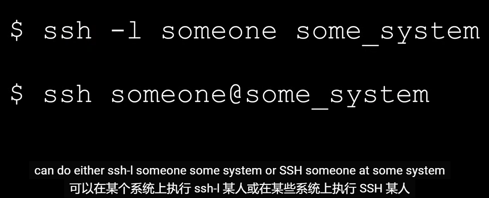

##### 	scp：远程copy

​		文件远程传输

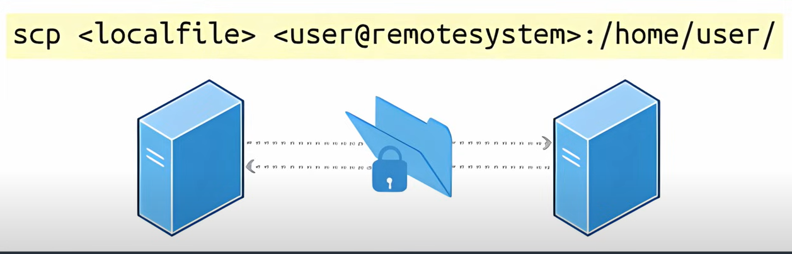

​	示例：

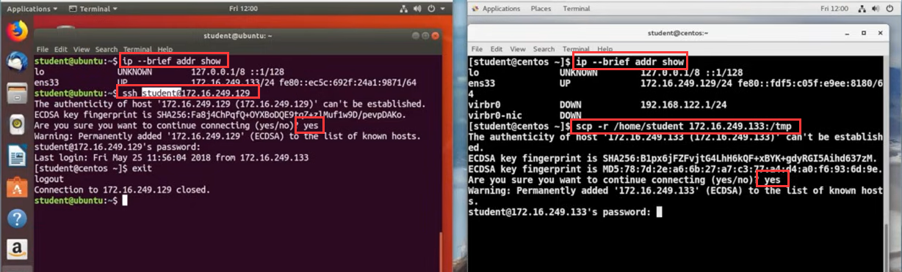

https://www.youtube.com/watch?v=sWbUDq4S6Y8

​	