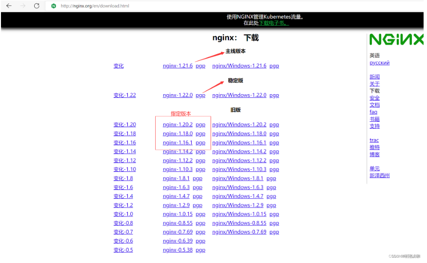
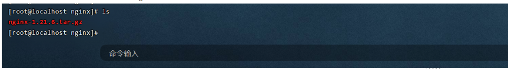
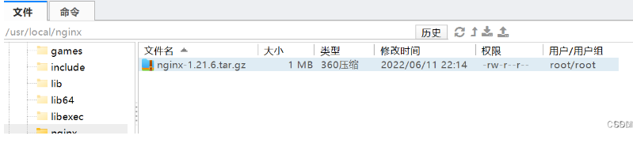
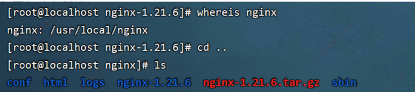
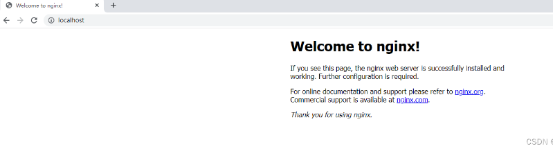

# 1、linux部署nginx

#### 简介
Nginx 是一个很强大的高性能Web和反向代理服务，也是一种轻量级的Web服务器，可以作为独立的服务器部署网站，应用非常广泛，特别是现在前后端分离的情况下。而在开发过程中，我们常常需要在window系统下使用Nginx作为Web服务器。

#### 一、下载Nginx


1.1 访问Nginx官网，点击download
Nginx官网：http://nginx.org/




## 1.2 上传源码包

注意：上传到指定目录下 /usr/local/nginx	






# 二、安装编译

## 2.1 解压文件

```sh
tar -xvzf nginx-1.21.6.tar.gz 
```

## 2.2 安装编译环境 、pcre软件包、openssl、zlib

```powershell
yum -y install gcc gcc-c++  pcre pcre-devel openssl openssl-devel zlib zlib-devel 
1
```

## 2.3 进入nginx目录里进行安装编译

```sh
cd nginx-1.21.6

#预编译
./configure --prefix=/usr/local/nginx --sbin-path=/usr/local/nginx/sbin  --with-http_ssl_module --with-http_stub_status_module --with-http_gzip_static_module

#编译并安装
make && make install
 
#检查是否编译正确，如果返回值是 0，就是执行成功；0 以外的值，就是失败。
echo $?  


```


***参数解析：***

```sh
在 ./configure 命令后跟了一堆参数，它们分别表示：
--prefix：指定当前要安装的 Nginx 主程序目录
--sbin-path：安装完成后，使用 Nginx 的命令放在该目录下(可以省略)
--user：运行 Nginx 的用户(可以省略)
--group：运行 Nginx 的用户组(可以省略)
--with-(模块名)：为 Nginx 添加的模块(可以省略)

```


# 三、启动nginx

## 3.1 查找工作目录

```sh
whereis nginx
```




## 3.2 进入sbin目录启动nginx

​	注意：

```sh
cd /usr/local/nginx/sbin/

#启动命令: ./nginx
#重启命令: ./nginx -s reload
#关闭命令: ./nginx -s stop 

```


## 3.3 访问nginx主页

**直接在浏览器地址栏输入网址：http://localhost:80**




# 四、修改配置

## 4.1 编辑nginx.conf

`vim /usr/local/nginx/conf/nginx.conf`

```sh
# 全局参数设置
user  nginx;				  #指定用户
worker_processes  4;          #设置nginx启动进程的数量，一般设置成与逻辑cpu数量相同
error_log  logs/error.log;    #指定错误日志
worker_rlimit_nofile 10240;  #设置一个nginx进程能打开的最大文件数
pid        /var/run/nginx.pid;
events {
    worker_connections  1024; #设置一个进程的最大并发连接数
}
 
# http 服务相关设置
http {
    include      mime.types;
    default_type  application/octet-stream;
    log_format  main  'remote_addr - remote_user [time_local] "request" '
                      'status body_bytes_sent "$http_referer" '
                      '"http_user_agent" "http_x_forwarded_for"'; 
    access_log  /var/log/nginx/access.log  main;    #设置访问日志的位置和格式 
    sendfile          on; #是否调用sendfile函数输出文件，一般设置为on，若nginx是用来进行磁盘IO负载应用时，可以设置为off，降低系统负载
    gzip              on;      #是否开启gzip压缩，将注释去掉开启 
    keepalive_timeout  65;     #设置长连接的超时时间
# 虚拟服务器的相关设置
server { 
        listen      80;        #设置监听的端口 
        server_name  localhost;        #设置绑定的主机名、域名或ip地址 
#        charset koi8-r;        # 设置编码字符 
		charset utf-8;
        location / { 
            root  /var/www/nginx;           #设置服务器默认网站的根目录位置,需要手动创建
            index  index.html index.htm;    #设置默认打开的文档 
        } 
        error_page  500 502 503 504  /50x.html; #设置错误信息返回页面 
        location = /50x.html { 
            root  html;        #这里的绝对位置是/usr/local/nginx/html
        }
    }
}

```


## 4.2 配置生效

注意：修改完配置文件须重新加载才能生效

```sh
./nginx -s reload

	
```


