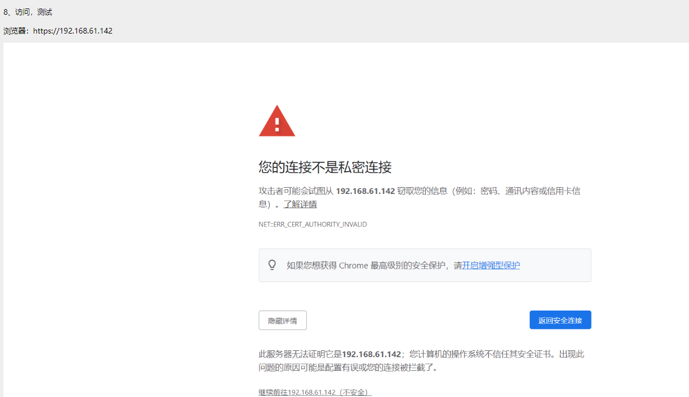

# 2、nginx生成ssl证书

1、创建证书存放路径  

```
[root@nginx ~]# mkdir /home/nginx/ssl
[root@nginx ~]# cd /home/nginx/ssl

```

2、  生成根证书的私钥

```
[root@nginx ~]# openssl genrsa 1024 > /home/nginx/ssl/server.key
genrsa：产生rsa密钥命令
1024： 密钥的长度位数，默认为512
```

3、  生成证书签署请求，（创建服务器证书的申请文件server.csr）

```
[root@nginx nginx]# openssl req -new -key /home/nginx/ssl/server.key > /home/nginx/ssl/server.csr

You are about to be asked to enter information that will be incorporated
into your certificate request.
What you are about to enter is what is called a Distinguished Name or a DN.
There are quite a few fields but you can leave some blank
For some fields there will be a default value,
If you enter '.', the field will be left blank.
-----
Country Name (2 letter code) [XX]:CN　　　　#国家名称
State or Province Name (full name) []:BJ　　#州或省名称
Locality Name (eg, city) [Default City]:BJ　　　　#城市
Organization Name (eg, company) [Default Company Ltd]:xiaoguaishou　　#组织名称（例如，公司）
Organizational Unit Name (eg, section) []:OP　　　　　　#组织单位名称（例如，部门）
Common Name (eg, your name or your server's hostname) []:127.0.0.1　　　　　　#通用名称（例如，您的名称或服务器主机名）
Email Address []:xiaoguaishou@qq.com　　　　#电子邮件地址

Please enter the following 'extra' attributes
to be sent with your certificate request
A challenge password []:test@123　　　　#密码
An optional company name []:xiaoguaishou　　　　#可选公司名称

```


4、  创建服务器证书（有效期十年）

```
[root@nginx nginx]# openssl req -x509 -days 3650 -key /home/nginx/ssl/server.key -in /home/nginx/ssl/server.csr > /home/nginx/ssl/server.crt
```

5、查看生成的证书

```
[root@nginx ssl]# ls
server.crt server.csr server.key　　　　　　#共生成3个文件
```

6、nginx配置证书


```
[root@nginx ]# vim /home/nginx/conf/nginx.conf

server {
listen 443 ssl;
server_name localhost;

ssl_certificate /home/nginx/ssl/server.crt;　　　　#证书路径
ssl_certificate_key /home/nginx/ssl/server.key;　　#证书路径

ssl_session_cache shared:SSL:1m;
ssl_session_timeout 5m;

ssl_ciphers HIGH:!aNULL:!MD5;
ssl_prefer_server_ciphers on;

location / {
root html;
index index.html index.htm;
}
}
```


7、重启nginx

```
[root@nginx nginx]# systemctl restart nginx.service
```


8、访问，测试 




