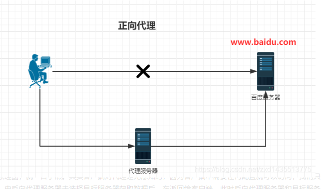
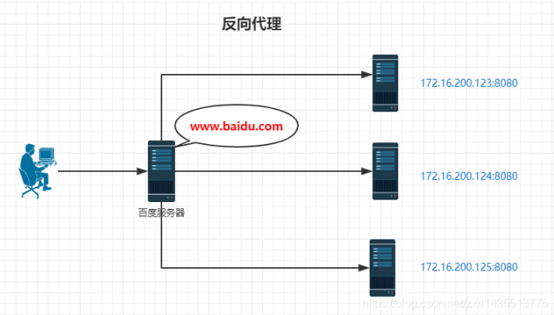
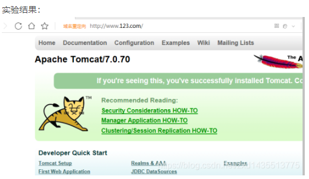
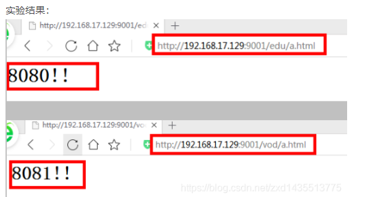

# 3、nginx反向代理


​	参考文章：[反向代理](https://blog.csdn.net/zxd1435513775/article/details/102508463?ops_request_misc=&request_id=&biz_id=102&utm_term=nginx%E5%8F%8D%E5%90%91%E4%BB%A3%E7%90%86%E8%B7%AF%E5%BE%84%E9%85%8D%E7%BD%AE&utm_medium=distribute.pc_search_result.none-task-blog-2~all~sobaiduweb~default-1-102508463.nonecase&spm=1018.2226.3001.4187)

#### 1.何为反向代理？
在介绍反向代理之前，先来了解一下正向代理。

**正向代理**：如果把局域网外的Internet想象成一个巨大的资源库，则局域网中的客户端要访问Internet，则需要通过代理服务器来访问，这种代理服务就称为正向代理，下面是正向代理的原理图。

由于工作环境原因，日常工作只能局限于单位的局域网，如果想要访问互联网，怎么办呢？这就需要用到正向代理，本人经常用正向代理来进行上网。




**反向代理**：看下面原理图，就一目了然。其实客户端对代理是无感知的，因为客户端不需要任何配置就可以访问，我们只需要将请求发送到反向代理服务器，由反向代理服务器去选择目标服务器获取数据后，在返回给客户端，此时反向代理服务器和目标服务器对外就是一个服务器，暴露的是代理服务器地址，隐藏了真实服务器 IP地址。




> 正向代理和反向代理的区别，一句话就是：如果我们客户端自己用，就是正向代理。如果是在服务器用，用户无感知，就是反向代理

​	这里有个问题：反向代理服务器，怎么选择挂在它后面的哪一台具体服务器呢？答案在后文揭晓，这就是负载均衡。


## 2.3 第三部分：http 块

```conf
http {
    include       mime.types;
    default_type  application/octet-stream;
    sendfile        on;
    keepalive_timeout  65;

    server {
        listen       80;
        server_name  localhost;

        location / {
            root   html;
            index  index.html index.htm;
        }

        error_page   500 502 503 504  /50x.html;
        location = /50x.html {
            root   html;
    }
}

```

​		这部分是 Nginx 服务器配置中最频繁的部分，代理、缓存和日志定义等绝大多数功能和第三方模块的配置都在这里。需要注意的是：http 块也可以包括 http 全局块、server 块。下面的反向代理、动静分离、负载均衡都是在这部分中配置

- http 全局块：http 全局块配置的指令包括：文件引入、MIME-TYPE 定义、日志自定义、连接超时时间、单链接请求数上限等。

- server 块：这块和虚拟主机有密切关系，从用户角度看，虚拟主机和一台独立的硬件主机是完全一样的，该技术的产生是为了节省互联网服务器硬件成本。

每个http块可以包括多个server块，而每个server块就相当于一个虚拟主机。而每个server块也分为全局server块，以及可以同时包含多个locaton块。（☆☆☆☆☆）


### 2.3.1 全局 server 块

​	最常见的配置是本虚拟机   主机的监听配置   和   本虚拟主机的  名称或`IP`配置。


### 2.3.2 location 块

一个 server 块可以配置多个 location 块。

这块的主要作用是：基于 Nginx 服务器接收到的请求字符串（例如 server_name/uri-string），对虚拟主机名称（也可以是 IP 别名）之外的字符串（例如 前面的 /uri-string）进行匹配，对特定的请求进行处理。地址定向、数据缓存和应答控制等功能，还有许多第三方模块的配置也在这里进行。

```
http {
    include       mime.types;
    default_type  application/octet-stream;
    sendfile        on;
    keepalive_timeout  65;

    server {
        listen       80;
        server_name  localhost;

        # 若请求路径像这样：www.xxxx/img/example.png
        # 则访问/img/目录下的文件时，nginx会去/var/www/image/img/目录下找文件
        location /img/ {
            root /var/www/image;
        }

        error_page   500 502 503 504  /50x.html;
        location = /50x.html {
            root   html;
    }
}

```

# 3. 反向代理如何配置

## 3.1 反向代理实例一

实现效果：使用 `Nginx `反向代理，访问`www.123.com`直接跳转到`127.0.0.1:8080`

注意：此处如果要想从`www.123.com`跳转到本机指定的`ip`，需要修改本机的`hosts`文件。此处略过

配置代码

```
server {
	listen       80;
	server_name  192.168.17.129;

	location / {
		root   html;
		index  index.html index.htm;
		proxy_pass  http://127.0.0.1:8080
	}
}

```


如上配置，`Nginx`监听 `80`端口，访问域名为`www.123.com`（不加端口号时默认为 `80`端口），故访问该域名时会跳转到 `127.0.0.1:8080` 路径上。

> 此处的意思为：nginx 反向代理服务监听 192.168.17.129的80端口，如果有请求过来，则转到proxy_pass配置的对应服务器上，仅此而已。
>
> 在location下，同时配置root和proxy_pass选项时，两个选项只会二选一执行
> 此处不能配置https反向代理
>





### 3.2 反向代理实例二

实现效果：使用 Nginx 反向代理，根据访问的路径跳转到不同端口的服务中，Nginx 监听端口为 9001

访问http://192.168.17.129/edu/直接跳转到 127.0.0.1:8080
访问http://192.168.17.129/vod/直接跳转到 127.0.0.1:8081

第一步，需要准备两个 tomcat，一个 8080 端口，一个 8081 端口，并准备好测试的页面
第二步，修改 nginx 的配置文件，在 http 块中配置 server

```
server {
	listen       9001;
	server_name  192.168.17.129;

	location ~ /edu/ {
		proxy_pass  http://127.0.0.1:8080
	}

	location ~ /vod/ {
		proxy_pass  http://127.0.0.1:8081
	}
}

```

​	注意：这里需要注意带/和不带/的区别

> > 根据上面的配置，当请求到达 Nginx 反向代理服务器时，会根据请求路径不同进行分发到不同的服务上。
>
> 




补充：location 指令说明

该指令用于匹配 `URL`， 语法如下：

```
location [ = | ~ | ~* | ^~] uri {

}
```


- = ：用于不含正则表达式的 uri 前，要求请求字符串与 uri 严格匹配，如果匹配成功，就停止继续向下搜索并立即处理该请求
- ~：用于表示 uri 包含正则表达式，并且区分大小写
- ~*：用于表示 uri 包含正则表达式，并且不区分大小写
- ^~：用于不含正则表达式的 uri 前，要求 Nginx 服务器找到标识 uri 和请求。字符串匹配度最高的 location 后，立即使用此 location 处理请求，而不再使用 location块中的正则 uri 和请求字符串做匹配。


​	