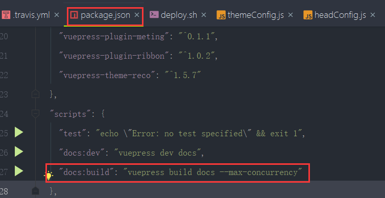
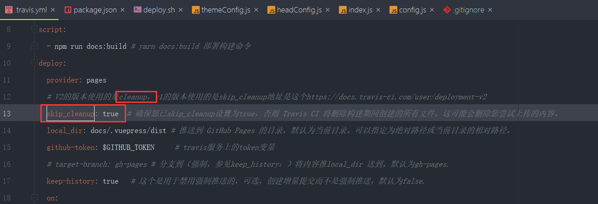
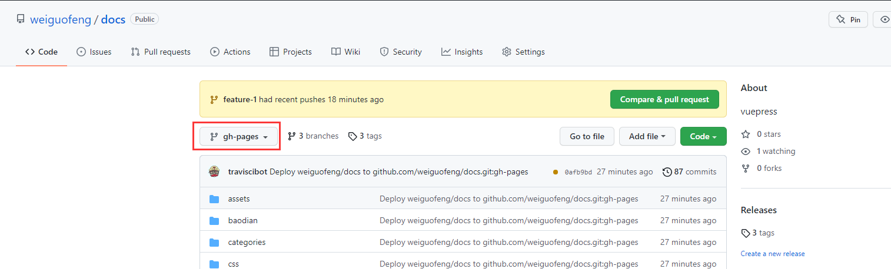
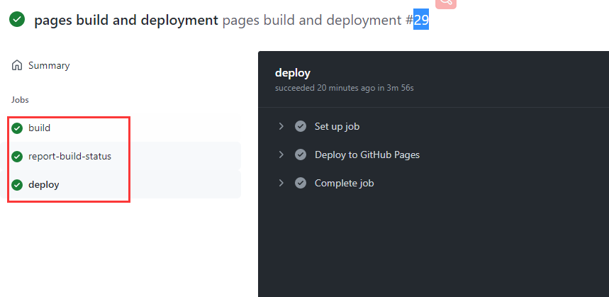

# vuepress内存溢出及构建问题


在我们使用Travis CI的时候，会遇到以下这种情况


#### 1、文档内容太多导致的内存溢出的问题

​		解决方案： 逻辑是我们通过travis.xml进行自动化构建的，那么

```
script:
  - npm run docs:build # yarn docs:build 部署构建命令
```

​	这段代码会去执行进行构建，他先去package.js 中去找到这个 docs：build

​		我们需要加一个参数--max-concurrency  这个参数的作用就是添加并发的去进行构建，防止内存溢出

​	


#### 2、我们的项目自动化并没有为我们推送编译后的文件到gh_page分支上

​	解决方法：原因是一个参数导致的问题，就是Travis.xml中的 cleanup导致的，我们使用这个参数会导致分支上的内容被清空，而我们使用skip_cleanup是跳过清空，这样就可以完整的将编译文件推送到我们的分支上了



​	推送分支可以使用target_branch参数，默认不选的话就是推送到gh_page分支上去了


#### 3、我们以上的问题都处理掉，但是请求页面发现页面乱序文件找不到的问题

​		解决办法：因为我们刚刚推送成功，我们就去访问，显示为黑框找不到文件是很正常的，推送完成后，还需要我们的github进行一个部署的过程，这个过程会根据文件的大小进行处理时长不定，一般是3分钟左右

​		

​		我们可以在github上进行查看--先进入到你的页面分支上gh_page




然后到右下角--的github-page进入


我们可以看到这个绿色的火箭就是当前的发布状态，也属于活动的发布，我们点击Deployed进入里面可以查看发布的详情


只要一上流水线都执行成功了---再次访问就成功了




#### 想法：

​		其实这个自动化的构建就是使用TravisCI将我们编译后的代码推送到gh-page分支上，如果后续有问题我们可以考虑自己直接将编译好的dist文件夹推送到 gh-page分支上。

​		或者我们可以考虑将github的钩子（就是每次推送会发起一个请求地址）这个请求地址可以为我们的项目地址，然后我们根据一些请求的参数，进行对代码的拉取，发布，和推送操作，然后就实现了自动化的部署，其实自动化部署的原理就是这样的。


​	后续有时间需要了解一下github的流水线操作流程及实现原理


​		

​	


