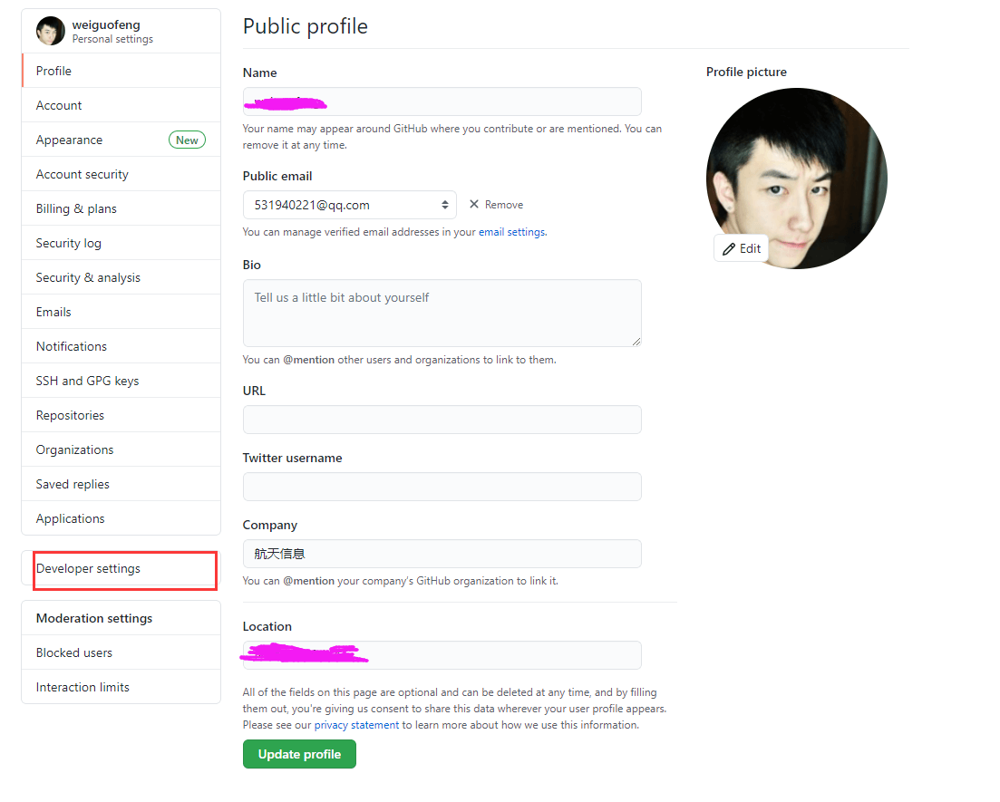

# vuePress搭建指南

### 1.github创建项目


### 2.本地拉取项目及配置


### 3.vuePress安装及初始化

[官网地址](http://caibaojian.com/vuepress/)

### 安装npm

```shell
npm install
1
```

### 创建博客工程

```shell
# 安装脚手架工具
npm install @vuepress-reco/theme-cli -g

# 创建项目
theme-cli init my-blog  #my-blog可替换成自己需要的项目名称
12345
```

上述命令执行后，在命令行窗口会进行一系列的信息配置

```shell
? What's the title of your project?  #键入您的项目标题

? What's the description of your project? #键入您的项目描述

? What's the author's name? #键入作者姓名

? What style do you want your home page to be?(Select afternoon-grocery, if you 
want to download reco_luan's '午后南杂') (Use arrow keys)
❯ blog   # 此处通过方向键选择您首页风格，这里我们选择blog
  doc 
  afternoon-grocery 
1234567891011
```

接下来进入您的工程目录，启动您的项目吧

```shell
# 接入项目目录
cd my-blog  #my-blog替换为之前您填入的项目名称

# 安装npm
npm install

# 运行测试环境
npm run dev
```


### 4.配置vuePress


### [Front Matter](https://vuepress-theme-reco.recoluan.com/views/1.x/frontMatter.html)

> 在markdown文档的顶部插入一段yaml配置代码

一个完整的 `Front Matter` 案例：

```yaml
---
title: 烤鸭的做法
date: 2019-08-08
sidebar: 'auto'
categories:
 - 烹饪
 - 爱好
tags:
 - 烤
 - 鸭子
keys:
 - '123456'
publish: false
---
```

常用变量说明：

`title` :文章标题，放弃通过一级目录定义标题的方式，改在 `Front Matter` 中定义。

`date` :文章创建日期，格式 `2019-08-08` 或 `2019-08-08 08:08:08`。

`sidebar`:是否开启侧边栏。

`categories` :所属分类。

`tags` :所属标签。

`keys`: 所属标签。

`publish` :文章是否发布。

另外还有一些`Vuepress` 默认主题的变量例如`prev`, `next`，请移步 [官方文档](https://vuepress.vuejs.org/zh/guide/frontmatter.html#其他格式的-front-matter)


### [摘要](https://vuepress-theme-reco.recoluan.com/views/1.x/abstract.html)

> 在markdown代码中，您将看到注释，注释前面的代码将显示在列表页面上的文章摘要中。

```markdown
---
title: Vuepress使用指南(reco)
date: 2020-08-16
sidebar: 'auto'
categories:
 - 工具
tags:
 - vue
publish: true
---

::: tip 
Vuepress是Vue作者尤雨溪开发的文档工具，本文采用Vuepress的reco主题进行相关配置说明
:::

<!-- more -->

### markdown正文
```

> 效果


### 5.插件的说明


### 6.部署相关配置


### [#](https://tsanfer.xyz/views/frontEnd/VuePress + GithubPages + TravisCI .html#生成和使用-token)生成和使用 Token

#### 生成 Token

在 Settings --> Developer settings --> Personal access tokens 右上角 Generate new toekn 生成新 Token 名字随便写，权限不清楚的可以全部选上，也可以参考我下面的配置




### 7.遇到的问题


#### 7.1样式显示不正确的原因


#### 7.2部署未生效的问题


#### 7.3 主题的优化处理

https://blog.csdn.net/howareyou2104/article/details/107412555 


#### 7.4 解决图片存放的问题

### 解决方法

我发现了一种简单粗暴的解决方法，就是除了在.vuepress的public文件的images中放上摘要图片，同时可以在和博文markdown文件相同目录下，再建立一个images文件夹并且放上摘要图片。路径如下图：


### 其他参考博文

先附上博客效果http://chqyys.top/

https://blog.csdn.net/qq_38390669/article/details/110859800

https://lovelijunyi.gitee.io/blog/

https://docs.shanyuhai.top/


