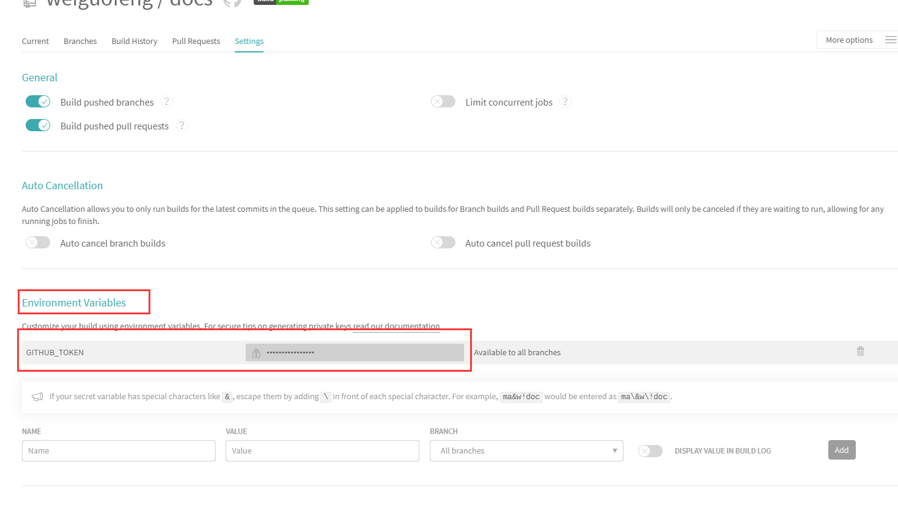

# vuePress搭建指南

### 1.github创建项目


### 2.本地拉取项目及配置

```
git clone 创建的项目
```


#### 如果有秘钥的问题-导致无法提交

```
进入到个人，点击SSH秘钥设置--将生成的公钥进行设置
```


```
秘钥的详细配置 请参考  <github秘钥配置> 进行搜索。
```


### 3.vuePress安装及初始化

[官网地址](http://caibaojian.com/vuepress/)

### 安装npm

```shell
npm install
```

### 创建博客工程

```shell
# 安装脚手架工具
npm install @vuepress-reco/theme-cli -g

# 创建项目
theme-cli init my-blog  #my-blog可替换成自己需要的项目名称
```

上述命令执行后，在命令行窗口会进行一系列的信息配置

```shell
? What's the title of your project?  #键入您的项目标题

? What's the description of your project? #键入您的项目描述

? What's the author's name? #键入作者姓名

? What style do you want your home page to be?(Select afternoon-grocery, if you 
want to download reco_luan's '午后南杂') (Use arrow keys)
❯ blog   # 此处通过方向键选择您首页风格，这里我们选择blog
  doc 
  afternoon-grocery 
```

接下来进入您的工程目录，启动您的项目吧

```shell
# 接入项目目录
cd my-blog  #my-blog替换为之前您填入的项目名称

# 安装npm
npm install

# 运行测试环境
npm run dev
```


### 4.配置vuePress


#### config配置

```js
module.exports = {
    title: '锋格blog',
    description: '锋格blog',
    base: '/docs/',	//这里要多注意，设置后部署会有路径上的差异，不设置也可能会导致样式加载错误
    // dest: './dist', 默认在.vuepress目录下生成
    port: '7777',
    head: [
        // 网页标签栏图标
        ['link', { rel: 'icon', href: '/vuepress/favicon.ico' }],
        // 移动栏优化
        ['meta', { name: 'viewport', content: 'width=device-width,initial-scale=1,user-scalable=no' }]
    ],
    //配置语言
    locales: {
        '/': {
            lang: 'zh-CN'
        }
    },
    markdown: {
        lineNumbers: true
    },
    themeConfig: {
        type: 'blog',
        subSidebar: 'auto',
        logo: '/fenggelogo.jpg',
        authorAvatar: '/fenggelogo.jpg',
        nav: require('./nav.js'),
        sidebar: require('./sidebar'),
        sidebarDepth: 2,
        lastUpdated: 'Last Updated',
        searchMaxSuggestoins: 10,
        serviceWorker: {
            updatePopup: {
                message: "有新的内容.",
                buttonText: '更新'
            }
        },
        editLinks: true,
        editLinkText: '在 GitHub 上编辑此页 ！',
        // vssueConfig: {
        //     platform: 'github',
        //     owner: 'OWNER_OF_REPO',
        //     repo: 'NAME_OF_REPO',
        //     clientId: 'YOUR_CLIENT_ID',
        //     clientSecret: 'YOUR_CLIENT_SECRET',
        // }
        friendLink: [
            {
                title: 'vuepress-theme-reco',
                desc: 'A simple and beautiful vuepress Blog & Doc theme.',
                logo: "https://vuepress-theme-reco.recoluan.com/icon_vuepress_reco.png",
                link: 'https://vuepress-theme-reco.recoluan.com'
            },
            {
                title: '午后南杂',
                desc: 'Enjoy when you can, and endure when you must.',
                email: 'recoluan@qq.com',
                link: 'https://www.recoluan.com'
            },
            // ...
        ],
        record: '京ICP备2018019108号-1',
        recordLink: 'http://beian.miit.gov.cn/',
    },
    theme: 'reco',
    plugins: [
        // ["@vuepress-reco/vuepress-plugin-bgm-player",
        //     {
        //         audios: [
        //             // 网络文件示例
        //             {
        //                 name: 'mojito',
        //                 artist: '周杰伦',
        //                 url: 'http://storage.chqyys.top/music/3.mp3',
        //                 cover: './1.jpg'
        //             }
        //         ] ,
        //         // 自动缩小
        //         autoShrink:true ,
        //         // 悬浮窗模式，吸边
        //         shrinkMode: 'float' ,
        //         // 悬浮窗位置
        //         floatStyle:{ bottom: '10px', 'z-index': '999999' },
        //
        //     }],
        [
            'vuepress-plugin-comment',
            {
                choosen: 'valine',
                visitor: true, // 阅读量统计
                // options选项中的所有参数，会传给Valine的配置
                options: {
                    el: '#valine-vuepress-comment',
                    appId: 'AfFAE0L44yanB796wFczMbzG-gzGzoHsz',
                    appKey: 'dp9nuN1hb1mLaDjqJnV8kd0b'
                }
            }
        ],
        ['cursor-effects'],
        [
            "ribbon"
        ],
        ['@vuepress/pwa', {
            serviceWorker: true,
            updatePopup: {
                message: "发现新内容可用",
                buttonText: "刷新"
            }
        }],
        ["dynamic-title",
            {
                showIcon: "vuepress/smile.ico",
                showText: "(/≧▽≦/)欢迎帅哥美女！",
                hideIcon: "vuepress/1.jsp",
                hideText: "(●—●)呜呜，不要走嘛！！",
                recoverTime: 2000
            }],
        ['meting', {
            // metingApi: "http://music.163.com/playlist?id=417639577&userid=301312374",
            meting: {
                server: "netease",
                type: "playlist",
                mid: "5361802856",
                auto: "http://music.163.com/playlist?id=5361802856"
            },
            // 不配置该项的话不会出现全局播放器
            aplayer: {
                // 吸底模式
                fixed: true,
                mini: true,
                // 自动播放
                autoplay: true,
                // 歌曲栏折叠
                listFolded:true,
                // 颜色
                theme: '#f9bcdd',
                // 播放顺序为随机
                order: 'random',
                // 初始音量
                volume: 0.3,
                // 关闭歌词显示
                lrcType: 0
            },
            mobile :{
                // 手机端去掉cover图
                cover: false,
            }
        }],
        ['@vuepress-reco/vuepress-plugin-kan-ban-niang',{
            theme: 'shizuku',
            modelStyle:{
                left: '50px',
                bottom: '-20px',
                opacity: '0.9'
            },
            messageStyle:{ left: '28px', bottom: '190px' },
            btnStyle:{left: '50px', bottom: '40px'}
        }],

        ["vuepress-plugin-nuggets-style-copy", {
            copyText: "复制代码",
            tip: {
                content: "复制成功!"
            }
        }],
]
}


```


#### 导航栏配置nav.js

```js
module.exports = [
    {
        text: '主页', link: '/',icon: 'reco-home'
    },
    {
        text: 'Java', link: '/java/',icon: 'reco-blog',
        items: [
            {text: '基础部分', link: '/baodian/high/'},
            {text: '多线程', link: '/baodian/zero/'},
            {text: 'Spring系列', link: '/baodian/zero/'},
            {text: 'Mybatis系列', link: '/baodian/zero/'},
            {text: '其他', link: '/baodian/zero/'},
        ]
    },
    {
        text: '数据库', link: '/baodian/',icon: 'reco-blog',
        items: [
            {text: 'MySQL', link: '/baodian/zero/'},
            {text: 'Oracle', link: '/baodian/high/'},
            {text: 'Redis', link: '/baodian/high/'},
            {text: 'MongoDB', link: '/baodian/high/'},
        ]
    },
    {
        text: '前端', link: '/guide/',icon: 'reco-tag',
        items: [
            {text: 'Vue', link: '/baodian/zero/'},
            {text: 'AngularJs', link: '/baodian/high/'},
            {text: 'LayUI', link: '/baodian/high/'},
        ]
    },
    {
        text: '面试宝典', link: '/baodian/',icon: 'reco-blog',
        items: [
            {text: '初级开发篇', link: '/baodian/zero/'},
            {text: '中高进阶篇', link: '/baodian/high/'},
        ]
    },
    {
        text: 'Tools', link: '/baodian/',icon: 'reco-blog',
        items: [
            {text: 'Linux', link: '/baodian/zero/'},
            {text: 'Windows', link: '/baodian/high/'},
        ]
    },
    { text: 'TimeLine', link: '/timeline/', icon: 'reco-date' },
    {
        text: '关于',icon: 'reco-message',
        items: [
            {
                text: '在线编辑',
                items: [
                    {text: '图片压缩', link: 'https://tinypng.com/'}
                ]
            },
            {
                text: '在线服务',
                items: [
                    {text: '阿里云', link: 'https://www.aliyun.com/'},
                    {text: '腾讯云', link: 'https://cloud.tencent.com/'}
                ]
            },
            {
                text: '博客指南',
                items: [
                    {text: '掘金', link: 'https://juejin.im/'},
                    {text: 'CSDN', link: 'https://blog.csdn.net/'}
                ]
            }
        ]
    }
]

```


#### 侧边栏配置sidebar

**注意这里使用的是引入每个文件夹下的侧边栏 **

```js
module.exports = {
    '/guide/': require('../guide/sidebar'),
    '/baodian/zero': require('../baodian/zero/sidebar'),
    '/baodian/high': require('../baodian/high/sidebar'),
    '/java/': require('../java/sidebar'),
}

```

**比如：guide/sidebar **

```js
module.exports = [
    {
        title:'首页'
    },
    {
        title:'css',
        collapsable: true,
        children:[
            '/guide/notes/css',
        ]
    },
    {
        title:'linux',
        collapsable: true,
        children:[
            '/guide/notes/linux',
        ]
    },
    {
        title:'vue',
        collapsable: true,
        children:[
            '/guide/notes/vue',
        ]
    },
    {
        title:'js',
        collapsable: true,
        children:[
            '/guide/notes/js1',
            '/guide/notes/js2',
        ]
    },
    {
        title:'ele',
        collapsable: true,
        children:[
            '/guide/notes/ele'
        ]
    },
    {
        title:'微信小程序',
        collapsable: true,
        children:[
            '/guide/notes/微信小程序'
        ]
    }
]

```


### [Front Matter](https://vuepress-theme-reco.recoluan.com/views/1.x/frontMatter.html)

> 在markdown文档的顶部插入一段yaml配置代码

一个完整的 `Front Matter` 案例：

```yaml
---
title: 烤鸭的做法
date: 2019-08-08
sidebar: 'auto'
categories:
 - 烹饪
 - 爱好
tags:
 - 烤
 - 鸭子
keys:
 - '123456'
publish: false
---
```

常用变量说明：

`title` :文章标题，放弃通过一级目录定义标题的方式，改在 `Front Matter` 中定义。

`date` :文章创建日期，格式 `2019-08-08` 或 `2019-08-08 08:08:08`。

`sidebar`:是否开启侧边栏。

`categories` :所属分类。

`tags` :所属标签。

`keys`: 所属标签。

`publish` :文章是否发布。

另外还有一些`Vuepress` 默认主题的变量例如`prev`, `next`，请移步 [官方文档](https://vuepress.vuejs.org/zh/guide/frontmatter.html#其他格式的-front-matter)


### [摘要](https://vuepress-theme-reco.recoluan.com/views/1.x/abstract.html)

> 在markdown代码中，您将看到注释，注释前面的代码将显示在列表页面上的文章摘要中。

```markdown
---
title: Vuepress使用指南(reco)
date: 2020-08-16
sidebar: 'auto'
categories:
 - 工具
tags:
 - vue
publish: true
---

::: tip 
Vuepress是Vue作者尤雨溪开发的文档工具，本文采用Vuepress的reco主题进行相关配置说明
:::

<!-- more -->

### markdown正文
```

> 效果


### 5.插件的说明

	#### 主要使用的插件package.json

```json
{
  "name": "vuepressBlog",
  "version": "1.0.0",
  "main": "index.js",
  "dependencies": {
    "@vuepress-reco/vuepress-plugin-kan-ban-niang": "^1.0.5",
    "vuepress": "^1.7.1",
    "vuepress-plugin-comment": "^0.7.3",
    "vuepress-plugin-nuggets-style-copy": "^1.0.3"
  },
  "devDependencies": {
    "@vuepress-reco/vuepress-plugin-bgm-player": "^1.1.3",
    "@vuepress/plugin-google-analytics": "^1.7.1",
    "@vuepress/plugin-medium-zoom": "^1.7.1",
    "@vuepress/plugin-pwa": "^1.0.0-rc.1",
    "@vuepress/plugin-search": "^1.7.1",
    "vuepress-plugin-cursor-effects": "^1.0.0",
    "vuepress-plugin-dynamic-title": "^1.0.0",
    "vuepress-plugin-meting": "^0.1.1",
    "vuepress-plugin-ribbon": "^1.0.2",
    "vuepress-theme-reco": "^1.5.7"
  },
  "scripts": {
    "test": "echo \"Error: no test specified\" && exit 1",
    "docs:dev": "vuepress dev docs",
    "docs:build": "vuepress build docs"
  },
  "keywords": [],
  "author": "",
  "license": "ISC",
  "directories": {
    "doc": "docs"
  },
  "description": ""
}

```


### 6.部署相关配置

#### 部署脚本 gh-pages需要提前在github创建分支

​	用于自动构建 将构建完成的静态资源 发布到gh-pages分支

```sh
#!/usr/bin/env sh

# 确保脚本抛出遇到的错误
set -e

# 生成静态文件
yarn docs:build

# 进入生成的文件夹
cd docs/.vuepress/dist

# 如果是发布到自定义域名
# echo 'www.example.com' > CNAME

git init
git add -A
git commit -m 'deploy'

# 如果发布到 https://<USERNAME>.github.io
# git push -f git@github.com:<USERNAME>/<USERNAME>.github.io.git master

# 如果发布到 https://<USERNAME>.github.io/<REPO>
git push -f git@github.com:weiguofeng/docs.git main:gh-pages

# 比如      git@github.com:weiguofeng/docs.git
# git push -f git@github.com:weiguofeng/docs.git main:gh-pages

cd -
```


### 使用Travis CI进行自动化部署构建项目

https://travis-ci.com/signin


### [#](https://tsanfer.xyz/views/frontEnd/VuePress + GithubPages + TravisCI .html#生成和使用-token)先在github生成和使用 Token

#### 生成 Token

在 Settings --> Developer settings --> Personal access tokens 右上角 Generate new toekn 生成新 Token 名字随便写，权限不清楚的可以全部选上，也可以参考我下面的配置


个人账户令牌---然后创建新的令牌


选择权限


最后点击创建。


#### 然后我们进入到travisCI官网

- 首先应该使用github账户关联登录比较好，会自动将仓库的项目监听到

- 进入后选择Dashborad会展示你的仓库资源

- 然后选择你需要构建的项目--点击trigger a build

- 

- 设置你构建项目的环境变量--也就是token的值，用于构建时候脚本使用变量的形式进行执行构建

- 

- 设置完成后，进行检查，从git上提交一次代码看是否会自动构建

- ```
  .travis.yml构建的配置
  
  ```

- ```yml
  language: node_js  # node环境
  node_js:
    - lts/*
  script:
    - npm run docs:build  # 执行命令
  deploy:
    provider: pages
    skip-cleanup: true
    local_dir: docs/.vuepress/dist # 部署的文件夹文件
    github-token: $GITHUB_TOKEN     # travis服务上的token变量
    # target-branch: gh-pages # 集成发布到gh-pages上
    keep-history: true
    on:
      branch: main  #这里指的是部署前的源文件分支
  ```

- 最后是成功部署。

​	[可参考地址](https://tsanfer.xyz/views/frontEnd/VuePress%20+%20GithubPages%20+%20TravisCI%20.html#travis-ci-%E7%BB%91%E5%AE%9A%E5%92%8C%E9%85%8D%E7%BD%AE)


### 7.遇到的问题


#### 7.1样式显示不正确的原因

```
原因是 base 未配置的原因导致样式路径错误
```


#### 7.2部署未生效的问题

```
构建脚本有问题--之前是配的自定义域名 CName脚本可能导致的部署未生效的问题
```


#### 7.3 主题的优化处理

https://blog.csdn.net/howareyou2104/article/details/107412555 


#### 7.4 解决图片存放的问题

### 解决方法

```
在文档目录下创建images--同样在.vuepress的public下创建images用来保存图片

typora设置--点击 文件---》偏好设置---》图片插入设置D:\idea-workSpace\docs\docs\images

然后每次提交的时候将此路径下的images复制到.vuepress的public下创建images的目录一次

设置优先使用相对路径

```


我发现了一种简单粗暴的解决方法，就是除了在.vuepress的public文件的images中放上摘要图片，同时可以在和博文markdown文件相同目录下，再建立一个images文件夹并且放上摘要图片。路径如下图：


### 其他参考博文

先附上博客效果http://chqyys.top/

https://blog.csdn.net/qq_38390669/article/details/110859800

https://lovelijunyi.gitee.io/blog/

https://docs.shanyuhai.top/


