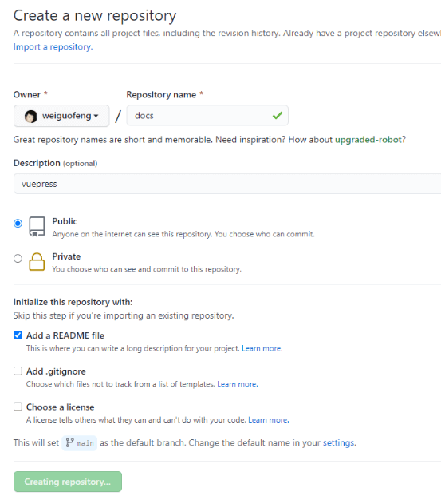
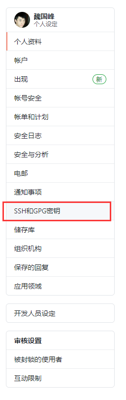
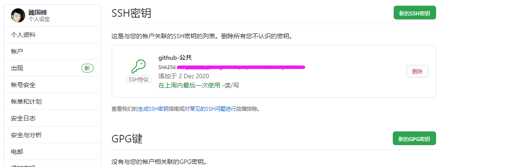

# vuePress搭建过程1


### 1.github创建项目

	创建docs项目




### 2.本地拉取项目及配置

```
git clone 创建的项目
```


#### 如果有秘钥的问题-导致无法提交

```
进入到个人，点击SSH秘钥设置--将生成的公钥进行设置
```






```
秘钥的详细配置 请参考  <github秘钥配置> 进行搜索。
```


### 3.vuePress安装及初始化

[官网地址](http://caibaojian.com/vuepress/)

### 安装npm

```shell
npm install
```

### 创建博客工程

```shell
# 安装脚手架工具
npm install @vuepress-reco/theme-cli -g

# 创建项目
theme-cli init my-blog  #my-blog可替换成自己需要的项目名称
```

上述命令执行后，在命令行窗口会进行一系列的信息配置

```shell
? What's the title of your project?  #键入您的项目标题

? What's the description of your project? #键入您的项目描述

? What's the author's name? #键入作者姓名

? What style do you want your home page to be?(Select afternoon-grocery, if you 
want to download reco_luan's '午后南杂') (Use arrow keys)
❯ blog   # 此处通过方向键选择您首页风格，这里我们选择blog
  doc 
  afternoon-grocery 
```

接下来进入您的工程目录，启动您的项目吧

```shell
# 接入项目目录
cd my-blog  #my-blog替换为之前您填入的项目名称

# 安装npm
npm install

# 运行测试环境
npm run dev
```


### [Front Matter](https://vuepress-theme-reco.recoluan.com/views/1.x/frontMatter.html)

> 在markdown文档的顶部插入一段yaml配置代码

一个完整的 `Front Matter` 案例：

```text
    title: 烤鸭的做法
    date: 2019-08-08
    sidebar: 'auto'
    categories:
     - 烹饪
     - 爱好
    tags:
     - 烤
     - 鸭子
    keys:
     - '123456'
    publish: false
    
```

常用变量说明：

`title` :文章标题，放弃通过一级目录定义标题的方式，改在 `Front Matter` 中定义。

`date` :文章创建日期，格式 `2019-08-08` 或 `2019-08-08 08:08:08`。

`sidebar`:是否开启侧边栏。

`categories` :所属分类。

`tags` :所属标签。

`keys`: 所属标签。

`publish` :文章是否发布。

另外还有一些`Vuepress` 默认主题的变量例如`prev`, `next`，请移步 [官方文档](https://vuepress.vuejs.org/zh/guide/frontmatter.html#其他格式的-front-matter)


### [摘要](https://vuepress-theme-reco.recoluan.com/views/1.x/abstract.html)

> 在markdown代码中，您将看到注释，注释前面的代码将显示在列表页面上的文章摘要中。

```text
title: Vuepress使用指南(reco)
date: 2020-08-16
sidebar: 'auto'
categories:
 - 工具
tags:
 - vue
publish: true

```

::: tip 
Vuepress是Vue作者尤雨溪开发的文档工具，本文采用Vuepress的reco主题进行相关配置说明
:::


### markdown正文
```

> 效果


### 其他参考博文

先附上博客效果

http://chqyys.top/

https://blog.csdn.net/qq_38390669/article/details/110859800

https://lovelijunyi.gitee.io/blog/

https://docs.shanyuhai.top/


```