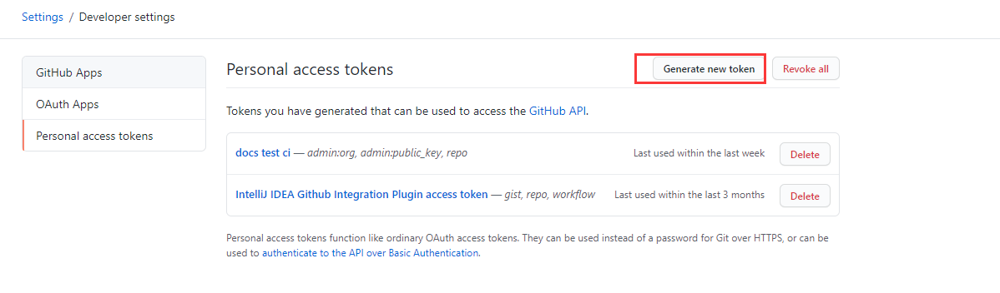
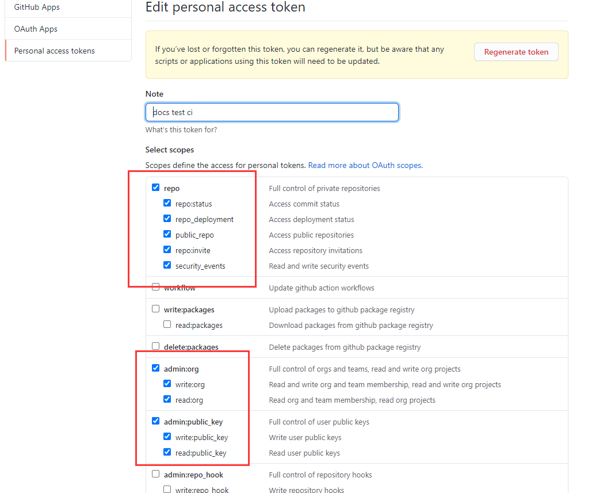

# vuepress搭建过程3

### 5.插件的说明

#### 主要使用的插件package.json

​```json
{
  "name": "vuepressBlog",
  "version": "1.0.0",
  "main": "index.js",
  "dependencies": {
    "@vuepress-reco/vuepress-plugin-kan-ban-niang": "^1.0.5",
    "vuepress": "^1.7.1",
    "vuepress-plugin-comment": "^0.7.3",
    "vuepress-plugin-nuggets-style-copy": "^1.0.3"
  },
  "devDependencies": {
    "@vuepress-reco/vuepress-plugin-bgm-player": "^1.1.3",
    "@vuepress/plugin-google-analytics": "^1.7.1",
    "@vuepress/plugin-medium-zoom": "^1.7.1",
    "@vuepress/plugin-pwa": "^1.0.0-rc.1",
    "@vuepress/plugin-search": "^1.7.1",
    "vuepress-plugin-cursor-effects": "^1.0.0",
    "vuepress-plugin-dynamic-title": "^1.0.0",
    "vuepress-plugin-meting": "^0.1.1",
    "vuepress-plugin-ribbon": "^1.0.2",
    "vuepress-theme-reco": "^1.5.7"
  },
  "scripts": {
    "test": "echo \"Error: no test specified\" && exit 1",
    "docs:dev": "vuepress dev docs",
    "docs:build": "vuepress build docs"
  },
  "keywords": [],
  "author": "",
  "license": "ISC",
  "directories": {
    "doc": "docs"
  },
  "description": ""
}

```


### 6.部署相关配置

#### 部署脚本 gh-pages需要提前在github创建分支

	用于自动构建 将构建完成的静态资源 发布到gh-pages分支

```sh
#!/usr/bin/env sh

# 确保脚本抛出遇到的错误
set -e

# 生成静态文件
yarn docs:build

# 进入生成的文件夹
cd docs/.vuepress/dist

# 如果是发布到自定义域名
# echo 'www.example.com' > CNAME

git init
git add -A
git commit -m 'deploy'

# 如果发布到 https://<USERNAME>.github.io
# git push -f git@github.com:<USERNAME>/<USERNAME>.github.io.git master

# 如果发布到 https://<USERNAME>.github.io/<REPO>
git push -f git@github.com:weiguofeng/docs.git main:gh-pages

# 比如      git@github.com:weiguofeng/docs.git
# git push -f git@github.com:weiguofeng/docs.git main:gh-pages

cd -
```


### 使用Travis CI进行自动化部署构建项目

https://travis-ci.com/signin


### [地址](https://tsanfer.xyz/views/frontEnd/VuePress + GithubPages + TravisCI .html#生成和使用-token)先在github生成和使用 Token

#### 生成 Token

在 Settings --> Developer settings --> Personal access tokens 右上角 Generate new toekn 生成新 Token 名字随便写，权限不清楚的可以全部选上，也可以参考我下面的配置


个人账户令牌-----然后创建新的令牌




选择权限




最后点击创建。


#### 然后我们进入到travisCI官网

- 首先应该使用github账户关联登录比较好，会自动将仓库的项目监听到

- 进入后选择Dashborad会展示你的仓库资源

- 然后选择你需要构建的项目--点击trigger a build

- 

- 设置你构建项目的环境变量--也就是token的值，用于构建时候脚本使用变量的形式进行执行构建

- 

- 设置完成后，进行检查，从git上提交一次代码看是否会自动构建

- ```
  .travis.yml构建的配置
  
  ```

- ```yml
  language: node_js  # node环境
  node_js:
    - lts/*
  script:
    - npm run docs:build  # 执行命令
  deploy:
    provider: pages
    skip-cleanup: true
    local_dir: docs/.vuepress/dist # 部署的文件夹文件
    github-token: $GITHUB_TOKEN     # travis服务上的token变量
    # target-branch: gh-pages # 集成发布到gh-pages上
    keep-history: true
    on:
      branch: main  #这里指的是部署前的源文件分支
  ```

- 最后是成功部署。

	[可参考地址](https://tsanfer.xyz/views/frontEnd/VuePress%20+%20GithubPages%20+%20TravisCI%20.html#travis-ci-%E7%BB%91%E5%AE%9A%E5%92%8C%E9%85%8D%E7%BD%AE)


### 7.遇到的问题


#### 7.1样式显示不正确的原因

```
原因是 base 未配置的原因导致样式路径错误
```


#### 7.2部署未生效的问题

```
构建脚本有问题--之前是配的自定义域名 CName脚本可能导致的部署未生效的问题
```


#### 7.3 主题的优化处理

https://blog.csdn.net/howareyou2104/article/details/107412555 


#### 7.4 解决图片存放的问题

### 解决方法

```
在文档目录下创建images--同样在.vuepress的public下创建images用来保存图片

typora设置--点击 文件---》偏好设置---》图片插入设置D:\idea-workSpace\docs\docs\images

然后每次提交的时候将此路径下的images复制到.vuepress的public下创建images的目录一次

设置优先使用相对路径

```


我发现了一种简单粗暴的解决方法，就是除了在.vuepress的public文件的images中放上摘要图片，同时可以在和博文markdown文件相同目录下，再建立一个images文件夹并且放上摘要图片。路径如下图：


### 注意

	如果使用同一个标签和同一种类型的话，要放到一个侧边栏分组里

```
{
        title:'vuePress搭建指南',
        collapsable: true,
        children:[
            '/guide/notes/vuepress搭建指南',
            '/guide/notes/vuePress插件及优化',
        ]
    },
```


