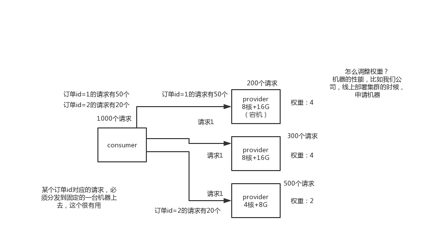

# dubbo支持哪些负载均衡、高可用以及动态代理的策略？


#### 1.面试题

​	**dubbo负载均衡策略和集群容错策略都有哪些？动态代理策略呢？**


#### 2.面试官心里分析

```
	就是继续深问，这些都是用dubbo必须知道的一些东西，你得知道基本原理，知道序列化是什么协议，还得知道具体用dubbo的时候，如何负载均衡，如何高可用，如何动态代理。
	
	说白了，就是看你对dubbo熟悉不熟悉
	
	1.dubbo工作原理：服务注册，注册中心，消费者，代理通信，负载均衡
	2.网络通信，序列化，dubbo协议，长链接，NIO，hessian序列化协议
	3.负载均衡策略，集群容错策略，动态代理策略：dubbo跑起来的时候一些功能是如何运转的，怎么做负载均衡？怎么做集群容错？怎么生成动态代理？
	4.dubbo SPI机制：你了解不了解dubbo的SPI机制？如何基于SPI机制对dubbo进行扩展？
	
	
```


#### 3.面试题剖析

```
	1.dubbo负载均衡策略：
		1.1：random loadbalance
		默认情况下，dubbo是random load balance随机调用实现负载均衡，可以对provider不同实例设置不同的权重，会按照权重来负载均衡，权重越大分配流量越高，一般就用这个默认的就可以了。
		
		1.2：roundrobin loadbalance
		还有roundrobin loadbalance，这个的话默认就是均匀的将流量打到各个机器上去，但是如果各个机器的性能不一样，容易导致性能差的机器负载过高。所以此时需要调整权重，让性能差的机器权重小一点，流量少一些。
		
		跟运维同学申请机器，有的时候，我们运气，正好公司资源比较充足，刚刚有一批热气腾腾，刚刚做好的一批虚拟机新鲜出炉，配置都比较高。8核+16g，机器，2台。过了一段时间，我感觉2台机器有点不太够，我去找运维同学，哥儿们，你能不能再给我1台机器，4核+8G的机器。我还是得要。
		
		1.3：leastactive loadbalance
		这个就是自动感知一下，如果某个机器性能越差，那么接收的请求越少，越不活跃，此时就会给不活跃的性能差的机器更少的请求
		
		1.4：consistanthash loadbalance
		一致性Hash算法，相同参数的请求一定分发到一个provider上去，provider挂掉的时候，会基于虚拟节点均匀分配剩余的流量，抖动不会太大。如果你需要的不是随机负载均衡，是要一类请求都到一个节点，那就走这个一致性hash策略。
		
	
	
	2.dubbo集群容错策略
		2.1：failvoer cluster 
			失败自动切换，自动重试其他机器，默认就是这个，常见于读操作
			
		2.2：failfast cluster模式
			一次调用失败就立即失败，常见于写操作
			
		2.3：failsafe cluster模式
			出现异常时忽略掉，常用于不重要的接口调用，比如记录日志
			
		2.4：failbackc cluster模式
			失败了后台自动记录请求，然后定时重发，比较适合于写消息队列这种
			
		2.5：forking cluster
			并行调用多个provider，只要一个成功就立即返回
			
		2.6：broadcacst cluster
			逐个调用所有的provider
			
			
			
	3.dubbo动态代理策略
		默认使用javassist动态字节码生成，创建代理类

		但是可以通过spi扩展机制配置自己的动态代理策略
		
	
	
	
	
```


**负载均衡**




