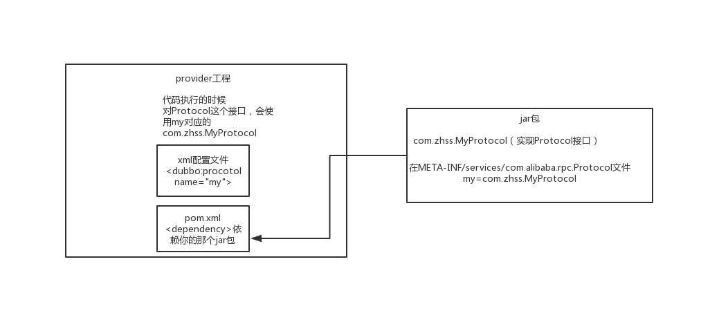

# SPI是啥思想？dubbo的SPI机制是怎么玩儿的？


#### 1.面试题

​	**dubbo的spi思想是什么？**


#### 2.面试官心里分析

```
	继续深入问呗，前面一些基础性的东西问完了，确定你应该都ok了解dubbo的一些基本东西，那么问个稍微难一点点的问题，就是spi，先问问你spi是啥？然后问问你dubbo的spi是怎么实现的？

其实就是看看你对dubbo的掌握如何
```


#### 3.面试题剖析

```
	spi，简单来说，就是service provider interface，说白了是什么意思呢，比如你有个接口，现在这个接口有3个实现类，那么在系统运行的时候对这个接口到底选择哪个实现类呢？这就需要spi了，需要根据指定的配置或者是默认的配置，去找到对应的实现类加载进来，然后用这个实现类的实例对象。

接口A -> 实现A1，实现A2，实现A3

配置一下，接口A = 实现A2

在系统实际运行的时候，会加载你的配置，用实现A2实例化一个对象来提供服务

比如说你要通过jar包的方式给某个接口提供实现，然后你就在自己jar包的META-INF/services/目录下放一个跟接口同名的文件，里面指定接口的实现里是自己这个jar包里的某个类。ok了，别人用了一个接口，然后用了你的jar包，就会在运行的时候通过你的jar包的那个文件找到这个接口该用哪个实现类。

这是jdk提供的一个功能。

比如说你有个工程A，有个接口A，接口A在工程A里是没有实现类的 -> 系统在运行的时候，怎么给接口A选择一个实现类呢？

你就可以自己搞一个jar包，META-INF/services/，放上一个文件，文件名就是接口名，接口A，接口A的实现类=com.zhss.service.实现类A2。让工程A来依赖你的这个jar包，然后呢在系统运行的时候，工程A跑起来，对接口A，就会扫描自己依赖的所有的jar包，在每个jar里找找，有没有META-INF/services文件夹，如果有，在里面找找，有没有接口A这个名字的文件，如果有在里面找一下你指定的接口A的实现是你的jar包里的哪个类？


SPI机制，一般来说用在哪儿？插件扩展的场景，比如说你开发的是一个给别人使用的开源框架，如果你想让别人自己写个插件，插到你的开源框架里面来，扩展某个功能。

经典的思想体现，大家平时都在用，比如说jdbc

java定义了一套jdbc的接口，但是java是没有提供jdbc的实现类

但是实际上项目跑的时候，要使用jdbc接口的哪些实现类呢？一般来说，我们要根据自己使用的数据库，比如msyql，你就将mysql-jdbc-connector.jar，引入进来；oracle，你就将oracle-jdbc-connector.jar，引入进来。

在系统跑的时候，碰到你使用jdbc的接口，他会在底层使用你引入的那个jar中提供的实现类

但是dubbo也用了spi思想，不过没有用jdk的spi机制，是自己实现的一套spi机制。

Protocol protocol = ExtensionLoader.getExtensionLoader(Protocol.class).getAdaptiveExtension();

Protocol接口，dubbo要判断一下，在系统运行的时候，应该选用这个Protocol接口的哪个实现类来实例化对象来使用呢？

他会去找一个你配置的Protocol，他就会将你配置的Protocol实现类，加载到jvm中来，然后实例化对象，就用你的那个Protocol实现类就可以了

微内核，可插拔，大量的组件，Protocol负责rpc调用的东西，你可以实现自己的rpc调用组件，实现Protocol接口，给自己的一个实现类即可。

这行代码就是dubbo里大量使用的，就是对很多组件，都是保留一个接口和多个实现，然后在系统运行的时候动态根据配置去找到对应的实现类。如果你没配置，那就走默认的实现好了，没问题。

@SPI("dubbo")  
public interface Protocol {  
      
    int getDefaultPort();  
  
    @Adaptive  
    <T> Exporter<T> export(Invoker<T> invoker) throws RpcException;  
  
    @Adaptive  
    <T> Invoker<T> refer(Class<T> type, URL url) throws RpcException;  

    void destroy();  
  
}  

在dubbo自己的jar里，在/META_INF/dubbo/internal/com.alibaba.dubbo.rpc.Protocol文件中：

dubbo=com.alibaba.dubbo.rpc.protocol.dubbo.DubboProtocol
http=com.alibaba.dubbo.rpc.protocol.http.HttpProtocol
hessian=com.alibaba.dubbo.rpc.protocol.hessian.HessianProtocol

所以说，这就看到了dubbo的spi机制默认是怎么玩儿的了，其实就是Protocol接口，@SPI(“dubbo”)说的是，通过SPI机制来提供实现类，实现类是通过dubbo作为默认key去配置文件里找到的，配置文件名称与接口全限定名一样的，通过dubbo作为key可以找到默认的实现了就是com.alibaba.dubbo.rpc.protocol.dubbo.DubboProtocol。

dubbo的默认网络通信协议，就是dubbo协议，用的DubboProtocol

如果想要动态替换掉默认的实现类，需要使用@Adaptive接口，Protocol接口中，有两个方法加了@Adaptive注解，就是说那俩接口会被代理实现。

啥意思呢？

比如这个Protocol接口搞了俩@Adaptive注解标注了方法，在运行的时候会针对Protocol生成代理类，这个代理类的那俩方法里面会有代理代码，代理代码会在运行的时候动态根据url中的protocol来获取那个key，默认是dubbo，你也可以自己指定，你如果指定了别的key，那么就会获取别的实现类的实例了。

通过这个url中的参数不通，就可以控制动态使用不同的组件实现类

好吧，那下面来说说怎么来自己扩展dubbo中的组件

自己写个工程，要是那种可以打成jar包的，里面的src/main/resources目录下，搞一个META-INF/services，里面放个文件叫：com.alibaba.dubbo.rpc.Protocol，文件里搞一个my=com.zhss.MyProtocol。自己把jar弄到nexus私服里去。

然后自己搞一个dubbo provider工程，在这个工程里面依赖你自己搞的那个jar，然后在spring配置文件里给个配置：

<dubbo:protocol name=”my” port=”20000” />

这个时候provider启动的时候，就会加载到我们jar包里的my=com.zhss.MyProtocol这行配置里，接着会根据你的配置使用你定义好的MyProtocol了，这个就是简单说明一下，你通过上述方式，可以替换掉大量的dubbo内部的组件，就是扔个你自己的jar包，然后配置一下即可。

dubbo里面提供了大量的类似上面的扩展点，就是说，你如果要扩展一个东西，只要自己写个jar，让你的consumer或者是provider工程，依赖你的那个jar，在你的jar里指定目录下配置好接口名称对应的文件，里面通过key=实现类。

然后对对应的组件，用类似<dubbo:protocol>用你的哪个key对应的实现类来实现某个接口，你可以自己去扩展dubbo的各种功能，提供你自己的实现。
```


**dubbo 的SPI原理**

