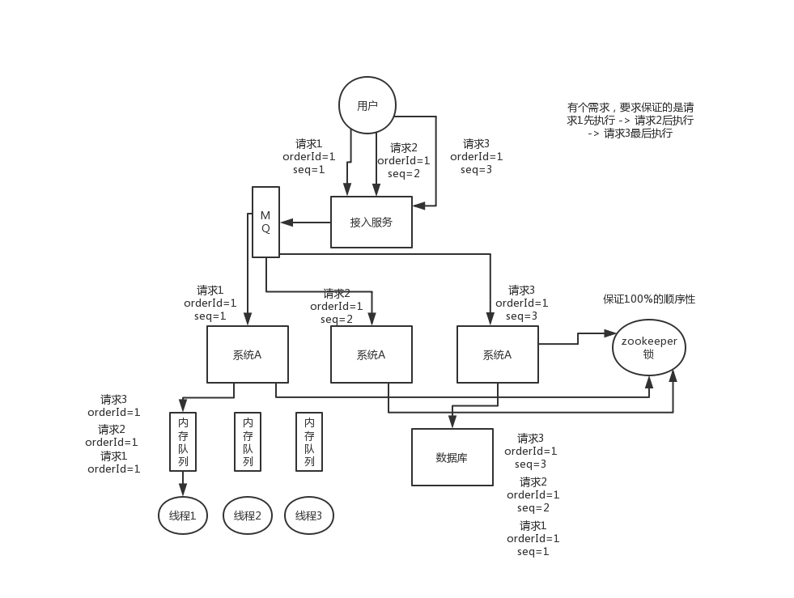

# 分布式系统中接口调用如何保证顺序性？


#### 1.面试题

​	**分布式服务接口请求的顺序性如何保证？**


#### 2.面试官心里分析

```
	其实分布式系统接口的调用顺序，也是个问题，一般来说是不用保证顺序的。但是有的时候可能确实是需要严格的顺序保证。给大家举个例子，你服务A调用服务B，先插入再删除。好，结果俩请求过去了，落在不同机器上，可能插入请求因为某些原因执行慢了一些，导致删除请求先执行了，此时因为没数据所以啥效果也没有；结果这个时候插入请求过来了，好，数据插入进去了，那就尴尬了。

本来应该是先插入 -> 再删除，这条数据应该没了，结果现在先删除 -> 再插入，数据还存在，最后你死都想不明白是怎么回事。

所以这都是分布式系统一些很常见的问题
```


#### 3.面试题剖析

```
	首先，一般来说，我个人给你的建议是，你们从业务逻辑上最好设计的这个系统不需要这种顺序性的保证，因为一旦引入顺序性保障，会导致系统复杂度上升，而且会带来效率低下，热点数据压力过大，等问题。

下面我给个我们用过的方案吧，简单来说，首先你得用dubbo的一致性hash负载均衡策略，将比如某一个订单id对应的请求都给分发到某个机器上去，接着就是在那个机器上因为可能还是多线程并发执行的，你可能得立即将某个订单id对应的请求扔一个内存队列里去，强制排队，这样来确保他们的顺序性。

但是这样引发的后续问题就很多，比如说要是某个订单对应的请求特别多，造成某台机器成热点怎么办？解决这些问题又要开启后续一连串的复杂技术方案。。。曾经这类问题弄的我们头疼不已，所以，还是建议什么呢？

最好是比如说刚才那种，一个订单的插入和删除操作，能不能合并成一个操作，就是一个删除，或者是什么，避免这种问题的产生。
```





