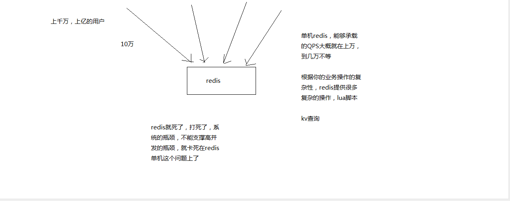
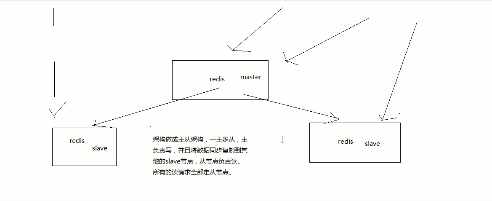
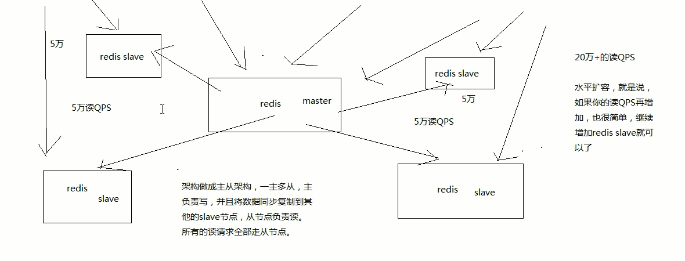
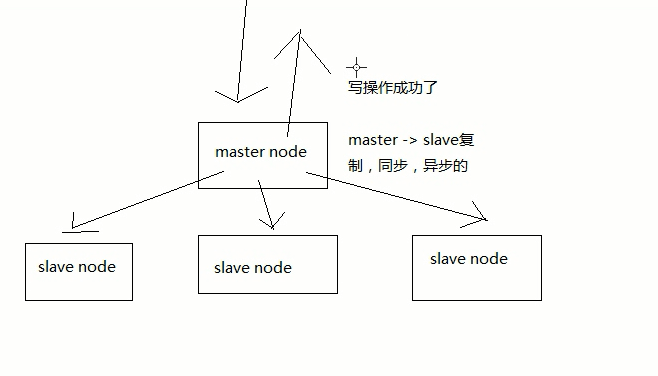
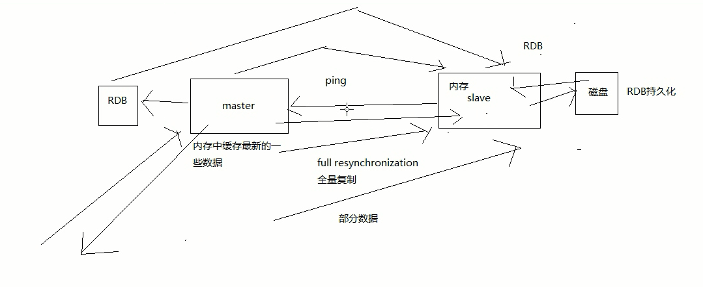

# 怎么保证redis是高并发以及高可用的？


#### 1.面试题

​	**怎么保证redis是高并发和高可用？redis的主从复制原理可以介绍一下吗？redis的哨兵原理能介绍一下吗？**


#### 2.面试官心里分析

```
	其实这个问题，主要是考考你，redis单机能承载多少高并发？如果单机抗不住如何扩容抗更多的并发？redis会不会挂？既然会挂怎么保证redis是高可用的？
	
	其实针对的都是项目中你肯定要考虑的一些问题，如果你没考虑过，那确实你对生产系统中的问题思考太少了。
	
	
```


#### 3.面试题剖析

```
	就是如果你用redis技术的话，肯定要考虑如何用redis来加多台机器，保证redis是高并发的，还有就是如何让redis保证自己不是挂掉以后就直接死掉了，redis高可用。
	
	一般单机redis可以承载大约1万到几万的QPS。如果想让redis承载10万或者更高的并发，那么思路是读写分离。
	一般来说，对缓存，一般都是用来支撑读高并发的，写的请求是比较少的，可能写的请求也就是 1秒钟几千，大量的请求都是读，1秒钟20万的读。
	
	redis高并发回答：使用读写分离 一个主多个重的架构方案，master slave，slave用于读，master用于写。单主用来写入数据，单机几万QPS，多从用来查询数据。多个实例可以提供每秒10万QPS。
	
	redis高并发的同时，还需要容纳大量的数据：一主多从，每个实例都容纳了完整的数据，比如redis主就10G的内存量，其实你就最多只能容纳10G的数据量，如果你的缓存要容纳的数据量很大，达到了几十G，甚至几百G，或者几T，那你就需要redis集群，而且redis集群之后，可以提供可能每秒几十万的读写并发。
	
	
	
	redis高可用回答：如果你做主从架构部署，其实就是加上哨兵就可以了，就可以任何一个实例宕机，自动会进入主备切换。
	
	
	
	
	主从架构 -> 读写分离 -> 支撑10万+读QPS的架构

	4、接下来要讲解的一个topic

		redis replication

		redis主从架构 -> 读写分离架构 -> 可支持水平扩展的读高并发架构
	
	
```


**redis单机的瓶颈**




**redis读写分离主从架构图：**






#### 4.redis replication基本原理

```
	1.图解redis replication基本原理
		其实就是将主master节点的数据 复制（同步） 到 slave 从节点上，并且是异步进行的。
	
	2.redis replication的核心机制
		2.1： redis采用异步方式复制数据到slave节点，不过redis 2.8版本开始，slave node会周期性地确认自己每次复制的数据量。
		2.2： 一个master node是可以配多个slave node的
		2.3： slave node 也可以连接其他的 slave node
		2.4： slave node 做复制的时候，是不会block（阻塞） master node 的正常工作的。
		2.5： slave node 在做复制的时候，也不会block对自己的查询操作，它会用旧的数据集来提供服务；但是复制完成的时候，需要删除旧数据集，加载新数据集，这个时候就会暂停对外服务了。
		2.6： slave node 主要用来进行横向扩容，扩容的slave node 可以提高吞吐量。实现高并发。
	
	3.master持久化对于主从架构的安全保障的意义
		3.1： 如果采用了主从架构，那么建议必须开启master node的持久化
		
		3.2： 不建议使用 slave node作为master node的数据热备，因为那样的话，如果你关掉master的持久化，可能在master宕机重启的时候数据是空的，然后可能一经过复制，slave node的数据也丢了。
			master-》RDB和AOF都关闭了--》数据全部在内存中
			master宕机，重启，是没有本地数据可以恢复的，然后就会直接认为自己的IDE数据是空的
			master就会将空的数据集同步到slave节点上去，所有的slave的数据被清空
			100%的数据丢失
			master节点必须使用持久化机制
			master的各种备份方案，要不要做，万一说本地所有文件丢失了；从备份中挑选一份rdb去回复master，这样才能确保master启动的时候，是有数据的。
			
	即使采用后续讲解的高可用机制，slave node可以自动接管 master node，但是也可能sentinal（哨兵） 还没有检测到master failure（宕机），master node就自动重启了，还是可能导致上面所有的slave node数据清空故障。
			
			
		
	
	
```


**redis replication**



```
1.主从架构核心原理
	当启动一个slave node的时候，他会发送一个PSYNC命令给master node
	如果这是slave node重新连接master node，那么master仅仅会复制给slave部分缺少的数据，否则如果是slave第一次连接master，那么会触发一次full resynchronization(生成RDB文件发送给slave，slave先存入磁盘然后再从磁盘中读取到slave中)
	
	开始full resynchronization的时候，master会启动一个后台线程，开始生成一份RDB快照文件，同时还会将从客户端收到的所有写命令缓存在内存中。RDB文件生成完毕之后，master会将这个RDB发送给slave，slave会先写入本地磁盘，然后再从本地磁盘加载到内存中。然后master会将内存中缓存的写命令发送给slave，slave也会同步这些数据。
	slave node如果跟master node有网络故障，断开了连接，会自动重连。master如果发现有多个slave node都来重新连接，仅仅会启动一个rdb save操作，用一份数据服务所有slave node。


2.主从复制的端点续传
	从redis 2.8开始，就支持主从复制的断点续传，如果主从复制过程中，网络连接断掉了，那么可以接着上次复制的地方，继续复制下去，而不是从头开始复制一份

	master node会在内存中常见一个backlog，master和slave都会保存一个replica offset还有一个master id，offset就是保存在backlog中的。如果master和slave网络连接断掉了，slave会让master从上次的replica offset开始继续复制

	但是如果没有找到对应的offset，那么就会执行一次resynchronization（全量复制）
	
	
	
3、无磁盘化复制

    master在内存中直接创建rdb，然后发送给slave，不会在自己本地落地磁盘了

    repl-diskless-sync（配置在6379.conf中）
    repl-diskless-sync-delay，等待一定时长再开始复制，因为要等更多slave重新连接过来

4、过期key处理

	slave不会过期key，只会等待master过期key。如果master过期了一个key，或者通过LRU淘汰了一个key，那么会模拟一条del命令发送给slave。	
	
```


**redis主从复制的原理图**




