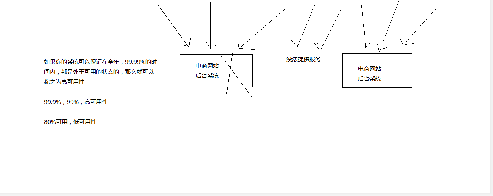
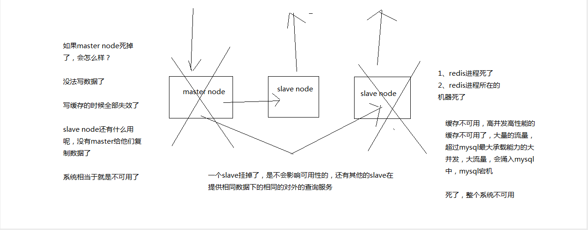
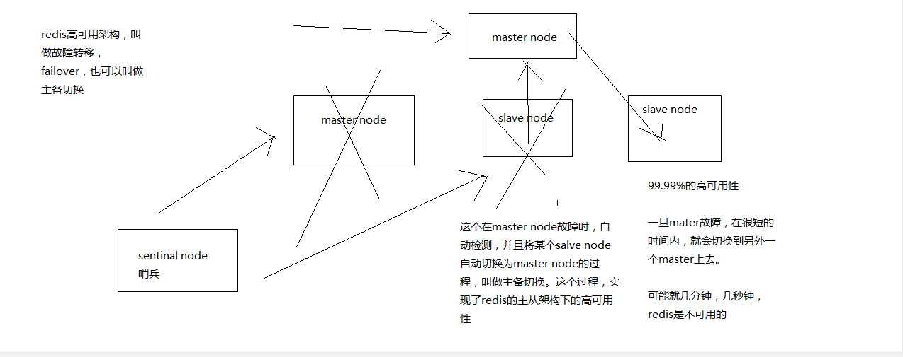

# redis主从架构如何实现高可用？

1、什么是99.99%高可用？

架构上，高可用性，99.99%的高可用性

讲的学术，99.99%，公式，系统可用的时间 / 系统故障的时间，365天，在365天 * 99.99%的时间内，你的系统都是可以哗哗对外提供服务的，那就是高可用性，99.99%

系统可用的时间 / 总的时间 = 高可用性，然后会对各种时间的概念，说一大堆解释

2、redis不可用是什么？单实例不可用？主从架构不可用？不可用的后果是什么？

3、redis怎么才能做到高可用？

**什么是高可用**

**redis的不可用**

**redis基于哨兵的高可用性**

1、哨兵的介绍

sentinal，中文名是哨兵

哨兵是redis集群架构中非常重要的一个组件，主要功能如下

（1）集群监控，负责监控redis master和slave进程是否正常工作
（2）消息通知，如果某个redis实例有故障，那么哨兵负责发送消息作为报警通知给管理员
（3）故障转移，如果master node挂掉了，会自动转移到slave node上
（4）配置中心，如果故障转移发生了，通知client客户端新的master地址

哨兵本身也是分布式的，作为一个哨兵集群去运行，互相协同工作

（1）故障转移时，判断一个master node是宕机了，需要大部分的哨兵都同意才行，涉及到了分布式选举的问题
（2）即使部分哨兵节点挂掉了，哨兵集群还是能正常工作的，因为如果一个作为高可用机制重要组成部分的故障转移系统本身是单点的，那就很坑爹了

目前采用的是sentinal 2版本，sentinal 2相对于sentinal 1来说，重写了很多代码，主要是让故障转移的机制和算法变得更加健壮和简单

2、哨兵的核心知识

（1）哨兵至少需要3个实例，来保证自己的健壮性
（2）哨兵 + redis主从的部署架构，是不会保证数据零丢失的，只能保证redis集群的高可用性
（3）对于哨兵 + redis主从这种复杂的部署架构，尽量在测试环境和生产环境，都进行充足的测试和演练

3、为什么redis哨兵集群只有2个节点无法正常工作？

哨兵集群必须部署2个以上节点

如果哨兵集群仅仅部署了个2个哨兵实例，quorum=1

+----+         +----+
| M1 |---------| R1 |
| S1 |         | S2 |
+----+         +----+

Configuration: quorum = 1

master宕机，s1和s2中只要有1个哨兵认为master宕机就可以还行切换，同时s1和s2中会选举出一个哨兵来执行故障转移

同时这个时候，需要majority，也就是大多数哨兵都是运行的，2个哨兵的majority就是2（2的majority=2，3的majority=2，5的majority=3，4的majority=2），2个哨兵都运行着，就可以允许执行故障转移

但是如果整个M1和S1运行的机器宕机了，那么哨兵只有1个了，此时就没有majority来允许执行故障转移，虽然另外一台机器还有一个R1，但是故障转移不会执行

4、经典的3节点哨兵集群

       +----+
       | M1 |
       | S1 |
       +----+
          |
+----+    |    +----+
| R2 |----+----| R3 |
| S2 |         | S3 |
+----+         +----+

Configuration: quorum = 2，majority

如果M1所在机器宕机了，那么三个哨兵还剩下2个，S2和S3可以一致认为master宕机，然后选举出一个来执行故障转移

同时3个哨兵的majority是2，所以还剩下的2个哨兵运行着，就可以允许执行故障转移

