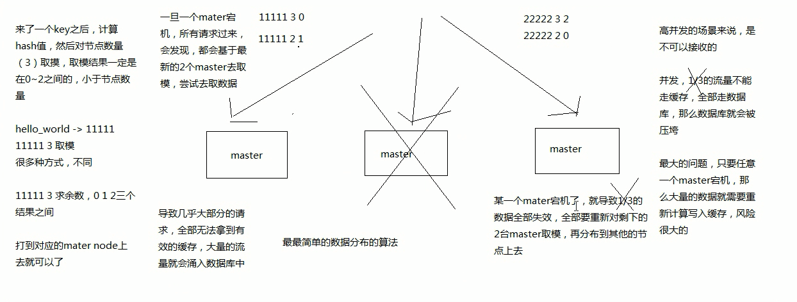
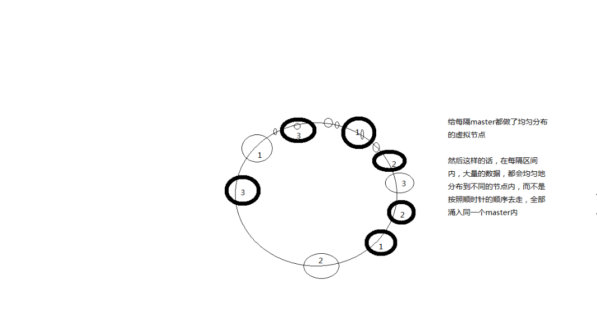
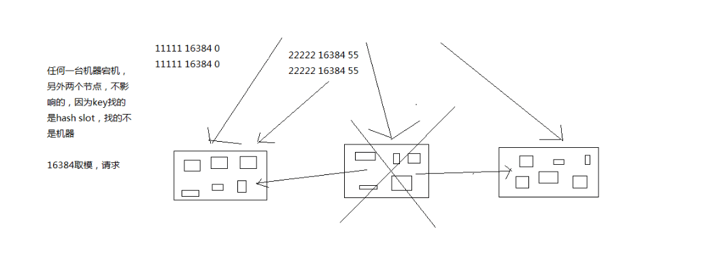
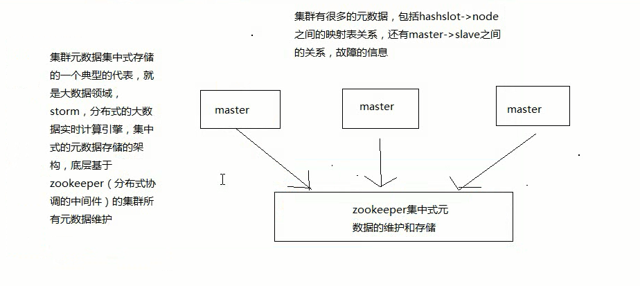
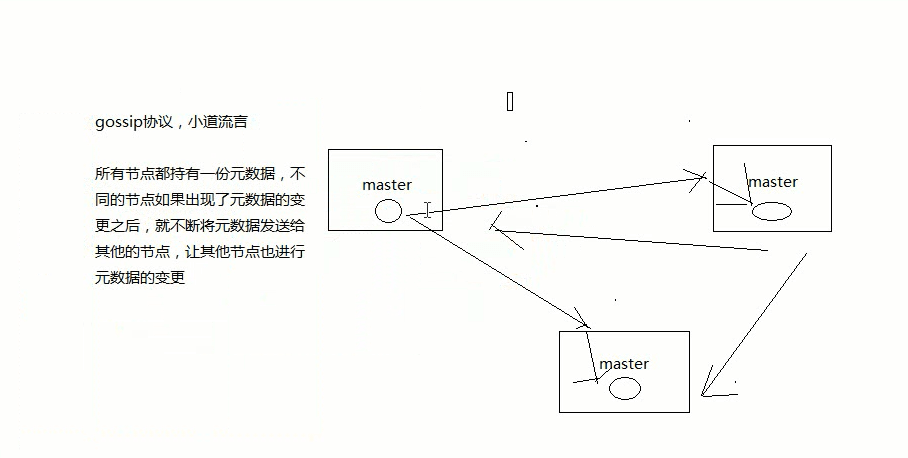

# redis集群原理


#### 1.面试题

​	**你能聊聊redis cluster集群模式的原理吗？在集群模式下，redis的key是如何寻址的？分布式寻址都有哪些算法？了解一致性hash算法吗？如何动态增加和删除一个节点？**


#### 2.面试官心里分析

```
	在以前，如果前几年的时候，一般来说，redis如果要搞几个节点，每个节点存储一部分的数据，得借助一些中间件来实现，比如说有codis，或者twemproxy，都有。有一些redis中间件，你读写redis中间件，redis中间件负责将你的数据分布式存储在多台机器上的redis实例中。

	这两年，redis不断在发展，redis也不断的有新的版本，redis cluster，redis集群模式，你可以做到在多台机器上，部署多个redis实例，每个实例存储一部分的数据，同时每个redis实例可以挂redis从实例，自动确保说，如果redis主实例挂了，会自动切换到redis从实例顶上来。
	
	现在redis的新版本，大家都是用redis cluster的，也就是redis原生支持的redis集群模式，那么面试官肯定会就redis cluster对你来个几连炮，要是你没用过redis cluster ，正常，以前很多人用codis之类的客户端来支持集群，但起码你得研究一下redis cluster吧。
	
	
	
	
```


**redis单master架构的容量瓶颈问题**


**redis如何通过master横向扩容支撑1T+数据量（多个master）**


#### 4.redis集群原理

```

1、单机redis在海量数据面前的瓶颈

2、怎么才能够突破单机瓶颈，让redis支撑海量数据？

3、redis的集群架构

redis cluster

支撑N个redis master node，每个master node都可以挂载多个slave node

读写分离的架构，对于每个master来说，写就写到master，然后读就从mater对应的slave去读

高可用，因为每个master都有salve节点，那么如果mater挂掉，redis cluster这套机制，就会自动将某个slave切换成master

redis cluster（多master + 读写分离 + 高可用）

我们只要基于redis cluster去搭建redis集群即可，不需要手工去搭建replication复制+主从架构+读写分离+哨兵集群+高可用

4、redis cluster vs. replication + sentinal

如果你的数据量很少，主要是承载高并发高性能的场景，比如你的缓存一般就几个G，单机足够了

replication，一个mater，多个slave，要几个slave跟你的要求的读吞吐量有关系，然后自己搭建一个sentinal集群，去保证redis主从架构的高可用性，就可以了

redis cluster，主要是针对海量数据+高并发+高可用的场景，海量数据，如果你的数据量很大，那么建议就用redis cluster


```


#### 5.分布式数据存储的核心算法，数据分布的算法

```
	hash算法	-》一致性hash算法（以前是memcached）--》redis cluster（hash slot算法）
	
	用不同的算法，就决定了在多个master的时候，数据如何分布到这些节点上去，解决这个问题
	
	1、redis cluster介绍

    redis cluster

    （1）自动将数据进行分片，每个master上放一部分数据
    （2）提供内置的高可用支持，部分master不可用时，还是可以继续工作的

    在redis cluster架构下，每个redis要放开两个端口号，比如一个是6379，另外一个就是加10000的端口号，比如16379

    16379端口号是用来进行节点间通信的，也就是cluster bus的东西，集群总线。cluster bus的通信，用来进行故障检测，配置更新，故障转移授权

    cluster bus用了另外一种二进制的协议，主要用于节点间进行高效的数据交换，占用更少的网络带宽和处理时间

    2、最老土的hash算法和弊端（大量缓存重建）

    3、一致性hash算法（自动缓存迁移）+虚拟节点（自动负载均衡）

    4、redis cluster的hash slot算法

    redis cluster有固定的16384个hash slot，对每个key计算CRC16值，然后对16384取模，可以获取key对应的hash slot

    redis cluster中每个master都会持有部分slot，比如有3个master，那么可能每个master持有5000多个hash slot

    hash slot让node的增加和移除很简单，增加一个master，就将其他master的hash slot移动部分过去，减少一个master，就将它的hash slot移动到其他master上去

    移动hash slot的成本是非常低的

    客户端的api，可以对指定的数据，让他们走同一个hash slot，通过hash tag来实现
	
	
		


```


**最老土的hash数据分布取模算法以及弊端**



```
如果一旦有一个master挂掉是很容易出现问题的，在取数据的时候因为是按2台机器取模，结果之前存的时候是按3台机器取模存的，这样会导致取不到数据，因为节点中就没有存那个数据。几乎接近100%的取值流量可能失效了
```


**一致性hash算法的讲解和优点**


```
	这样可能存在缓存热点问题，可能导致某个master节点的数据太多，导致内存瓶颈
```


**一致性hash算法的虚拟节点实现负载均衡**




**redis cluster 的hash slot算法**



```
	redis cluster 的hash slot算法,是对16384进行取模，这样可以更均衡的分配节点，如果一旦某个节点挂了，会把他持有的slot分配给其他的master。
```


#### 6.redis cluster核心原理分析

```
	一、节点间的内部通信机制
	1.基础通信原理
		1.1 redis cluster节点采取gossip协议进行通信。
        	跟集中式不一样，不是将集群元数据（节点信息，故障，等等）集中存储在某个节点上，而是相互之间不断通信，保持整个集群所有节点的数据是完整的维护集群的元数据用得，集中、gossip（小道留言）。
        	
        	如果采用集中式的元数据维护：
        		好处在于：元数据的更新和读取，时效性非常好，一旦元数据出现了变更，立即就更新到集中式的存储中，其他节点读取的时候立即就可以感知到；
        		不好在于：所有的元数据的更新压力全部集中在一个地方，可能会导致元数据的存储有压力。
                
            gossip：
            	好处在于：元打到数据的更新比较分散，不是集中在一个地方，更新请求会陆陆续续，打到所有节点上去更新，有一定的延时，降低了压力。
            	不好在于：元数据更新有延时，可能导致集群的一些操作会有一些滞后。
            	
     	1.2 10000端口：
     		每个节点都有一个专门用于节点通信的端口，就是自己提供服务的端口号+10000，比如7001，那么用于节点通信的就是17001端口。
     		每个节点每隔一段时间就会往另外几个节点发送ping消息，同时其他节点都接收到ping之后返回pong。
     		
     2.gossip协议：
     
         gossip协议包含多种消息，包括ping，pong，meeet,fail，等等。

         meet：某节点发送meet给新加入的节点，让新节点加入集群中，然后新节点就会开始与其他节点进行通信。
            比如：redis.trib.rb add-node
            其实内部就是发送了一个gossip meet消息，给新加入的节点，通知那个节点去加入我们的集群。

         ping：每个节点都会有频繁给其他节发送ping，其中包含自己的状态还有自己维护的集群元数据，互相通过ping交换元数据。
            每个节点每秒都会频繁发送ping给其他集群，通过ping，频繁发交换数据，频繁的互相之间交换数据，互相进行元数据的更新。

         pong:返回ping和meet，包含自己的状态和其他信息，也可以用于信息广播和更新。

         fail:某个节点判断另外一个节点fail之后，就发送fail给其他节点，通知其他节点，指定的节点宕机了。
         
         
     3.ping消息深入
     	ping很频繁，而且要携带一些元数据，所以可能会加重网络负担
     	每个节点每秒都会执行10次ping，每次都会选择5个最久没有通信的其他节点
     	当然如果发现某个节点通信延时达到了cluster_node_timeout/2,那么就立即发送ping，避免数据交换延时过长，落后的时间太长了。（比如说：俩个节点之间都是10分钟没有交换数据了，那么整个集群处于严重的数据不一致的情况，就会有问题），
     	所以cluster_node_timeout可以调节，如果调节比较大，那么会降低发送的频率。
     	每次ping，一个是带上自己的节点信息，还有就是带上1/10其他节点的信息，发送出去，进行数据交换。
     	每次发送至少包含3个其他节点的信息，最多包含  总结点-减2个节点信息。
     	
     	
     二、面向集群的jedis内部实现原理
     	开发都是基于jedis，redis的java client客户端，因为使用redis cluster，所以用jedis cluster api。
     	jedis cluster api与redis cluster集群交互的一些基本原理
     	
     	1.基于重定向的客户端
     	redis-cli -c，自动重定向
     		1.1 请求重定向
  				客户端可能会挑选任意一个redis去发送命令，每个redis实例接收到命令，都会计算key对应的hash slot 
  				如果在本地就在本地处理，否则返回moved给客户端，让客户端进行重定向
  				cluster keyslot mykey，可以查看一个key对应的hash slot
  				用redis-cli的时候，可以加入-c参数，支持自动的请求重定向，redis-cli接收到moved之后，会自动重定向到对应的节点执行命令。
  		
            1.2.计算hash slot
            计算hash slot的算法，就是根据key计算CRC16的值，然后对16384取模，拿到对应的hash slot
            用hash tag可以手动指定key对应的slot，同一个hash tag下的key，都会在一个hash slot中，比如set mykey1{100}和set mykey2{100}
        
        
        	1.3.hash slot查找
        	节点间通过gossip协议进行数据交换，就知道每个hash slot在哪个节点上
        
        2、smart jedis

        （1）什么是smart jedis

        基于重定向的客户端，很消耗网络IO，因为大部分情况下，可能都会出现一次请求重定向，才能找到正确的节点

        所以大部分的客户端，比如java redis客户端，就是jedis，都是smart的

        本地维护一份hashslot -> node的映射表，缓存，大部分情况下，直接走本地缓存就可以找到hashslot -> node，不需要通过节点进行moved重定向

        （2）JedisCluster的工作原理

        在JedisCluster初始化的时候，就会随机选择一个node，初始化hashslot -> node映射表，同时为每个节点创建一个JedisPool连接池

        每次基于JedisCluster执行操作，首先JedisCluster都会在本地计算key的hashslot，然后在本地映射表找到对应的节点

        如果那个node正好还是持有那个hashslot，那么就ok; 如果说进行了reshard这样的操作，可能hashslot已经不在那个node上了，就会返回moved

        如果JedisCluter API发现对应的节点返回moved，那么利用该节点的元数据，更新本地的hashslot -> node映射表缓存

        重复上面几个步骤，直到找到对应的节点，如果重试超过5次，那么就报错，JedisClusterMaxRedirectionException

        jedis老版本，可能会出现在集群某个节点故障还没完成自动切换恢复时，频繁更新hash slot，频繁ping节点检查活跃，导致大量网络IO开销

        jedis最新版本，对于这些过度的hash slot更新和ping，都进行了优化，避免了类似问题

        （3）hashslot迁移和ask重定向

        如果hash slot正在迁移，那么会返回ask重定向给jedis

        jedis接收到ask重定向之后，会重新定位到目标节点去执行，但是因为ask发生在hash slot迁移过程中，所以JedisCluster API收到ask是不会更新hashslot本地缓存

        已经可以确定说，hashslot已经迁移完了，moved是会更新本地hashslot->node映射表缓存的

        -------------------------------------------------------------------------------------------------------

三、高可用性与主备切换原理

        redis cluster的高可用的原理，几乎跟哨兵是类似的

        1、判断节点宕机

        如果一个节点认为另外一个节点宕机，那么就是pfail，主观宕机

        如果多个节点都认为另外一个节点宕机了，那么就是fail，客观宕机，跟哨兵的原理几乎一样，sdown，odown

        在cluster-node-timeout内，某个节点一直没有返回pong，那么就被认为pfail

        如果一个节点认为某个节点pfail了，那么会在gossip ping消息中，ping给其他节点，如果超过半数的节点都认为pfail了，那么就会变成fail

        2、从节点过滤

        对宕机的master node，从其所有的slave node中，选择一个切换成master node

        检查每个slave node与master node断开连接的时间，如果超过了cluster-node-timeout * cluster-slave-validity-factor，那么就没有资格切换成master

        这个也是跟哨兵是一样的，从节点超时过滤的步骤

        3、从节点选举

        哨兵：对所有从节点进行排序，slave priority，offset，run id

        每个从节点，都根据自己对master复制数据的offset，来设置一个选举时间，offset越大（复制数据越多）的从节点，选举时间越靠前，优先进行选举

        所有的master node开始slave选举投票，给要进行选举的slave进行投票，如果大部分master node（N/2 + 1）都投票给了某个从节点，那么选举通过，那个从节点可以切换成master

        从节点执行主备切换，从节点切换为主节点

        4、与哨兵比较

        整个流程跟哨兵相比，非常类似，所以说，redis cluster功能强大，直接集成了replication和sentinal的功能


没有办法去给大家深入讲解redis底层的设计的细节，核心原理和设计的细节，那个除非单独开一门课，redis底层原理深度剖析，redis源码

对于咱们这个架构课来说，主要关注的是架构，不是底层的细节，对于架构来说，核心的原理的基本思路，是要梳理清晰的
        
     
     
```


**集中式的集群元数据存储和维护图**



**redis的gossip协议通信维护集群元数据**




