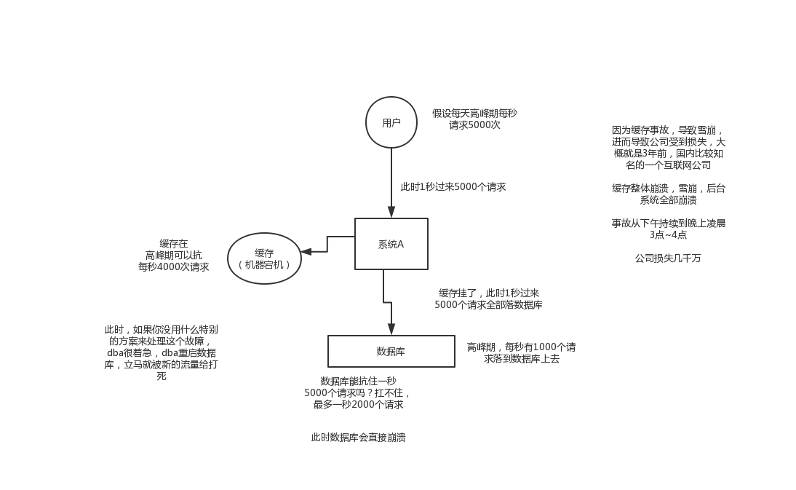
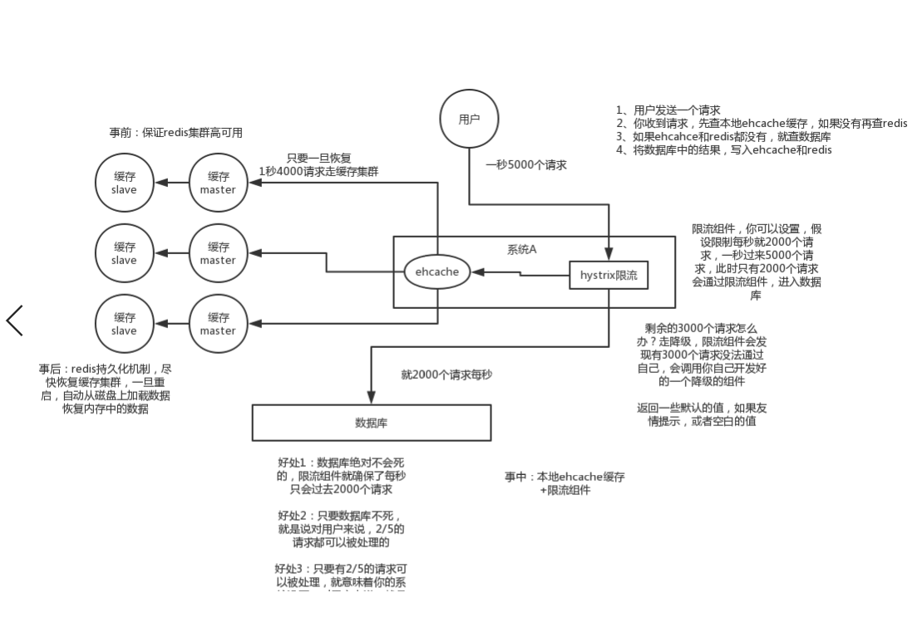
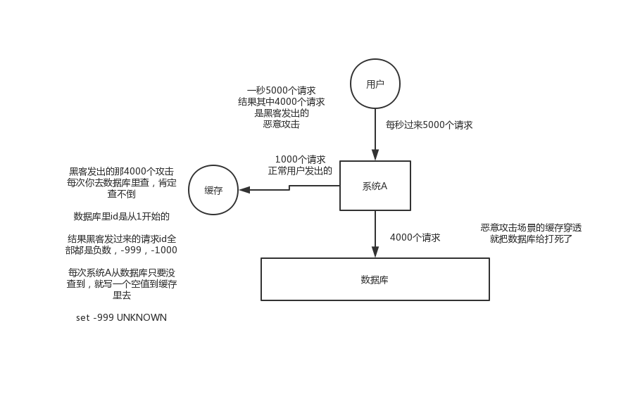

# 你能说说我们一般如何应对缓存雪崩以及穿透问题吗？


#### 1.面试题

**了解什么是redis的雪崩和穿透？redis奔溃后会怎样？系统该如何应对这种情况？如何处理redis的穿透？**


#### 2.面试官心里分析

```
	其实这是问到缓存必问的，因为缓存雪崩和穿透，那是缓存最大的俩个问题，要么不出现，一旦出现就是致命性的问题，所以面试官肯定会问你。
```


#### 3.面试题剖析

```
	1.缓存雪崩发生的现象
		其实就是因为高并发的时候，正好缓存故障，导致访问数据库把数据库打死，系统整体奔溃。
		
	2.缓存雪崩解决方案
		事前：redis高可用，主从+哨兵，redis cluster，避免全盘崩溃
        事中：本地ehcache缓存 + hystrix限流&降级，避免MySQL被打死
        	限流需要写一个限流组件，返回一些默认值
        事后：redis持久化，快速恢复缓存数据

	
	3.缓存穿透现象
		其实就是大量并发数据过来，从缓存里没有查到数据，就会从数据库里查，数据库里也没有数据，而且是高并发的访问数据库，导致数据库宕机（一般可能是黑客行为）
		
	4.缓存穿透解决方案
		如果是缓存和数据库里都没有的数据请求，就设置一个默认值，或者空值。
	
	
	
	
	
```


**缓存雪崩现象**




**如何解决缓存雪崩现象**




**缓存穿透及解决方案**




