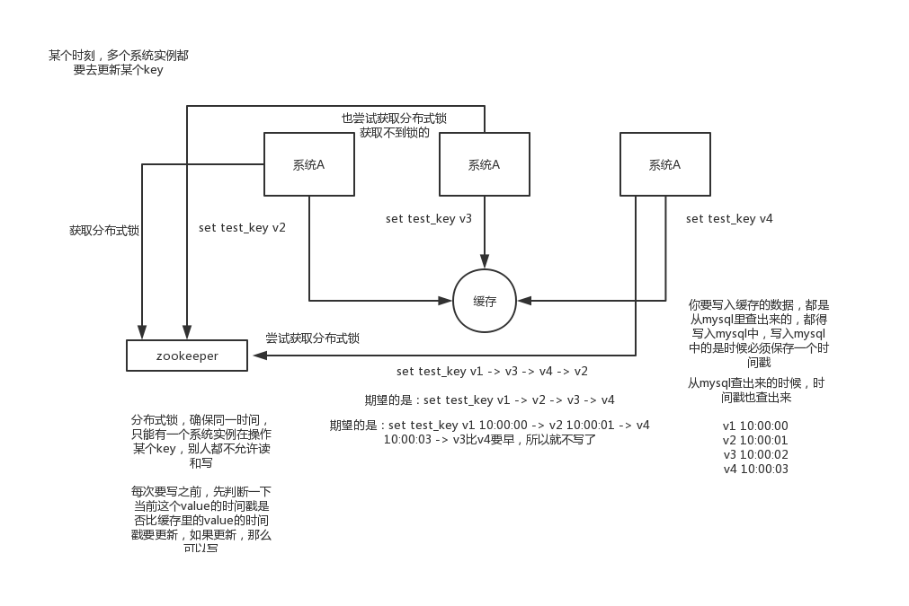

# 你能说说redis的并发竞争问题该如何解决吗？


#### 1.面试题

​	**redis的并发竞争问题是什么？如何解决这个问题？了解Redis事务的CAS方案吗？**


#### 2.面试官心里分析

```
	这个也是线上很常见的问题，就是多客户端并发写一个key，可能本来应该先到的数据后到了，导致数据版本错了。或者是多客户端同时获取一个key，修改值之后再写回去，只要顺序错了，数据就错了。
	
	而且redis自己就有天然解决这个问题的CAS类的乐观锁方案
```


#### 3.面试题剖析

```
	redis并发竞争的问题，因为redis的数据都是从数据库获取的，那么在写入数据库的时候保存一个时间戳，在redis并发保存数据的时候先做分布式锁，然后写入redis之前 再做时间戳检查，检查数据是不是比上一次的时间戳要大，大那就是最新的。顺序就正确了。
```


**redis并发竞争以及解决方案**




