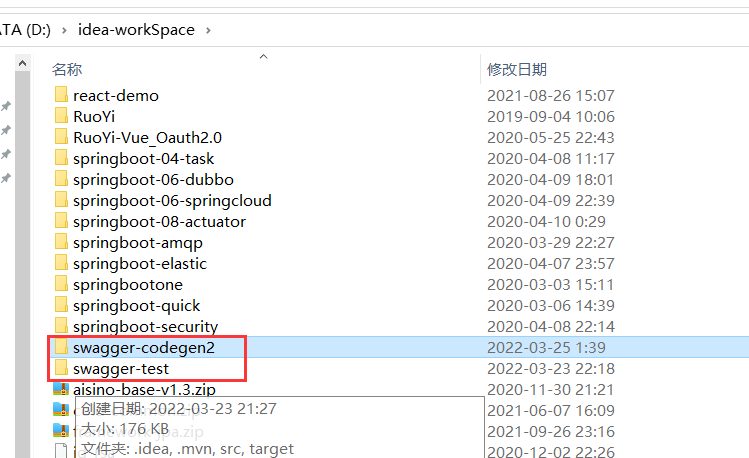

# Swagger-codegen记录


学习地址：https://www.youtube.com/watch?v=YmQyzNF5iKg 这个会引入父类的使用


这个会引入远程接口的调用：https://www.youtube.com/watch?v=i1xXmSAbLXQ&t=753s


官方github项目地址：https://github.com/swagger-api/swagger-codegen


maven插件地址：https://github.com/swagger-api/swagger-codegen/blob/master/modules/swagger-codegen-maven-plugin/README.md


语言选择复选配置参数解释地址：https://github.com/OpenAPITools/openapi-generator/blob/master/docs/generators/spring.md


测试项目：

```
http://127.0.0.1:9091/v2/api-docs

http://127.0.0.1:9092/svc/v1/api/example?name=John


```




重要参数配置记录：

```xml
<plugin>
        <groupId>io.swagger</groupId>
        <artifactId>swagger-codegen-maven-plugin</artifactId>
        <executions>
          <!--执行可以多个-->
          <execution>
            <!--执行任务ID-->
            <id>spring-front</id>
            <!--执行generate-sources阶段-->
            <phase>generate-sources</phase>
            <goals>
              <!--执行单元特定任务命令-->
              <goal>generate</goal>
            </goals>
            <!--配置-->
            <configuration>
              <!--源接口文件-->
              <inputSpec>src/main/resources/api/visualization-frontapi.yml</inputSpec>
              <language>spring</language>
              <!--输出model包名称-->
              <modelPackage>com.ccb.visualization.frontapi.vo</modelPackage>
              <!--输出Controller接口包名称-->
              <apiPackage>com.ccb.visualization.frontapi</apiPackage>
              <!--输出包路径-->
              <output>target/generated-sources</output>

              <!--特定语言下的参数映射-->
              <!--https://github.com/OpenAPITools/openapi-generator/blob/master/docs/generators/spring.md-->
              <configOptions>
                <!--是否只生成接口-->
                <interfaceOnly>true</interfaceOnly>
                <!--生成文件时隐藏生成的时间戳-->
                <hideGenerationTimestamp>true</hideGenerationTimestamp>

              </configOptions>
            </configuration>
          </execution>
            
            
            
          <execution>
            <id>spring-service</id>
            <phase>generate-sources</phase>
            <goals>
              <goal>generate</goal>
            </goals>
            <configuration>
              <inputSpec>src/main/resources/api/visualization-serviceapi.yml</inputSpec>
              <language>spring</language>
              <modelPackage>com.ccb.visualization.serviceapi.dto</modelPackage>
              <apiPackage>com.ccb.visualization.serviceapi</apiPackage>
              <output>target/generated-sources</output>
              <configOptions>
                <interfaceOnly>true</interfaceOnly>
                <serializableModel>true</serializableModel>
                <hideGenerationTimestamp>true</hideGenerationTimestamp>
              </configOptions>
            </configuration>
          </execution>
          <execution>
            <id>spring-open</id>
            <phase>generate-sources</phase>
            <goals>
              <goal>generate</goal>
            </goals>
            <configuration>
              <inputSpec>src/main/resources/api/visualization-openapi.yml</inputSpec>
              <language>spring</language>
              <modelPackage>com.ccb.visualization.openapi.dto</modelPackage>
              <apiPackage>com.ccb.visualization.openapi</apiPackage>
              <output>target/generated-sources</output>
              <configOptions>
                <interfaceOnly>true</interfaceOnly>
                <hideGenerationTimestamp>true</hideGenerationTimestamp>
              </configOptions>
            </configuration>
          </execution>
          <execution>
            <id>html-front</id>
            <phase>generate-sources</phase>
            <goals>
              <goal>generate</goal>
            </goals>
            <configuration>
              <inputSpec>src/main/resources/api/visualization-frontapi.yml</inputSpec>
              <language>html2</language>
              <output>target/api/front</output>
            </configuration>
          </execution>
          <execution>
            <id>html-service</id>
            <phase>generate-sources</phase>
            <goals>
              <goal>generate</goal>
            </goals>
            <configuration>
              <inputSpec>src/main/resources/api/visualization-serviceapi.yml</inputSpec>
              <language>html2</language>
              <output>target/api/service</output>
            </configuration>
          </execution>
          <execution>
            <id>html-open</id>
            <phase>generate-sources</phase>
            <goals>
              <goal>generate</goal>
            </goals>
            <configuration>
              <inputSpec>src/main/resources/api/visualization-openapi.yml</inputSpec>
              <language>html2</language>
              <output>target/api/open</output>
            </configuration>
          </execution>
          <execution>
            <id>javascript</id>
            <phase>generate-sources</phase>
            <goals>
              <goal>generate</goal>
            </goals>
            <configuration>
              <inputSpec>src/main/resources/api/visualization-frontapi.yml</inputSpec>
              <language>javascript</language>
              <output>target/generated-sources/javascript</output>
            </configuration>
          </execution>
        </executions>
      </plugin>


```


如果想要生成的文件在编译时忽略--加入.swagger-codegen-ignore文件--**注意必须是根目录下才可以生效**


另外一种配置插件 根据json接口文件来生成代码

```xml
<?xml version="1.0" encoding="UTF-8"?>
<project xmlns="http://maven.apache.org/POM/4.0.0" xmlns:xsi="http://www.w3.org/2001/XMLSchema-instance"
         xsi:schemaLocation="http://maven.apache.org/POM/4.0.0 https://maven.apache.org/xsd/maven-4.0.0.xsd">
    <modelVersion>4.0.0</modelVersion>
    <parent>
        <groupId>org.springframework.boot</groupId>
        <artifactId>spring-boot-starter-parent</artifactId>
        <version>2.6.4</version>
        <relativePath/> <!-- lookup parent from repository -->
    </parent>
    <groupId>com.guofeng</groupId>
    <artifactId>swagger-codegen2</artifactId>
    <version>0.0.1-SNAPSHOT</version>
    <name>swagger-codegen2</name>
    <description>Demo project for Spring Boot</description>
    <properties>
        <java.version>1.8</java.version>
    </properties>
    <dependencies>
        <dependency>
            <groupId>org.springframework.boot</groupId>
            <artifactId>spring-boot-starter</artifactId>
        </dependency>

        <dependency>
            <groupId>org.springframework.boot</groupId>
            <artifactId>spring-boot-starter-web</artifactId>
        </dependency>

        <!-- https://mvnrepository.com/artifact/io.springfox/springfox-swagger2 -->
        <!-- swagger核心包 -->
        <dependency>
            <groupId>io.springfox</groupId>
            <artifactId>springfox-swagger2</artifactId>
            <version>2.9.2</version>
        </dependency>

        <!--swagger UI -->
        <dependency>
            <groupId>io.springfox</groupId>
            <artifactId>springfox-swagger-ui</artifactId>
            <version>2.9.2</version>
        </dependency>

        <!--Joda-Time这个日期时间工具类库-->
        <dependency>
            <groupId>joda-time</groupId>
            <artifactId>joda-time</artifactId>
            <version>2.9.7</version>
        </dependency>

        <dependency>
            <groupId>junit</groupId>
            <artifactId>junit</artifactId>
            <version>4.12</version>
            <scope>test</scope>
        </dependency>

    </dependencies>

    <build>
        <plugins>
            <plugin>
                <groupId>org.springframework.boot</groupId>
                <artifactId>spring-boot-maven-plugin</artifactId>
            </plugin>
            <!--swagger-codegen插件-->
            <plugin>
                <groupId>io.swagger</groupId>
                <artifactId>swagger-codegen-maven-plugin</artifactId>
                <version>2.3.1</version>
                <!--swagger-codegen插件的配置-->
                <configuration>
                    <!--输入接口请求服务端生成的JSON内容，然后会根据这个Json在本客户端服务项目生成代码 -->
                    <inputSpec>${project.basedir}/src/main/resources/employee-profile-api.json</inputSpec>
                    <configOptions>
                        <sourceFolder>main/java</sourceFolder>
                        <interfaceOnly>true</interfaceOnly>
                        <dateLibrary>java8</dateLibrary>
                    </configOptions>
                    <!--输出生成代码路径-->
                    <output>${project.build.directory}/generated-sources</output>
                    <language/>
                    <ignoreFileOverride>${project.basedir}/resource/.swagger-codegen-ignore</ignoreFileOverride>
                </configuration>
                <!--执行标签-->
                <executions>
                    <execution>
                        <goals>
                            <goal>generate</goal>
                        </goals>
                        <configuration>
                            <ignoreFileOverride>${project.basedir}/.swagger-codegen-ignore</ignoreFileOverride>
                            <!-- 生成的语言-->
                            <language>java</language>
                            
							<!--生成代码的同时加入依赖-->
                            <library>resttemplate</library>
                            <!--生成model的路径-->
                            <modelPackage>com.swagger.client.codegen.rest.model</modelPackage>
                            <!--生成api的路径-->
                            <apiPackage>com.swagger.client.codegen.rest.api</apiPackage>
                            <!--生成model的路径-->
                            <invokerPackage>com.swagger.client.codegen.rest.invoker</invokerPackage>
                            <generateApiTests>false</generateApiTests>
                            <inputSpec />
                        </configuration>
                    </execution>
                </executions>
            </plugin>
            <!--swagger-codegen插件  END-->

        </plugins>
    </build>

</project>


```


