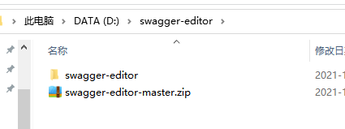
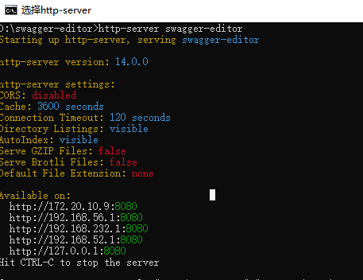
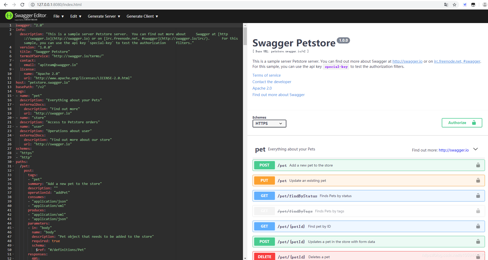
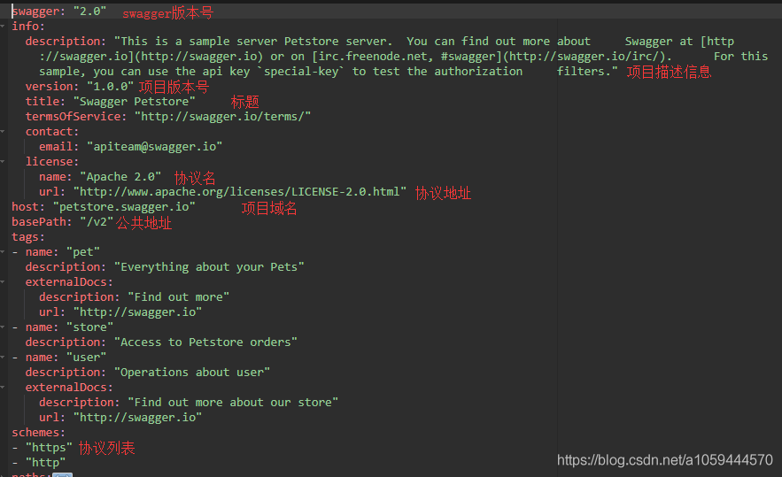
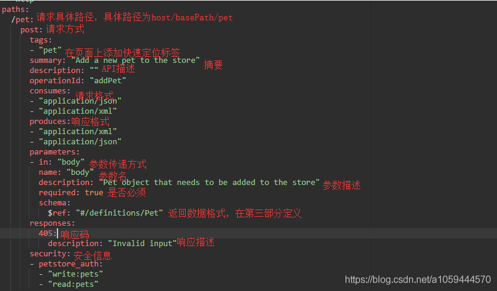
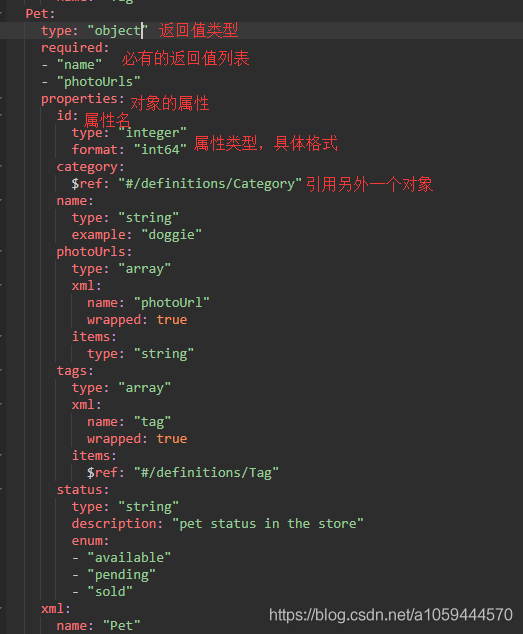
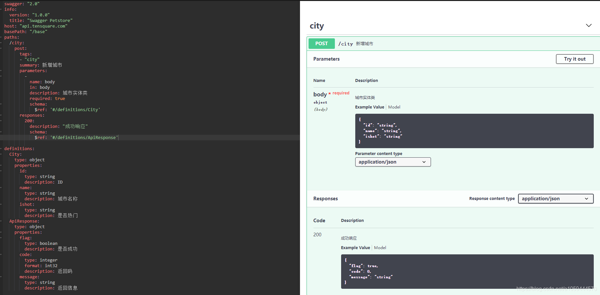

# Swagger-editor

#### 学习目标:为什么要使用Swagger?

- Swagger 是一款RESTFUL接口的文档在线自动生成+功能测试功能软件

- 随着互联网的发展,现在的软件架构已经由原来的jsp渲染页面变为了现在的前后端完全分离，前端只做前端的事，后端只做后端的事，而不是在后端开发中要将前端人员写好的页面改为jsp。如果页面出什么问题还需要前端开发人员懂得一定的jsp语法才能进行调试。

- 所以，在前后端完全分离的情况下，前后端人员唯一的联系就变成了API接口，写API接口的方式有很多种，可以使用word来编写，也可以使用markdown来编写，但Swagger来编写是更好也是更优雅的方式，swagger就是能够让你更好的编写API文档的框架

  

  #### swagger的下载与安装
  1、下载swagger，并解压

  ```
  下载地址https://github.com/swagger-api/swagger-editor
  ```

  

  2 、由于swagger是使用Angular开发的一款BS软件，所以此处需要全局安装http-server，需要nodejs环境，
  在命令行中运行以下命令

  ```
  npm i http-server -g
  ```

  

  3、在swagger-editor的目录外执行命令

  ```
  http-server swagger-editor
  ```

  

  

  注意，**一定要在目录外运行，比如我的解压目录是**

  那么就这在运行

**如果在其他地方运行可能导致首页访问不到的问题**





http-server后面跟的是目录名，然后使用生成的这几个网址都可以访问，如果出现访问不了，请在后面加上/index.html,或者将目录扔到tomcat下运行，如果出现以下界面就表示安装运行成功了



#### swagger-editor基本界面基本介绍

- swagger-editor大致可以分为三部分

  

  1、基础信息

  

  

  2、path（核心部分），API的具体描述、路径、返回值，参数，请求格式

  


​	3、path以下部分，描述返回的类型，字段，安全信息



示例：




