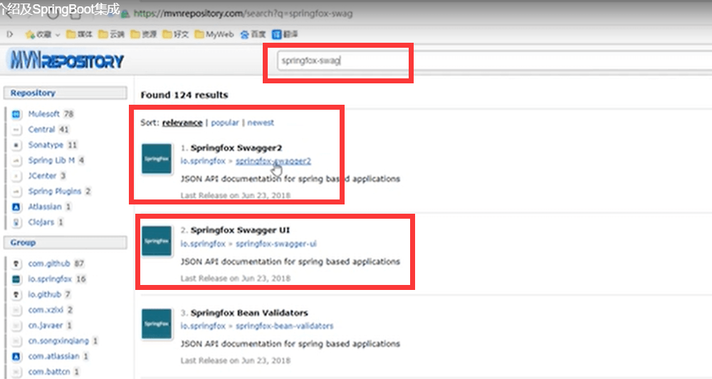
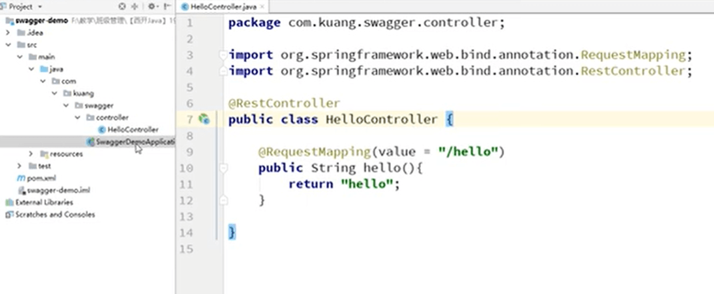
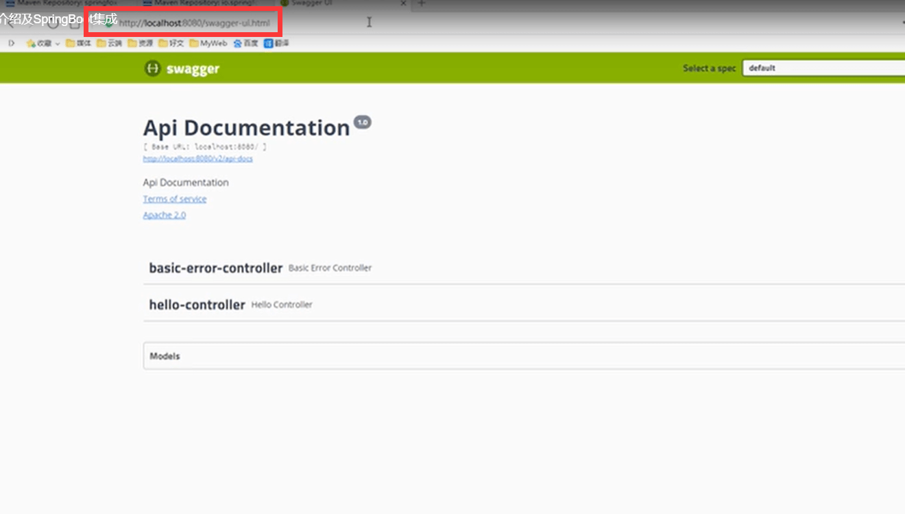
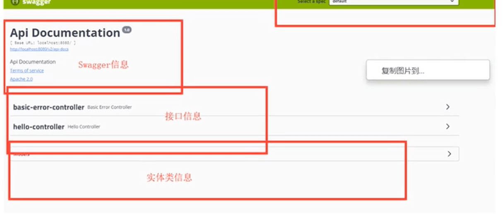
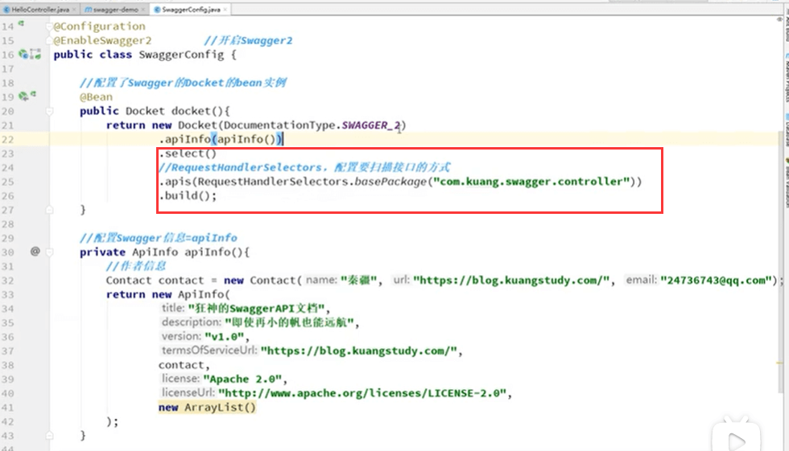
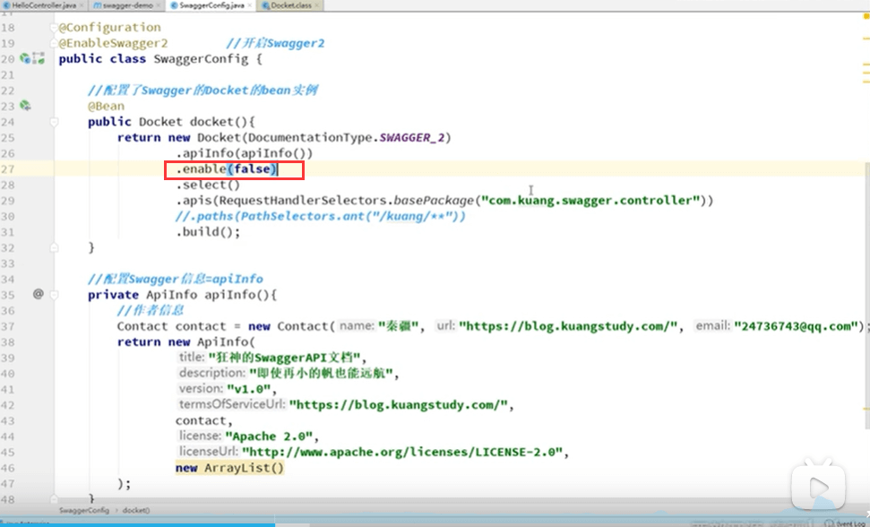
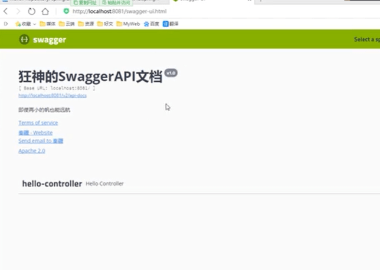

# 1.Swagger介绍


#### 学习目标：

	- 了解Swagger的作用和概念
	- 了解前后端分离
	- 在SpringBoot中集成Swagger

https://www.bilibili.com/video/BV1Y441197Lw?from=search&seid=441129464099293217

## Swagger介绍

```
	先了解一下前后端分离，Vue+SpringBoot
	
	后端时代：前端只用管理静态页面
	
	前后端分离时代：
		后端：后端控制层，服务层，数据访问层
		
		前端：前端控制层，视图层
			伪造后端数据，json数据，已经存在了，不需要后端数据，前端依旧可以靠伪造数据跑起来
		
		前后端如何交互：就是通过API接口
		
		前后端相对独立，松耦合
		前后端甚至可以部署在不同的服务器上
		
	产生一个问题：
		前后端集成联调，前端人员和后端人员无法做到，即时协商，尽早解决，最终导致问题集中爆发。
		
	解决方案：
		首先指定schema[计划的提纲]，实时更新最新的API，降低集成的风险；
		早些年：制定word计划文档；
		前后端分离：
			前端测试后端接口：postman
			后端提供接口，需实时更新最新的消息改动
	Swagger就应运而生了
		号称世界上最流行的API框架
```


## Swagger

	- 号称世界上最流行的API框架
	- RestFul API 文档在线自动生成工具--》Api文档与API定义同步更新
	- 直接运行，可以在线测试API接口
	- 支持多种语言 java php 等等


官网：swagger.io


#### 在项目中使用Swagger需要springfox

	- swagger2
	- ui




#### SpringBoot集成Swagger

​	1.新建一个SpringBoot web项目

​	2.导入相关依赖

```
<!-- https://mvnrepository.com/artifact/io.springfox/springfox-swagger2 -->
<dependency>
    <groupId>io.springfox</groupId>
    <artifactId>springfox-swagger2</artifactId>
    <version>3.0.0</version>
</dependency>


<!-- https://mvnrepository.com/artifact/io.springfox/springfox-swagger-ui -->
<dependency>
    <groupId>io.springfox</groupId>
    <artifactId>springfox-swagger-ui</artifactId>
    <version>3.0.0</version>
</dependency>

```


​	3.编写一个hello工程




​	4.配置swagger ==》Config


​	5.测试运行 localhost:8080/swagger-ui.html






#### 配置Swagger

Swagger的bean实例Docket


#### 配置扫描接口及开关

​	注意现在自动生成的接口请求有各种方式，原因是Controller没有使用RestFul


目前没有做任何事情，默认是全部扫描


基于Docket实例，使用Docket.select()他需要传入的参数required的Docket和found的ApiSelectorBullder


指定扫描的包：




可以根据扫描注解的方式进行扫描


一般使用还是basePackage


还有path是过滤的意思，参数是正则表达


##### 配置是否启动swagger

如果enable配置了false就是关闭了swagger，enable就是是否启动swagger




我只希望我的Swagger在生产环境中使用，在发布的时候不使用

	- 判断是不是生产环境(根据Enviroment获取项目的环境，是org.springframwork.core.env)  
	- 注入enable()这个是否开启的方法


设置环境为dev





#### 配置API文档的分组

通过.groupName，配置多个docket即可


#### 实体类配置


models里面就自动有内容了


如果给实体类加文档注释


这样就会在swagger文档中生成的更加清晰


给接口加中文注释


应该是放在方法上的注解，放在类上无效@ApiOperation


给接口参数也加上注释：@ApiParam


Swagger的try out测试功能

新编辑一个方法测试


测试


加响应注解就ok了，@responsebody


总结：

​		1.我们可以通过Swagger给一些比较难理解的属性或者接口，增加注释信息

​		2.接口文档实时更新

​		3.可以在线测试

Swagger是一个优秀的工具，几乎所有大公司都有使用。


注意点：在正式发布的时候，关闭Swagger！！！出于安全考虑，而且可以节省运行内存。

https://www.bilibili.com/video/BV1Y441197Lw?p=4&spm_id_from=pageDriver


