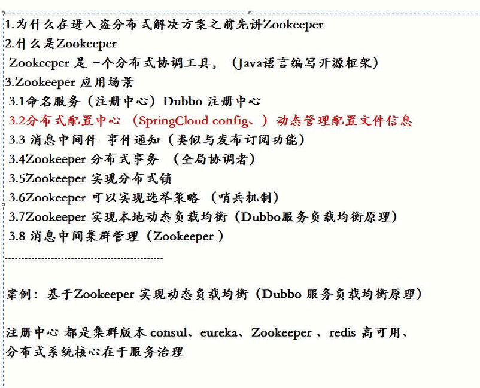
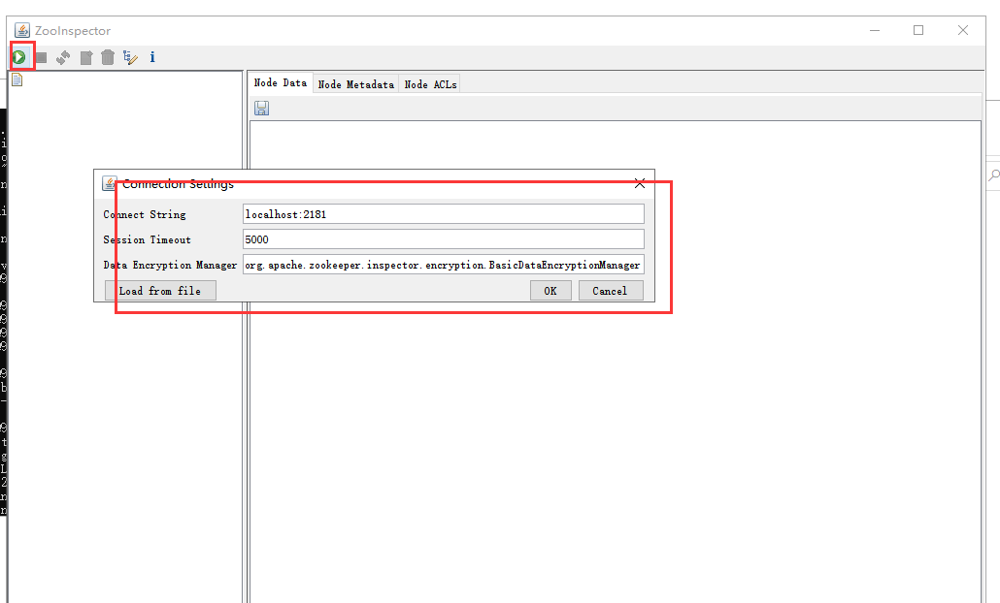
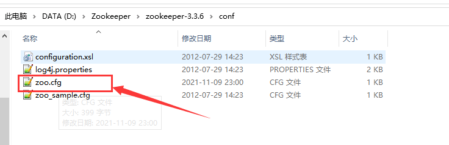

# 蚂蚁-1为什么要使用Zookeeper





#### 安装Zookeeper服务器端

我们现在可以使用windows做一个单机版的

​	进入zookeeper的bin目录下（注意路径不要有中文-否则会报错）

​	然后运行zkserver.cmd


**Zookeeper连接工具ZooInspector**

在他的bulid目录下双击运行


连接：




默认节点：


如果发生连接不成功--需要修改一下配置文件




如果连接发生中文乱码的问题：可以通过https://gitee.com/fennykk/ZooInspector项目来解决


创建节点：


#### 项目代码连接zookeeper


1、引入依赖


2.代码zookeeper创建一个连接


3、创建节点--有4个参数  分别是 1节点名称 2节点value 3节点权限 4createModel节点类型-分为临时节点和持久节点

 

最后关闭连接：


```java
/**
 * 功能说明:
 * 功能作者:
 * 创建日期:
 * 版权归属:每特教育|蚂蚁课堂所有 www.itmayiedu.com
 */
package com.itmayiedu.zk;

import java.io.IOException;
import java.util.concurrent.CountDownLatch;

import org.apache.zookeeper.CreateMode;
import org.apache.zookeeper.KeeperException;
import org.apache.zookeeper.WatchedEvent;
import org.apache.zookeeper.Watcher;
import org.apache.zookeeper.Watcher.Event.EventType;
import org.apache.zookeeper.Watcher.Event.KeeperState;
import org.apache.zookeeper.ZooDefs.Ids;
import org.apache.zookeeper.ZooKeeper;

/**
 * 功能说明: <br>
 * 创建作者:每特教育-余胜军<br>
 * 创建时间:2018年8月9日 下午4:15:24<br>
 * 教育机构:每特教育|蚂蚁课堂<br>
 * 版权说明:上海每特教育科技有限公司版权所有<br>
 * 官方网站:www.itmayiedu.com|www.meitedu.com<br>
 * 联系方式:qq644064779<br>
 * 注意:本内容有每特教育学员共同研发,请尊重原创版权
 */
public class Test001 {

	// 连接地址
	private static final String ADDRES = "127.0.0.1:2181";
	// 连接地址
	private static final int SESSIN_TIME_OUT = 2000;
	private static final CountDownLatch countDownLatch = new CountDownLatch(1);

	public static void main(String[] args) throws IOException, KeeperException, InterruptedException {
		ZooKeeper zooKeeper = new ZooKeeper(ADDRES, SESSIN_TIME_OUT, new Watcher() {

			public void process(WatchedEvent event) {
				// 获取事件状态
				KeeperState keeperState = event.getState();
				// 获取事件类型
				EventType eventType = event.getType();

				if (KeeperState.SyncConnected == keeperState) {
					if (EventType.None == eventType) {
						countDownLatch.countDown();
						System.out.println("开启连接............");
					}
				}
			}
		});
		countDownLatch.await();
		// 创建节点
		String result = zooKeeper.create("/itmayiedu_b", "itmayiedu_a".getBytes(), Ids.OPEN_ACL_UNSAFE,
				CreateMode.EPHEMERAL);
		System.out.println("result:" + result);
		Thread.sleep(1000 * 10);
		zooKeeper.close();
	}

}

```


注意：创建临时节点是不会显示的


windows停止zookeeper

 netstat -ano | findstr 2181


