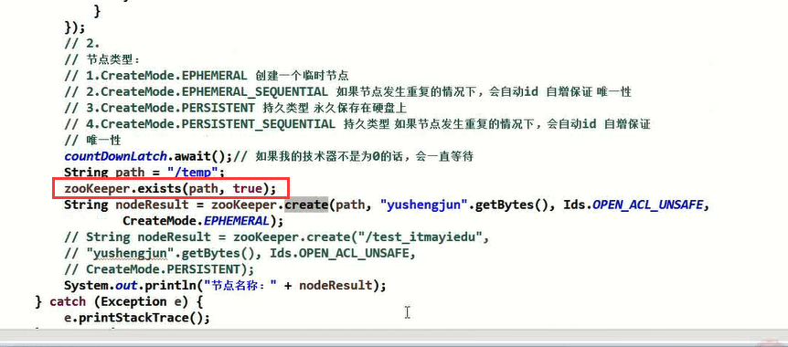
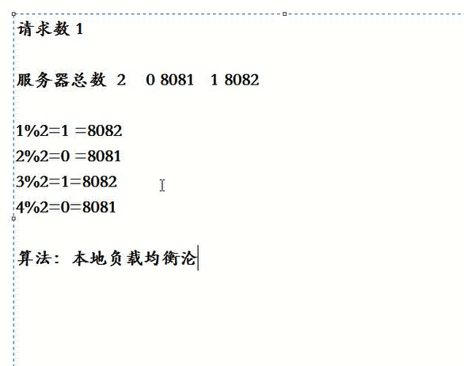

# 蚂蚁-2zookeeper实现Dubbo的负载均衡原理


**事件的监听：**

通过zookeeper调用 exists方法（path，true）--俩参数 path是节点路径，true是开启监听




监听获取到当前节点：用处特别大，比如后续的分布式锁就用到这个监听的原理


#### 1、基于JK实现动态本地负载均衡--其实就是Dubbo服务调用负载均衡原理


先聊一下比如一个集群服务在zookeeper上注册节点的形式其实是这样的：

相当于 服务节点下-多个集群服务节点--节点的value对应服务的地址及端口（节点的名称很多都是节点的value值，所以很多节点其实都不用写value值的）


服务消费端--》在调用这个集群服务的时候是从zk注册中心里面去取这个集群 节点--》然后获取到全部的子节点--》然后在本地代码实现 负载均衡算法 --》最后实现的 本地负载均衡 调用


#### 2、将服务注册到zookeeper上 具体实现


2.1、首先创建项目引入zkclient的依赖


2.2、创建ZkServerScoekt.java  --socket服务端，相当于创建开启一个socket服务

```java
package com.itmayiedu.zk;

import java.io.IOException;
import java.net.ServerSocket;
import java.net.Socket;

import org.I0Itec.zkclient.ZkClient;

//##ServerScoekt服务端
public class ZkServerScoekt implements Runnable {
	private static int port = 18080;

	public static void main(String[] args) throws IOException {

		ZkServerScoekt server = new ZkServerScoekt(port);
		Thread thread = new Thread(server);
		thread.start();
	}

	public ZkServerScoekt(int port) {
		this.port = port;
	}

	// 启动注册服务
	private void regServer() {
		ZkClient zkClient = new ZkClient("127.0.0.1:2181", 6000, 1000);
		String path = "/test/server" + port;
		if (zkClient.exists(path)) {
			zkClient.delete(path);
		}
		// 创建临时节点
		zkClient.createEphemeral(path, "127.0.0.1:" + port);
	}

	public void run() {
		ServerSocket serverSocket = null;
		try {
			serverSocket = new ServerSocket(port);
			regServer();
			System.out.println("Server start port:" + port);
			Socket socket = null;
			while (true) {
				socket = serverSocket.accept();
				new Thread(new ServerHandler(socket)).start();
			}
		} catch (Exception e) {
			e.printStackTrace();
		} finally {
			try {
				if (serverSocket != null) {
					serverSocket.close();
				}
			} catch (Exception e2) {

			}
		}
	}

}
```


在zksocketserver端创建我们的服务节点-将服务节点 注册到注册中心zookeeper上去


2.3、创建ServerHandler.java ---服务处理类

```java
package com.itmayiedu.zk;

import java.io.BufferedReader;
import java.io.IOException;
import java.io.InputStreamReader;
import java.io.PrintWriter;
import java.net.Socket;

//ServerHandler
public class ServerHandler implements Runnable {
	private Socket socket;

	public ServerHandler(Socket socket) {
		this.socket = socket;
	}

	public void run() {
		BufferedReader in = null;
		PrintWriter out = null;
		try {
			in = new BufferedReader(new InputStreamReader(this.socket.getInputStream()));
			out = new PrintWriter(this.socket.getOutputStream(), true);
			String body = null;
			while (true) {
				body = in.readLine();
				if (body == null)
					break;
				System.out.println("Receive : " + body);
				out.println("Hello, " + body);
			}

		} catch (Exception e) {
			if (in != null) {
				try {
					in.close();
				} catch (IOException e1) {
					e1.printStackTrace();
				}
			}
			if (out != null) {
				out.close();
			}
			if (this.socket != null) {
				try {
					this.socket.close();
				} catch (IOException e1) {
					e1.printStackTrace();
				}
				this.socket = null;
			}
		}
	}
}

```


2.4、创建ZkServerClient 服务客户端---用于获取 zk上的注册服务节点信息--并发起调用

​		建立zk连接--》然后获取集群节点getChildren(父节点路径)--》然后循环遍历子节点通过readData(节点路径)--》获取到节点下的value值---》放入本地集合中后续使用


负载均衡使用 使用请求数 取模的方式 --》达到一种轮询的效果




客户端在获取注册中心的节点的时候，如果有的服务已经宕机，临时节点就在注册中心消失了，我们客户端可以通过监听注册中心节点的方式来获取最新的节点信息。通过subscribeChildChanges  --API对节点进行监听

如果有服务新增也是会立马获取到的--所以这个就是服务监听的作用，一旦有节点变动就会收到


```java
package com.itmayiedu.zk;

import java.io.BufferedReader;
import java.io.IOException;
import java.io.InputStreamReader;
import java.io.PrintWriter;
import java.net.Socket;
import java.util.ArrayList;
import java.util.List;

import org.I0Itec.zkclient.IZkChildListener;
import org.I0Itec.zkclient.ZkClient;

public class ZkServerClient {
	public static List<String> listServer = new ArrayList<String>();
	public static String parent = "/test";

	public static void main(String[] args) {
		initServer();
		ZkServerClient client = new ZkServerClient();
		BufferedReader console = new BufferedReader(new InputStreamReader(System.in));
		while (true) {
			String name;
			try {
				name = console.readLine();
				if ("exit".equals(name)) {
					System.exit(0);
				}
				client.send(name);
			} catch (IOException e) {
				e.printStackTrace();
			}
		}
	}

	// 注册所有server
	public static void initServer() {
		// listServer.add("127.0.0.1:18080");

		final ZkClient zkClient = new ZkClient("127.0.0.1:2181", 6000, 1000);
		List<String> children = zkClient.getChildren(parent);
		getChilds(zkClient, children);
		// 监听事件
		zkClient.subscribeChildChanges(parent, new IZkChildListener() {

			public void handleChildChange(String parentPath, List<String> currentChilds) throws Exception {
				getChilds(zkClient, currentChilds);
			}
		});
	}

	private static void getChilds(ZkClient zkClient, List<String> currentChilds) {
		listServer.clear();
		for (String p : currentChilds) {
			String pathValue = (String) zkClient.readData(parent + "/" + p);
			listServer.add(pathValue);
		}
		serverCount = listServer.size();
		System.out.println("从zk读取到信息:" + listServer.toString());

	}

	// 请求次数
	private static int reqestCount = 1;
	// 服务数量
	private static int serverCount = 0;

	// 获取当前server信息
	public static String getServer() {
		// 实现负载均衡
		String serverName = listServer.get(reqestCount % serverCount);
		++reqestCount;
		return serverName;
	}

	public void send(String name) {

		String server = ZkServerClient.getServer();
		String[] cfg = server.split(":");

		Socket socket = null;
		BufferedReader in = null;
		PrintWriter out = null;
		try {
			socket = new Socket(cfg[0], Integer.parseInt(cfg[1]));
			in = new BufferedReader(new InputStreamReader(socket.getInputStream()));
			out = new PrintWriter(socket.getOutputStream(), true);

			out.println(name);
			while (true) {
				String resp = in.readLine();
				if (resp == null)
					break;
				else if (resp.length() > 0) {
					System.out.println("Receive : " + resp);
					break;
				}
			}
		} catch (Exception e) {
			e.printStackTrace();
		} finally {
			if (out != null) {
				out.close();
			}
			if (in != null) {
				try {
					in.close();
				} catch (IOException e) {
					e.printStackTrace();
				}
			}
			if (socket != null) {
				try {
					socket.close();
				} catch (IOException e) {
					e.printStackTrace();
				}
			}
		}
	}
}
```


然后我们先启动ZkServerScoekt服务端，在启动zkClient客户端--进行服务的通信


注：第61节


