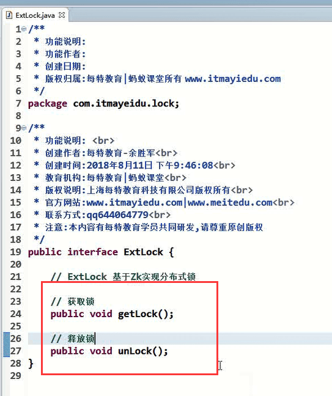
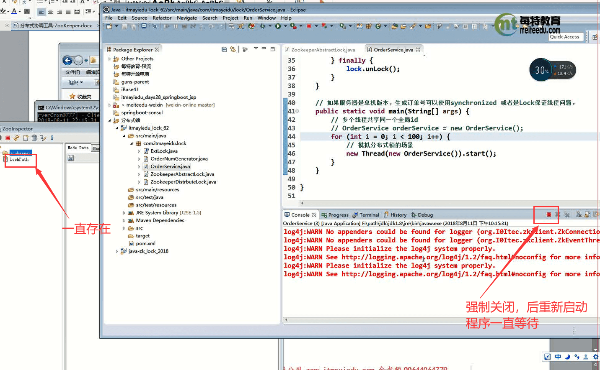

# 蚂蚁-3zookeeper实现分布式锁


#### 1.分布式锁产生的原因

​		由于服务器集群--导致的线程安全问题，可能会引发数据的错乱，引发的一系列错误。

​		那么我们就需要一个保障数据安全的问题需要在集群环境下对共享数据的操作的时候进行锁定，每个服务在操作这个共享的数据的时候，其他服务是不能进行操作的。


#### 2、分布式锁解决方案：


​		SpringCloud也可以实现，他有个内部分布式锁实现的功能


#### 3、如何使用Zookeeper实现分布式锁，思路：

​			我们使用zookeeper的临时节点---临时节点的特性是1：socket会话结束节点销毁，2：节点如果发生在客户端重复创建会自增节点的key保证唯一，我们实现分布式锁 主要用到就是他的第二个特性-保证**唯一性**。

​			我**们集群的每个服务在Zookeeper上创建相同的节点（比如 /Lock）他一定不会有重复的节点，然后我们使用监听机制 或者事件通知 判断此节点是否存在，如果存在说明其他服务已经创建在操作他，其他服务处于等待环节----如果服务A成功创建节点 相当于获取到锁--执行完程序后--关闭会话--然后临时节点会销毁--相当于释放锁，那么其他服务就可以进行创建此节点-----以此来解决分布式锁的问题。**


如果发生程序一直执行不完-导致死锁问题---这个是可以使用有效期的，假设设置10秒，如果程序10秒没有处理完成就释放锁 --close会话--相当于销毁节点。  解决死锁的问题。


#### 4.代码实现分布式锁


引入依赖：


创建Extlock接口--拥有获取锁 和释放锁2个方法




然后是实现类：


抽象实现：ZookeeperAbstractLock

```java
public abstract class ZookeeperAbstractLock implements ExtLock {
	// 集群连接地址
	protected String CONNECTION = "127.0.0.1:2181";
	// zk客户端连接
	protected ZkClient zkClient = new ZkClient(CONNECTION);
	// path路径
	protected String lockPath = "/path";
	protected CountDownLatch countDownLatch = new CountDownLatch(1);

	public void getLock() {
		if (tryLock()) {
			System.out.println("####获取锁成功######");
		} else {
			waitLock();
			getLock();
		}
	}

	// 获取锁
	abstract boolean tryLock();

	// 等待锁
	abstract void waitLock();

	public void unLock() {
		if (zkClient != null) {
			System.out.println("#######释放锁#########");
			zkClient.close();
		}
	}

}

```


然後给抽象实现在建一个子类ZookeeperDistrbuteLock--实现其抽象方法

```java
public class ZookeeperDistrbuteLock extends ZookeeperAbstractLock {

	@Override
	boolean tryLock() {
		try {
			zkClient.createEphemeral(lockPath);
			return true;
		} catch (Exception e) {
			return false;
		}

	}

	@Override
	void waitLock() {

		// 使用zk临时事件监听
		IZkDataListener iZkDataListener = new IZkDataListener() {

			public void handleDataDeleted(String path) throws Exception {
				if (countDownLatch != null) {
					countDownLatch.countDown();
				}
			}

			public void handleDataChange(String arg0, Object arg1) throws Exception {

			}
		};
		// 注册事件通知
		zkClient.subscribeDataChanges(lockPath, iZkDataListener);
		if (zkClient.exists(lockPath)) {
			countDownLatch = new CountDownLatch(1);
			try {
				countDownLatch.await();
			} catch (Exception e) {
				// TODO: handle exception
			}
		}
		// 监听完毕后，移除事件通知
		zkClient.unsubscribeDataChanges(lockPath, iZkDataListener);
	}

}

```


模拟分布式服务实现：创建OrderService.java 

```java
public class OrderService implements Runnable {
	private OrderNumGenerator orderNumGenerator = new OrderNumGenerator();
	private ExtLock extLock = new ZookeeperDistrbuteLock();

	public void run() {
		getNumber();
	}

	public void getNumber() {
		try {
			extLock.getLock();
			String number = orderNumGenerator.getNumber();
			System.out.println("线程:" + Thread.currentThread().getName() + ",生成订单id:" + number);
		} catch (Exception e) {

		} finally {
			extLock.unLock();
		}
	}

	public static void main(String[] args) {
		System.out.println("多线程生成number");
		// OrderService orderService = new OrderService();
		for (int i = 0; i < 100; i++) {
			new Thread(new OrderService()).start();
		}
	}

}
```


模拟的生成订单的orderNumGenerator.java 

```java
public class OrderNumGenerator {

	// 生成订单号规则
	private static int count = 0;

	public String getNumber() {
		try {
			Thread.sleep(200);
		} catch (Exception e) {

		}
		SimpleDateFormat simpt = new SimpleDateFormat("yyyy-MM-dd-HH-mm-ss");
		return simpt.format(new Date()) + "-" + ++count;
	}

}
```


我们将程序直接停止，结果可能发生死锁的情况




等待好久才开始继续执行--原因是强制关闭是有延时的


我们还可以设置超时时间


