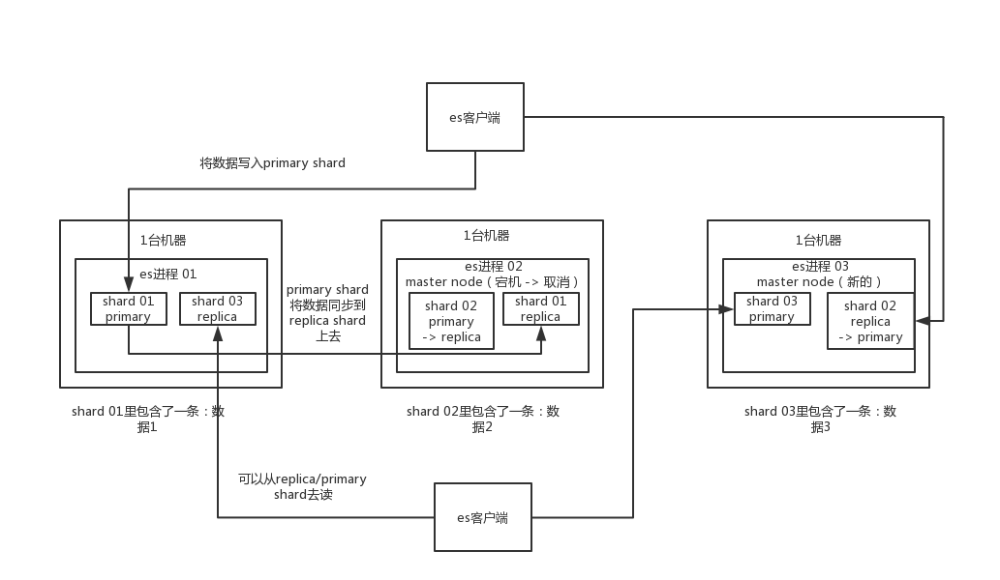

# 体验一下对应分布式搜索引擎的四个连环炮


#### 1.面试题

```
	业内目前来说事实上的一个标准，就是分布式搜索引擎一般大家都用elasticsearch，也叫es，还有solr，但是确实，这俩年大家一般都用更加易用的es。
	lucene

如果你确实真的不连lucene都不知道是什么？我觉得你确实不应该，lucene底层的原理是一个东西，叫做倒排索引。太基础了。

百度，搜索一下lucene入门，了解一下lucene是什么？倒排索引是什么？全文检索是什么？写个lucene的demo程序体验一把。
	
面试官可能会怎么问？

	1.es的分布式架构原理能说一下吗？es是如何实现分布式的？
	
	
	2.es写入数据的工作原理是什么啊？es查询数据的工作原理是什么啊？底层的lunce介绍一下呗？倒排索引了解吗？
	
	3.es在数据量很大的情况下（数十亿级别） 如何提高查询效率？
	
	
	4.es生成集群的部署架构是什么？每个索引的数据量大概有多少？每个索引大概有多少个分片？
	
	
```


#### 2.分布式搜索引擎架构是怎么设计的？为什么是分布式的

​	**2.1面试官心里分析**

```
	es底层是lucene开发的，可以认为Lucene就是一个全文检索的jar包，工具类库的这样的一个工具。
	在搜索这块，之前是Lucene是最流行的搜索库，几年前业内一般都问，你了解Lucene吗？你知道倒排索引的原理吗？现在早已经out了，因为现在很多项目都是直接基于Lucene的分布式搜索引擎--ElasticSearch，简称es。
	
	而现在分布式搜索已经成为大部分互联网行业的java系统的标配，其中尤为流行的就是es，前几年es没火的时候，大家一般用solr。但是这俩年大部分企业和项目都开始转向ES了。
	
	所以互联网面试，肯定会跟你聊聊分布式搜索引擎，也就一定会聊聊es，如果你确实不知道，那你就真的out了。
	
	如果面试官问你第一个问题，确实一般都会问你es的分布式架构设计能介绍一下吗？就看看你对分布式搜索引擎架构的一个基本理解。
	
	
	额外的友情提示

同学啊，如果你看到这里发现自己对es一无所知，没事儿，保持淡定，暂停一下课程。然后上百度搜一下es是啥？本机启动个es？然后写个es的hello world感受一下？然后搜个帖子把es常见的几个操作都执行一遍（聚合、常见搜索语法之类的）？ok了，1~2小时熟悉足够了，回来吧，继续看我们的课程。
```

​	

​	**2.2面试题剖析**

````
	ElasticSearch设计理念就是分布式搜索引擎，底层还是基于Lucene的。
	核心思想就是在多台机器上启动多个es进程的实例，组成一个es集群。
	
	
	es中存储数据的基本单位是索引，比如说你现在要在es中存储一些订单数据，你就应该在es中创建一个索引，order_idx,所有的订单数据都写到这个索引里面去，一个索引就像mysql里面的一张表。
	index-->type-->mapping-->document-->filed
	
	index:mysql里的一张表
	type：没法跟mysql里去对比，一个index里可以有多个type，每个type都是差不多的，但是有一些略微的差别。
		好比说，有一个index，是订单index，里面专门放订单数据的，就好比你在mysql中建表，有些订单是实物商品的订单（一双鞋子，一件衣服），有些订单是虚拟商品的订单，就好比说游戏点卡，话费充值。就俩种订单大部分字段是一样的，可能略微有一些差别。
		很多情况下index里可能就一个type，但是确实如果说一个index里有多个type的情况，你可以认为index是一个类别的表，每个type代表了具体的某一类的一个mysql的表。
		
		每个type都有一个mapping，如果你认为一个type是一个具体的一个表，index代表了多个type同属于一个类型，mapping就是这个type的表结构定义，你在mysql创建一个表，肯定要定义表结构的，里面有些字段，字段是什么类型。。。
	
	mapping:mapping就代表了这个type的表结构定义，定义了这个type中每个字段名称，字段是什么类型，然后还有这个字段的各种配置。
	
	document: 实际上你往index里的一个type写一条数据，叫做一条document，一条document就代表mysql表里的一行数据
	
	filed: 每个document有多个filed、每个filed就代表了这个document的一个字段的值。
	
	
	
	
	
	接着你搞一个索引，这个索引可以拆分为多个shard(分片),每个shard存储部分数据。
	
	接着就是这个shard的数据实际有多个备份，就是说每个shard都有一个primary shard（主分片），负责写入数据，但是还有多个replic shard（备份分片）。 primary shard 写入数据后，将数据同步到多个 replic shard上去。
	
	通过这个replic shard方案，每个shard的数据都有多个备份，如果某个机器宕机了，没关系啊，还有别的数据副本在别的机器上呢。高可用了吧。
	
	es集群多个节点，会自动选举一个节点为master节点，这个master节点其实就是干一些管理工作，比如维护索引元数据啦等一些，负责切换primary shard和replic shard身份啦，之类的。
	
	要是master宕机了，那么会重新选举一个节点为master。
	
	
	如果是非master宕机了，那么会由master节点，让那个宕机节点上的 primary shard 的身份转移到其他机器上的replic shard（角色切换），紧接着你要是修复了那个宕机的机器，重启之后，master节点会控制将缺失的replic shard分配过去，同步后续修改的数据之类的，让集群恢复正常。（原来的master宕机重启后为普通节点，不是master节点了）
	
	其实上述就是ElasticSearch作为一个分布式搜索引擎最基本的一个架构设计。
	
	
	
	
````


**ElasticSearch分布式架构原理**




