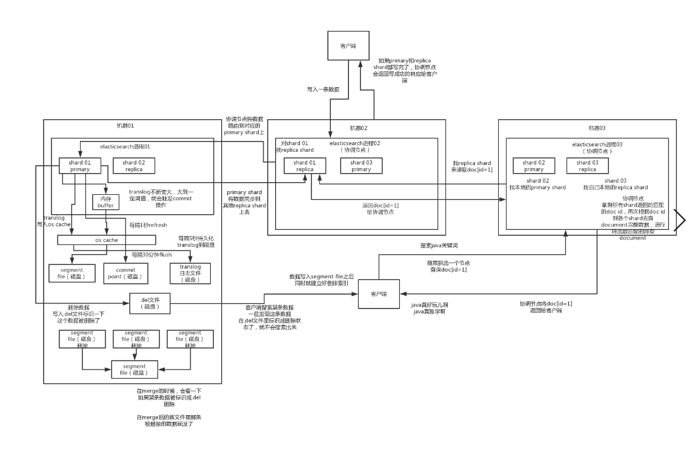

# 分布式搜索引擎写入和查询的工作流程是什么样的？


#### 1.面试题

​	**2.es写入数据的工作原理是什么啊？es查询数据的工作原理是什么啊？底层的lunce介绍一下呗？倒排索引了解吗？**


#### 2.面试官心里分析

```
	问这个其实面试官就是想看看你了解不了解es的一些基本原理，因为用es无非就是写入数据，搜索数据，你要是你发起一个写入和搜索请求的时候，es在干什么，那你真的就是out了。
	
	
	对es基本就是个黑盒，你还能干啥？你唯一能干的就是用es的api读写数据了，要是出点什么问题，你啥都不知道，那还能指望你干什么呢？是不是
	
	 
```


#### 3.面试题剖析

```
	1.ES写数据的过程
		1.1：客户端选择一个node发送请求过去，这个node就是coordinating node协调节点
		1.2：coordinating node，对doucument进行路由，将请求转发给对应的node（primary shard）
		1.3：对应的node上的 primary shard 处理请求，然后将数据同步到replic shard上面去。
		1.4：coordinating node，如果发现primary node和replic node都搞定之后，会返回响应给客户端。
		
	
	2.es读数据过程：
		查询，GET某一条数据，写入了某个document，这个document会自动给你分配一个全局唯一的id，doc id，同时也是根据doc id进行hash路由到对应的primary shard上面去。也可以手动指定doc id，比如用订单id，用户id。

        你可以通过doc id来查询，会根据doc id进行hash，判断出来当时把doc id分配到了哪个shard上面去，从那个shard去查询

        1）客户端发送请求到任意一个node，成为coordinate node
        2）coordinate node对document进行路由，将请求转发到对应的node，此时会使用round-robin随机轮询算法，在primary shard以及其所有replica中随机选择一个，让读请求负载均衡
        3）接收请求的node返回document给coordinate node
        4）coordinate node返回document给客户端

	3.es搜索数据过程

        es最强大的是做全文检索，就是比如你有三条数据

        java真好玩儿啊
        java好难学啊
        j2ee特别牛

        你根据java关键词来搜索，将包含java的document给搜索出来

        es就会给你返回：java真好玩儿啊，java好难学啊

        1）客户端发送请求到一个coordinate node
        2）协调节点将搜索请求转发到所有的shard对应的primary shard或replica shard也可以
        3）query phase：每个shard将自己的搜索结果（其实就是一些doc id），返回给协调节点，由协调节点进行数据的合并、排序、分页等操作，产出最终结果
        4）fetch phase：接着由协调节点，根据doc id去各个节点上拉取实际的document数据，最终返回给客户端
	
	4.搜索的底层原理，倒排索引，画图说明传统数据库和倒排索引的区别
	
	
	
	
	5.写数据的底层原理（其实就是shard里的写入过程）
		5.1：先写入buffer，在buffer里的时候数据是搜索不到的，
		5.2：如果buffer快满了，或者到一定时间后，buffer将数据写入到 os cache（操作系统缓存），然后从os cache 写入 segment file磁盘文件中，这个过程就是refresh，强制刷新。
		
			每隔1s，es将buffer中的数据写入一个新的segment file中，每秒钟会产生一个新的磁盘文件，这个segment file就存储最近1s内的buffer 中写入的数据。
			但是如果buffer中没有数据，那当然不会执行refresh操作咯，因为每次refresh一次都生成一个segment file，如果是空的是没有意义的。如果buffer里有数据，那么默认是1s执行一次refresh，将数据刷入segment file中
			只要buffer中的数据被refresh操作，刷入os cache 中，就代表这个数据可以被搜索到了。
			为什么叫es是准实时的？NRT，near real-time，准实时，默认是每隔1s refresh一次，所以es是准实时的，因为写入数据1s之后就可以被查询到了。
			
			可以通过es的restful api或者java api，手动执行一次refresh操作，就是手动将数据刷入 os cache然后生成segment file磁盘文件，让数据立马就被搜索到（比如做完全实时）
			
			只要数据被刷入到os cache中，buffer就被清空了，因为不需要保留buffer了，数据在translog里面已经持久化到磁盘里面去一份了。
			
		5.3：只要数据进入os cache，此时就可以让这个segment file的数据对外提供搜索了。
		5.4：重复1-3步骤，新的数据不断进入buffer然后进入translog，然后不断将buffer数据写入一个又一个新的segment file中去，每次refresh完buffer被清空，translog保留记录，随着这个过程推进，translog会变的越来越大，当translog达到一定长度时，就会触发commit操作。
			
			buffer中的数据，倒是好，每隔1s就被刷到os cache中去了，然后这个buffer被清空，所以这个buffer的数据始终是可以保持不会填满es进程的内存的。
		5.5：commit操作发生第一步，就是将buffer中现有数据refresh到os cache中，清空buffer
		5.6：将一个 commit point写入磁盘文件，里面标识着这个commit point对应的所有segment file。
		5.7：强行将 os cache中的数据都 fsync 到磁盘文件中。
		
			tranlog日志文件有什么作用？就是你在执行commit之前，数据要么停留在buffer中，要么停留在os cache中，无论是buffer还是os cache都是内存，一旦这台机器宕机了，内存中的数据就丢失了。
			所以需要将数据对应的操作写入一个专门的日志文件，translog文件中，一旦此时机器宕机，再次重启的时候，es会自动读取translog日志文件中的数据，恢复到buffer和os cache中去。
			commit操作：1、写commit point；2、将os cache数据fsync强刷到磁盘上去；3、清空translog日志文件
		
		5.8：将现有的translog清空，然后再次重启启用一个translog，此时commit操作完成。默认每隔30分钟会自动执行一次commit，但是如果translog过大，也会触发commit。整个commit的过程，叫做flush操作。我们可以手动执行flush操作，就是将所有os cache数据刷到磁盘文件中去。
			
			不叫做commit操作，flush操作。es中的flush操作，就对应着commit的全过程。我们也可以通过es api，手动执行flush操作，手动将os cache中的数据fsync强刷到磁盘上去，记录一个commit point，清空translog日志文件。
			
		5.9：translog其实也是先写入os cache的，默认每隔5秒刷一次到磁盘中去，所以默认情况下，可能有5秒的数据会仅仅停留在buffer或者translog文件的os cache中，如果此时机器挂了，会丢失5秒钟的数据。但是这样性能比较好，最多丢5秒的数据。也可以将translog设置成每次写操作必须是直接fsync到磁盘，但是性能会差很多。
		
			实际上你在这里，如果面试官没有问你es丢数据的问题，你可以在这里给面试官炫一把，你说，其实es第一是准实时的，数据写入1秒后可以搜索到；可能会丢失数据的，你的数据有5秒的数据，停留在buffer、translog os cache、segment file os cache中，有5秒的数据不在磁盘上，此时如果宕机，会导致5秒的数据丢失。
			
			如果你希望一定不能丢失数据的话，你可以设置个参数，官方文档，百度一下。每次写入一条数据，都是写入buffer，同时写入磁盘上的translog，但是这会导致写性能、写入吞吐量会下降一个数量级。本来一秒钟可以写2000条，现在你一秒钟只能写200条，都有可能。
			
		5.10：如果是删除操作，commit的时候会生成一个.del文件，里面将某个doc标识为deleted状态，那么搜索的时候根据.del文件就知道这个doc被删除了。
		
		5.11：如果是更新操作，就是将原来的doc标识为deleted状态，然后新写入一条数据
		
		5.12：buffer每次refresh一次，就会产生一个segment file，所以默认情况下是1秒钟一个segment file，segment file会越来越多，此时会定期执行merge。
		
		5.13：每次merge的时候，会将多个segment file合并成一个，同时这里会将标识为deleted的doc给物理删除掉，然后将新的segment file写入磁盘，这里会写一个commit point，标识所有新的segment file，然后打开segment file供搜索使用，同时删除旧的segment file。
		
		es里的写流程，有4个底层的核心概念，refresh、flush、translog、merge
		
		当segment file多到一定程度的时候，es就会自动触发merge操作，将多个segment file给merge成一个segment file。
		
		
		
```


**ES读写底层原理**




