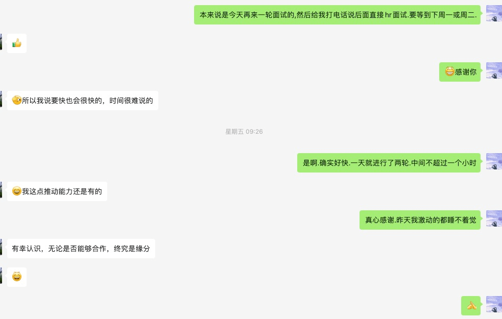
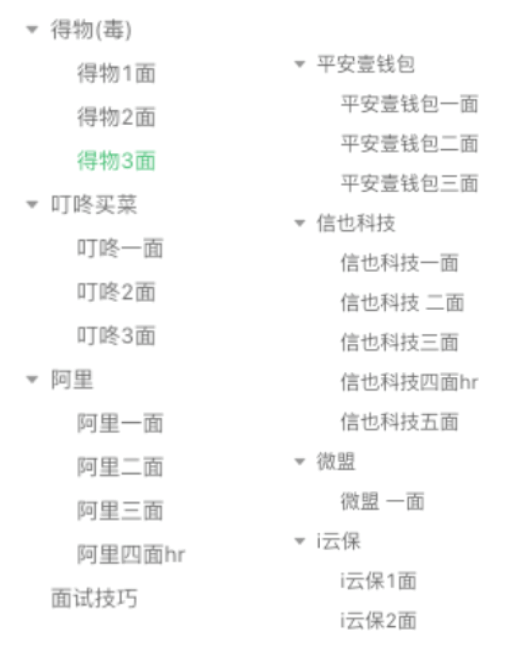
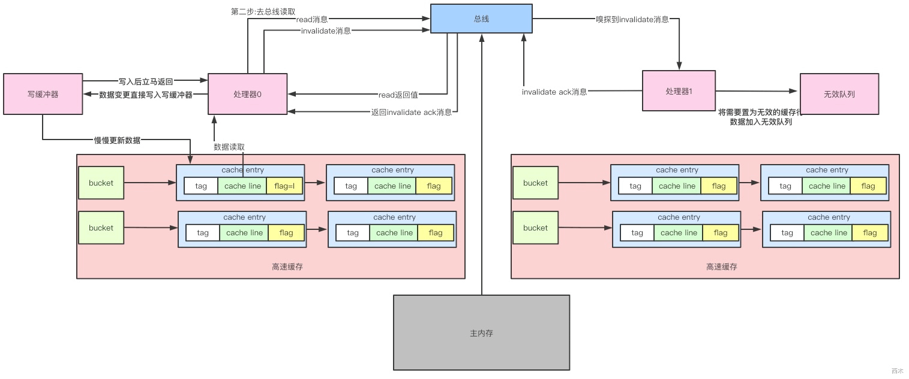
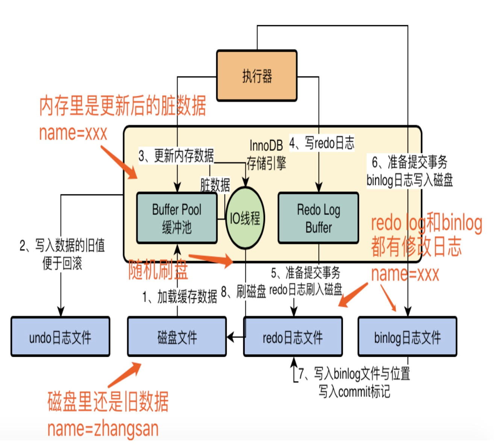

1、 自我介绍

大家好，我是东林，喜欢看电影。18年毕业的。家里不富裕，所以忧患意识比较强。知道it这个行业比较赚钱后，就想着多学习专业知识赚钱，一进大学也就进了实验室。在实验室里学了一些android，ps，java。主攻android，因为那时android还是很吃香的，听学长说哪怕会简单开发一个页面，基本上就是人均一万五。这对于我这种喜欢钱的人来说非常诱人，虽然我中间也贪玩，但还是学了两年，期间不断的做项目。

直到大三上学期的一天，学长告诉我安卓不行了，学这个出去很可能找不到工作。又推荐我们学java，说这个比较吃香。因为当时已经大三了。马上还有一年就毕业了。所以还是比较着急的。正好赶上传智招生。免费学习一个月java se基础。当时我立即报名学习，期间还找那里的老师要了传智经典的淘淘商城来学习。就这样大三下学期把se基础打牢后，又学习了电商项目，包装了一下项目经验。

于是大三暑假结束就去找工作，清楚的记得用了8天时间找到了第一份工作，当时公司离住的地方要坐两个半小时地铁。 不过薪资9000，对于一个大三的学生来说，可以说是天文数字了。  于是大四就让同学上课的时候代替我签到。工作了一年回去写毕业论文，拿着公司已有的项目去答辩，简直轻松的不行。同学老师都惊呆了。最终毕业论文过了比较顺利。

后来在网上也有报名学习一些课程，每天晚上学习，学了一年。在19年的3月份离职。凭着这期间的知识积累(虽然学的知识很浅)，找到工作，月薪18000，成功翻倍。（当然现在跳槽后，我的工资涨又到了24k。） 可能面试我的人太水，也可能是我运气好，毕竟报名的那些课程内容比较浅显。但说句良心话，那些讲课的老师的激情让我每次听课都兴奋不已，至少从来不会听课睡觉，也算是一分耕耘一分收获。 总之我是感谢的，因为工资翻了一倍不止。

说到技术深度就不得不提下石杉老师了。我从室友那里听到了狸猫技术窝，也就是现在的儒猿技术窝。学了jvm，rocketmq，mysql图文三剑客，感到我的认知被刷新了。以前买的innodb引擎书籍看了几页就放弃治疗了，但是看了专栏之后，简直兴奋的不行，感慨原来我也可以学懂这么深奥的东西，也惊叹于作者一步一图把这些原理讲的清清楚楚的深厚功力。

后来我想突破以前的结界，学习更深的东西。于是我就开始留意市面上一些培训机构。比如咕泡学院，马士兵之类的。后来经过室友推荐，知道了石杉老师在做架构课，由于有儒猿之前的专栏做口碑基础，在经过了一番了解后，果断在2020年11月报名。毕竟此时也是不怎么缺钱的，报名后一直学到今年4月份，每天跟室友一起打卡学习，效果显著。

公司当时的情况不太妙，简直就是“山雨欲来风满楼”。如果不早日为离职做准备，事情只会越来越多，压力可以说非常大了。为了学习准备面试，我从去年时候的158斤瘦到现在的145斤不到 。

因此4月份我就开始回顾自己记在语雀的笔记。每天早起对着墙练习，边讲边画图理解。然后开始准备简历，这期间各种找儒猿群里的大神帮忙修改简历，最终浪哥给我提了几点建议。(这里非常感谢破浪哥，可能简单几句话，但是肯跟我讲，对我就是莫大的帮助)。

初步改完简历后，我找老师进行面试指导。老师对着我的简历给我提供了一些修改建议。最后我就开始找猎头推荐公司，投递简历。期间也是抱着试试看的态度去面试。

结果面试了平安壹钱包和信也科技拍拍贷。最后都过了。  按照我下面的面试技巧来。基本没啥大问题。  发了offer那一刻我真的是一下子放松了。下面这个是我的offer截图

然后就开始面试其他公司，比如得物，叮咚买菜，阿里。这些公司。因为毕竟有保底了。所以后来就是轻装上阵了。因为有前面的经验加持，再去应付这些面试问题都不大。叮咚阿里的都面过了。这里要着重提一下。大厂的人的素质是真的高。我面阿里时候遇到不会的面试题，面试官一点都没说不耐烦，全程指导给我思路。

如果我当时有一丝丝不耐烦，放弃了没有继续写，估计就面不过了。这里也希望大家以后面对难的问题不要着急。可能最后人家只是看你能不能坚持。面试官都没有嫌烦。你又为什么要放弃呢。

这里也说一点。以前一直觉得阿里面试要好久好久。可能要经历6到7轮面试。但是我跟阿里的人说能不能快一点。因为当月31号我有一个offer要求入职，但我特别想进阿里，所以希望流程走快点。他说可以。然后奇迹的是两天就进行了4面。

第二天晚上面试完毕，阿里联系人跟我说本来要再安排一场技术面，但是考虑到我技术没有什么大问题，再面试也没什么意义，所以进行hr面后就过了。回想起来依然觉得神奇。别人眼里遥不可及的阿里，竟然为了我破格将流程压缩到了两天。 现在想想觉得一面面试官帮了我的大忙。感恩!

2、 我面试了哪些公司

下面图片都是我面试的公司。有几个因为前面已经拿到了offer，所以就直接拒了没继续面试了。

3、 我做了哪些准备

专栏课：面试突击123+JVM专栏课+MYSQL专栏课+ROCKETMQ专栏课，上述专栏学透了开始背笔记。 应付面试基本没有任何问题

亿级流量课：里面的redis讲解让我在被问到redis集群运维以及选型相关问题的时候基本上没有任何问题

jdk源码分析
然后就是架构课的jdk源码分析，看完之后真是佩服的不要不要的。真不是一般人能讲的了的。我现在回看我那些笔记，简直就是对jdk内容的透彻掌握了，面试无敌。

只要问到基本没有打不出来的，下面是老师245讲并发课程大纲部分截图：

计算机网络，netty
这个学了之后网络层面基本没有任何问题了。

分布式锁，分布式事务，分布式全局id
这三大模块的视频一定要学，将会成为你简历中的一个亮点。因为公司实际却是有相关场景，所以面试的时候基本写了必问。

大型电商系统v1。0项目实战--专看设计模式
设计模式有实际结合自己业务用到了比如策略，模板，构造器，工厂，命令等等，面试被问到也基本没有问题。

4、 面试内容

我这里提供几家公司的面试问题
因为好几家公司的面试题。有很多。我不一一列举。这里只写几个比较常见的。

1、递归如何保证不进行太多的压栈操作?    什么是尾递归?  递归函数栈帧越来越多，如何进行递归优化?   编译器底层是怎么对递归优化的?   什么写法可以让递归的栈溢出基本上不可能。? 
https://www.yuque.com/docs/share/9d2c0254-339f-4ec7-9d41-0a525db41ab6?# 《尾递归介绍》

2、netty怎么拆包?   假设让你在应用层去设计。如何设计一个协议包。?   如何在拆包的过程中去解析你的那个协议包? 没有回答很好!
https://www.yuque.com/docs/share/647a6046-8d08-45ff-8601-ee3265a1f6bd?# 《如何设计一个通讯协议》

3、A，B，C，D四个请求链条，如何记录这四个服务的一个链式调用的日志? 我回答了dubbo的invocation设置参数。以及拦截器 。但是他又问如何在不同jvm中取出这个日志。 ? 最后我又回答了拦截器拦截请求。然后存储这个到本地cache 
又问你为什么不用threadLocl去处理呢? 讲下底层原理。以及注意事项
https://www.yuque.com/docs/share/b0fa01d7-c986-44f9-90d4-404850f9fc51?# 《ThreadLocal基础及项目中使用实战》

4、讲下transactional注解原理吧? 底层是操作的什么跟数据库进行互通的? 
讲了下事物的原理。以及jdbc接口和hibernet框架实现
https://www.yuque.com/docs/share/f89eb26d-dd15-436b-8253-a01d143913fc?# 《spring事物的基本原理》
https://www.yuque.com/docs/share/6b75af4a-5f33-4717-9d72-6fe9098a4e5c?# 《基于hibernate和jdbc完成事务的开启》

5、redis获取的数据后面还要跑定时任务来进行计算? 那么定时任务用的什么东西做的? schedule这个注解用做定时任务多机情况怎么解决并发问题? 为什么要用redisson? 普通的redis锁不能满足你的场景吗? 

这里可以看老师架构课中的分布式锁，基本将redisson的原理讲一下就没有什么大问题了。过程中可以讲一下zk锁。毕竟老师也讲了curator。   给面试官讲出来会觉得你了解的比较多
https://www.yuque.com/docs/share/91e9b9ad-2a40-4648-9256-92bd0abd5aa9?# 《redisson可重入锁（reentrant lock）》
https://www.yuque.com/docs/share/faed6566-ff8f-4bab-a172-3bf38dae260c?# 《zk可重入锁源码解析》

6、讲下synchronized底层原理讲一下。为什么concurrentHashmap1.8用synchronized 而1.7用reentrantLock呢? synchronzied锁优化有哪些?具体是jdk哪个版本做了什么优化。。。jdk1.8的synchronized对jdk1.7来说具体有哪些优化?

上面的问题问的很好。因为基本上你要讲明白，你得首先讲一下synchronized，然后讲下他的优化。还要讲一下concurrentHashmap。。以及1.7版本中的reentrantLock   所以要都跟他们讲清楚才能算完整理解了。下面是做的笔记。
https://www.yuque.com/docs/share/4aca7f04-2048-49a9-bcbd-db80803040b7?# 《synchronized详细介绍》

https://www.yuque.com/docs/share/b90afd4e-7c8b-4fbf-8b0c-2782319c66ff?# 《ConcurrentHashMap源码解析》

https://www.yuque.com/docs/share/426cbaff-e1d5-4de5-9116-37c790a0961e?# 《AQS是什么?基于ReentrantLock解密!》

7、讲一下volatile关键字

这个讲起来会讲的很深。你可以从mesi讲起。

先讲为什么引入高速缓存?   因为效率问题

再讲为什么引入MESI协议，  因为缓存一致性

再讲为什么引入写缓冲器和无效队列 ，因为串行化问题

再讲为什么引入内存屏障，  因为可见性和有序性问题，从而引出volatile关键字

上面几个讲完，基本就证明你对volatile很理解了。
https://www.yuque.com/docs/share/4b83a6b7-8d0b-42e2-9224-c3a5bc8aa2d6?# 《MESI缓存一致性协议》

8、类加载的机制是怎么样的一个流程? jvm内存分区有哪几块儿?

https://www.yuque.com/docs/share/4360e1c9-cc14-4c90-9c38-ee99effb55bf?# 《两道面试题，带你解析Java类加载机制》

https://www.yuque.com/docs/share/a6dd5897-d341-4beb-b838-0ffd3f0c03f0?# 《jvm整体运行的流程图详解（超详细）》

9、你能说一下你是怎么对你用到的中间件的一些选型吗? 讲了下rocketmq和kafka和rabbit的特性

这里rocketmq专栏就已经讲得很清楚了。直接按照专栏来就OK，然后再结合一下业务。
https://www.yuque.com/docs/share/ee69733a-13a4-4384-b38b-d77c1eb0ed8f?# 《消息队列技术选型Kafa，RabbitMQ与RocketMQ》

10、mysql优化的时候一般会考虑怎么优化呢?数据库主从是怎么同步的有了解吗?mysql什么情况下会丢数据?比如客户端已经拿到commit的响应了，什么情况下会发生这个丢数据的问题? 怎么避免这个情况呢?

将mysql专栏索引记得笔记讲出来基本没啥大问题。  
https://www.yuque.com/docs/share/246649c8-f06d-4bed-aa4b-a41be122df73?# 《mysql索引》
https://www.yuque.com/docs/share/bb3bfe58-0c7b-4f60-a3e1-4c45fad08e9a?# 《执行一条sql语句经历了哪些过程》

5、 面试技巧

1、尽量线上面试， 这样才能有机会边电话，边翻笔记。哪怕翻到一个关键字，也能作为一个提示，去讲更多话。 
a：如果有些公司不能线上，也可以跟猎头提要求，能不能一面二面先线上，等三面四面再去一下现场。 
b：面试前可以问清楚这个公司考不考算法，如果不考采取投递简历。 如果自己准备了就不用这一步

2、话一定要多，提出一个问题之后尽量多讲一下话，讲的越细越好。这样才能拖时间。 因为一场面试最多45分钟到一个小时。讲的越多，对方提问的时间越少。 期间可以说明白，如果嫌自己说的太多可以随时打断。

3、讲的时候多结合业务来讲技术，解决的问题一定要阐述清楚，为什么要用到这个技术?什么场景用到的。解决的问题给公司带来了什么好处要讲清楚。

a：在公司最大的挑战以及为公司做的贡献一定要准备好说什么。 对业务的理解一定要准备好 对将来的发展方向一定要准备好，走技术还是管理，做业务开发还是基础架构。

说清楚简历一定要写自己完全掌握的东西， 有些公司比如阿里，基本每个面试官都会问你上面的问题。尤其看中你入职之后为公司做了哪些贡献。如果你每天只是crud的话。基本你就没什么希望了。

你要根据业务需求，采用了什么技术方案，为公司解决了什么问题，节省了多少人力成本或者外包成本。都讲清楚。人家自然对你刮目相看。

b：比如spring源码没看过就不要写。 dubbo没看过源码也不要写。 但是问到了能说出一些简单的大范围的话。 这个建议看老师的面试突击。基本应对一些大方向的问题。不成问题。

4、面试前的介绍一定要仔细锻炼

a：首先介绍自己的工作经历，几家公司，年限多长。离职原因(背调时如果不实会出问题，所以说实话就行)

b：然后介绍自己负责的业务模块有哪些。 过程中讲出的一些技术实现方式涉及的技术点一定要完全掌握才去说。

c：最后非常关键的点就是一定一定要讲清楚 " 自己擅长的技能" 也就是简历中专业技能一栏中写的一些技术点。 从头到尾背下来。

这样面试官因为是最后听到的，所以会针对这个擅长的技能来问你。这样基本全程就是按照自己准备好的技术来应对提问了。时间最多一个小时。我相信你对一个技术掌握了之后是完全可以扯很久的。

6、总结
看了那么多面经，最后你会发现，架构课里的东西没学到，简历上根本就不敢写。所以追究到底还是自己得踏踏实实的坚持学。

还有一个，你学的时候，可能有很多人不理解，甚至看不起你，不愿意搭理你。没有关系，你自己强大起来了，还怕别人不正眼看你吗。

如果你不把脑袋削尖了往前钻，谁来主动跟你打招呼。动力不足的时候，想想你的薪水能满足你的花销吗? 能养得起家庭吗?主动学起来，把压力转化为动力。学习之路，没有捷径。有的只是自己顶住压力，忍住寂寞， 拼命学习。

最后送各位儒猿群的小伙伴一句话以作共勉：“东方欲晓，莫道君行早，踏遍青山人未老，风景这边独好”。

最后的最后，感谢儒猿技术窝提供这么好的平台，认识这么多志同道合的朋友，感谢架构课让我成功跳槽大厂，祝愿大家都早日找到自己心仪的工作，一起加油学起来！

