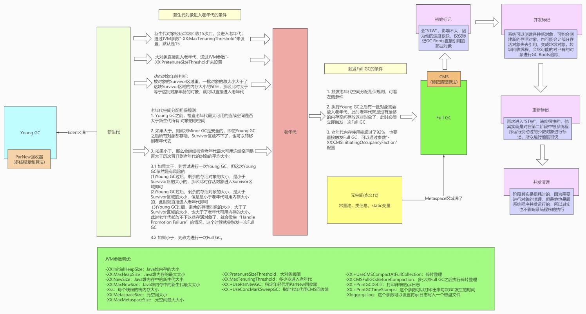
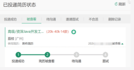
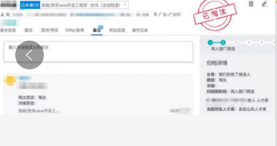

# 30岁大专经历

#### 1.自我介绍

我今年30，喜欢和家人待在一起，喜欢的食物是可乐和火锅。我还喜欢摄影，打篮球。在摄影里记录美丽的风景，缅怀流金岁月，在打篮球的过程中释放自我，都是让我特别愉悦的事。过去的30年的岁月里，我计算机系大专毕业，自考了本科。刚毕业时，我做过一份月薪3k，运维相关的工作。由于自己当时负责部署java相关的项目，我对java产生了一些兴趣，开始在业余时间看视频自学。学到一定基础后，我向上司提出了负责一些编码工作的要求，上司看我勤奋好学，给予了我参与一些项目开发的机会。于是我开始了自己的java开发生涯。最开始，我做了一些基于struct，spring，springmvc的后台管理项目，积累了一定经验后，我跳到了一家做跨境电商物流的公司。

后来的时间，每隔一两年，我都会跳槽一次，但都不是很顺利。就这样，不知不觉我已经在这个行业里耕耘了6年。2020年12月初，一个风和日丽的日子，公司突然倒闭了，没有任何赔偿。我咨询过律师，他们说就算赢了你也拿不到赔偿，因为公司没钱了。没钱了？我想起了公司服务器被攻击的那一天，我不分昼夜的奋力抢救公司的数据，连续41小时的时间里，只睡了2小时。第三天的清晨，疲惫的我走出公司，那时我想，终于可以好好休息了。

地球不会因为任何人停止运转。我必须振作起来重新找工作。幸运的是，我这段时间一直有学架构课，基础还算不错。于是我开始准备面试了，花了一个月复习儒猿的专栏课，加上有架构班定制化的简历，面试指导，内推资源的加成，在老师的帮助下，我拿到满意的offer，甚至还通过了一些大厂的面试。面试通过后，我意气风发，在篮球场上畅酣淋漓的打了一场。

#### 2.我面试了哪些公司
DataStory  (2轮技术+1轮Hr，通过)
乐摇摇    (2轮技术+1轮Hr，通过)
4399      (2轮技术+1轮Hr，通过)
Bigo       (3轮技术，通过)
唯品会    (3轮技术+1轮Hr，通过)
虎牙      (3轮技术+1轮Hr，待定)
荔枝      (3轮技术+1轮Hr，通过)

#### 3.我的面试准备工作
面试前，我主动找老师聊一下自己目前的情况，把最近的一些项目经历和工作经验都跟老师大概反馈一下，老师根据我的情况提供一个完整的复习计划，我按照老师的复习计划按部就班的执行。

因为我的目标是大厂，而不是一些小公司。面试不能急，要提前准备，包括知识复习和简历准备，这些都需要时间。好在机会是留给有准备的人的。

先说说我的当时的一些情况和学习方法：

那时我入架构班有一段时间了，每天会抽出2个多小时来学习，早上6点多起床学，晚上也会用零碎的时间学，11点前入睡。以前我基本在晚上学习，但效率不高，看视频听课的时候，容易打瞌睡，很多视频也白看。后来调整作息早睡，早上学习。效率高了很多。

平时上班不忙的时候，我会打开儒猿技术窝公众号，看一些图文专栏，整理整理架构课里面的笔记，或者练习架构课里面的项目代码。

这次面试，我大概准备了1个月的时间，因为我一直有在学架构课和专栏课，所以一点也不慌，这1个月的时间，只是做下知识复习和回顾。

我原本是打算在年后跳槽的，所以在11月中旬的时候已经在准备复习了，但没想到在12月初，公司突然倒闭，这也让我下定决心去努力一把。

#### 我的学习方法：

1. 6点多早起学习。主要还是受到群里面的闲人和治慧大佬的早起学习习惯的影响，他们作息规律，然后我开始从早睡到早起慢慢过渡过来，这样学习效果还是很不错的。
2. 学习内容都是来源于：架构课+石杉的架构笔记+儒猿公众号专栏
3. 学习的过程不一味地追进度。学完自己要消化，融入成自己的知识体系才算真正的学到。为了做到这点，可以做笔记总结，画流程图总结，不懂的就多看几次，就会懂。
4. 碎片时间也很宝贵，可以利用起来学习，如周末外出、空闲的时间可以带上平板看视频，工作任务完成了，也可以摸摸鱼，整理笔记和练习代码。以前没买平板前，我也是把自己的电脑背出去，有时间就打开电脑来看视频学习。
5. 同事遇到的问题或者技术交流群提出的一些问题，自己可以多参与讨论，多思考。参与讨论的过程，可以学到更多知识，印象也会加深。

#### 主要复习的内容：专栏课内容+架构课内容+公司的项目

专栏课：面试突击123+JVM专栏课+MYSQL专栏课+ROCKETMQ专栏课

复习面试突击1 (免费白嫖)内容，包括下面的重点:

#### MQ部分必看：
1.体验一下面试官对于消息队列的7个连环炮

2. MQ的作用
3. MQ保证消息队列的高可用
4. MQ保证消息不被重复消费
5. MQ如何保证消息的顺序性
6. MQ如何处理消息丢失的问题
7. MQ消息持续积压几小时怎么处理

#### Redis部分必看:

1. Redis线程模型
2. Redis数据类型以及用的场景
3. Redis过期策略
4. Redis持久化RDB/AOF
5. Redis集群模式架构思想/gossip通信协议/hash slot算法/部署经验
6. Redis高可用架构
7. 高并发场景下的缓存一致性问题

#### 分库分表必看：

1. 体验一下面试官对于分库分表这个事儿的一个连环炮
2. 垂直拆分/水平拆分
3. 动态扩容/不停机迁移
4. 分库分表后的全局ID方案

熔断技术必看：
1. 资源隔离/熔断/降级的作用
2. 线程池/信号量两种隔离级别技术理解
3. 熔断技术的执行步骤和流程

复习面试突击2内容，包括下面的重点:

Springcloud部分必看：
1. Springcloud底层架构原理
2. Springcloud与Dubbo的对比
3. Springcloud的组件

注册中心部分必看：
1. Eureka注册中心基础原理
2. Zookeeper注册中心基础原理
3. Euerka注册中心参数调优

分布式事务部分必看：
1. 怎么设计分布式事务技术方案
2. TCC事务、最终一致性事务的技术选型
3. RocketMQ对分布式事务支持的底层实现原理

复习面试突击3内容，包括下面的重点:

#### 并发编程部分必看：

1. HashMap底层结构/JDK1.8 HashMap的优化/hash算法/寻址算法
2. HashMap如何解决hash碰撞/如何扩容
3. Volatile/synchronized底层原理(原子性、可见性、顺序性)
4. CAS底层原理/CAS会引发的问题
5. AQS底层原理/AQS核心的执行流程
6. 线程池的底层工作原理
7. 线程池的核心配置参数
8. 8.ConcurrentHashMap底层原理

#### 网络部分必看：

1. TCP/IP四层网络模型
2. 浏览器请求的全过程是怎么样的
3. HTTPS的工作原理

#### Zookeeper部分必看：

1. ZooKeeper可以做什么？
2. ZooKeeper集群的三种角色：Leader、Follower、Observer
3. ZooKeeper最核心的一个机制：Watcher监听回调
4. ZAB的核心思想介绍：主从同步机制和崩溃恢复机制
5. ZooKeeper到底是强一致性还是最终一致性

#### JVM专栏课内容，包括下面的重点:

1. 类加载机制/类加载过程
2. 双亲委派机制/以及他的作用
3. JVM内存区域(堆、栈等其他)
4. 堆内存划分
5. 新生代、老年代垃圾回收机制以及原理
6. 常用的垃圾回收器(ParNew、CMS、G1)
7. 触发垃圾回收的时机和条件
8. JVM调优参数模板
9. JVM分析命令(jstat、jmap、jstack等)
10. JVM分析工具(MAT等)

JVM总结的图：JVM专栏课内容，包括下面的重点:

1. 类加载机制/类加载过程
2. 双亲委派机制/以及他的作用
3. JVM内存区域(堆、栈等其他)
4. 堆内存划分
5. 新生代、老年代垃圾回收机制以及原理
6. 常用的垃圾回收器(ParNew、CMS、G1)
7. 触发垃圾回收的时机和条件
8. JVM调优参数模板
9. JVM分析命令(jstat、jmap、jstack等)
10. JVM分析工具(MAT等)

JVM总结的图：

架构课内容：

大型电商系统v1.0项目实战里面的设计模式部分必看：
复习几个比较重要的设计模式：
策略模式/迭代器模式/工厂模式/代理模式/构造器模式/适配器模式

基于微服务架构的大型分布式电商系统部分必看：
主要复习微服务Spring Cloud那块：

1. Eureka服务注册与发现的原理/心跳检测/注册表抓取/自我保护机制
2. Eureka注册表多级缓存机制/参数调优
3. Ribbon负载均衡工作原理/负载均衡算法IRule
4. Hystrix资源隔离、限流、熔断、降级
5. Hystrix的线程池隔离技术/信号量隔离技术
6. Hystrix执行时的8大流程步骤以及内部原理

分布式事务实践模块部分必看：
1. 事务的基础知识：ACID以及几种隔离级别
2. 事务的基础知识：Spring的事务支持以及传播特性
3. XA规范以及2PC分布式事务理论介绍
4. 2PC分布式事务方案的缺陷以及问题/3PC分布式事务方案的理论知识讲解
5. 理解CAP与BASE的基础知识
6. 理解TCC分布式事务技术方案以及原理/TCC分布式事务执行流程
7. 可靠消息最终一致性方案/整体架构以及核心流程设计

分布式系统架构实战部分必看：
1. 保证分布式系统的接口幂等性的几种常见方案
2. Redisson分布式锁原理
3. Redisson可重入锁/lua脚本加锁逻辑/watchdog维持加锁/锁的互斥阻塞/释放锁
4. Redisson公平锁原理
5. MultiLock原理/RedLock源码算法实现
6. Zookeeper Curator框架介绍以及分布式锁支持
7. Zookeeper分布式锁可重入锁源码剖析
8. Zookeeper分布式锁可重入读写锁源码剖析

#### JDK源码剖析系列部分必看：
集合部分：

1. ArrayList基本原理以及优缺点
2. ArrayList数组扩容以及元素拷贝
3. LinkedList基本原理以及优缺点
4. LinkedList双向链表数据结构
5. HashMap数组、链表、红黑树的数据结构
6. HashMap优化后的降低冲突概率的hash算法
7. HashMap put操作原理以及hash寻址算法
8. HashMap JDK 1.8引入红黑树优化hash冲突
9. HashMap JDK 1.8的高性能rehash算法
10. LinkedHashMap底层原理/有顺序的map数据结构
11. TreeMap/HashSet/LinkedHashSet/TreeSet底层结构以及原理
12. Iterator迭代器应对多线程并发修改的fail fast机制

并发编程部分：
1. CPU多级缓存模型
2. 总线加锁机制和MESI缓存一致性协议
3. Java内存模型
4. volatile是如何保证可见性/顺序性
5. volatile的底层实现原理：lock指令以及内存屏障
6. synchronized底层原理（jvm指令以及monitor锁）
7. 可见性涉及的底层硬件概念：寄存器、高速缓存、写缓冲器
8. 深入探秘有序性：Java程序运行过程中发生指令重排的几个地方
9. synchronized锁同时对原子性、可见性以及有序性的保证
10. 采用写缓冲器和无效队列优化MESI协议的实现性能
11. AtomicInteger中的CAS无锁化原理
12. AtomicInteger源码剖析：仅限JDK内部使用的Unsafe类
13. AtomicInteger源码剖析：底层CPU指令是如何实现CAS语义的
14. Atomic原子类体系的CAS语义存在的三大缺点分析/CAS的引发问题的解决方案
15. AQS的原理(异步队列同步器)/以及AQS重要的参数
16. AQS默认的非公平加锁策略的运作原理
17. AQS队列唤醒阻塞线程的过程

18. ReentractLock如何设置公平锁策略
19. ThreadLocal源码剖析：线程本地副本的实现原理
20. JDK 1.7 HashMap并发环境下死循环之环形链表
21. JDK 1.7 HashMap并发环境下死循环之死循环与丢数据
22. ConcurrentHashMap底层原理：初始化流程
23. ConcurrentHashMap底层原理：未分段数组的CAS加锁
24. ConcurrentHashMap底层原理：链表和红黑树解决hash冲突问题
25. JDK 1.8对ConcurrentHashMap做出的锁细粒度优化
26. CopyOnWriteArrayList：线程安全的List数据结构/基于写时复制机制
27. CopyOnWriteArrayList核心思想：弱一致性提升读并发
28. 线程安全的有界队列：LinkedBlockingQueue
29. 基于数组实现的有界队列：ArrayBlockingQueue
30. 线程池的核心成员变量有哪些/以及作用
31. 线程池的源码执行流程
32. 线程池的几个种类/区别/以及使用场景

大白话网络课程部分必看：
1. 数据链路层：以太网协议、mac地址、网卡以及路由器
2. 网络层：IP协议、子网划分以及子网掩码
3. 传输层：TCP协议、Socket编程是什么
4. 应用层：HTTP协议是什么
5. HTTPS协议加密通信的实现原理
6. 全世界几万台DNS服务器如何大接力完成IP地址的查询
7. ARP广播获取路由器mac地址以及ARP缓存机制

#### 公司的项目准备：

1. 梳理自己做过比较复杂的或者最有挑战性的功能或者项目
2. 把上面的功能或者项目画一下核心的流程图
3. 把上面的功能或者项目一些功能点列一下，还有表结构串联起来
4. 做完这些功能和项目难点在哪，从里面学到什么东西，自己回顾一下
5. 梳理项目的时候，参考闲人大佬之前在群里分享的内容，比如架构班学员如何梳理项目，按照他们的思路去梳理项目。

以上内容基本都是我面试前的准备，基本是我挑选过的一些重点知识。 有些课程之前看过，复习的时候过过笔记就行了，但大多时候，我会有重新看视频或者重新看专栏课的文章。

#### 简历准备
当你复习完知识后，你心里面就有数了，哪些知识点比较扎实，比较熟悉。项目里用过哪些技术，线上问题怎么排查等等，这些都是很好的简历素材。

举几个例子：
JVM专栏课里面的知识你都理解透彻了，那么你的简历就可以写：
熟悉JVM底层工作原理和垃圾回收机制，熟悉使用jstat、jmap、mat进行JVM调优

MYSQL专栏课里面的知识你都理解透彻了，那么的简历就可以写：
Mysql熟悉Innodb引擎、MVCC机制，能根据explain执行计划优化SQL

你有读过Redission、zk分布式锁、SpringCloud的源码，那么你的简历就可以写：
对开源技术有一定研究，对Spring Cloud、Redisson 、zk分布式锁等开源框架深入阅读过源码

上面的简历填充就是很好的技巧了，可以丰富你简历里面的个人总结和技术专业技能这些栏目了。

项目经验的话，那么你就要突出项目的技术亮点，技术难点，技术栈，你负责的模块的细节，这些都要根据你实际的项目开发经验来写了，毕竟每个人的项目经验都不一样。

很重要的一点是，我简历的内容，如专业技能和项目经历这些都是找老师帮我定制优化的，他给我提出一些专业技能和项目经历的优化建议，还有怎么丰富简历的内容，反复1-2次的调整与修改，我的简历就会“焕然一新”了。

#### 图片准备

1. 画出最近项目的系统架构图，先用processon画一次，再手撸画多几次。
2. 画出项目里面比较复杂的功能或者比较难的功能的流程图，先用processon画一次，再手撸画多几次。
3. 重要的技术流程图也手画了，例如Eureka注册表的多级缓存、AQS核心流程图、可靠消息最终一致性方案流程图、Redis线程模型流程图等等。

准备这些图有什么用呢？手撸给面试官看的。

#### 面试内容
根据自己的面试印象回忆，先归纳一下经常问的一些热点问题：

1. 线上某个程序CPU 100%，一般是什么原因导致的？怎么排查？讲讲排查步骤？

问题分析：
主要考你JVM的基础知识和一些JVM故障的排查命令。
这些问题很简单，你看完JVM专栏课就知道对应的排查命令了，例如ps java进程的pid、Top -Hp、利用Jstack分析。这种CPU 100%出现的原因有很多，例如代码哪里没写好出现了死循环、一些连接池再调用之后，没有合理关闭等等。
但你只是回答出这些内容，我觉得面试官觉得你只能拿到70分，刚好达到及格线。如果你想拿到90分+的话，必须继续分析出现这种问题的根本原因是啥？
那你就可以继续带出JVM的堆内存相关知识点，例如新生代、老年代有没有合理的分配，java启动参数有没有合理指定大小，垃圾回收器有没有合理指定，出现问题的时候要合理的输出日志，线上可以用过jstat、jmap等命令定位出新生代、老年代的回收次数和哪些对象占用比较大。
一步一步这样分析的话，让面试官知道你已经非常掌握到这块的知识了。

2. 有些sql执行很慢，怎么分析？要怎么优化？

问题分析：
主要考你sql的分析能力和优化能力。
首先要打开mysql的慢查询日志，慢查询日志会统计出系统执行sql后出现的一些慢sql汇总，然后就拿出慢sql来分析了，看看对应的sql查询条件有没有走索引，如果没走索引就新建对应的索引就可以了。
但你只是回答出这些内容，我觉得面试官觉得你只能拿到65分，刚好达到及格线。如果你想拿到90分+的话，必须告诉面试官后面怎么避免出现这种慢sql的问题，还有怎么深度调优？
其实你看了Mysql专栏，都已经知道答案了。
首先可以从innodb存储引擎里面的buffer pool入手，调优对应的buffer pool数量参数，然后继续把索引的结构B+树和原理讲解一次，避免查询的sql频繁的进行回表操作，还有主键的值是否是有序的，不建议是用uuid，如果使用uuid作为主键的后果是啥。然后继续讲一下使用索引的规则，几种索引的类型，怎样命中索引，怎么避免频繁回表。Explain分析sql语句的时候，type命中了哪个类型是最快的，type类型分了哪几类等等，如果你能继续带上分库分表的场景，那就锦上添花了。
一步一步这样分析的话，让面试官觉得你对mysql很熟悉了。

3. 分布式锁你用过哪些？使用的时候要注意什么地方？

问题分析：
主要考察你对redis、redission、zk锁这块的知识点
可以先从redis原生的分布式锁讲起，讲一下他的优缺点
然后再讲redission实现分布式锁的原理和机制：
（1）加锁：在redis里设置hash数据结构，生存周期是30000毫秒
（2）维持加锁：代码里一直加锁，redis里的key会一直保持存活，后台每隔10秒的定时任务（watchdog）不断的检查，只要客户端还在加锁，就刷新key的生存周期为30000毫秒
（3）可重入锁：同一个线程可以多次加锁，就是在hash数据结构中将加锁次数累加1
（4）锁互斥：不同客户端，或者不同线程，尝试加锁陷入死循环等待

然后再讲一下zk锁，zk与redis做分布式锁的区别和优缺点
zk锁的znode结构和核心的watch监听器机制
这里顺便把zk锁的如何防止羊群效应的思想也讲一下
zk的zab协议的大概方案也讲一下
已经回答的很不错了

4. 如何保证幂等性？

这个问题rocketmq专栏课和架构课已经讲的很详细了，这里就不说了

5. 讲下synchronized的锁升级

这个问题我答不出来，主要是synchronized的锁升级没复习到这块，其实架构课里面都有讲，然后跟面试官卖惨，说没啥印象了，因为前面的synchronized原理已经回答的差不多了。
面试后，我就马上的回顾了这块的知识了，面试不懂的问题，自己要记录下来，然后复习一下。

（1）锁消除
锁消除是JIT编译器对synchronized锁做的优化，在编译的时候，JIT会通过逃逸分析技术，来分析synchronized锁对象，是不是只可能被一个线程来加锁，没有其他的线程来竞争加锁，这个时候编译就不用加入monitorenter和monitorexit的指令。
（2）锁粗化
（3）偏向锁
（4）轻量级锁
（5）适应性锁

6. 讲下可靠消息最终一致性方案

这个基本是手撸画图给面试官看的，边画边讲解，详细的内容可以看看rocketmq专栏课和分布式事务的架构课内容

7. Eureka注册中心和Nacos注册中心和Zookeeper注册中心的区别

讲一下Eureka注册中心是如何保证AP的/Eureka注册表的多级缓存机制。
讲一下Zookeeper是如何保证CP的。
讲一下nacos是怎样支持AP/CP的，顺便讲一下nacos集成了配置中心的功能。

这里说一下，我对nacos不是很熟悉，但知道他的大概特性，讲nacos的时候顺便也带一下现在比较流行的Spring Cloud Alibaba那套，面试前也复习了一下nacos的思想，应付面试官毫无压力。

根据自己的面试印象回忆，讲一下一些开放性题目：

1. 讲一下你自己做的最复杂或者最难的功能。

这个要根据自己的项目经验和业务模块来讲，我的建议最好是挑最近的公司的项目来准备，因为最近公司的项目根据目前时间来说你是最熟悉的。
你自己要准备项目里面的1-2个比较复杂的功能，要理解里面的细节，最好自己手画一下流程图，因为问这种问题的面试官，往往会抠你项目的细节，如果你不知道项目的细节的话，你会被面试官问的不知道如何回答，这时候就会很尴尬。

2. 如果要你自己设计一个rpc框架，你要考虑哪些点？

这个主要考察你对框架设计的总体能力，例如框架的可用性，可扩展性，可读性，可伸缩性
然后也讲讲市面上一些比较流量的rpc框架，不同rpc框架他们之间的区别，以及他们是怎么保持上面的几个性的

3. 如何保证系统的高可用、高并发？

这种问题就最好回答了，看过专栏课、架构课后，这些问题其实没啥压力。
可以从最上层开始慢慢的剖析，如服务器用了Lvs + nginx + keepalive的负载均衡架构，LVS服务器，作为负载均衡调度器，请求到来了以后，直接基于linux内核内部的一些底层机制进行请求转发，转发给后端的Web服务器池子里的一台服务器，本质上就是在进行负载均衡，而且因为LVS主要是基于linxu内核级的一些底层机制做请求转发，所以说效率极高，单机抗每秒几十万甚至上百万吞吐量绝对不是问题。

然后就带出MQ异步、MQ削峰、防止消息堆积，幂等性处理、多级缓存、Redis Cluster、防止缓存雪崩、防止缓存穿透、防止缓存击穿、熔断降级技术、分布式锁、分布式调度、分库分表等。

7. 面试技巧
面试前先找石杉老师聊聊：
现在架构班对学员有就业指导服务，而且是老师1对1的就业指导，老师会先了解你的学习情况、学习进度和个人的情况，然后会帮你指定这段时间的学习计划，我就是按照老师的学习计划来复习的，完了之后老师也会指导你如何修改简历，帮你优化简历的一些细节，提高简历匹配率，这个就业指导服务对我帮助很大，效果很明显，少走了很多弯路。

关于招聘网站：
找Java的基本就用拉钩和BOSS的，如果你想找猎头的话，那就在猎聘网公开简历也行。

投简历的时机：
工作日周一到周三投，选择早上的上班时间，如10：00-10：30之间，
简历被查看的成功率达80%+。
提前一天收藏好想投递的公司。

投简历的公司:
第一周面试的公司，基本都是用来练手的，热身的。
但第一周的公司最好不要投你想去的公司，不要用你想去的公司去练手。
选择性投递小公司，toC端的，行业最好是互联网、电商、直播等。
第一周面个大概4，5家，你会从中找到一些面试的感觉，而且你的自我介绍的内容每一次讲都会越讲越好，因为你会从中知道讲哪些内容会好，而且会调整自我介绍内容的一些顺序。

第二周就可以投你想去的公司了

面试准备的物品：
简历必须要带了，
自备笔跟A4纸，面1家公司准备3张A4纸，2家就5-6张，
A4纸有什么用？等下你就知道了

面试开始前：
准备好手机的录音功能，或者手表的录音功能，
面试官走进来就按开始，
录音是为了更好的进行复盘，你可以听回你自己的面试过程，
哪里有不足的，就可以不断的改进和优化。

#### 自我介绍怎么说：
这里要先说一个事情，之前面了一家公司，我自我介绍讲了大概有20分钟，完了后，面试官问我，你每次都是这样讲的吗？你知道你自己讲了多久吗？我说是，他很不爽的看着我。
自从那次后，我每次讲自我介绍前都会很礼貌的说一句，如果我自我介绍讲的太长，你可以随时打断来问我。

自我介绍的时候，要控制好自己节奏的好时机，引导面试官往自己擅长的技术的领域去聊，把自己在开发过程中参与的架构设计、架构选型、掌握的开源技术等各方面内容告诉给面试官，面试官就知道你大概做过一些什么事情了。

介绍完后，你接着可以用之前准备的A4纸，跟面试官说，要不我直接画一下以前公司的系统架构图吧，边画边讲每一层直接的关系以及作用，这样面试官就会被你按照自己的节奏带进去了，这个效果是很棒的。

#### 面试官提问:

1. 问你索引的原理，你就可以用之前准备的A4纸手撸B+树和数据页和索引页的结构给面试官看，有看过mysql专栏的话，基本没难度的。
2. 问你Eureka服务发现与感知为什么这么慢，怎么调优，你就可以手撸Eureka的多级缓存机制以及各模块的时间的图，然后逐个功能点讲解怎么优化参数了。
3. 不管面试官提问啥，你都可以再纸上面边讲边画图给面试官看，我都是这样做的，效果很好。

面试完：
面试完后，你可以听回你自己的面试录音。
面试过程中你遇到不懂的问题，面试完你会印象很深刻的，那么建议你要马上记录下来，然后回到家复习一下知识点，结合面试录音和不懂的问题进行复盘。

面试结果:
面试一般通过了第一轮后，后面几轮都不难的，自己的自信心要十足。
一般面试完后，1-2天内会有结果反馈，如果HR有加你微信那就更好了。
如果一直没反馈，你可以主动联系HR去问结果，不管是通过还是不通过，总比你一直等待结果要好。
因为不通过了，不用失望，失败很正常，反而你就更加有信心和毅力去拿下其他大厂的offer了。

#### 内推面试
第一周面试的公司，都是自己投的，用来练手的。
第二周面试的公司，都是一些大厂，例如唯品会，虎牙，荔枝。
这些大厂都是走内推的，都是靠自己的资源或者是架构班里面的广州的同学的资源走内推的
准备面试前，要告诉老师，老师会拉你进去你该地区的跳槽交流群，里面有各个同学的公司资源。

有一个小插曲，第一周再用拉钩投简历的时候，拉钩有个投了又投的功能，不小心点错了。导致把简历投到荔枝FM那了，但是一直没电话通知。
第二周，我经过闲人大佬的内推帮助下，把我的简历直接推给他的前领导，才发现原来我的简历在拉钩被淘汰掉了，最后用人部门重新把我的简历捞回来，直接约面试。

#### 大厂面试
唯品会：
先说一下我的第一学历是大专，后面拿到了自考本科。
一般大厂都是对学历有要求的，几年前找朋友内推唯品会，他看了我的简历说不是全日制本科，会卡简历，最后没走内推，那时我还没学习，技术比较差，所以自己也放弃了。
这次我面试唯品会的时候，简历上没写自考本科，直接走内推，然后就约上了面试。
3轮技术完了后，最后见HR，HR问我的学历的时候，我坦白说我的第一学历是大专，本科是自考的，是自己后面报读的，但学信网可以查，都是正常的报考流程。HR没说什么，就正常记录，因为技术都过关了，不在乎本科是自考还是全日制了，最后我顺利拿到了唯品会的offer。信心大增。

荔枝：

荔枝一开始要网上做题，限时30分钟完成几条题目，题目不难的。
去到现场是3轮技术面，1轮HR面，前2轮技术面试主要是问我笔试时做题题目的一些问题，还有一些并发编程、Redis锁相关、数据库MVCC相关、还有项目中遇到的问题等。第三轮技术主要是问一些软实力、综合素质等问题，例如产品改需求，只剩下几天时间就要上线了，要怎么应对等。只要做好充分准备，面试都不难，最后还是会如愿(儒猿)拿到offer。

#### 总结
想要有足够的技术深度和广度，没办法走捷径，只能靠保持平和的心态日复一日的学习，不断的去沉淀积累。想要去大公司，要多准备多复习，平时学习，认真梳理好笔记，做好知识储备，面试前，多画一些核心流程图，理顺自己的思路。面试时面对各种问题就可以驾熟就轻，即使是画图也是信手拈来。

一开始我跟大家一样，抱着怀疑的心态来报班学习，可当我跟着专栏课+架构课，一步一个脚印的来，我感受到自己每天不断在进步，心里就有了十足的底气，不知不觉我也就到达了自己的目的地。最后，我拿到了几个比较满意的offer。

人生没有白走的路，每一步都算数。希望2021年大家都能拿到满意的offer，一起学起来！

级别定的--资深P6级别----28K，学习了一年，面试准备了2个月--在广州荔枝就职--群里的健兄

