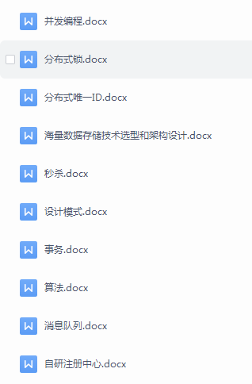

# 32岁文科转行做Java开发

1、自我介绍

大家好，我是grace，今年32岁，儒猿架构班四期的学员。

10年毕业于一所普通的本科院校，文科专业。毕业后做电话销售，工资也非常低，难以生存。13年机缘巧合，我一个高中同学做java开发，工资还不错，为了更好的生存，和我同学交流之后，我也加入了it行业大军，之后进入了教育、旅游等公司做后台开发。

2、学习经历

加入儒猿架构班之后，一直跟着老师的课程，默默的学习，老师给大家规划的学习路线，我就按照老师的节奏来学习。老师的每一课都是大白话，加上经常画图，学起来也非常舒服，易懂。被老师的技术、态度、个人魅力深深的折服，我觉的老师可能是我这辈子能接触到的天花板大牛了。

但是架构班学习的期间因为生娃，带娃，由于家庭原因，家里对带娃的支持给的不是太多，自己这边付出的就要多一点，很艰难，学习过程也是零零散散，断断续续。我觉的这个可能是每个成立家庭的兄弟后面都要面对的事情，有了家庭，学习的时间就少了，在未成立家庭之前，好好学习，那是多么幸福的事情呀。

但是学习的决心从来没有间断，每次看到老师群里发的大家的励志经历，和师兄弟们市场上千锤百炼，千军万马中拿到一堆offer，都会默默的告诉自己加油。有时候学习的时候精力跟不上，也会打瞌睡，硬着头皮学习。期间也经常看群里大家的交流。

3、学习中的困惑

跟着老师的视频课程学习的时间长了，除了老师自己的笔记，我也经常会对每个专题做笔记总结，但是不知道大家有没有跟我一样的困惑，就是总结的文档一大堆一大堆，时间长了，很长时间就遗忘知识点了。这一点，对我的困惑非常大。

4、学习方法

为了解决学习上这个问题，我自己思考，总结了一些方法。

1、把平时总结的知识点放到手机里，经常没事刷题。

2、不断的问自己为什么？为什么要有这个技术？为什么这里这样设计？不这样设计会怎么样。

3、总结的时候，要去除繁杂，保留精华，尽量几句话直达本质。先称之为精华学习法吧。

自从使用这个方法后，我就不再弄专题文档了，也是最近才开始，所有问题都精简，大幅度删减，保留核心和精华。几句话能讲清楚的事情，能让别人明白，那就非常牛了，大道至简。

5、笔记
1、《从零开始带你成为MySQL实战优化高手》

比如mysql专栏做为案例，架构班的课程姑且不说，就几个专栏的质量实在太强了，原子弹大侠，救火队队长，鞭辟入里的介绍jvm和mysql、rocketmq，这几个专栏是老师朋友开的，学习完，都感觉自己实力有大幅度提升。

不仅老师的朋友强，专栏强，你从学习留言中，还能看到小霸王的身影，哪里都是他。

好，那我就先举几个mysql的例子，这是我学习专栏的时候总结的笔记。
mysql专栏笔记链接：https://sourl.cn/zf2yHk

通过mysql的学习，解决了我多年的疑问，平时开发过程中，经常搞不清，rr、rc模式下，到底select要不要加手动加锁，几个事务并发执行，这些数据会不会乱，大家之间都有哪些关系。我觉的可能不少人都搞不清楚，写的时候，可能也会糊里糊涂。

通过msyql专栏的 学习，彻底搞清楚运行原理，写代码的时候，这些种种问题都能甄别。

那么之前为什么学习经历中要分享给同学呢？为什么？

你自己学习知识点，你觉的你消化了，实际上，你不经过一顿毒打和灵魂拷问，很可能只觉的自己掌握了，实际还没有深刻掌握，多几个兄弟拷问你，可能会有你想不到的收获。

就比如群里同学给了一道mysql题，没学过专栏，可能搞不定。

RR模式,看图形红色字给出结果：

2、《从 0 开始带你成为JVM实战高手》

jvm专栏笔记链接：https://sourl.cn/M2urL3

3、 并发举例 
架构课里的并发讲解，包括并发源码和实战，老师一套并发讲下来，自己再进行思考和总结。整理了200多页的学习笔记

6、 学习+面试后的感悟

1、化繁为简，记忆本质，减少大脑负担

面试的时候，面试官没有时间听你一堆唠叨，也没有时间听你说的很细很细的，会经常打断你，我的实际情况是这样的。每个面试官的风格也不一样。站在我自己的角度，我希望，以最短的时间震撼面试官。

如果能画图，也非常nice；不过我不喜欢画图，我个人感觉现场画图，可能短时间讲的东西太少。我更喜欢口述，以精简的语言，达到最好的效果。大家看自己的情况。找到适合自己的方式。

2、 脚踏实地，静心治学
学习是一个长期的过程，不急不躁，慢工出细活。
可以多和儒猿群友交流学习成果，每个人对专栏和架构课程的领悟都不一样。

3、核心能力
越往上走，很多公司，要求你有带团队的能力，给团队成员提供指导和帮助，技术和管理双要求，说白了就是管理好人；技术上，要求你有架构设计的能力，业务建模 + 技术架构，说白了，就是能把项目做的好。

个人技术栈按照老师给的学习路线，持续打造，已经超级强了。关键在于自己的消化和吸收，领悟，内化。形成自己的知识，学以致用，融合一体。

这里老师的课程高并发、高可用、海量数据、中间件源码，几十门课，不得不感叹老师的博大精深，好多门课一起更新，听老师课时间久的都知道老师嗓子经常不舒服，天天讲课，肯定有影响的，希望老师能保护下嗓子。

4、 使用平板
平板可以倍速，可以拖拽，可以带着到处跑，我感觉使用了平板之后，我的学习效率大幅度提升，很舒服。

7、面试公司

1、这次面试没有特别准备

就是加入架构班以来的静心学习，师兄弟之间的交流，老师的问询关怀，自己遇到问题尝试自己去解决，解决不了的寻求老师帮助。

简历准备，从师兄那里要了两份模板，简历内容已经非常强了，按照那个改了改。

2、面试公司介绍和经过

某线下零售商超：
这块全程问我项目，就是架构师云实战seckill项目。当初因为我自己没有通过云实战 大规模服务器 跑一边流程，脑补了一些东西，对项目的准备也不足，所以有些点答的不是太好。

事后跟老师沟通，老师要求严格按照实战项目的数据指标来。同时需要对自己树立信心。很多面试官技术都不如咱们。经过老师指导，稍作整理，再战3家公司，这次带着自信，面试基本上气场、自信、被认可的感觉都非常ok

这个是面试结束后，找老师复盘的部分聊天：

传统行业龙头公司

一面 面试官 给的问题，基本上，我按照我的思路，精简+本质，一两句话概括，没几个问题，面试官就不问了，觉的技术能力很强了。然后就开始出场景题，我也按照我的日常经验给了一些解决方案。然后hrbp聊了很长时间，就约了二面。

二面是一个很高级的负责人了，我们聊了30分钟，全程就是我自己自我介绍，讲述了一个云实战项目，介绍一下自己是怎么样的人，就结束了，第二天给了60w的总包。考虑的离家近不加班，再好好沉淀跟老师学习，最终决定去这家公司。

证券公司

行业龙头，约了后，写笔试题，普通的笔试题，我基本上概括语言写出不一样的高度，技术面就过了。二面领导就聊项目设计的经验。hr电话谈薪资给了65w左右的包，我提了70w，后面hr跟领导争取，没有通过

hr的意思也是公司领导希望用大量校招来补充。加上这边公司大小周，距离有点远，有娃了，也不能跑那么远，跑远了一加班，晚上就回不了家了，因此我也拒绝了这个offer。

8、 面试题

我出去面试，感觉面试官问我的技术题不会多，可能是我都每个点的回答都能快速、简短、直达本质，加上项目也很强，直接震慑了面试官。

举个例子 来说，就比如jmm，我一套打下来，面试官可能还没等我说完就打断我，直接下一个。分布式redis锁，我把我自己深入去研究的结果说一遍，可能还捎带一些细节，比如它客户端使用了semaphore + pub sub，就感觉已经很强了，面试官一般这个话题就会终结。

1、技术问题

ip隧道原理
cdn缓存原理
http和https的区别
http报文内容介绍一下
https原理
谈谈你对安全防护各个方面的理解
为什么零拷贝更快，具体原理
mysql事务acid是如何实现的
mysql幻读是如何解决的
mysql rr模式的原理
redis锁和zk锁的实现原理

谈谈你对锁优化的理解
谈谈你对JMM的理解
谈谈你对AQS的理解
谈谈你对读写锁的理解
谈谈有哪些保证原子性的手段
说一说你对ddd 战术部分的理解，代码如何分层
聊聊spring cloud各个组件的原理
hystrix限流是怎么做的，原理
谈一谈你对CompletableFuture的理解，为什么要用这个，超时机制怎么实现的
rocketmq中间件里面有哪些组件，说一说都有什么作用
mq事务消息的实现原理
如何解决缓存热key问题

3、开放题

1、你觉的你是一个什么样的人？
自我驱动，用于担当，主动沟通和推进项目，能和团队成员良好协作，完成部门内和跨部门协作任务。

2、你觉的你能胜任我们提供的这个职位吗？
完全可以，工作态度认真积极，自我驱动力强，勇于挑战。

9、总结
感谢石杉老师，感谢各位专栏老师，感谢各位助教和工作人员。谢谢你们！

千言万语，只能用实力和结果，来证明自己和报答各位老师

@所有人
今天面经分享到此结束，谢谢大家！面经主人公是@grace 同学，大家有什么问题可以跟他交流

