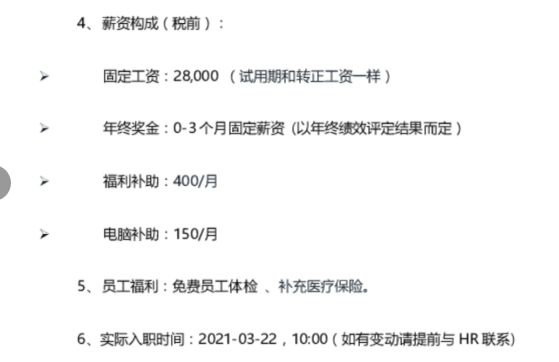
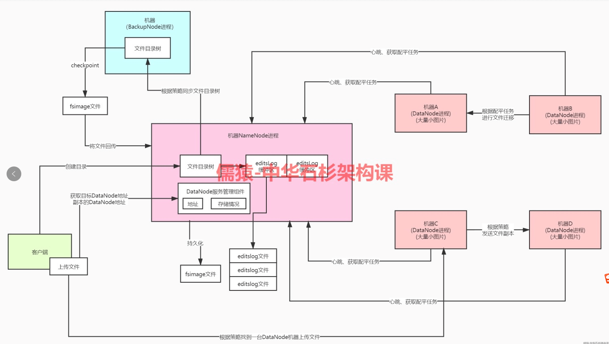

# 93年8个月学习成果经验

1、概述
这次主要跟大家分享一下近一年的学习经历和最近一次的面试的成果，大家可以结合自己的情况看看有什么可以借鉴的。2020年3月到2021年4月一共跳槽两次，学习的内容是架构课里1-12、15、kafka，儒猿技术窝，亿级流量。

**内容已学汇总**

2、个人情况

我93年出生，17年毕业，普通二本学历。毕业之前参加了java几个月的培训，毕业以后在一家20多人的小公司做单块系统（java就俩人），一做就是两年多，这两年多也没学过什么技术，就连培训班学的技术也忘的差不多了。

薪资呢从来没涨过，两年多都是12000。薪资不给涨就算了，老板还老想把我干掉。2020年年初实在忍不了，3月份回到公司就提了离职，背背面试题准备找工作。

第一次跳槽经历：
我是从网上通过搜面试题找到的面试突击视频。通过面试突击第一季，我对主流的技术栈有个入门的了解，当时觉得石杉老师的大白话 + 画图的讲课方式很适合我这种小白，所以通过视频课程里的二维码找到公众号，又在公众号里买了jvm和面试突击第三季，然后就是边学边面试的过程。

我面的都是20k以内的中级岗位，面试问的基本都是面试突击里的问题，当时也是收获了不少15k左右的offer（疫情状况下），最后入职某互联网公司，薪资16k

3、学习过程

（1）学习过程：
2020年5月入班。我以前业余时间就是打打游戏，所以刚开始学的时候找不到状态，看一会就看不下去了，这个学习的状态需要慢慢培养，我的学习时间从一天一个小时到三个小时慢慢递增，最后维持在三个小时左右。

（2）全职学习：
2020年11月-2021年2月是全职学习的时间
原因：
1、2020年4月-2020年10月，这半年的工作时间基本上就是007，几乎没什么时间学习，架构班里的课程阶段一都没看完。

2、我的基础太差，会的技术不多，如果再找工作还是中小型公司20k以内的工作。

3、看到石杉老师的短期跳槽指导以后，觉得花两三个月的时间把短期跳槽的内容学完也是个不错的选择。

4、十一放假的时候，我尝试全职学一周，看看效果，最后效果不错，就决定11月开始进入全职学习。

困难：
1、刚开始学的时候，看着那么多课，有点着急，恨不得马上学完，从早上学到半夜。这种状态坚持了一周就有点扛不住了。

2、我是全天学，吃饭定外卖，很少出去，也没什么娱乐，这种状态持续了两个月，后期效率很低，一天有效的学习时间可能就4.5个小时。

3、我觉得全职学习最大的困难就是一个人扛不住寂寞，坚持不下来。

建议：
1、全职学习不能着急，一着急就学不好了，要慢慢学，把技术学扎实了。

2、学习前先定好每月目标、每周目标、每日目标，目标不能太难，刚开始可以简单一些，根据这些目标制定学习计划，比如每天学一周的课程（包括看视频、整理笔记、融入项目、记忆）。

3、尽量在白天完成每日目标，晚上出去散散步，看看剧，打打游戏进行一些娱乐项目。

（3）学习方法：
1、看视频

2、整理笔记：老师的笔记相当于课本，还需要自己把一些核心的知识点整理成思维导图，再画一些比较重要的流程图。（我以前没画过图，刚开始学习的时候就是比着老师的画，后来就是按照自己的理解画图，图画不下去的时候就去看看老师画的图）

3、思考：多想想为什么，这个技术点和已经学过的技术有没有相似的地方。

4、技术融入项目：看看以前做过的项目哪些地方可以用到刚刚学到的这个技术，比如学完设计模式之后，好好想想以前的项目里哪些业务场景可以用设计模式。刚学完技术，印象比较深刻，这个时候直接融入项目，准备简历的时候就可以轻松很多。

5、定期复习：我是学完一个课程整体复习一次，一个月以后再复习一次，准备面试的时候主要看自己的笔记和流程图。

下面主要说一下我的第二次跳槽。

4、我面试了哪些公司
美团、滴滴、快手、58集团、还有北京的一些独角兽

面试情况：滴滴收到offer，美团、快手挂在 hr 面，58因为要入职没面完，offer大部分都是总包42万左右。

5、面试前的准备
1、看老师的笔记把技术复习一遍

2、结合着面试突击，重点记一些面试中可能被问到的技术

3、找石杉老师优化简历，通过石杉老师的简历指导把秒杀和小文件融入自己以前的项目里。

4、找助教帮忙完善一下项目细节，技术面的时候几乎横扫，一面讲秒杀、二面讲小文件。

5、自己项目的架构图、核心链路流程图多画几遍，记住为止。

6、思考一下项目怎么迭代的，每个版本都有哪些功能。

6、面试内容

这次面试基本都是先介绍项目，然后结合项目来聊技术。面试问的问题都是围绕这简历里写的来问，如果简历写的太简单，最好先找老师优化一下简历。很多面试题架构班的师兄们都分享过，我就不重复了

1、分布式小文件系统
1.1 为什么要自研？
1.2 和hdfs比有什么优势？
1.3 在开发的过程中有什么难点？
1.4 BIO、NIO、AIO有什么区别？
1.5 nio reactor模型为什么要设计成三层？
1.6 文件数据怎么保证高可用的？
1.7 reactor模型里Processor线程设置几个？为什么？Handler线程设置几个？为什么？
1.8 如果一个DataNode宕机，怎么处理文件？
1.9 NameNode怎么保证高可用？
1.10 如果NameNode要设计成高可用，你会怎么设计？
1.11 你觉得这个系统有哪些可以优化的地方？

分布式小文件系统架构图：

2、秒杀系统
2.1 秒杀商品详情页如果生成失败怎么办？有没有数据预加载的机制？
2.2 怎么防止库存超卖的?
2.3 redis有没有开启持久化？redis重启有什么问题么？
2.4 nginx限流怎么做的？如果用java代码怎么实现？（这个为了问java并发那块的知识）
2.5 MQ在抢购链路里的作用是什么？
2.6 解决消息积压、解决消息重复以及保证消息顺序性的方案？
2.7 kafka都做了哪些优化？

秒杀架构图：https://www.yuque.com/dulante-ikt7c/dy8hn4/dcwpqp

kafka producer端架构图：

3、java基础
3.1 HashMap源码
3.2 HashMap并发情况下会有什么问题？
3.3 ConcurrentHashMap底层原理
3.4 Synchronized和Lock区别
3.5 volatile怎么保证可见性、有序性的？

4、分布式事务
4.1 分布式事务在项目的哪些业务场景用到了？
4.2 直接用kafka不单独研发可靠消息服务有什么问题么？
4.3 ByteTCC实现TCC方案的原理
4.4 你们公司有没有监控分布式事务的平台，可以手动重试失败的分布式事务？

5、分布式锁
5.1 zk和redis分别怎么实现分布式锁？讲解redisson和curator的zk顺序节点的源码
redisson非公平锁源码图：https://www.yuque.com/dulante-ikt7c/dy8hn4/eogxqt
zookeeper可重入锁源码图：https://www.yuque.com/dulante-ikt7c/dy8hn4/gqu12e

6、开放类问题

6.1、如果一个接口慢，造成这个接口慢的原因都有哪些？
1、网络IO （说下数据库优化、redis优化）
2、磁盘IO （可以用异步优化）
3、锁竞争 （分段加锁、锁粒度，详见架构课锁优化策略）
4、jvm优化（如果前面没问jvm的话，这时候也可以说一下jvm专栏里的优化方案）

6.2、如果让你来实现一个注册的功能，要考虑哪些点？
1、项目初期没什么数据量，单库单表就可以
2、数据量大了以后要考虑分库分表
3、超时重试
4、接口幂等性
5、注册功能属于核心功能，不能降级

6.4、一个很大的文件里存的都是些id，怎么统计出重复id的次数？(内存不能一次性加载所有数据)
1、把大文件拆分成内存可以放下的小文件比如10个小文件。
2、大文件中的id通过一个hash函数计算出hash值，寻址算法找到小文件
3、把小文件加载到内存中用HashMap就可以统计了

6.5、一个文件里都是电话号码，重复的号码需要记录重复次数，你会怎么设计存储？
1、电话号码可以分成三段，前面3位、中间4位、后面4位
2、仿照Mysql索引树设计，叶子节点挂的是重复次数
3、面试官说可以使用混合树（我不了解什么是混合树）

6.3、怎么实现直播间送礼排行榜的功能？(使用redis，只展示前100名)
分两种情况考虑
1、访问量很小的直播间
（1）使用redis sorted set数据结构存储用户id，分数就是送礼金额
（2）查询的的时候直接获取前100个

2、访问量很大的直播间 （在这种情况下，使用上述设计方案，会有两个问题：一个问题是单台redis是扛不住那么高的并发;另一个问题是送礼的人很多，展示的话只需要前100个，多个机器都存全量的key会浪费资源）

（1）同一个排行榜放在多个redis实例上，客户端读的时候做个轮询

（2）一个redis实例存全量的排行榜，只负责写数据；其他redis存前100名的数据，负责读。写数据时，如果前100名发生变化，就把最新的数据同步到其他节点。

6.6、 mysql里一个字段的值需要存几百万个id怎么设计？
1、这些id先计算出一个base（所有id减去这个base就是个int类型的值）
2、搞一个bitmap，通过一个特殊的hash函数计算出（id-base）在bitmap中的位置（这个是唯一的）
3、核心思想就是使用bitmap存数据

6.7、 怎么设计一个接口的降级方案？
降级方案要分两种情况
1、核心链路的接口不能随便降级，有的接口慢，就得在那等着。
2、非核心链路参照面试突击里使用Hystrix降级

7、面试内容总结
一次面试1个小时左右，如果能把架构班里的技术+公众号+亿级流量这些技术都在简历里体现出来，面试的时候简历上的技术都聊不完。

我在儒猿群里看到很多人问面试的时候会不会问spring，我面试的时候很少有人问，碰到问的也是第一面，比着面试题在那问的，被问到就说没有深入研究过，只是会用就可以了。如果这么说了，面试官还在那死问直接结束面试，面下一家。

算法的话，我只看了一个算法专栏，知道一些数据结构，我碰到让写算法的一般都是面完了技术以后来一道简单的算法题，实在不会的话就直说没刷过算法题

很多面试官都是直接讲一下思路，让我来写代码。也有那种全程算法题的面试，如果对算法没啥信心，可以问下面试官对算法的态度，是这些技术重要还是算法重要，如果比较看重算法不看重技术，就别浪费时间了。

8、总结

学习是一个很漫长的过程，想要看几篇博客，读两本书就成为大牛是不可能的。看到很多架构班的师兄1年p6两年p7，我感觉架构课就是学习路上的一种“捷径”，这种捷径不是指买了课之后就可以不付出努力躺着进大厂，而是说你可以每一分努力都用到刀刃上，将自己学习的时间成本降到最低。

我很庆幸能遇到石杉老师，是老师给了我弯道超车的机会，如果没有架构课，我现在可能还是在某个20多人的小公司做着crud的功能。

短短一年时间，我从架构班学到了很多，这一年时间里，我也怀疑过学这些技术是不是真的能找到高薪工作，还好最后坚持下来了。这次面试的结果让我有更大的动力去学习更多的内容。

看着几百G的视频，我只想好好学习，还有时间焦虑？还有时间操闲心？我的分享就这么多，我也祝大家能早日拿到自己心仪的offer。

今天面经分享到此结束，谢谢大家！面经主任公是@000同学，大家有什么问题可以跟他交流

