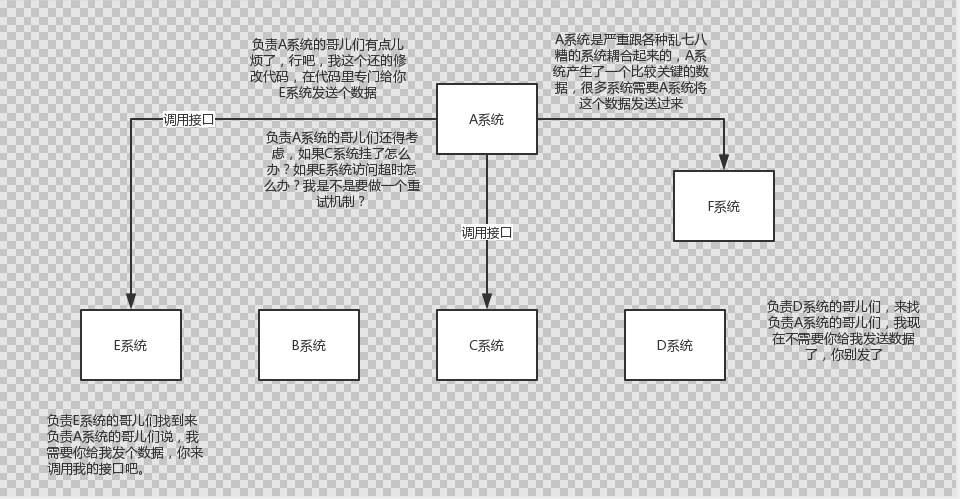
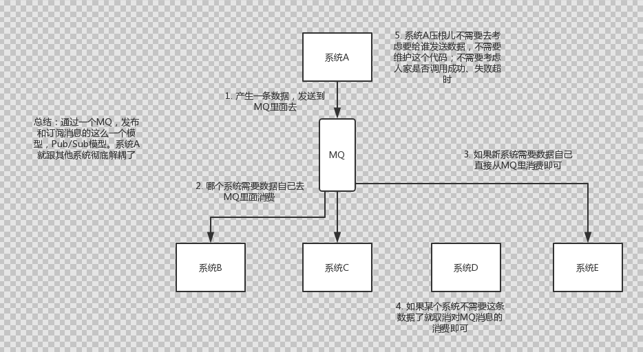
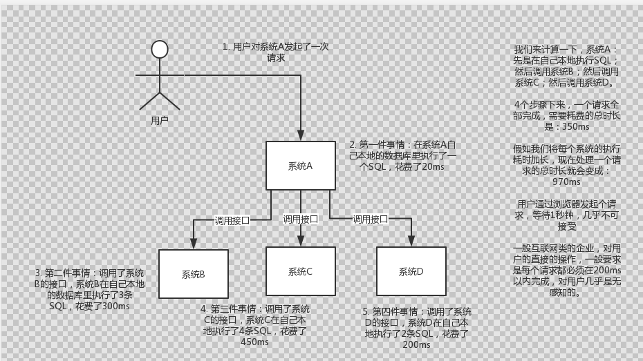
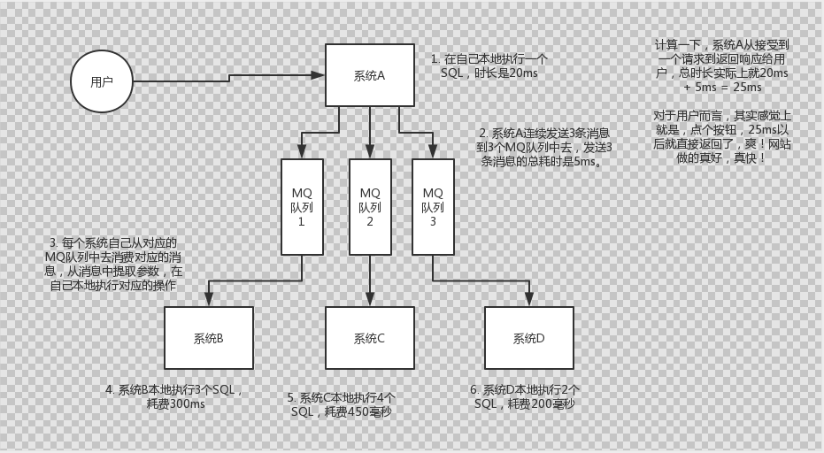
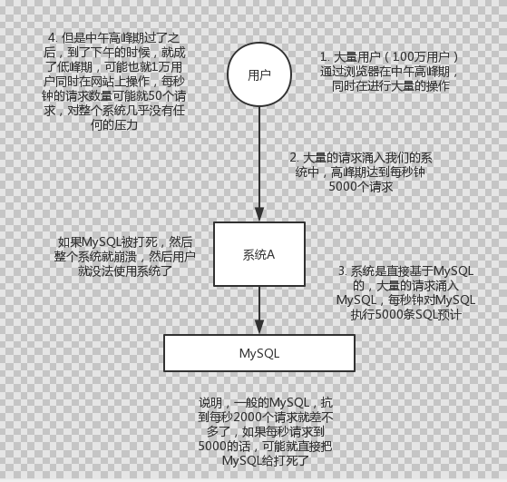
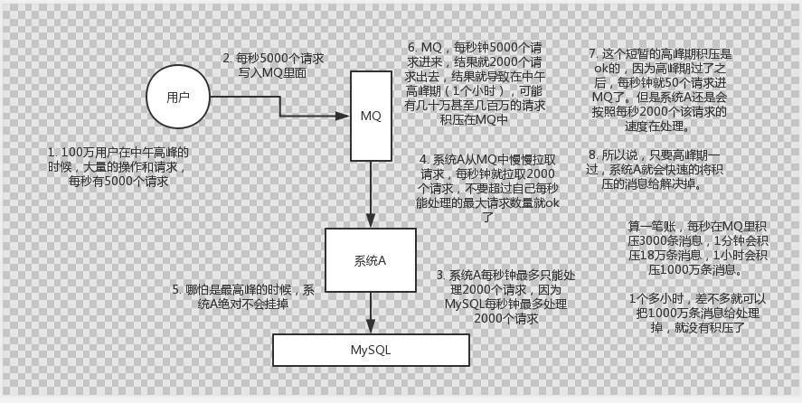
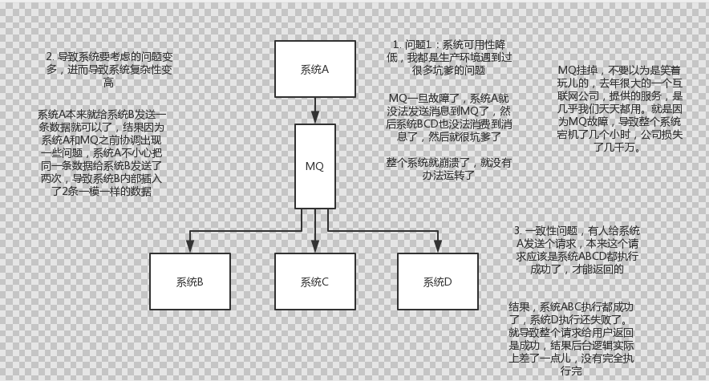

# 05知其然而知其所以然：如何进行消息队列的技术选型？


#### 1.面试题：

​	**为什么使用消息队列？ 消息队列有什么优缺点？ kafka，activemq，rabbitmq，rocketmq都有什么区别以及适合什么场景？**


#### 2.面试官心里分析：

**其实面试官主要是想看看：**

```
	1.第一，你知道不知道你们系统里为什么要用消息队列这个东西？
		之前就见过大量的候选人，说自己项目里用了redis，mq，但是其实他并不知道自己为什么要用这个东西，其实说白了，就是为了用而用，或者是别人设计的架构，他从头到尾没思考过。
		没有对自己的架构问过为什么的人，一定是平时没有思考的人，面试官对这类候选人印象通常很不好，因为进了团队担心你就木头木脑的干呆活儿，不会自己思考。
	
	2.第二，你既然用了消息队列这个东西，你知道不知道用了有什么好处？
		系统中引入消息队列之后会不会有什么坏处？你要是没考虑过这个，那你盲目弄个MQ进系统里，后面出了问题你是不是就自己溜了给公司留坑？你要是没考虑过引入一个技术可能存在的弊端和风险，面试官把这类候选人招进来了，基本可能就是挖坑型选手。
		就怕你干一年挖一堆坑，自己跳槽了，给公司留下后患无穷。
		
	3.第三，既然你用了MQ，可能是某一种MQ，那么你当时做没做过调研啊？
		你别傻乎乎的自己拍脑袋看个人喜好就瞎用了一个MQ，比如kafka。甚至都没调研过业界到底流行的MQ有哪几种？每一个MQ的优点和缺点是什么？每一个MQ没有绝对的好坏，但是就是看用在哪个场景可以扬长避短，利用其优势，规避其劣势。
		如果是一个不考虑技术选型的候选人招进了团队，面试官交给他一个任务，去设计个什么系统，他在里面用一些技术，可能都没考虑过技术选型，最后选的技术可能并不一定合适，一样是留坑。
		
		
	
```

#### 3.额外友情提示备注：

​		如果看到这里，连activemq，rabbitmq，rocketmq，kafka是什么都不知道？连个hello world demo 都没写过，那你。。。
​		那也没事，建议你马上暂停一下，然后上百度搜一下，这4个东西是什么，每个东西找一个教你的hello world 的博客，自己跟着做一遍，我保证你一个小时之内就可以快速入门这几个东西。

		通过网上查阅技术资料和博客，用于快速入门，是比较合适的，但是如果比如系统梳理你的面试技术体系，或者是系统的深入的研究和学习一些东西，看博客实际上是不太适合的。


#### 4.面试题剖析

```text
	1.为什么要使用消息队列啊？
		面试官问你这个问题，期望的一个回答是说，你们公司有个什么业务场景，这个业务场景有个什么技术挑战，如果不用MQ可能会很麻烦，但是你现在用了MQ之后带给你了你很多的好处，按照这个思路来回答。
		先说一下消息队列最常见的使用场景吧，其实场景有很多，但是比较核心的有3个，解耦、异步、肖峰
		
		解耦：现场画图说明一下，假设A系统发送个数据到BCD三个系统，接口调用发送，那如果是E系统也要这个数据呢？（A系统增加对E系统发送数据的接口），那如果D系统不需要了呢？（那么A系统又得把发送数据的接口去掉），如果后续又有F系统需要数据，那么A系统又需要维护接口，现在A系统又要发送第二种数据呢？（又需要各种维护一遍接口），A系统的负责人濒临奔溃中。。。再来点更加奔溃的事，A系统要时时刻刻考虑BCDE等系统如果挂了怎么办？我要不要重发？我要不要把消息存起来？头发都白了啊。。。(A系统是严重跟各种乱七八糟的系统耦合起来的，A系统生产了一个比较关键的数据，很多系统需要A系统将这个数据发送过来)。
		
		面试技巧：你需要考虑一下你负责的系统中是否有类似的场景，就是一个系统或者一个模块，调用了多个系统或者模块，互相之间的调用很复杂，维护起来很麻烦。但是其实这个调用是不需要直接同步调用接口的，如果用MQ给他异步化解耦，也是可以的，你就需要在你的项目里，是不是可以运用MQ去进行系统的解耦。在简历中体现出来这块东西，用MQ做解耦。
```


不用MQ系统耦合的场景图




使用MQ系统解耦合的场景图




```
		异步：现场画图来说明一下，A系统接收一个请求，需要在自己本地写库，还需要BCD三个系统写库，自己本地写库要3ms，BCD三个系统分别写库需要 300ms，450ms，200ms 最终总延时是953ms，用户感觉搞个什么东西，慢死了，慢死了。（不用MQ多个系统同步调用会导致高延时的场景）
		
```


不用MQ多个系统同步调用会导致高延时的场景图




使用MQ进行异步化之后的接口性能优化场景




```
	肖峰：比如每天0点到11点，A系统风平浪静，每秒并发请求数量就100个，结果每次从11点到1点，每秒并发请求数量突然报增到1万条，但是系统最大的处理能力就只能是每秒钟处理1000个请求啊。。尴尬啊，系统会挂掉。
	
	使用MQ来解决高峰期的问题：
		1.假如现在有100万用户在中午高峰期时，大量的操作和请求，每秒有5000个请求。
		2.每秒5000个请求写入MQ里面。
		3.假设系统A每秒钟最多只能处理2000个请求，因为MySQL每秒钟最多能处理2000个请求。
		4.系统A从MQ中慢慢拉取请求，每秒钟就拉取2000个请求，不要超过自己每秒能处理的最大请求数量就ok了。
		5.哪怕是最高峰的时候，系统A绝对不会挂掉。
        
        6.MQ，每秒5000个请求进来，结果就2000个请求出去，结果就导致在高峰期（2小时），可能有几十万甚至几百万的请求积压在MQ中
        7.这个短暂的高峰期积压是ok的，因为高峰期过了之后，每秒钟就50个请求进MQ了，但是系统A还是会以每秒2000个请求的速度处理
        8.所以说，只要高峰期一过，系统A就会快速的将积压的消息给解决掉。
```


没有用MQ的时候高峰期系统被打死的场景




使用MQ削峰系统场景图




```
	2.消息队列有什么优点和缺点？
		优点上面已经说了，就是在特殊场景下有其对应的好处，解耦，异步，削峰。
		缺点呢，显而易见 
			系统可用性降低：系统引入的外部依赖越多，越容易挂掉，本来你就是系统A调用BCD三个系统的接口就好了，人ABCD四个系统好好的，没啥问题，你偏加个MQ进来，万一MQ挂了咋整，整套系统奔溃了，你不就完了
			
			系统复杂性提高：硬生生加个MQ进来，你怎么保证高可用？你怎么保证消息没有重复消费？怎么处理消息丢失的情况？怎么保证消息传递的顺序性？头大头大，问题一大堆，痛苦不已
			
			一致性问题： A系统处理完直接返回成功了，人都以为你这个请求就成功了，但是问题是，要BCD三个系统那里，BC俩个系统写库成功了，而D系统写库失败了，咋整，你这数据不一致了。
			
	所以消息队列实际是一种非常复杂的架构，你引入他有很多好处，但是也得针对他带来的坏处做各种额外的技术方案和架构来规避掉，最好之后，你会发现，妈呀，系统复杂度提升了一个数量级，也许是复杂了10倍。但是关键时刻，用，还是得用的。。。
			
```


消息队列的缺点：




```tex
	3.kafka,activemq,rabbitmq,rocketmq都有什么优点和缺点啊？
	常见的MQ其实就这几种，别的还有很多其他的MQ，但是比较冷门的，那么就别多说了。
	作为一个码农，你起码得知道各种mq的优点和缺点吧，咱们来画个表格看看
```


| 特性                                          | ActiveMQ                                                     | RabbitMQ                                                     | RocketMQ                                                     | kafka                                                        |
| --------------------------------------------- | ------------------------------------------------------------ | ------------------------------------------------------------ | ------------------------------------------------------------ | ------------------------------------------------------------ |
| 单机吞吐量（就是1秒钟处理多少个事务或者请求） | 万级，吞吐量比RocketMQ 和kafka要低一个数量级                 | 万级，吞吐量比RocketMQ 和kafka要低一个数量级                 | 10万级，RocketMQ也是可以支撑高吞吐的一种MQ                   | 10万级别，这也是kafka 最大的优点，就是吞吐量高。   一般配合大数据类的系统来进行实时数据计算，日志采集等场景 |
| topic数量对吞吐量的影响                       |                                                              |                                                              | 以支撑大量的topic                                            | 支撑大规模topic，需要增加更多的机器资源                      |
| 时效性                                        | ms级（毫秒级）                                               | 微秒级，这是rabbitmq的一大特点，延迟最低的                   | ms级（毫秒级）                                               | 延迟在ms级以内                                               |
| 可用性（高可用）                              | 高，基于主从架构实现高可用性                                 | 高，基于主从架构实现高可用性                                 | 非常高，分布式架构                                           | 非常高，kafka是分布式的，一个数据多个副本，少数机器宕机，不会丢失数据，不会导致不可用 |
| 消息可靠性                                    | <font color=#FF0000 >有较低的概率丢失数据 </font>            |                                                              | 经过参数优化配置，可以做到0丢失                              | 经过参数优化配置，消息可以做到0丢失                          |
| 功能支持                                      | MQ领域的功能极其完备                                         | 基于erlang开发，所以并发能力很强，性能极其好，延时很低       | MQ功能较为完善，还是分布式的，扩展性好                       | 功能较为简单，主要支持简单的MQ功能，在大数据领域的实时计算以及日志采集被大规模使用，是事实上的标准 |
| 优劣势总结                                    | 非常成熟，功能强大，在业内大量的公司以及项目中都有应用.<br/>偶尔会有较低概率丢失消息.<br/>而且现在社区以及国内应用都越来越少，官方社区现在对ActiveMQ 5.x维护越来越少，几个月才发布一个版本.<br/>而且确实主要是基于解耦和异步来用的，较少在大规模吞吐的场景中使用 | erlang语言开发，性能极其好，延时很低；<br/>吞吐量到万级，MQ功能比较完备，而且开源提供的管理界面非常棒，用起来很好用。<br/>社区相对比较活跃，几乎每个月都发布几个版本.<br/>在国内一些互联网公司近几年用rabbitmq也比较多一些.<br />但是问题也是显而易见的，RabbitMQ确实吞吐量会低一些，这是因为他做的实现机制比较重。<br/>而且erlang开发，国内有几个公司有实力做erlang源码级别的研究和定制？如果说你没这个实力的话，确实偶尔会有一些问题，你很难去看懂源码，你公司对这个东西的掌控很弱，基本职能依赖于开源社区的快速维护和修复bug。<br/>而且rabbitmq集群动态扩展会很麻烦，不过这个我觉得还好。其实主要是erlang语言本身带来的问题。很难读源码，很难定制和掌控。 | 接口简单易用，而且毕竟在阿里大规模应用过，有阿里品牌保障<br/>日处理消息上百亿之多，可以做到大规模吞吐，性能也非常好，分布式扩展也很方便，社区维护还可以，可靠性和可用性都是ok的，还可以支撑大规模的topic数量，支持复杂MQ业务场景<br/>而且一个很大的优势在于，阿里出品都是java系的，我们可以自己阅读源码，定制自己公司的MQ，可以掌控.<br/>社区活跃度相对较为一般，不过也还可以，文档相对来说简单一些，然后接口这块不是按照标准JMS规范走的有些系统要迁移需要修改大量代码.<br/>还有就是阿里出台的技术，你得做好这个技术万一被抛弃，社区黄掉的风险，那如果你们公司有技术实力我觉得用RocketMQ挺好的. | kafka的特点其实很明显，就是仅仅提供较少的核心功能，但是提供超高的吞吐量，ms级的延迟，极高的可用性以及可靠性，而且分布式可以任意扩展.<br/>同时kafka最好是支撑较少的topic数量即可，保证其超高吞吐量 <br/>而且kafka唯一的一点劣势是有可能消息重复消费，那么对数据准确性会造成极其轻微的影响，在大数据领域中以及日志采集中，这点轻微影响可以忽略.<br />这个特性天然适合大数据实时计算以及日志收集. |


```
  综上所述，各种对比之后，我个人倾向于是：
  	一般的业务系统要引入MQ,最早大家都用ActiveMQ，但是现在确实大家用的不多了，没经过大规模吞吐场景的验证，社区也不是很活跃，所以大家还是算了吧，我个人不推荐使用这个了；
  	
  	后来大家开始用RabbitMQ，但是确实erlang语言阻止了大量的java工程师去深入研究和掌控他，对公司而言，几乎处于不可控的状态，但是确实人家是开源的，比较稳定的支持，活跃度也高。
  	
  	不过现在确实越来越多的公司，会去用RocketMQ，确实很不错，但是我提醒一下自己想好社区万一突然黄掉的风险，对自己公司技术实力有绝对自信的，我推荐用RocketMQ，否则回去老老实实用RabbitMQ吧，人是活跃社区绝对不会黄。（RabbitMQ是纯个人散户大量的人支撑起来的项目，所以不会黄）
  	
  	所以中小型公司，技术实力较为一般的，技术挑战不是特别高，用RabbitMQ是不错的选择；
  	大型公司，基础架构研发实力较强，用RocketMQ是很好的选择
  	
  	如果是大数据领域的实时计算、日志采集等场景，用kafka是业内标准的，绝对没问题，社区活跃度很高，绝对不会黄，何况几乎是全世界这个领域的事实性规范。
  	
```


