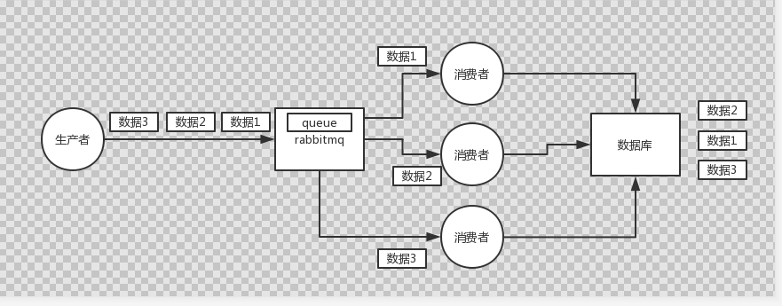
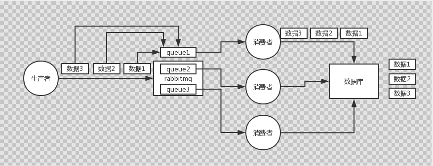
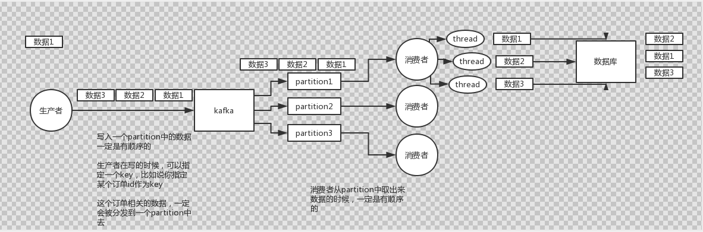
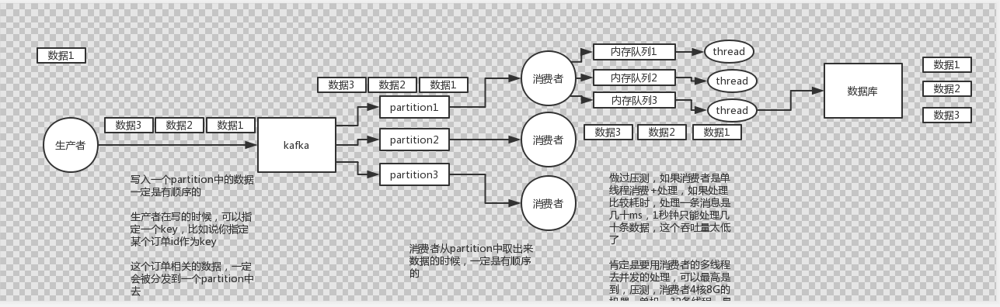

# 09_我该怎么保证从消息队列里拿到的数据按顺序执行？


#### 1.面试题

**如何保证消息的顺序性？**


#### 2.面试官心里分析

```
	其实这个也是用MQ的时候必问的话题，第一看看你了解不了解顺序这个事？第二看看你有没有办法保证消息是有顺序的？这个生产系统中常见的问题。
	
```


#### 3.面试题剖析

```
	我举个例子，我们以前做过一个mysql binlog同步的系统，压力还是非常大的，日同步数据要达到上亿。mysql--》mysql，常见的一点在于说大数据team，就需要同步一个mysql库过来，对公司的业务系统的数据做各种复杂操作。
	
	你在mysql里增删改一条数据，对应出来了增删改3条binlog，接着这三条binlog发送到MQ里面，到消费出来依次执行，起码得保证人家是按照顺序来的吧？不然本来是：增加、修改、删除；你愣是换了顺序给执行成，删除、修改、增加，不全错了么。
	
	本来这个数据同步过来，应该最后这个数据被删除了，结果你搞错了顺序，最后这个数据保留下来了，数据同步就出错了。
	
	先看看顺序会错乱的俩场景
	1.RabbitMQ：一个queue，多个consumer，这不明显乱了
	2.kafka:	一个topic，一个partition，一个consumer，内部多线程，这不明显也乱了
	
	那如何保证消息的顺序性呢？简单简单
		1.RabbitMQ：拆分多个queue，每个queue一个consumer，就是多一些queue而已，确实是麻烦点；或者就一个queue但是对应一个consumer，然后这个consumer内部用内存队列做排队，然后分发给底层不同的worker来处理。
		
		
		2.kafka:
		一个topic，一个partition，一个consumer，内部单线程消费，写N个内存queue，然后N个线程分别消费一个内存queue即可，就是一个线程消费一个queue是可以保证顺序性的。
```


**RabbitMQ可能出现数据顺序错乱的问题**




**RabbitMQ如何保证消息顺序性图：**




**kafka消息顺序错乱的场景**




**kafka如何保证消息的顺序性**




