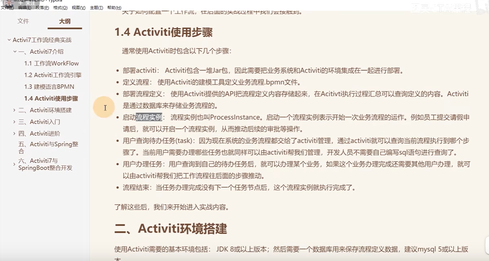

# 3、BPMN及流程部署介绍

#### 流程使用步骤：

​		1：首先是集成Activiti的依赖jar包及环境

​		2：定义流程 -- 需要使用BPMN语言和建模工具实现流程的定义

​		3：部署流程定义： 就是将定义好的BPMN流程 内容存储起来，其实就是存储到Activiti生成的那些表中了

​		4：启动流程实例： 其实就是一次流程的运转，例如发起一次请假申请流程 就需要启动一个流程实例

​		5：用户查询待办任务： 查询自己的待办任务

​		6：用户办理任务：  用户查询到任务后对任务的操作，把流程往后推动

​		7：流程结束：   任务办理完成没有下个任务节点后，这个流程实例就执行完成了

