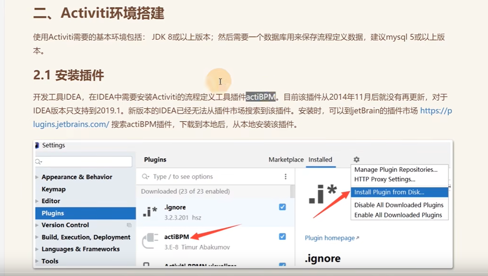
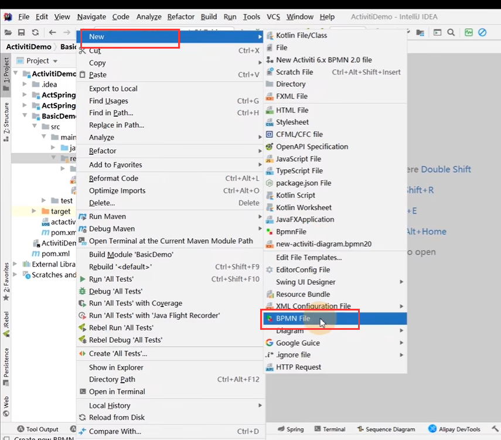
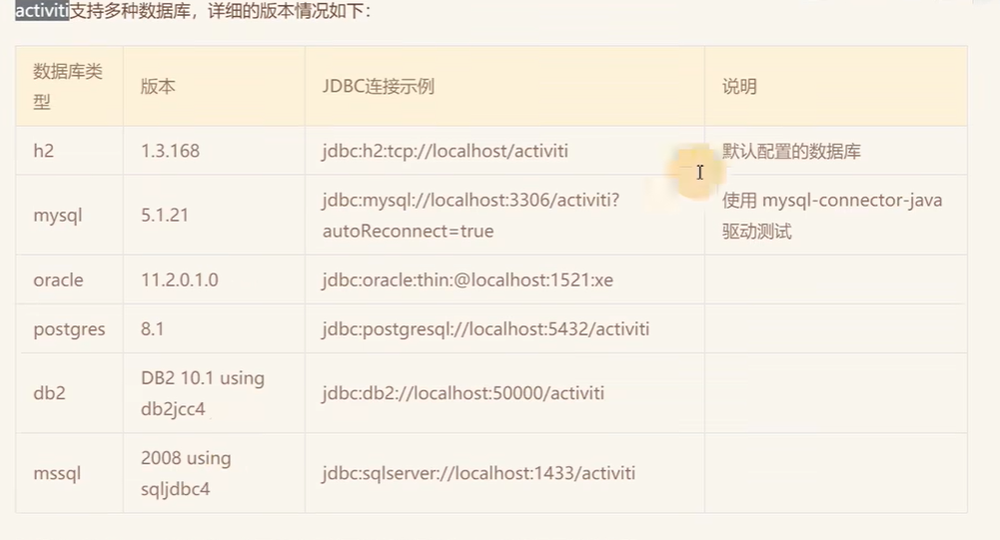
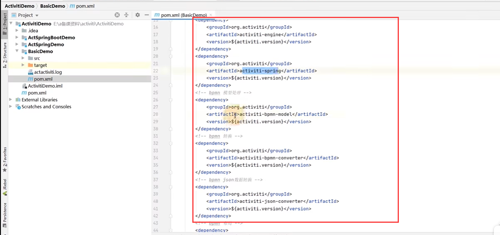
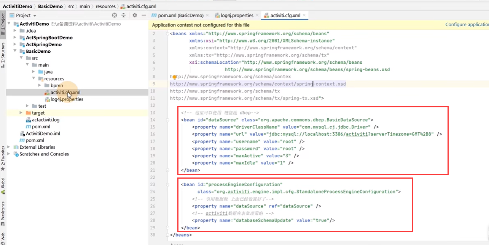
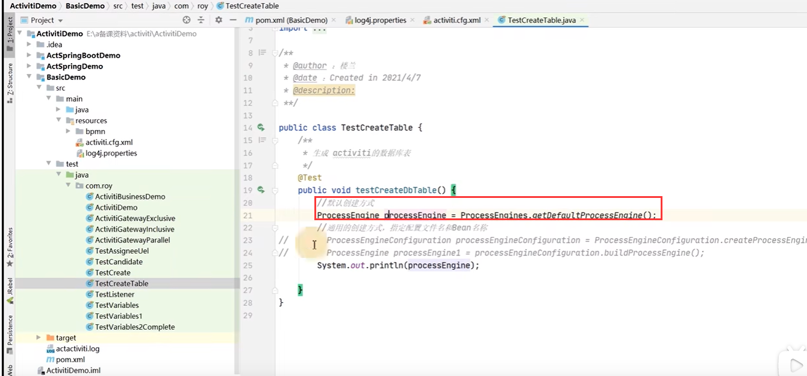
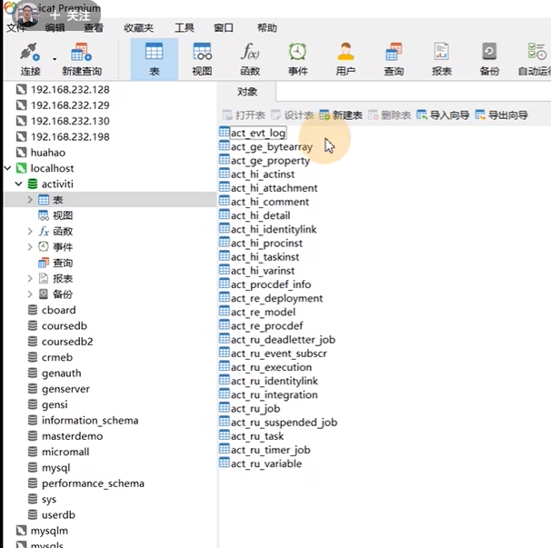
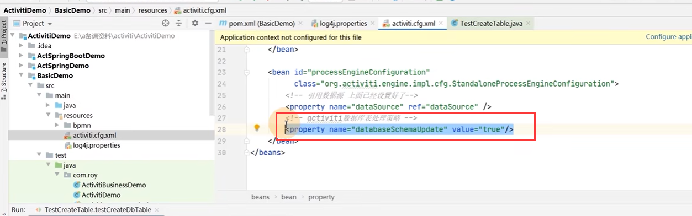
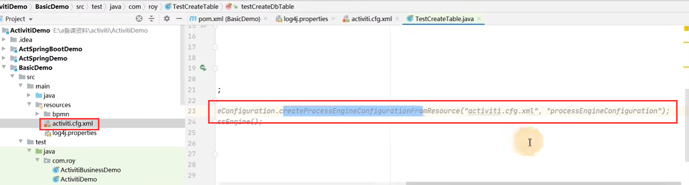

# 4、Activiti环境搭建

​	1、首先需要JDK8+，还需要一个数据库 建议MySQL5以上版本。

​	2、开发工具IDEA 然后需要一个插件actiBPM -- 用于编辑流程图

​	有了这个插件我们就可以创建这个BPMN这个文件了

​	3、Activiti支持的数据库类型 --默认他是使用基于内存H2数据库

​		比如我们使用mysql数据库--那么必须是提前先把这个activiti库创建好

​	

​		activiti依赖的数据表有25张，它自身会提供自动生成的功能帮助我们建立好这些表

​	4、建立一个maven工程--加入activiti的依赖

5、Activiti的配置文件

​	这里主要是配置一些数据库信息，和是否自动生成表的一些操作

​	执行这个测试案例：activiti就可以帮助我们生成业务数据表

6:、activiti表的作用--这个也是activiti的难点

​			我们只需要了解部分表的作用就可以了

​					就是这25张表支撑起这个工作流的实现，如果我们对这25张表都操作写代码的话就没有意义了，activiti就是帮助我们来管理这25张表，实现工作流的引擎

​			所有的表都是是act开头的、第二个表示它的业务属性--

​			比如re这些就是包含流程定义的内容的表，这些就是和流程定义相关的表

​			比如ru--这些表是流程在运行过程中的数据在这些表中

​			比如hi-- 这些表 代表流程的历史信息

​			ge开头-- generate 表示一些通用的信息

​	7、配置文件的自动创建表结构

​		这个配置就可以帮我们自动的创建表

​			true就代表会在启动项目的时候检查表结构--如果没有就创建，如果有就检查是否合适或者更新

​			它的默认值是false -- 不会创建。

​			我们第一次使用的时候使用这个配置，之后就不需要这个配置了

​	如果配置文件不是使用的默认配置文件名称--那么就需要指定的去读取了

​	第二个参数就是bean--就是activiti配置文件中的bean的id

​	

https://www.bilibili.com/video/BV1Ya411z7kW?p=4&spm_id_from=pageDriver&vd_source=243ad3a9b323313aa1441e5dd414a4ef

