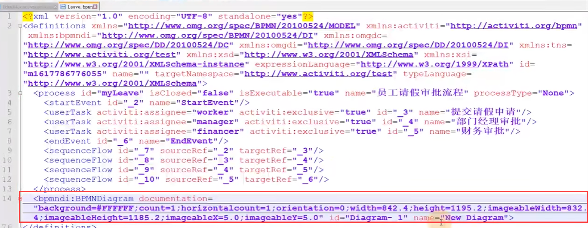
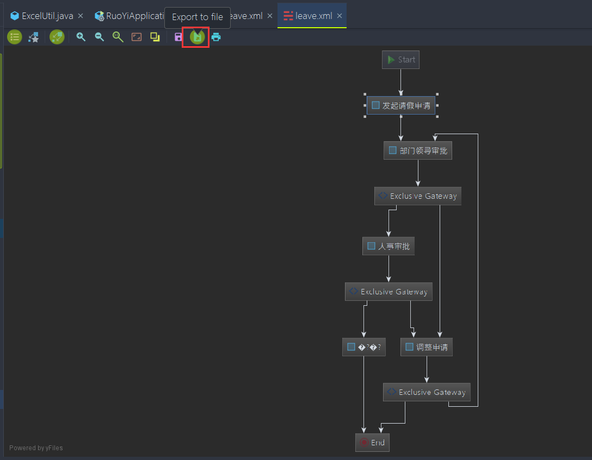

# 5、创建流程定义

​		这个ProcessEngine类就代表activiti最基础的环境类--或者说引擎类

​	我们通过get就可以看出来有几个核心的服务

​			历史服务--管理服务--资源管理服务 -- 运行服务 -- 任务服务

​	有了这些服务我们就可以搭建一个流程了

#### 1、首先需要一个BPMN文件

​		点击方框usertask 然后点击方框我们可以对这个任务进行配置

​		比如name--任务名称

​		Assignee -- 责任人

​	

​	设置责任人

​	最后我们点击空白处，然后设置整个流程信息

​		这里主要是设置这个id和name

​	这样我们就配置完成了一个简单的BPMN流程了

#### 注意的问题

​		在我们编辑完之后 再次打开出现了 中文乱码的问题

​	中文乱码需要修改idea的字符集

​	加入一行 utf-8

​		我们需要了解这个BPMN的本质--虽然使用插件有这么个图形，其实他的本质就是一个xml文件

​	这个xml也是需要熟悉的

​	《process》这个节点 就表示这是一个流程

​	《bpmndi》这个就表示一个图形及坐标的内容了--画布上的东西

​	《userTask》--就是对应的每个任务--我们有3个任务对应3个userTask

​	《sequenceFlow》-- 就表示连线，就是各个元素之间的连线

##### 注意：在一个bpmn文件中是可以配置多个流程的，只是我们日常开发中是不建议这样使用的

##### 我们还需要一个png的流程图

​	这个图有什么用呢？我们以后会拿出来使用，其实就是activiti给我们考虑了非常周到的，因为这个bpmn文件的本质它是一个xml，而xml只有开发人员能看得懂业务人员是看不得的，那么业务人员是怎么去理解你这个流程呢？ 最好的方式就是保存这么个流程png的图

怎么做这个图呢？我们复制一下这个bpmn文件，然后复制为一个xml文件

​	然后右键--选择Diagram 

​		如果xml在右键没有这个Diagram选项的话就安装一个Jboss jbpm插件

​	然后点击导出按钮

​	选择导出的图片类型

​	我们一般都是导出的和bpmn放在同一个路径下

​	到这里我们的流程就定义好了

https://www.bilibili.com/video/BV1Ya411z7kW?p=5&spm_id_from=pageDriver&vd_source=243ad3a9b323313aa1441e5dd414a4ef

