# 6、流程初体验

​		我们需要让activiti认识这个bpmn文件，那么就需要部署流程

#### 1、部署流程

​		部署流程其实就是将这个xml解析保存在我们的数据库中

​		表里没有数据它就不知道这个流程

​		部署的时候我们指定bpmn这个文件，也可以保存png图片，然后给他一个名称，最后deploy部署

​		这个部署其实就相当于解析的xml流程 数据插入到数据库表中了

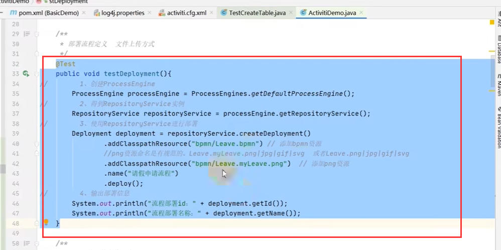

我们执行一下这个流程

​	那么它的部署具体操作了数据库的那些表呢？这个其实很复杂，很少有人能够完全的全部都了解

​	我们可以了解局部的插入内容

​	deployment表中会多一条数据

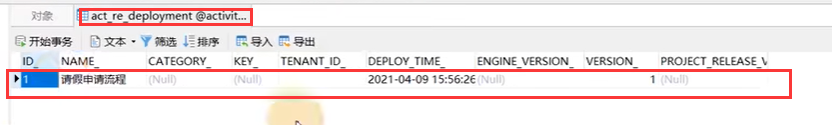

​	流程定义表 re_procdef表中会有一条数据

​		通过这次部署我们就定义了一个流程，而且会保存流程图和bpmn文件的名称

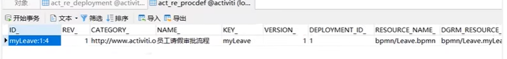

​	这个文件存放在哪里呢？

​	在ge_bytearray这个表中

​		name是资源名称，Btyes字段里面就存放的是完整的资源文件了，类型是BLOB类型

​		我们不光是部署的时候需要加文件，中间环节也有文件，所有的文件都会存放在这个表中

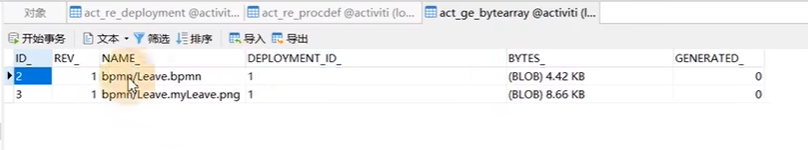

​	我们现在完成了单个任务的部署，但是我们在实际开发中肯定是会有多个任务的，那么我们也这样一个个的去部署吗？这样太麻烦了

​	所以activiti提供了通过zip包的方式上传，这样的话一次上传多个文件，定义多个工作流程

​		将bpmn文件和png图片放一个zip中进行统一上传

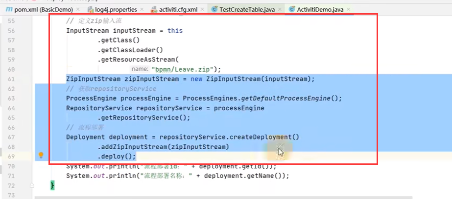

这里需要注意一个问题就是文件的命名规范--注意图片的后缀 png jpg...常用图片的类型，如果有其他图片类型可能上传不上去，还有就是我们使用这种zip包的方式它怎么知道 bpmn和png的关系呢，它在解压zip包后根据 流程的id 去找对应的 png图片，图片名称一定要是流程id的名称才可以

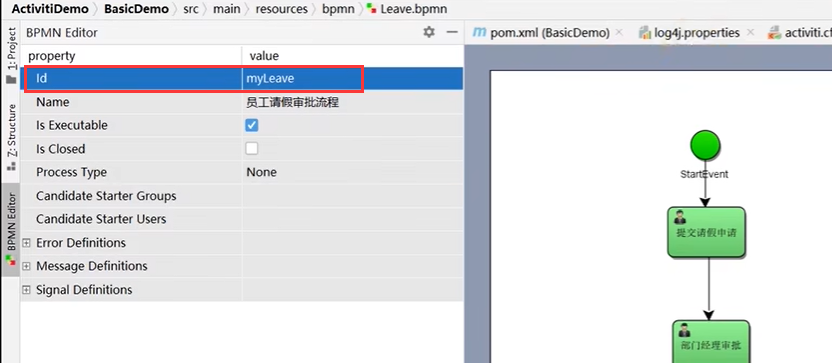

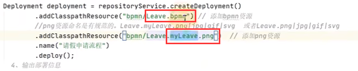

​		通过流程id这种方式来匹配png图片识别的--这个规则要清楚

#### 2、启动流程实例

​		有一个员工要请假了，那么我们就需要启动一个流程实例了

​	同样先是拿到流程引擎对象Processengine

​		然后拿到runtimeService 这个服务

​		然后启动一个流程实例通过key，这个key就是流程的id

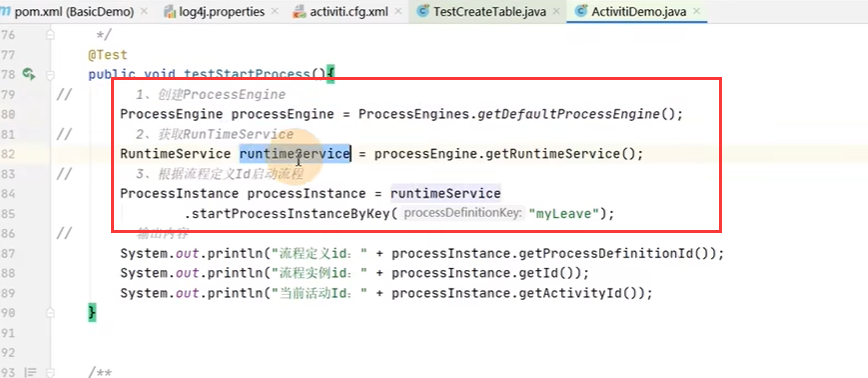

​	有了这个实例后，员工就可以进行一次请假申请了

#### 3、员工提交申请

​	通过流程引擎ProcessEngine对象

​		然后使用任务服务--TaskService

​			首先是查询我的任务--通过taskService来查询我的任务

​			在查询中设置流程的key--查询的流程

​			还需要设置责任人 -- Assignee --这里设置的是worker这个人

​	比如由worker来进行这个任务

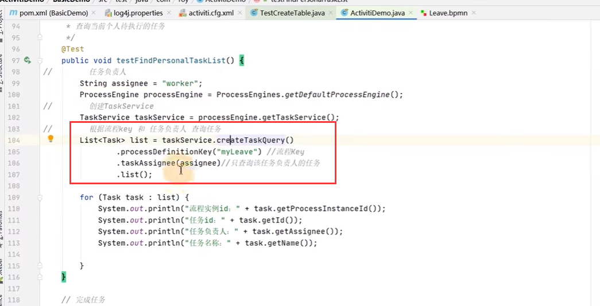

​	最后我们输出一下查到的内容：

​			流程实例的id，任务的id，负责人，任务名称 都是可以查看到的

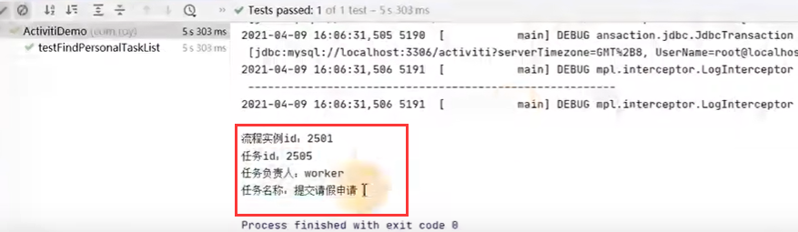

#### 4、完成任务

​		完成任务还是使用taskService

​		还是先查询--设置流程key和责任人

​		获取任务singleResult 会返回一个 task -- singleResult表示只返回一个对象，一个任务

​		通过task拿到 task 的id 然后 使用TaskService的 complete完成任务

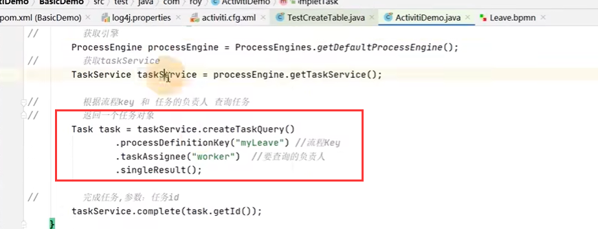

​		我们查询一下任务使用worker用户查询不到任务了，我们使用manager用户查询一下可以查询到，说明流程正常的流转走到manager用户这里了

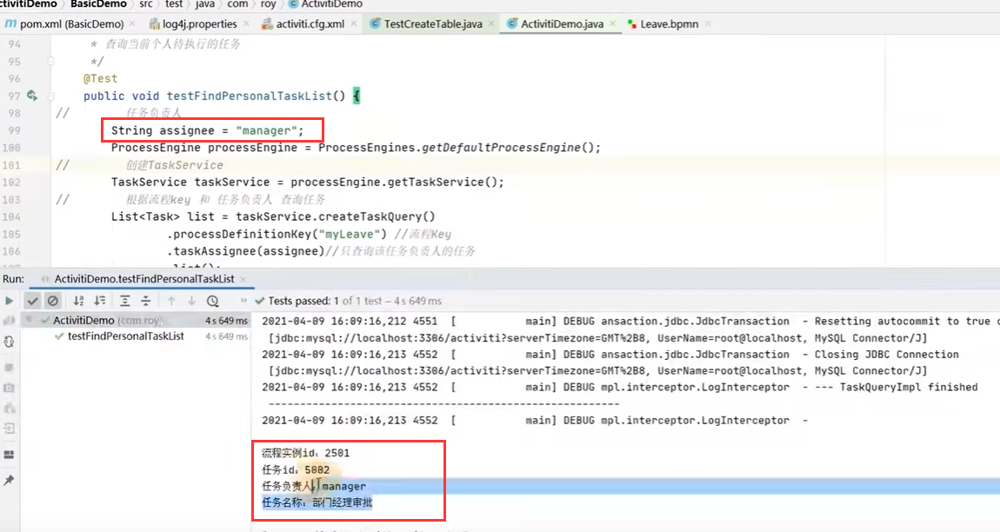

​	接下来就是由manager来完成这个任务---一步步推动这个流程进行

#### 5、查询流程定义

​		我们这个就是查询在这个bpmn文件下有多少个流程定义--也就是部署的流程

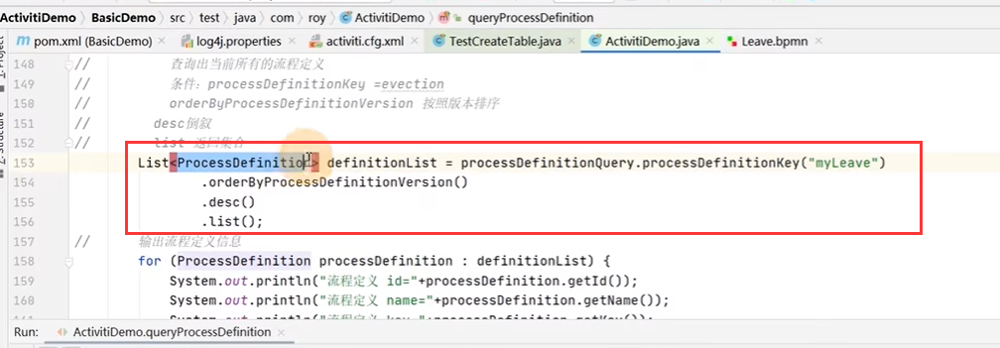

​	流程重复定义后 --会发生version的变化，不会影响原流程运转

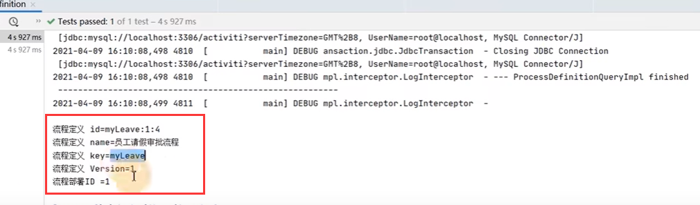

#### 6、查询当前流程定义下的流程实例

​			也就是某个流程部署下进行中的流程

​			传入流程定义key

​			就是由那些正在处理中的流程实例

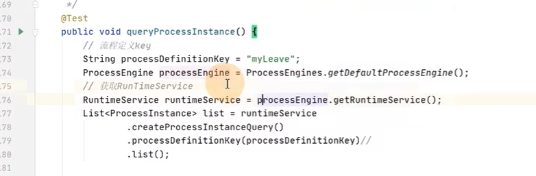

​		查询到目前这个流程定义下--目前有一个流程在进行

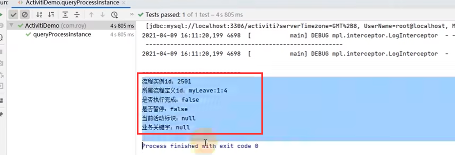

​	那么这样我们就可以随时跟踪 这个任务执行的情况

#### 7、删除流程部署

​		我们一般是不会删除流程部署的，除非是这个流程出现问题了

​	需要流程部署id

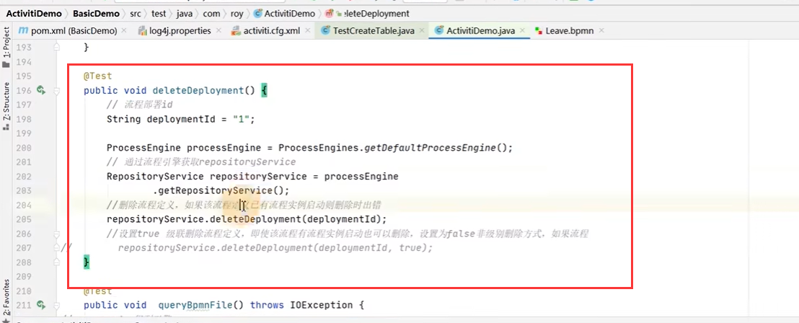

​		如果这个流程还没有处理完成---无法删除流程部署--会报错的

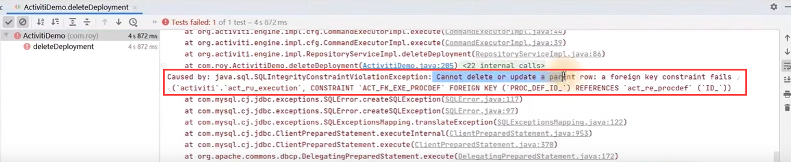

​	也可以强制删除--级联删除 会删除相关的流程数据 参数中添加一个 true就是强制删除

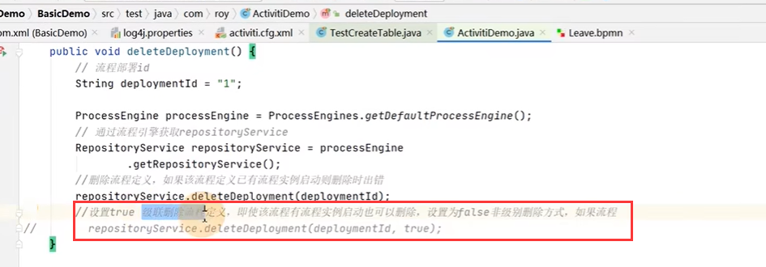

​				这个一般只会给管理员使用

#### 8、获取流程定义文件

​	使用RepositoryService

​			先是查询某个流程的定义--然后通过流程定义进行查询

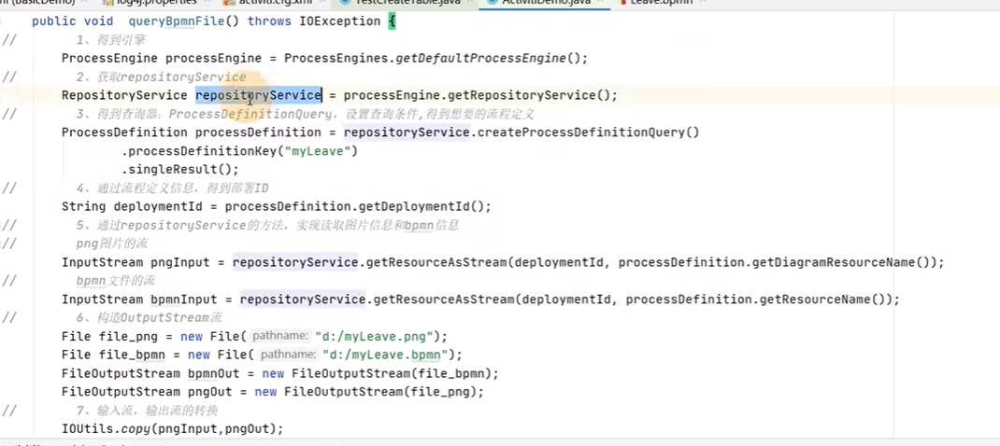

​		这个有什么用呢？如果我们做一个web系统的话，开发人员和业务人员都可以看到这个流程定义了

#### 9、查看历史信息

​		使用historyService

​		查询流程经过了那些具体的步骤

​				创建query实例对象--设置query的属性(也就是查询条件) 还可以设置排序

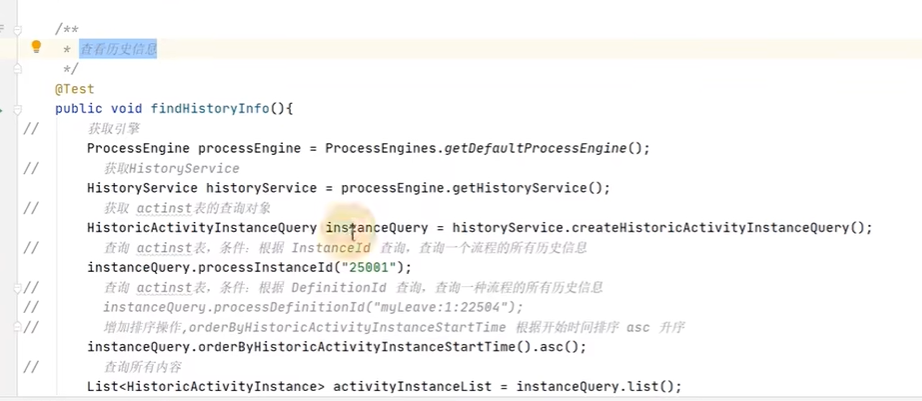

​		通过list方法就可以查询出来历史结果了

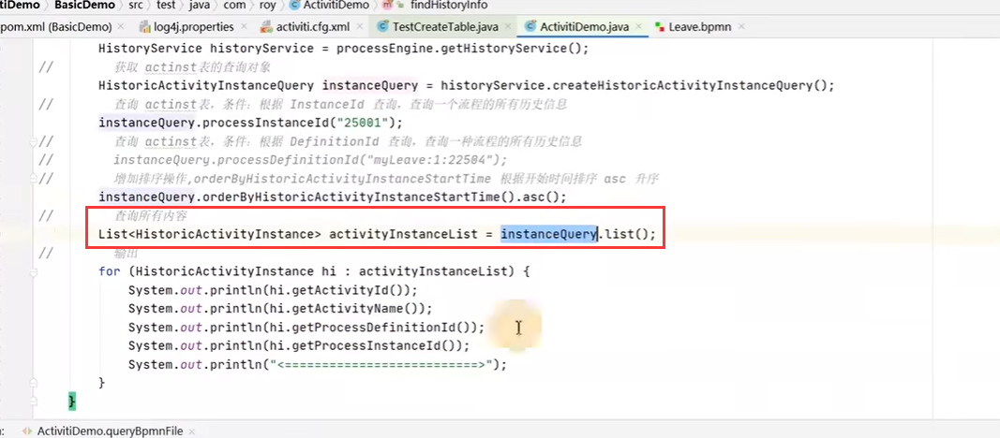

​	我们可以看到一些历史步骤

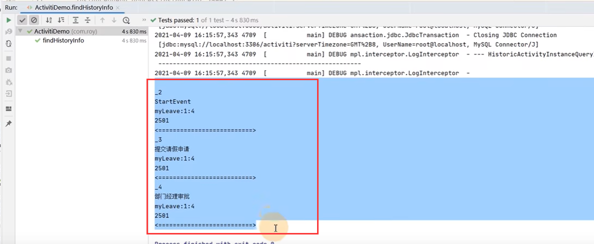

​		这里就完成了 activiti 的入门了

#### 10、总结

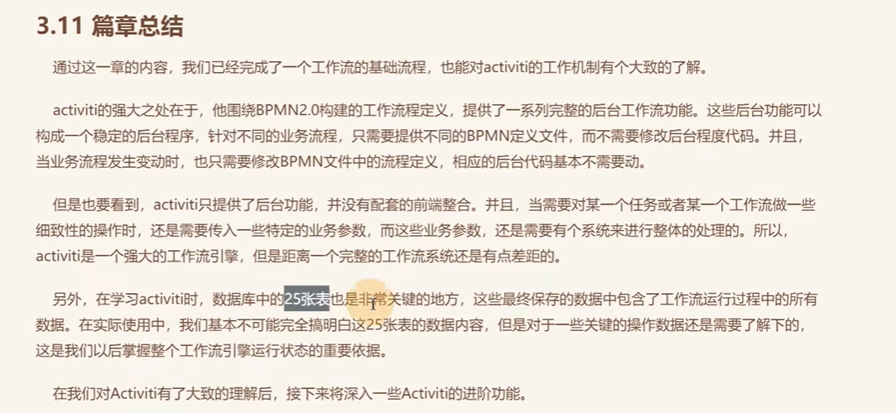

https://www.bilibili.com/video/BV1Ya411z7kW?p=6&spm_id_from=pageDriver&vd_source=243ad3a9b323313aa1441e5dd414a4ef

